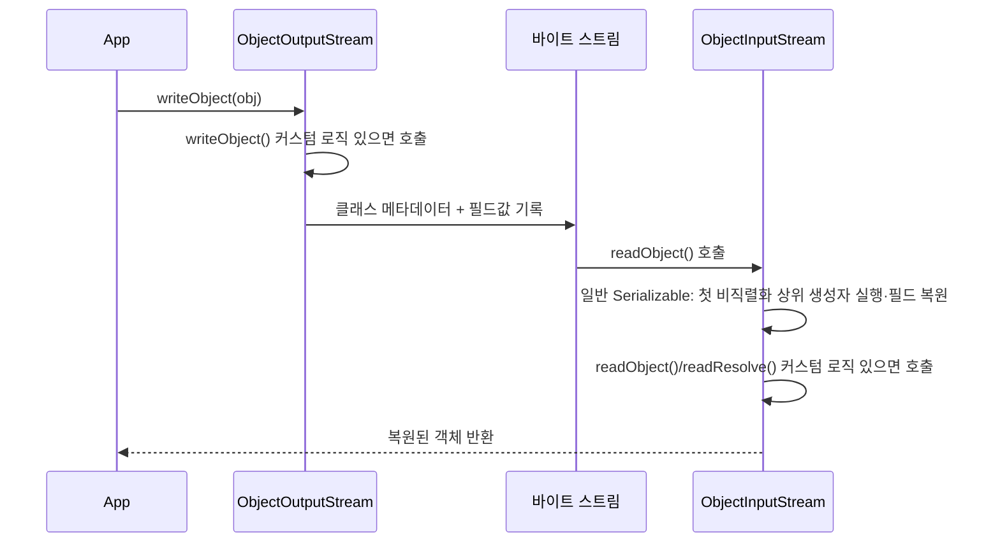

# 직렬화와 Serializable

## 핵심 정의
직렬화(serialization)는 객체의 상태를 바이트 스트림으로 변환해 저장하거나 전송 가능한 형태로 만드는 과정이고, 역직렬화(deserialization)는 그 반대로 바이트 스트림을 다시 객체로 복원하는 과정이다. 자바는 `java.io.Serializable` 마커 인터페이스(marker interface)를 구현한 클래스에 대해 `ObjectOutputStream`/`ObjectInputStream`을 통한 기본 직렬화 메커니즘을 Java 플랫폼 라이브러리로 제공한다.

`Serializable`은 메서드가 하나도 없는 마커 인터페이스로, 구현 자체가 동작을 바꾸지 않는다. 대신 JVM의 직렬화 런타임이 리플렉션을 통해 해당 클래스가 이 인터페이스를 구현했는지 검사해 직렬화 가능 여부를 판단하는 신호로만 쓰인다.

## 동작 원리 / 구조

### 기본 직렬화 흐름
```java
public class User implements Serializable {
    private static final long serialVersionUID = 1L;
    private String name;
    private transient String password; // 직렬화 제외
}
```

- `ObjectOutputStream.writeObject()`는 리플렉션으로 필드를 순회하며 각 필드 값을 기록한다. `transient` 키워드가 붙은 필드와 `static` 필드는 직렬화 대상에서 제외된다.
- 역직렬화 시에는 생성자를 호출하지 않고(단, 직렬화 불가능한 첫 부모 클래스의 생성자는 호출됨) 리플렉션으로 힙에 객체를 직접 할당한 뒤 필드 값을 채워 넣는다. 이 때문에 생성자에서 수행하던 유효성 검증이나 불변식(invariant) 보장 로직이 우회될 수 있다.

### serialVersionUID
클래스 버전 호환성을 식별하는 값으로, 명시하지 않으면 JVM이 클래스의 필드/메서드 시그니처를 기반으로 자동 계산한다. UID 계산 알고리즘은 명세에 정의되어 있지만 컴파일러가 생성하는 합성 멤버 등 입력 클래스 형태가 달라질 수 있어, 실무에서는 반드시 명시적으로 선언해 컴파일 환경이 달라져도 값이 고정되도록 한다. 역직렬화 시 저장된 `serialVersionUID`와 현재 클래스의 값이 다르면 `InvalidClassException`이 발생한다.

### 커스터마이징 훅
| 메서드 | 역할 |
|---|---|
| `writeObject(ObjectOutputStream)` | 특별히 인식되는 private 훅으로 기본 직렬화 로직을 대체/보강 |
| `readObject(ObjectInputStream)` | 특별히 인식되는 private 훅으로 기본 역직렬화 로직을 대체/보강, 유효성 검증 삽입 지점 |
| `readResolve()` | 역직렬화로 생성된 객체를 다른 객체(예: 싱글턴 인스턴스)로 치환 |
| `writeReplace()` | 직렬화 시점에 실제 기록할 객체를 다른 객체로 치환 |
| `Externalizable` | `Serializable`을 확장해 직렬화 전 과정을 개발자가 완전히 제어 |



### 레코드와 직렬화
Java 16부터 정식화된 레코드(record)도 `Serializable`을 구현할 수 있지만 내부 동작이 일반 클래스와 다르다. 레코드의 직렬화 형태는 컴포넌트(component)에 의해 정해지고, 역직렬화 시 리플렉션으로 필드를 직접 채우지 않고 반드시 표준(canonical) 생성자를 호출한다. 따라서 생성자에 넣은 유효성 검증 로직이 역직렬화 시에도 항상 적용되어, 일반 클래스가 `readObject`로 별도 검증을 추가해야 했던 문제를 구조적으로 해결한다. 자세한 레코드 자체 특성은 [[Record]] 참고.

일반 Serializable의 `readObject`/`writeObject` 훅은 레코드에서 무시된다. 레코드는 기본 UID가 0L이고 UID 일치 요구가 면제되지만, 이것이 모든 스키마 변경의 의미적 호환성을 보장하지는 않는다. 일반 클래스도 UID를 같게 둔 것만으로 필드 타입 변경 등 비호환 변경이 안전해지는 것은 아니다.

## 실무 관점
- **역직렬화는 신뢰할 수 없는 입력을 실행하는 것과 같다**: 역직렬화 대상 클래스에 임의 코드를 실행시키는 부작용(사이드 이펙트)이 있는 `readObject`/`readResolve`가 클래스패스 어딘가에 존재하면, 공격자가 조작한 바이트 스트림만으로 원격 코드 실행(RCE)이 가능하다. 이를 가젯 체인(gadget chain) 공격이라 하며, 공용 라이브러리(Apache Commons Collections 등)의 클래스를 체이닝해 공격하는 사례가 지속적으로 보고된다.
- **신뢰할 수 없는 소스의 역직렬화는 하지 않는다**: 외부 입력을 `ObjectInputStream`으로 직접 역직렬화하지 않는 것이 가장 확실한 방어다. 대신 JSON을 명시적 DTO로 바인딩하거나 Protobuf처럼 스키마로 타입을 제한하는 방식을 쓴다.
- **역직렬화 필터링**: JEP 290(Java 9)으로 `ObjectInputFilter`를 통해 역직렬화 허용 클래스, 배열 크기, 그래프 깊이/참조 개수를 제한할 수 있게 되었고, JEP 415(Java 17)의 필터 팩토리(filter factory)로 스트림별/컨텍스트별로 다른 필터를 조합해 적용할 수 있다. 클래스 이름 허용 목록만으로는 깊은 객체 그래프를 이용한 서비스 거부(DoS) 공격을 막지 못하므로 `maxdepth`, `maxrefs` 같은 수치 제한을 함께 건다.
- **분산 캐시/세션 저장과의 관계**: Redis 세션 저장소, 일부 캐시 라이브러리가 기본적으로 Java 직렬화를 쓰는 경우가 있는데, 필드 추가/삭제 등 클래스 구조 변경 시 `serialVersionUID` 불일치로 기존 저장 데이터를 읽지 못하는 장애가 흔하다. 실무에서는 JSON이나 Protobuf 같은 언어/버전에 덜 민감한 포맷으로 대체하는 경우가 많다.
- **성능과 크기**: 기본 자바 직렬화는 클래스 메타데이터를 스트림에 포함하지만 같은 스트림의 반복 클래스·객체는 핸들로 재사용한다. 크기와 처리 시간은 객체 그래프·스트림 재사용·대안 포맷 설정에 따라 달라 실측이 필요하다. 대규모 트래픽 환경에서는 대안 포맷을 우선 고려한다.
- **상속 관계에서의 직렬화 가능성**: 부모 클래스가 `Serializable`을 구현하지 않으면 역직렬화 시 그 부모의 기본 생성자가 호출되어야 하므로, 부모 클래스에 접근 가능한 기본 생성자가 없으면 `InvalidClassException`이 발생한다.

### 필터의 거부 정책과 스트림 시작 순서

필터 기능이 있다는 사실과 현재 스트림에 제한이 설정되었다는 사실은 다르다. Java SE 25의 `ObjectInputFilter.Config.createFilter`는 어떤 클래스 패턴에도 맞지 않으면 `UNDECIDED`를 반환하며, 이것만으로 역직렬화를 거부하지 않는다. 허용 클래스만 나열한 패턴을 완성된 허용 목록으로 착각하지 않는다. 필요한 클래스·하위 그래프를 먼저 허용하고 마지막 `!*` 등으로 나머지 클래스를 거부하는 정책을 구성하며, 필터 팩토리가 조합한 최종 동작도 확인한다.

직접 기록한 `String`과 기본 타입 값은 클래스 필터 호출 대상이 아니다. `maxbytes`도 필터가 호출되는 시점의 읽은 바이트 수를 검사하므로, 모든 입력 읽기를 가로채는 강제 상한으로 볼 수 없다. 문자열만 읽는 입력 등에는 별도의 메시지 크기 제한과 값·길이 검증이 필요하다. 객체 필터와 전송 계층의 입력 제한을 함께 적용한다.

`ObjectInputStream` 생성자는 상대 `ObjectOutputStream`의 헤더를 읽을 때까지 대기한다. 양쪽이 입력 스트림부터 만들면 서로 헤더를 기다릴 수 있다. 양방향 연결에서는 프로토콜에 맞춰 출력 스트림을 먼저 만들고 헤더를 `flush()`한 뒤 입력 스트림을 생성한다. 출력에 `BufferedOutputStream`이 있으면 객체를 아직 쓰지 않았더라도 이 초기 flush가 필요하다.

## 심화 Q&A

### Q. 역직렬화가 생성자를 호출하지 않는다는 사실이 왜 보안 문제로 이어지는가?
일반적인 객체 생성 경로에서는 생성자가 유효성 검증, 불변식 강제, 방어적 복사 같은 안전장치 역할을 한다. 그러나 기본 직렬화 역직렬화는 리플렉션으로 힙에 객체를 직접 할당하고 필드를 채우기 때문에 이 안전장치를 전부 우회한다. 예를 들어 특정 필드 조합이 항상 유효해야 한다는 불변식을 생성자에서만 검증했다면, 역직렬화로 그 불변식을 깨는 객체를 손쉽게 만들어낼 수 있다. 이를 막으려면 `readObject`에서 명시적으로 검증 로직을 다시 구현해야 하며, 레코드는 표준 생성자를 거쳐 그 생성자의 검증을 수행한다. 다만 참조 컴포넌트의 전체 그래프와 외부 부수 효과까지 자동으로 안전하게 만드는 것은 아니다.

### Q. 가젯 체인(gadget chain) 공격은 구체적으로 어떤 원리로 동작하는가?
공격자가 직접 악성 코드를 담은 클래스를 주입하는 것이 아니라, 이미 클래스패스에 존재하는 정상적인 라이브러리 클래스들의 `readObject`, `equals`, `hashCode`, `toString` 등을 연쇄적으로 호출되도록 조작된 객체 그래프를 만들어 전달하는 방식이다. 각 클래스의 정상적인 메서드 호출이 도미노처럼 이어지다가 최종적으로 `Runtime.exec()`류의 위험한 호출에 도달하면 임의 명령 실행이 성립한다. 방어의 핵심은 역직렬화 시점에 허용된 클래스만 통과시키는 화이트리스트 필터(`ObjectInputFilter`)를 적용해 체인의 시작점 자체를 차단하는 것이다.

### Q. `serialVersionUID`를 명시하지 않으면 어떤 문제가 생기는가?
JVM이 클래스의 필드, 메서드, 인터페이스 등을 해시해 값을 자동 계산하는데, 알고리즘 자체는 명세로 고정되지만 컴파일러가 만든 클래스의 합성 멤버 등 입력이 달라지면 결과가 달라질 수 있다. 즉 동일한 소스 코드라도 다른 환경에서 컴파일하면 다른 UID가 나올 수 있어, 한 서버에서 직렬화한 객체를 다른 서버(다른 컴파일 결과물)에서 역직렬화하면 `InvalidClassException`이 발생할 위험이 있다. 명시적으로 고정값을 선언하면 이 위험을 없애고, 버전 간 호환 여부도 개발자가 의도적으로 통제할 수 있다(호환되면 값 유지, 깨는 변경이면 값 증가).

### Q. `readResolve()`와 `writeReplace()`는 왜 필요하며, 싱글턴 패턴과 어떤 관계가 있는가?
싱글턴 클래스를 `Serializable`로 만들면, 역직렬화가 리플렉션으로 새 인스턴스를 만들기 때문에 싱글턴 보장이 깨져 직렬화-역직렬화를 거칠 때마다 별도의 인스턴스가 생긴다. `readResolve()`를 정의해 역직렬화 직후 반환할 객체를 싱글턴 인스턴스로 치환하면 이 문제를 해결할 수 있다. `writeReplace()`는 반대로 직렬화 시점에 실제로 기록할 대체 객체(예: 프록시 객체)를 지정할 때 쓰인다. enum 기반 싱글턴은 JVM이 enum 상수의 유일성을 직렬화 메커니즘 차원에서 보장하므로 이런 훅 없이도 안전하다.

### Q. Java 기본 직렬화 대신 JSON이나 Protobuf 같은 포맷을 선택해야 하는 기준은 무엇인가?
자바 기본 직렬화는 JVM/언어에 강하게 결합되어 있어 다른 언어와의 상호운용에 부적합하고 클래스 메타데이터와 객체 그래프 복원에 결합되어 있으며, 앞서 설명한 보안 위험까지 안고 간다. 반면 JSON은 가독성과 상호운용성이 좋지만 형식 자체는 스키마를 강제하지 않는다. 허용 DTO와 바인딩 설정을 제한해야 한다. Protobuf/Avro는 스키마 기반 표현과 호환성 규칙을 사용할 수 있으며 성능은 측정한다. 같은 JVM 프로세스 내부에서 짧게 쓰고 버리는 캐시나 레거시 RMI 연동처럼 상호운용성이 필요 없고 신뢰된 데이터만 다루는 극히 제한된 경우가 아니라면, 신규 시스템에서는 자바 기본 직렬화보다 이런 대안을 우선한다.

### Q. `Serializable`과 `Externalizable`의 차이는 무엇이고 언제 `Externalizable`을 선택하는가?
`Serializable`은 JVM이 리플렉션 기반으로 필드를 자동 순회해 직렬화하는 반면, `Externalizable`은 `writeExternal()`/`readExternal()` 두 메서드를 직접 구현해 어떤 데이터를 어떤 순서/형식으로 쓰고 읽을지 완전히 개발자가 통제한다. `Externalizable`은 역직렬화 시 반드시 public 기본 생성자를 통해 인스턴스를 생성한 뒤 `readExternal()`을 호출하므로, 생성자 실행만으로 입력 검증이 끝나는 것은 아니다. readExternal()에서 길이·값·객체 그래프를 검증해야 하며 커스텀 표현의 크기와 유지보수 비용을 비교한다. 대신 필드가 추가/변경될 때마다 읽기/쓰기 로직을 수동으로 동기화해야 하는 유지보수 부담이 따른다.

### Q. 같은 객체를 수정해서 같은 ObjectOutputStream에 다시 쓰면 변경된 상태가 전송되는가?
A. 일반 `writeObject`는 이미 기록한 객체의 핸들(handle)을 재사용한다. 객체 필드를 변경해도 두 번째 쓰기가 새 상태의 스냅샷을 뜻하지 않으며, 수신자는 앞서 복원한 같은 객체 참조를 받을 수 있다. 별도 스냅샷 객체를 만들거나 프로토콜에 맞는 경계에서 `reset()`을 적용한다. 장기간 유지한 스트림의 객체 추적 상태도 메모리를 유지하므로 수명과 reset 정책을 정한다.

### Q. writeUnshared를 사용하면 전체 객체 그래프가 깊게 복사되는가?
A. 아니다. 매번 독립적으로 기록한다는 규칙은 루트 객체에 적용되며, 그 객체가 참조하는 하위 객체에는 같은 규칙이 전이되지 않는다. 전송 포맷의 객체 동일성·공유 참조 보존과 애플리케이션의 스냅샷 의미를 구분해야 한다.

## 관련 개념
- [[Record]]
- [[JVM 구조와 클래스 로더]]
- [[애노테이션과 리플렉션]]
- [[불변 객체]]

## 참고 자료

확인 날짜: 2026-09-08. 아래 버전과 범위의 공식 문서·소스로 본문을 대조했다. 성능 비교와 운영 선택은 워크로드에 따라 달라지는 판단 기준이다.

- [Java 25 Serialization §1](https://docs.oracle.com/en/java/javase/25/docs/specs/serialization/serial-arch.html) — 필드·핸들·record·enum 직렬화.
- [Java 25 Serialization §3](https://docs.oracle.com/en/java/javase/25/docs/specs/serialization/input.html) — 생성자·readObject·Externalizable·record 복원.
- [Java 25 Serialization §4](https://docs.oracle.com/en/java/javase/25/docs/specs/serialization/class.html) — UID 산출 규칙.
- [Java 25 Serialization §5](https://docs.oracle.com/en/java/javase/25/docs/specs/serialization/version.html) — 호환·비호환 변경.
- [Java SE 25 ObjectInputFilter](https://docs.oracle.com/en/java/javase/25/docs/api/java.base/java/io/ObjectInputFilter.html) — 클래스·그래프 제한과 필터 팩토리.

### 2026-09-23 부분 재검증

Java 25 Serialization §2.1의 핸들 재사용·reset·writeUnshared 적용 범위를 확인했다. 기존 전체 검증일은 유지한다.

- [Java 25 Serialization §2](https://docs.oracle.com/en/java/javase/25/docs/specs/serialization/output.html) — 반복 객체 기록, reset 및 하위 객체의 공유.

실행 확인: 2026-09-23, OpenJDK 25.0.2+10-69에서 동일 객체 핸들 재사용·reset 이후 새 상태·writeUnshared의 하위 객체 공유을 재현했다. 구현 관측은 해당 버전 범위로 한정한다.

### 부분 재검증: 2026-10-04

Java SE 25의 필터 미일치 상태·구체적인 String/기본 타입 제외·헤더 대기를 확인했다. 기존 전체 `verified`는 유지한다.

- [ObjectInputFilter.Config](https://docs.oracle.com/en/java/javase/25/docs/api/java.base/java/io/ObjectInputFilter.Config.html) — 필터 설정, createFilter의 패턴 순서·UNDECIDED·자원 한도.
- [ObjectInputStream](https://docs.oracle.com/en/java/javase/25/docs/api/java.base/java/io/ObjectInputStream.html) — 생성자의 헤더 대기, setObjectInputFilter의 호출 대상·거부 조건.

실행 확인: Oracle JDK 25.0.4+7-LTS-189(macOS AArch64)에서 미일치 패턴의 객체 통과와 마지막 `!*`의 거부, String의 필터 미호출과 maxbytes 비강제, 버퍼의 헤더 flush 전 대기·후 생성 완료를 재현했다. 실제 소켓 양단 교착이나 악성 객체 그래프를 실행한 검증은 아니다.

- 도식·표 대조(2026-10-04): [Java 25 Serialization §3](https://docs.oracle.com/en/java/javase/25/docs/specs/serialization/input.html) — 도식의 생성자 미호출 단정을 일반 Serializable의 첫 비직렬화 상위 생성자 실행으로 교정했다. record·Externalizable의 별도 생성자 경로는 기존 본문에서 구분한다. 실행 시험 추가 없이 명세·소스와 기존 본문을 대조했으며 verified는 유지한다.
