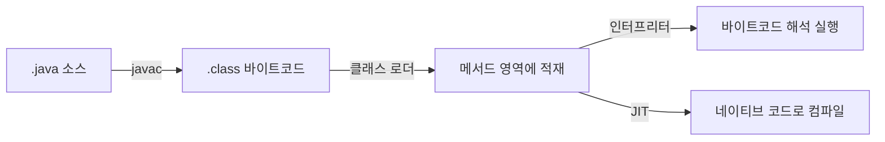

# 클래스 파일 구조와 바이트코드

## 핵심 정의
클래스 파일(class file)은 자바 컴파일러(`javac`)가 소스 코드를 컴파일해 만드는 플랫폼 독립적인 중간 산출물로, JVM 명세(JVM Specification)가 정의한 고정된 바이너리 포맷을 따른다. 이 파일 안에 담긴 명령어 집합이 바이트코드(bytecode)이며, JVM은 이를 해석(interpret)하거나 JIT 컴파일러로 네이티브 코드로 변환해 실행한다. "한 번 작성하면 어디서든 실행"(Write Once, Run Anywhere)이라는 자바의 특성은 바로 이 클래스 파일 포맷이 플랫폼과 무관하게 표준화되어 있기 때문에 성립한다.

## 동작 원리 / 구조

### 클래스 파일 포맷
클래스 파일은 아래 순서의 고정 구조를 가진 바이너리 스트림이다.

| 항목 | 설명 |
|---|---|
| magic | `0xCAFEBABE` 매직 넘버, 유효한 클래스 파일 식별 |
| minor_version, major_version | 클래스 파일 포맷 버전. 예: Java 17→61, Java 21→65, Java 25→69, Java 27→71 |
| constant_pool | 클래스에서 사용하는 문자열·큰 숫자 상수 및 클래스/메서드/필드 심볼릭 레퍼런스를 담는 테이블 |
| access_flags | `public`, `final`, `abstract` 등 클래스 접근 제어자 |
| this_class, super_class | 현재 클래스와 부모 클래스에 대한 constant_pool 인덱스 |
| interfaces | 구현한 인터페이스 목록 |
| fields | 필드 정보(이름, 타입, 접근 제어자 등) |
| methods | 메서드 정보. abstract/native가 아닌 메서드는 바이트코드를 담은 `Code` 속성을 하나 갖고, abstract/native 메서드는 갖지 않음 |
| attributes | `SourceFile`, `LineNumberTable`, `LocalVariableTable`, 애노테이션 등 부가 정보 |

### 상수 풀(Constant Pool)
클래스 파일 내부에서 사용하는 클래스명, 메서드 시그니처, 필드명, 문자열/숫자 리터럴을 직접 문자열로 담지 않고 상수 풀에 등록한 뒤 인덱스로 참조한다. 바이트코드 명령어는 이 인덱스를 통해 심볼릭 레퍼런스(symbolic reference)를 가리키며, 클래스 로딩의 링크(Link) 단계 중 Resolve 과정에서 런타임 클래스·필드·메서드 참조로 해석된다. 명세가 상수 풀 바이트를 실제 주소로 치환하도록 강제하지는 않는다. 이 구조 덕분에 클래스 파일은 컴파일 시점에 다른 클래스의 실제 메모리 배치를 알 필요가 없다.

### 바이트코드 명령어
바이트코드는 스택 기반(stack-based) 명령어 집합으로, 각 명령어는 1바이트 opcode와 필요시 피연산자로 구성된다. 레지스터 기반 명령어 집합(예: 안드로이드 Dalvik/ART의 DEX)과 달리 로컬 변수 배열(local variable array)과 오퍼랜드 스택(operand stack)을 오가며 값을 push/pop 하는 방식으로 연산한다.

```java
int a = 1;
int b = 2;
int c = a + b;
```

위 코드는 대략 다음과 같은 바이트코드로 컴파일된다(`javap -c` 결과 예시).

```
0: iconst_1
1: istore_1      // a = 1
2: iconst_2
3: istore_2      // b = 2
4: iload_1
5: iload_2
6: iadd
7: istore_3      // c = a + b
```

`iconst_1`로 상수를 오퍼랜드 스택에 push하고 `istore_1`로 로컬 변수 슬롯에 저장하는 식으로, 산술 연산도 스택에 값을 올렸다 내리는 흐름으로 이루어진다.



### 제네릭과 타입 소거의 흔적
자바 제네릭은 컴파일 시점에 타입 소거(type erasure)가 일어나 실행용 타입 descriptor는 소거된 타입(erased type)을 사용한다. 다만 `Signature` 속성(attribute)에 제네릭 타입 정보가 별도로 남아 리플렉션(reflection)이나 IDE가 제네릭 시그니처를 복원할 수 있게 해준다. 애노테이션 정보도 `RuntimeVisibleAnnotations` 같은 속성으로 클래스 파일에 저장된다.

## 실무 관점
- **바이트코드 조작 라이브러리**: ASM, ByteBuddy, Javassist는 클래스 파일을 직접 읽고 수정한다. Spring의 CGLIB 프록시, Hibernate의 지연 로딩 프록시, Mockito의 목(mock) 객체 생성이 모두 이런 바이트코드 조작에 기반한다. 참고로 Lombok은 성격이 다른데, 컴파일된 클래스 파일을 건드리는 것이 아니라 `javac` 컴파일 과정 중 애노테이션 처리(annotation processing) 단계에서 소스 코드의 AST(추상 구문 트리)를 직접 조작해 getter/setter 등의 코드를 주입한다. 이렇게 만들어진 AST가 이후 정상적인 컴파일 과정을 거쳐 바이트코드로 변환되는 것이라, 엄밀히는 바이트코드 조작이 아니라 컴파일 타임 AST 조작이다.
- **`javap`로 디버깅**: `javap -c -v ClassName.class`로 바이트코드를 직접 확인하면 컴파일러 최적화 결과(예: 문자열 연결이 `StringBuilder`로 변환되는지, `try-with-resources`가 어떻게 전개되는지)를 검증할 수 있다.
- **`UnsupportedClassVersionError`**: 낮은 버전 JDK로 실행 시 상위 major_version으로 컴파일된 클래스 파일을 만나면 발생한다. CI/CD에서 빌드 JDK와 배포 JDK 버전 불일치로 자주 겪는 장애 패턴이다. 직접 컴파일하는 소스에는 `--release`로 타깃 버전을 명시하고, 배포할 의존 JAR의 클래스 버전도 별도로 확인한다.
- **상수 풀과 문자열 인터닝**: `String` 리터럴은 컴파일 시점에 상수 풀에 등록되고 런타임에 String Pool로 연결된다. 관련 세부는 [[String과 String Pool]] 참고.
- **바이트코드 크기 제한**: 메서드 하나의 바이트코드는 65535바이트를 넘을 수 없다. 대량의 필드를 초기화하는 자동 생성 코드(예: 매우 큰 정적 초기화 블록, Lombok의 대형 빌더)에서 `Code too large` 컴파일 오류로 나타날 수 있다.

### 배포 호환성은 클래스 버전과 API를 함께 확인한다
JDK 25의 `javac -source 17 -target 17`은 소스 문법과 클래스 형식을 제한하지만 그 자체로 Java 17의 플랫폼 API만 보게 만들지는 않는다. 예를 들어 `List.of("x").getFirst()`가 major 61로 컴파일되어도 Java 17에 없는 메서드 참조가 남는다. `javac --release 17`은 해당 릴리스의 공개·지원 API로 컴파일 범위도 제한해 이 호출을 거절한다. `--release`는 이미 만들어진 의존 JAR를 변환하지 않으므로 배포 JDK에서의 통합 실행도 필요하다.

프리뷰(preview) 기능을 사용한 클래스는 별도 제약이 있다. Java 25 프리뷰 클래스의 버전은 `69.65535`이며 Java 25에서 `--enable-preview`를 켜야 로드할 수 있다. 다음 JDK에서 같은 옵션을 켠다고 이전 릴리스의 프리뷰 클래스가 호환되는 것은 아니다. 프리뷰를 채택했다면 빌드·테스트·운영의 릴리스를 맞추고 JDK 업그레이드 때 다시 컴파일한다.

## 심화 Q&A

### Q. 자바 바이트코드가 스택 기반 명령어 집합을 채택한 이유는 무엇인가?
스택 기반 구조는 명령어에 오퍼랜드의 레지스터 번호를 인코딩할 필요가 없어 명령어 자체가 짧고 클래스 파일 크기가 작아진다. 또한 컴파일러 구현이 단순해지고 플랫폼별 레지스터 개수/구조에 종속되지 않아 이식성이 높다. 대신 실행 성능은 레지스터 기반보다 불리할 수 있는데, 이는 JIT 컴파일러가 실제 실행 시 레지스터 기반 네이티브 코드로 변환하며 보완한다.

### Q. 제네릭 타입 소거(type erasure)가 바이트코드에 남기는 흔적과, 이 때문에 발생하는 런타임 제약은 무엇인가?
컴파일된 바이트코드의 메서드 시그니처와 필드 타입에는 제네릭 타입 파라미터가 사라지고 타입 변수는 최좌측 상한(`Object` 등)으로, 매개변수화 타입은 소거된 클래스/인터페이스 타입으로 표현된다. 이를 모두 raw type이라고 부르는 것은 부정확하다. 다만 `Signature` 속성에 제네릭 정보가 부가적으로 기록되어 리플렉션 API(`getGenericSuperclass()` 등)로 조회는 가능하다. 실행 시 `List<String>`과 `List<Integer>`는 같은 `List` 클래스로 취급되므로 `Object`에서 `instanceof List<String>`으로 원소 타입까지 검사할 수 없다. 다만 Java 16+에서는 정적 타입으로 안전성이 확보되는 `List<String> value`에 대한 `value instanceof ArrayList<String>` 같은 검사가 허용된다. 이 경우도 실제 원소가 String인지 순회 검사하지 않는다. `new List<String>[n]` 같은 비구체화 타입 배열 생성 제한과 구분한다. 자세한 내용은 [[제네릭]] 참고.

### Q. Spring이나 Hibernate가 런타임에 생성하는 프록시 클래스는 실제로 클래스 파일을 어떻게 만들어내는가?
CGLIB(Spring AOP의 클래스 기반 프록시)나 Hibernate의 지연 로딩 프록시는 ASM 같은 바이트코드 생성 라이브러리를 이용해 대상 클래스를 상속한 서브클래스의 클래스 파일을 메모리 상에서 직접 바이트 배열로 조립한 뒤, `ClassLoader.defineClass()`로 즉시 JVM에 적재한다. 소스 코드나 `.class` 파일을 디스크에 만드는 과정 없이, 상수 풀과 메서드의 `Code` 속성을 프로그래밍적으로 구성해 오버라이드된 메서드에 위빙(weaving) 로직(트랜잭션 시작, 지연 로딩 트리거 등)을 삽입하는 방식이다.

### Q. 동일한 소스 코드를 다른 JDK 버전으로 컴파일하면 클래스 파일이 달라질 수 있는가?
그렇다. major_version 필드 자체가 달라질 뿐 아니라, 컴파일러 최적화 방식이 버전마다 바뀌면서 생성되는 바이트코드 시퀀스도 달라질 수 있다(예: 문자열 연결에 사용하는 `invokedynamic` 기반 `StringConcatFactory` 도입, switch 표현식의 바이트코드 전개 방식 변화). 따라서 재현 가능한 빌드(reproducible build)가 필요한 환경에서는 컴파일에 사용한 JDK 버전을 고정해야 한다.

### Q. `invokedynamic` 명령어는 기존 `invokevirtual`, `invokestatic` 등과 무엇이 다르며 왜 도입되었는가?
`invokevirtual`/`invokeinterface`도 심볼릭 메서드를 해석한 뒤 실제 수신 객체 타입에 따라 구현 메서드를 선택한다. `invokestatic` 등과 달리 가상 호출의 최종 대상까지 정적으로 고정되는 것은 아니다. `invokedynamic`은 호출 사이트(call site)의 실제 연결 대상을 부트스트랩 메서드(bootstrap method)가 반환한 `CallSite`에 연결한다. 이후 그 호출 사이트를 사용하며 `MutableCallSite` 등은 연결된 타깃 변경도 허용한다. 람다 표현식(`invokedynamic`으로 `LambdaMetafactory` 호출), 동적 언어(JRuby, Groovy) 지원, 최신 문자열 연결 최적화가 이 메커니즘을 기반으로 한다.

### Q. 클래스 파일의 상수 풀 크기나 메서드 바이트코드 길이 제한이 실무에서 문제가 되는 경우는?
constant_pool_count는 부호 없는 2바이트로 최대 65535이며 인덱스 0은 사용할 수 없어 최대 65534개 슬롯을 인덱싱한다. long/double 항목은 2슬롯을 차지한다. 또한 메서드 하나의 바이트코드도 65535바이트를 넘을 수 없다. 매우 많은 필드를 갖는 클래스에 Lombok `@Builder`나 MapStruct가 대량의 매핑 코드를 한 메서드에 생성하거나, 코드 생성기가 만든 거대한 단일 메서드(예: 자동 생성된 초기화 로직)에서 `Code too large` 컴파일 오류가 실제로 발생한다. 해결책은 로직을 여러 메서드로 분리하는 것이며, 이는 코드 생성 도구 설계 시 고려해야 할 제약이다.

## 관련 개념
- [[JVM 구조와 클래스 로더]]
- [[JIT 컴파일러]]
- [[애노테이션과 리플렉션]]
- [[제네릭]]

## 참고 자료

확인 날짜: 2026-09-08. 아래 버전과 범위의 공식 문서·소스로 본문을 대조했다. 성능 비교와 운영 선택은 워크로드에 따라 달라지는 판단 기준이다.

- [JVMS 25 §4](https://docs.oracle.com/javase/specs/jvms/se25/html/jvms-4.html) — ClassFile·버전 69·constant_pool·Code·Signature 제한.
- [JVMS 25 §5](https://docs.oracle.com/javase/specs/jvms/se25/html/jvms-5.html) — 심볼 해석·메서드 선택·invokedynamic 호출 사이트.
- [JEP 280](https://openjdk.org/jeps/280) — Java 9 문자열 연결 바이트코드 변경.

부분 재검증: 2026-09-22. 아래 확인 범위에 한하며 노트 전체의 기존 verified는 유지한다.

- [JVMS 27 §4.1·§4.7.3](https://docs.oracle.com/javase/specs/jvms/se27/html/jvms-4.html) — major 71, abstract/native의 Code 속성 금지. JDK 27 javac/javap 결과를 대조했다.
- [JLS 27 §15.20.2](https://docs.oracle.com/javase/specs/jls/se27/html/jls-15.html#jls-15.20.2) — 타입 소거와 instanceof의 정적 검사 조건. Java 16에서 완화된 매개변수화 타입 검사 사례를 컴파일 확인했다.

부분 재검증: 2026-10-04. 아래 적용 버전과 확인 범위에 한하며 노트 전체의 기존 verified는 유지한다.

- [JDK 25 javac](https://docs.oracle.com/en/java/javase/25/docs/specs/man/javac.html), [JVMS 25 §4.1](https://docs.oracle.com/javase/specs/jvms/se25/html/jvms-4.html#jvms-4.1) — --release의 API 범위와 preview minor 65535 제약. Oracle JDK 25.0.4에서 getFirst 호출의 source/target 17 컴파일 성공·major 61·메서드 참조 잔존과 --release 17 실패를 확인했다. 프리뷰 클래스의 69.65535 헤더, 옵션 미지정 실행 실패와 지정 실행 성공도 확인했다. Java 17·다른 릴리스 JVM 실행은 하지 않았다.
