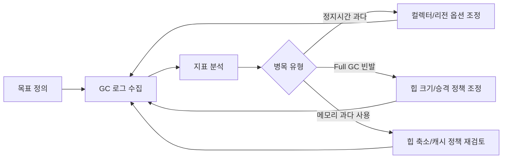

# GC 튜닝

## 핵심 정의
GC 튜닝은 애플리케이션의 목표(처리량, 지연시간, 메모리 풋프린트 중 우선순위)를 정한 뒤, GC 로그와 모니터링 지표를 근거로 힙 크기와 컬렉터 옵션을 반복적으로 조정하는 과정이다. 감으로 옵션을 바꾸기보다 측정 → 가설 → 변경 → 재측정의 사이클을 따르는 것이 핵심이다.

세 가지 목표(처리량, 지연시간, 풋프린트)는 서로 트레이드오프 관계에 있어 동시에 모두 최적화할 수 없다는 전제를 이해하고 접근해야 한다.

## 동작 원리 / 구조

### 튜닝 프로세스


### GC 로그 확인
Java 9 이상은 통합 로깅 프레임워크(Unified JVM Logging)를 사용한다.
```
-Xlog:gc*:file=gc.log:time,uptime,level,tags
```
확인해야 할 핵심 지표:
- 정지 시간(pause time)의 평균/최대/분포(P99)
- GC 발생 빈도와 유형(Minor/Mixed/Full)
- 승격률(promotion rate) — Old로 얼마나 빨리 객체가 넘어가는지
- Full GC 발생 여부와 원인(Metaspace 부족, Promotion failure 등)

### 대표 튜닝 옵션
| 옵션 | 용도 |
|---|---|
| `-Xms`, `-Xmx` | 힙 초기/최대 크기. 지연시간 우선이면 동일 값과 AlwaysPreTouch를 검토; 유휴 메모리 반환이 필요하면 차등 설정 |
| `-XX:MaxGCPauseMillis` | G1(및 Parallel의 적응형 크기 조정)이 참고하는 목표 정지 시간 힌트, 강제는 아님. ZGC는 설계 자체가 항상 서브 밀리초 정지를 지향하므로 이 옵션의 영향을 받지 않는다 |
| `-XX:NewRatio`, `-XX:G1NewSizePercent` | 컬렉터별 Young 크기 제어. G1은 자동 조정을 우선하며 G1NewSizePercent는 실험 옵션 |
| `-XX:MaxRAMPercentage` | 컨테이너 메모리 대비 힙 비율 (명시적 `-Xmx` 없을 때) |
| `-XX:+HeapDumpOnOutOfMemoryError` | OOM 시 자동 힙 덤프 생성 |

## 실무 관점
- **Xms=Xmx 선택**: 메모리 확보·반납에 따른 지연이 확인되고 메모리 예산이 충분하면 고정을 검토한다. G1 문서는 `AlwaysPreTouch`와 함께 이 비용을 시작 시점으로 옮기는 방법을 제시한다. 시작 시간과 유휴 메모리 반환까지 측정해 결정한다.
- **컨테이너 메모리 리밋과의 정합성**: 힙 외에 Metaspace·스레드 스택·Direct Memory·JVM 오버헤드와 cgroup에 계상되는 사용량까지 고려한다. 한도에 도달해 회수로 해결되지 않으면 커널 OOM으로 프로세스가 강제 종료될 수 있다([[가상 메모리와 페이징]]). HotSpot JDK 25의 지원 Linux 환경에서는 컨테이너 리밋을 인식하지만, 구형 JDK 업데이트별 cgroup v1/v2 지원은 서로 다르므로 안전 마진을 남기고 힙 비율을 설정해야 한다.
- **힙 덤프 분석**: `jmap`으로 힙 덤프를 뜨고 Eclipse MAT(Memory Analyzer Tool)의 Dominator Tree, Leak Suspects 리포트로 어떤 객체가 메모리를 점유하는지 추적하는 것이 표준 절차다.
- **Full GC 원인 분석 사례**: 대량 데이터를 한 번에 조회해 리스트에 담는 배치 로직, 무제한으로 커지는 인메모리 캐시, 세션에 과도한 데이터를 저장하는 패턴이 반복적인 Full GC의 흔한 원인이다.
- **APM 연계**: Pinpoint, Datadog 등 APM에서 제공하는 GC 대시보드를 상시 모니터링해 배포 전후 GC 패턴 변화를 비교하는 것이 회귀를 조기에 잡는 방법이다.

### 명시적 GC 요청과 자동 수집을 구분한다
GC 로그 원인이 `System.gc()`라면 라이브러리·관리 코드의 명시적 요청도 조사한다. Java 25 `System.gc()`는 최선 노력 요청이므로 반환 시 특정 객체 회수·참조 큐 통지·자원 반납 완료를 보장하지 않는다. 애플리케이션 정리 로직을 이 호출의 성공 가정에 의존시키지 않는다.

HotSpot JDK 25의 `-XX:+DisableExplicitGC`는 `System.gc()` 요청 처리를 비활성화하며 필요한 자동 GC까지 끄는 옵션이 아니다. G1의 `-XX:+ExplicitGCInvokesConcurrent`는 명시적 요청에 동시 수집을 사용하게 하지만 짧은 정지나 CPU 비용까지 없애지는 않는다. 먼저 로그의 원인과 호출 주체를 확인한 뒤 선택하고, 메모리 누수·과도한 할당 자체를 해결하는 옵션으로 취급하지 않는다.

## 심화 Q&A

### Q. 운영 환경에서 -Xms와 -Xmx를 동일하게 설정하는 이유는 무엇이며, 항상 옳은 선택인가?
힙이 동적으로 커지고 줄어드는 리사이징 과정 자체가 OS로부터 메모리를 추가 확보하는 시스템 콜과 내부 자료구조 재조정 비용을 유발해 예측 불가능한 지연을 낳는다. 고정하면 이 변동성을 제거할 수 있다. 다만 메모리가 극히 제한적이고 워크로드 변동이 커서 유휴 시간에 메모리를 반환해야 하는 멀티테넌트/서버리스 환경에서는 오히려 동적 크기 조정이 유리할 수 있어 절대적인 규칙은 아니다.

### Q. Promotion failure가 Full GC를 유발하는 메커니즘은 무엇인가?
Minor GC 도중 살아남은 객체를 Old 영역으로 승격시키려는데 복사 대상 공간이 부족하면 승격/evacuation 실패가 발생할 수 있다. 이후 복구와 Full GC 여부는 컬렉터에 따라 다르다. G1은 evacuation failure로 남은 객체를 처리하고, 충분한 공간을 확보하지 못하면 Full GC로 폴백할 수 있다. 이는 짧은 급증 트래픽으로 대량 객체가 한꺼번에 오래 살아남거나, Old 영역이 이미 단편화되어 있을 때 자주 발생한다.

### Q. G1의 Mixed GC와 Full GC는 어떻게 다른가?
Mixed GC는 Young 영역 전체와 가비지가 많은 일부 Old 리전만 선택적으로 회수하는, G1의 정상적인 회수 경로다. Full GC는 Mixed GC로도 회수 속도가 승격 속도를 따라가지 못하거나 리전 할당에 실패했을 때의 복구 수단이며, 설정에 따라 System.gc 같은 명시적 요청으로도 발생한다. 힙 전체를 Stop-the-world 상태에서 병렬 스레드로 압축까지 수행하므로 정지 시간이 길어질 수 있다. G1의 Full GC는 Java 10(JEP 307)부터 병렬화되었다. 튜닝 목표는 Full GC가 드물도록 여유 공간과 회수 속도를 확보하는 것이며 발생을 보장하여 차단할 수는 없다.

### Q. 처리량과 지연시간 중 무엇을 우선할지는 어떤 기준으로 판단하는가?
사용자에게 직접 응답하는 API/웹 서버는 P99/P999 지연시간이 SLA에 직결되므로 지연시간을 우선하고, 야간 배치나 대용량 데이터 처리 파이프라인은 전체 작업 완료 시간이 중요하므로 처리량을 우선한다. 같은 애플리케이션 안에서도 동기 요청 처리 스레드와 백그라운드 배치 스레드가 공존한다면 한 JVM은 하나의 컬렉터를 사용하므로 워크로드에 맞는 절충점을 찾거나 요구가 충돌하는 작업을 별도 프로세스로 분리한다.

### Q. 컨테이너 환경에서 힙 크기 설정 시 흔히 놓치는 부분은 무엇인가?
`-XX:MaxRAMPercentage`만 믿고 Metaspace, 스레드 스택, Direct Memory, JVM 코드 캐시 등 Non-heap 영역을 고려하지 않으면 힙은 여유가 있는데도 컨테이너 전체 메모리 리밋에 걸려 OOMKilled 되는 경우가 흔하다. 고정 비율을 보편적인 안전값으로 취급하지 않는다. 최대 동시성의 RSS와 네이티브 메모리, 여유 공간을 측정한 뒤 컨테이너 한도에서 이를 제외한 크기로 힙 상한을 정한다.

### Q. G1 pause 목표를 낮췄는데 API의 P99가 오히려 나빠질 수 있는가?
A. 가능하다. 더 작은 수집 단위로 개별 pause가 짧아져도 GC 빈도와 동시 작업의 CPU 비용이 늘어 처리량·대기열에 영향을 줄 수 있다. GC pause 분포와 요청 지연 분포는 서로 다른 지표다. 같은 부하에서 할당률, GC CPU, pause 빈도, 애플리케이션 처리량을 함께 비교한다. GC 로그의 Real이 User+Sys보다 크게 늘면 CPU 스케줄링·스로틀링도 확인한다.

### Q. G1의 IHOP 숫자만 낮추면 항상 marking이 빨리 시작되는가?
A. JDK 25 G1은 기본 적응형 IHOP에서 이전 동작을 바탕으로 시작 임계값을 조정한다. 고정된 `InitiatingHeapOccupancyPercent`만 보고 실제 트리거를 단정하지 않는다. 먼저 marking 완료 시점과 Old 할당률을 확인하고, 적응형 계산의 여유 공간 또는 명시적 비활성화 여부를 구분한다. `-Xmn` 등으로 Young 크기를 고정하면 pause 목표를 맞추는 주요 수단을 제한한다.

## 관련 개념
- [[가비지 컬렉션 알고리즘]]
- [[메모리 누수]]
- [[런타임 데이터 영역]]

## 참고 자료

확인 날짜: 2026-09-08. 아래 버전과 범위의 공식 문서·소스로 본문을 대조했다. 성능 비교와 운영 선택은 워크로드에 따라 달라지는 판단 기준이다.

- [JDK 25 G1 Tuning](https://docs.oracle.com/en/java/javase/25/gctuning/garbage-first-garbage-collector-tuning.html) — evacuation failure·Young 크기·정지시간 및 힙 선택.
- [JDK 25 G1](https://docs.oracle.com/en/java/javase/25/gctuning/garbage-first-g1-garbage-collector1.html) — 병렬 Full GC와 수집 주기.
- [JDK 25 java](https://docs.oracle.com/en/java/javase/25/docs/specs/man/java.html) — GC·컨테이너·메모리 옵션.
- [JEP 307](https://openjdk.org/jeps/307) — Java 10 G1 Full GC 병렬화.

### 2026-09-23 부분 재검증

JDK 25 G1 Tuning의 pause·처리량 절충, Real/User/Sys, 적응형 IHOP 및 Young 크기 고정 제약을 재확인했다. 기존 전체 검증일은 유지한다.

부분 재검증: 2026-10-04. 아래 적용 버전과 확인 범위에 한하며 노트 전체의 기존 verified는 유지한다.

- [Java SE 25 System.gc](https://docs.oracle.com/en/java/javase/25/docs/api/java.base/java/lang/System.html#gc()), [JDK 25 java GC 옵션](https://docs.oracle.com/en/java/javase/25/docs/specs/man/java.html) — 회수 보장 부재·DisableExplicitGC·G1 ExplicitGCInvokesConcurrent. Oracle JDK 25.0.4의 독립 32 MiB 시험 JVM에서 기본 G1의 System.gc Full GC, DisableExplicitGC의 요청 생략과 할당 압박에 따른 Young GC, concurrent 옵션의 Concurrent Start/Mark Cycle을 확인했다. 관찰한 정지 시간을 운영 성능 보장으로 사용하지 않았다.
- [Linux cgroup v2 Memory](https://docs.kernel.org/admin-guide/cgroup-v2.html#memory) — 회수 실패 뒤 cgroup OOM 경계로 컨테이너 즉시 종료 단정을 조정했다. Linux 메모리 압박 실험은 하지 않았다.
