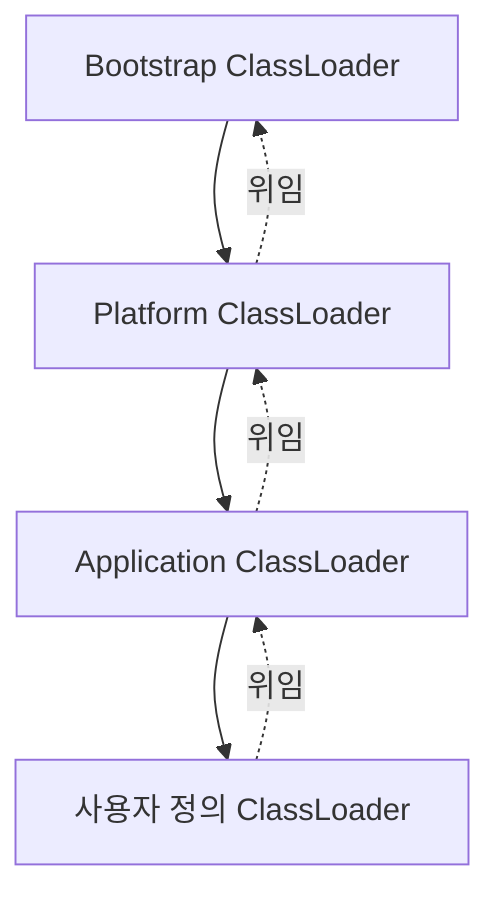

# JVM 구조와 클래스 로더

## 핵심 정의
JVM(Java Virtual Machine)은 자바 바이트코드(bytecode)를 플랫폼에 독립적으로 실행하는 런타임이다. 크게 클래스 로더 서브시스템(Class Loader Subsystem), 런타임 데이터 영역(Runtime Data Area), 실행 엔진(Execution Engine) 세 부분으로 구성된다.

클래스 로더는 `.class` 파일을 찾아 읽고, 검증한 뒤 JVM 메모리(Method Area)에 적재하는 역할을 담당한다. 단순히 파일을 읽어오는 것을 넘어 클래스의 네임스페이스를 격리하고, 언제 어떤 클래스를 로드할지(지연 로딩) 결정하는 구조적 역할을 한다.

## 동작 원리 / 구조

### 클래스 로딩 3단계
1. **Loading**: 클래스 파일을 찾아 바이너리 데이터를 읽고 클래스 메타데이터(내부 klass 구조)를 Method Area(Metaspace)에 적재한다. 이때 리플렉션으로 다루는 `java.lang.Class` 대표 객체(미러)는 Heap에 생성되어 이 메타데이터를 가리킨다
2. **Linking**
   - Verify: 바이트코드가 JVM 스펙을 위반하지 않는지 검증
   - Prepare: static 변수에 기본값(0, null 등) 할당, 메모리 확보
   - Resolve: 심볼릭 레퍼런스를 실제 레퍼런스로 변환 (선택적, 지연 가능)
3. **Initialization**: static 초기화 블록 실행, static 변수에 실제 값 대입 (`<clinit>` 실행)

### 클래스 로더 계층 (Parent Delegation Model)
- **Bootstrap ClassLoader**: 네이티브 코드로 구현, `java.lang` 등 JDK 핵심 클래스 로드
- **Platform ClassLoader** (구 Extension ClassLoader): 부트스트랩이 정의하지 않는 플랫폼 클래스들을 정의; Java 9+ 모듈 구조를 반영
- **Application ClassLoader**: 클래스패스(classpath) 및 애플리케이션 모듈의 클래스 로드
- **사용자 정의 ClassLoader**: 플러그인, 동적 리로딩 등을 위해 개발자가 직접 구현

기본 동작은 위임 모델로, 클래스 로딩 요청을 받으면 먼저 부모에게 위임하고 부모가 못 찾을 때만 자신이 로드한다. 이는 `java.lang.Object` 같은 핵심 클래스가 임의로 재정의되는 것을 막기 위한 보안/일관성 장치다.

## 실무 관점
- **같은 클래스, 다른 로더 = 다른 타입**: 클래스를 실제 정의한 로더(defining loader)와 바이너리 이름이 함께 클래스의 유일성(identity)을 결정한다. WAS에서 여러 애플리케이션이 각자의 클래스 로더를 갖는 이유이자, `ClassCastException`이 발생하는 대표 원인이다.
- **Fat JAR 실행 방식**: Spring Boot의 실행 가능한 JAR(executable jar)는 표준 클래스패스 방식이 아니라 자체 `LaunchedClassLoader`(Spring Boot 3.2+; 구 버전은 `LaunchedURLClassLoader`)를 사용해 내부 `BOOT-INF/lib`의 라이브러리를 로드한다. 일반 IDE 실행과 `java -jar` 실행 시 클래스 로딩 방식 차이로 인한 이슈가 종종 발생한다.
- **ClassNotFoundException vs NoClassDefFoundError**: 전자는 명시적으로 `Class.forName()` 등으로 로드를 시도했으나 클래스패스에 없는 경우, 후자는 JVM이 클래스 정의를 필요로 할 때 찾지 못하거나, 이전 초기화 실패로 erroneous 상태가 된 클래스를 다시 사용할 때도 발생한다. 초기 초기화 실패의 cause를 먼저 찾아야 한다.
- **부모 위임을 깨는 경우**: JDBC 드라이버 로딩, SPI(`ServiceLoader`) 등은 Application ClassLoader가 로드한 하위 로더에만 보이는 서비스 구현을 상위 로더의 API 코드가 발견해야 하는 역전 상황이 생긴다. 이때 `Thread.currentThread().getContextClassLoader()`(Thread Context ClassLoader)를 활용해 위임 모델의 한계를 우회한다.
- **핫 리로드/데브툴즈**: `spring-boot-devtools`는 애플리케이션 클래스만 별도 클래스 로더로 다시 로드해 재시작 속도를 높인다.

### close와 클래스 언로딩은 다르다

`URLClassLoader.close()`는 로더가 연 파일을 닫고 그 로더가 정의할 새 클래스·리소스의 로딩을 막는다. 이미 로드한 클래스는 계속 사용할 수 있고 부모 로더에서 찾는 클래스도 접근 가능하다. 따라서 close를 호출했다고 기존 인스턴스가 무효화되거나 Metaspace가 즉시 회수되는 것은 아니다. 로더를 사용하는 작업을 먼저 종료한 뒤 닫으며, 다른 스레드가 동시에 클래스를 로드하는 중의 close 결과는 정의되지 않는다.

재배포·플러그인 교체 때는 이전 클래스의 인스턴스, 캐시, 살아 있는 스레드의 컨텍스트 클래스 로더(Thread Context ClassLoader, TCCL)가 이전 로더를 붙잡는지 확인한다. 스레드 풀 작업에서 TCCL을 잠시 교체했다면 `finally`에서 **이전 로더를 복원**한다. 무조건 null로 지우면 같은 스레드를 다시 쓰는 다음 작업의 서비스 탐색을 바꿀 수 있다. 자원 닫기와 참조 수명 정리가 모두 필요하다.

## 심화 Q&A

### Q. 동일한 이름의 클래스를 서로 다른 클래스 로더가 각각 로드하면 어떤 문제가 생기는가?
JVM은 (defining loader, 바이너리 이름) 조합을 타입의 유일한 식별자로 취급한다. 따라서 같은 바이트코드라도 다른 로더가 로드하면 서로 다른 타입으로 취급되어, 한쪽 로더가 만든 인스턴스를 다른 쪽 타입으로 캐스팅하면 `ClassCastException`이 발생한다. WAS의 애플리케이션 간 격리, OSGi 번들 격리가 이 특성을 이용한다.

### Q. 부모 위임 모델(Parent Delegation Model)을 우회해야 하는 대표적인 경우와 해결 방법은?
JDBC `DriverManager`, JNDI, JAXP처럼 핵심 API는 상위 로더가 로드하지만 실제 구현체는 Application ClassLoader가 로드하는 서드파티 라이브러리인 경우가 대표적이다. Bootstrap 클래스 로더는 자식 로더가 로드한 클래스를 볼 수 없으므로, `Thread Context ClassLoader`를 명시적으로 설정해 필요한 시점에 알맞은 로더를 참조하도록 우회한다. `ServiceLoader` 기반 SPI 메커니즘이 이 패턴을 표준화한 것이다.

### Q. Metaspace에서 OutOfMemoryError가 발생하는 근본 원인은 무엇이며, 클래스 언로딩은 어떤 조건에서 일어나는가?
Metaspace는 클래스 메타데이터를 저장하는 네이티브 메모리 영역으로, 기본적으로 힙 크기와 무관하게 시스템 메모리 한도까지 커질 수 있다(단, `-XX:MaxMetaspaceSize`로 제한 가능). 일반 클래스의 언로딩은 defining loader가 회수 가능해야 한다. 약하게 연결된 hidden class는 로더보다 먼저 언로드될 수 있는 예외다. 즉 클래스 로더를 참조하는 것이 하나도 남지 않아야 하는데, 동적 프록시나 리플렉션 캐시, 리소스 재배포(hot deploy)를 반복하는 환경에서 이전 클래스 로더가 해제되지 않고 누적되면 Metaspace OOM으로 이어진다.

### Q. WAR 배포와 Fat JAR 실행 방식은 클래스 로딩 관점에서 어떻게 다른가?
전통적인 WAR는 서블릿 컨테이너(WAS)가 애플리케이션마다 별도의 클래스 로더 계층을 구성해 배포하고, 컨테이너 자체 클래스와 애플리케이션 클래스를 명확히 분리한다. Spring Boot의 실행 가능 JAR는 별도 컨테이너 없이 JVM에서 바로 실행되므로, 내부에 내장 라이브러리 JAR들을 포함한 구조(nested JAR)를 표준 `URLClassLoader`가 다루지 못해 자체 구현한 `LaunchedClassLoader`(Spring Boot 3.2+; 구 버전은 `LaunchedURLClassLoader`)로 내부 JAR를 인식해 로드한다.

### Q. static 초기화는 정확히 어느 시점에 일어나며, 이를 이용한 지연 초기화 패턴은 어떻게 동작하는가?
static 초기화(Initialization 단계, `<clinit>` 실행)는 해당 클래스가 처음으로 능동적으로 사용되는 시점(인스턴스 생성, 선언한 static 메서드 호출, 상수 변수가 아닌 static 필드의 사용, 초기화를 요구하는 리플렉션 등)에 JVM이 동기화해 수행한다. 성공한 초기화는 한 번만 수행되며, 실패하면 해당 클래스 정의는 오류 상태가 된다. Initialization-on-demand holder 패턴은 싱글턴을 감싸는 중첩 static 클래스를 만들어, 외부 클래스가 로드되어도 내부 홀더 클래스는 능동 사용 전까지 초기화를 미룰 수 있는 특성(로딩·링크는 먼저 일어날 수 있음)을 이용해 락 없이 지연 초기화와 스레드 안전성을 동시에 확보한다.

### Q. static 초기화에서 외부 호출이 실패하면 다음 접근 때 다시 시도되는가?
A. 같은 클래스 정의에서는 재시도되지 않는다. JLS 25 §12.4.2에 따라 첫 초기화 실패가 Error가 아니면 보통 `ExceptionInInitializerError`로 감싸지고, 해당 클래스는 erroneous 상태가 되어 후속 능동 사용에서 `NoClassDefFoundError`가 발생한다. 네트워크 재시도 가능한 초기화를 정적 블록에 숨기면 일시 장애가 클래스 전체의 지속 실패로 바뀔 수 있다.

### Q. static final이면 모두 초기화 없이 사용할 수 있는 상수인가?
A. 아니다. 컴파일 타임 상수 식으로 초기화한 기본 타입·String의 상수 변수와 `static final Integer` 또는 메서드 호출로 얻은 값을 구분한다. `static final int N = 3`의 읽기는 선언 클래스 초기화를 유발하지 않지만, `static final int N = load()`는 그렇지 않다. 초기화가 재귀적으로 현재 스레드에 다시 요청되면 초기화 전 기본값을 관찰할 수 있으므로 순환 static 의존성도 피한다.

## 관련 개념
- [[런타임 데이터 영역]]
- [[메모리 누수]]
- [[JIT 컴파일러]]

## 참고 자료

확인 날짜: 2026-09-08. 아래 버전과 범위의 공식 문서·소스로 본문을 대조했다. 성능 비교와 운영 선택은 워크로드에 따라 달라지는 판단 기준이다.

- [JVMS 25 §5](https://docs.oracle.com/javase/specs/jvms/se25/html/jvms-5.html) — 로딩·링크·타입 식별·초기화 실패.
- [JLS 25 §12](https://docs.oracle.com/javase/specs/jls/se25/html/jls-12.html) — 초기화 트리거·상수 예외·언로딩.
- [Java SE 25 ClassLoader](https://docs.oracle.com/en/java/javase/25/docs/api/java.base/java/lang/ClassLoader.html) — 부모 위임·platform/system loader·모듈.
- [Spring Boot LaunchedClassLoader](https://docs.spring.io/spring-boot/api/java/org/springframework/boot/loader/launch/LaunchedClassLoader.html) — Since 3.2.0; 조회 API 4.1.1의 실행 JAR 로더 명칭.

### 2026-09-23 부분 재검증

JLS 25 §12.4.1–12.4.2의 상수 변수 예외·초기화 실패 상태·같은 스레드의 재귀 초기화를 확인했다. 기존 전체 검증일은 유지한다.

실행 확인: 2026-09-23, OpenJDK 25.0.2+10-69에서 최초 ExceptionInInitializerError·후속 NoClassDefFoundError, 순환 초기화의 기본값 관찰을 재현했다. 구현 관측을 다른 JVM·버전의 추가 보장으로 일반화하지 않는다.

### 부분 재검증: 2026-10-04

Java SE/JLS 25의 URLClassLoader close 이후 사용 범위, TCCL 참조·복원, 일반 클래스 언로딩의 로더 수명 조건을 확인했다. 기존 전체 `verified`는 유지한다.

- [URLClassLoader.close](https://docs.oracle.com/en/java/javase/25/docs/api/java.base/java/net/URLClassLoader.html#close()) — 새 로딩 중단, 기존·부모 클래스 접근, 동시 로딩 중 close의 미정의 결과.
- [Thread의 contextClassLoader](https://docs.oracle.com/en/java/javase/25/docs/api/java.base/java/lang/Thread.html#setContextClassLoader(java.lang.ClassLoader)) — 현재 스레드의 컨텍스트 로더 설정.
- [JLS 25 §12.7](https://docs.oracle.com/javase/specs/jls/se25/html/jls-12.html#jls-12.7) — 클래스 언로딩과 defining loader의 회수 가능성.

실행 확인: Oracle JDK 25.0.4+7-LTS-189(macOS AArch64)에서 임시 JAR를 별도 URLClassLoader로 로드했다. close 뒤 기존 클래스 메서드·부모 클래스 접근은 성공하고 아직 읽지 않은 자체 클래스는 ClassNotFoundException으로 실패했다. 예외 발생 경로의 TCCL 복원도 확인했다. 실제 GC 언로딩 시점·WAS 재배포·Metaspace 회수량은 측정하지 않았다.
