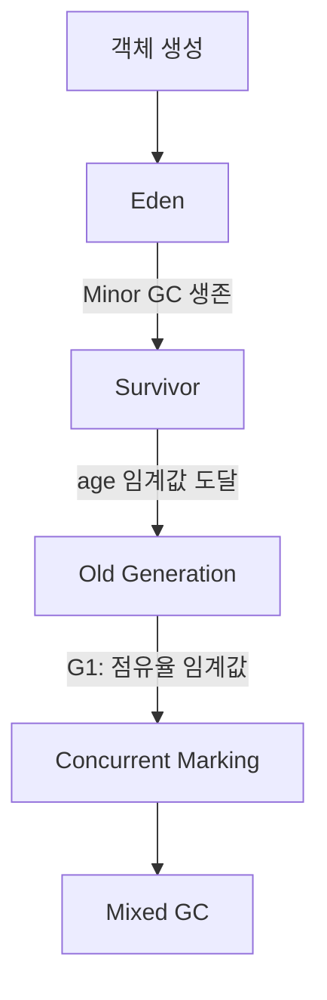

# 가비지 컬렉션 알고리즘

## 핵심 정의
가비지 컬렉션(Garbage Collection, GC)은 더 이상 도달할 수 없는(unreachable) 객체를 자동으로 탐지하고 회수해 개발자가 명시적으로 메모리를 해제하지 않아도 되게 하는 JVM의 메모리 관리 메커니즘이다. 기본 동작은 mark(도달 가능 객체 표시) → sweep(미표시 객체 회수) → compact(단편화 방지를 위한 재배치)의 조합이다.

대부분의 컬렉터는 "객체는 대부분 금방 죽는다"는 세대 가설(generational hypothesis)에 기반해 Heap을 Young/Old로 나누고 서로 다른 빈도와 알고리즘으로 처리한다.

## 동작 원리 / 구조

### 주요 컬렉터 비교 (Java 25 LTS 기준)

| 컬렉터 | 특성 | 기본 여부 |
|---|---|---|
| Serial GC | 단일 스레드, 소규모 힙/클라이언트용 | 제약 환경(1 CPU, 저메모리)의 fallback |
| Parallel GC | 다중 스레드, 처리량(throughput) 최우선 | - |
| G1 GC | 리전(region) 기반, 처리량과 지연시간 균형 | Java 9부터 server-class 환경의 기본 |
| ZGC (Generational) | 컬러드 포인터·로드/스토어 배리어 기반, 초저지연 | 명시적 선택, Java 21+에서 세대형 구조 제공 |
| Shenandoah | 동시 압축(concurrent compaction), 저지연 | 명시적 선택, 배포판 지원 확인 |
| CMS | Concurrent Mark Sweep, 저지연 | Java 9 deprecated, Java 14 제거 |

CMS(Concurrent Mark Sweep)는 Java 9에서 deprecated되고 Java 14(JEP 363)에서 완전히 제거되었으며, G1과 이후 ZGC/Shenandoah가 그 역할을 대체했다.

### Java 27의 기본 컬렉터 변경
JDK 27(JEP 523)은 CPU 수와 물리 메모리가 적은 환경에서도 G1을 기본으로 선택한다. 위 표의 Serial fallback은 Java 25 범위의 설명이며 Java 27에는 적용하지 않는다. Serial이 제거된 것은 아니므로 필요하면 `-XX:+UseSerialGC`로 선택하고 실제 부하에서 비교한다. Oracle JDK 27+35에서 `-XX:ActiveProcessorCount=1 -Xmx64m -XX:+PrintFlagsFinal`로 `UseG1GC=true`를 확인했다. 컨테이너 배포 시에도 실행 중인 JDK와 명시적 GC 옵션을 함께 확인한다.

### G1 GC 동작 방식
힙을 다수의 동일 크기 리전(region)으로 나누고, 각 리전을 Eden/Survivor/Old로 동적 할당한다. Young GC는 전체 Young 리전을 회수하고, Old 할당률과 마킹 시간을 반영한 IHOP(Initiating Heap Occupancy Percent) 임계값을 기준으로 동시 마킹(concurrent marking)을 시작한 후 가비지가 가장 많은 리전 위주로 회수하는 Mixed GC를 수행한다. 목표 정지 시간(`-XX:MaxGCPauseMillis`)에 맞춰 처리할 리전 수를 동적으로 조절한다. JDK 25는 Adaptive IHOP가 기본이며 고정 InitiatingHeapOccupancyPercent는 초기 추정에 쓰이고, 목표 정지시간은 상한 보장이 아니다.

### G1에서 큰 객체와 늦게 회수되는 객체
HotSpot JDK 25는 헤더·정렬을 포함한 객체 크기가 리전 크기의 절반을 **초과**하면 humongous로 분류해 연속된 Old 리전에 직접 할당한다. 마지막 리전에서 남는 공간은 해당 객체를 회수할 때까지 다른 할당에 활용하지 못한다. 따라서 짧게 살아도 큰 `byte[]`·직렬화 결과를 반복 생성하면 Old 점유와 연속 리전 확보 부담이 커질 수 있다. 할당이 동시 마킹 시작 여부를 점검하게 만들기도 하지만 humongous 할당마다 Full GC가 발생하는 것은 아니다. 먼저 GC 로그의 humongous 리전과 실제 payload 크기를 대조하고 스트리밍·분할 처리를 검토한다. 리전 크기 변경은 임계값과 낭비 공간을 함께 바꾸므로 [[GC 튜닝]]에서 부하를 재측정한다.

G1의 동시 마킹은 시작 시점 스냅샷(Snapshot-At-The-Beginning, SATB)을 기준으로 한다. 마킹 도중 참조가 끊긴 객체도 해당 사이클에는 살아 있는 것으로 취급되어 다음 마킹까지 남을 수 있다. 참조를 제거한 직후나 GC 한 번 뒤에 힙이 줄지 않았다는 사실만으로 누수를 확정하지 않는다. 여러 수집 사이클의 생존량과 참조 경로를 함께 확인한다.

### Generational ZGC
Java 21(JEP 439)에서 세대형 ZGC가 도입되어 Young/Old 세대를 분리 수집할 수 있게 되었고, Java 23(JEP 474)부터 세대형 모드가 기본값이 되었다. 비세대형 모드는 Java 24(JEP 490)에서 제거되었으며 Java 25도 세대형만 지원한다. 컬러드 포인터(colored pointer)와 로드/스토어 배리어(load/store barrier)를 이용해 정지시간 1ms 이하를 목표로 압축까지 동시에 수행한다.

위 흐름도는 일반적인 세대형 할당·승격 경로를 단순화한 것이다. G1의 humongous 직접 Old 할당과 ZGC의 세대 구조를 모두 표현하지는 않는다.

## 실무 관점
- **선택 기준**: 배치/대용량 처리량이 중요하면 Parallel GC, 응답 지연이 SLA에 민감한 API 서버는 G1(기본값)이 대부분 무난하며, 대용량 힙(수십 GB 이상)에서 지연시간이 극도로 중요하면 ZGC/Shenandoah를 검토한다.
- **컨테이너 환경**: 기본 힙 크기는 `-XX:MaxRAMPercentage` 등 컨테이너 인식(cgroup-aware) 로직에 의해 컨테이너 메모리 리밋을 기준으로 산정된다. 명시적으로 `-Xmx`를 지정하지 않으면 예상과 다른 크기로 설정될 수 있으니 운영 환경에서는 검증이 필요하다.
- **흔한 장애 패턴**: Old 영역이 빠르게 차서 Mixed GC로도 못 따라가 Full GC(Stop-the-world, 전체 힙 대상)로 전락하는 경우가 대표적인 지연시간 급증 원인이다. 대량 객체를 짧은 시간에 Old로 승격시키는 배치성 로직, 과도한 캐시 증가가 원인이 되곤 한다.

## 심화 Q&A

### Q. G1과 ZGC의 정지 시간(pause time) 차이는 근본적으로 어디서 오는가?
G1은 리전 단위로 나눠 정지 시간을 예측 가능한 범위로 쪼개지만, 주 마킹 단계는 동시 실행하지만 객체 복사(evacuation)와 일부 마킹 마무리는 Stop-the-world로 수행한다. ZGC는 컬러드 포인터와 로드/스토어 배리어를 이용해 마킹, 재배치(relocation), 리매핑(remapping)까지 대부분을 애플리케이션 스레드와 동시에(concurrent) 수행하므로 힙 크기와 거의 무관하게 정지시간이 힙 크기에 크게 비례하지 않도록 설계되었다. 실제 정지와 할당 지연은 CPU·메모리 여유 및 OS 스케줄링에 영향을 받으며 실시간 상한을 보장하지 않는다. 대신 배리어 비용으로 인한 처리량 오버헤드가 G1보다 클 수 있다.

### Q. CMS가 deprecated되고 제거된 이유는 무엇이며 무엇으로 대체되었는가?
CMS는 압축(compaction)을 지원하지 않아 단편화가 누적되면 결국 Full GC(Serial Old, 압축 포함)로 폴백해야 했고, 이 폴백이 매우 긴 정지 시간을 유발했다. 또한 코드 복잡도가 높아 유지보수 부담이 컸다. G1이 리전 기반 압축을 기본 지원하면서 CMS의 저지연 목적을 대체했고, 이후 ZGC/Shenandoah가 더 극단적인 저지연 요구를 담당하게 되어 Java 14에서 CMS가 완전히 제거되었다.

### Q. Generational ZGC가 필요했던 이유는 무엇인가? 비세대형 ZGC의 한계는?
비세대형 ZGC는 Young/Old 구분 없이 힙 전체를 균일하게 처리했기 때문에, 금방 죽는 객체가 많다는 세대 가설의 이점을 활용하지 못해 매 사이클에서 전체 힙을 수집 대상으로 삼아 살아 있는 객체를 추적하는 비용이 있었다. 모든 힙 바이트를 선형 스캔한다는 뜻은 아니다. Generational ZGC는 Young 영역을 훨씬 자주, 저비용으로 수집해 처리량을 개선하면서도 ZGC 고유의 저지연 특성을 유지한다.

### Q. Stop-the-world를 완전히 제거하지 못하는 이유는 무엇인가?
동시(concurrent) 컬렉터라도 루트 스캔(root scanning) 시작 시점 동기화, 스레드별 로컬 상태(TLAB 등) 정리, 일부 참조 갱신 작업 등은 애플리케이션과 GC 스레드가 동시에 힙 상태를 바꾸면 정합성이 깨지기 때문에 아주 짧게라도 전체 스레드를 정지시켜야 하는 지점이 남는다. ZGC/Shenandoah가 목표로 하는 것은 '제거'가 아니라 정지 시간을 힙 크기와 무관한 상수 수준으로 낮추는 것이다.

### Q. Card Table과 Remembered Set은 왜 필요한가?
세대별 GC에서 Young GC만 수행할 때도 Old 영역의 객체가 Young 영역 객체를 참조하는 경우(cross-generational reference)를 놓치면 살아있는 객체를 잘못 회수하게 된다. Card Table은 Old 영역을 작은 블록(카드)으로 나눠 어떤 카드가 Young을 참조하는 필드를 담고 있는지 기록하고, Remembered Set은 이를 리전/세대 단위로 집계해 Young GC 시 Old 전체가 아닌 기록된 카드만 스캔하면 되도록 만들어 Minor GC 비용을 크게 줄인다.

### Q. 처리량 최적화 컬렉터와 지연시간 최적화 컬렉터 사이의 근본적인 트레이드오프는 무엇인가?
동시성(concurrency)을 높여 정지 시간을 줄이려면 애플리케이션 스레드와 GC 스레드가 동시에 실행되어야 하므로 배리어, 추가 스레드, 메모리 오버헤드(메타데이터와 재배치 여유 공간) 비용이 발생해 전체 CPU 사용량과 처리량이 희생된다. Parallel GC는 수집 중 애플리케이션을 멈추므로 동시 수집에 필요한 일부 배리어·조정 비용을 줄일 수 있지만, GC 워커 사이의 동기화 비용까지 없어지는 것은 아니다. 처리량 이점과 정지 시간은 실제 워크로드에서 함께 측정한다. 결국 SLA(응답 지연 vs 초당 처리량) 요구사항에 따라 선택해야 한다.

## 관련 개념
- [[런타임 데이터 영역]]
- [[GC 튜닝]]
- [[JIT 컴파일러]]

## 참고 자료

확인 날짜: 2026-09-08. 아래 버전과 범위의 공식 문서·소스로 본문을 대조했다. 성능 비교와 운영 선택은 워크로드에 따라 달라지는 판단 기준이다.

- [JDK 25 G1](https://docs.oracle.com/en/java/javase/25/gctuning/garbage-first-g1-garbage-collector1.html) — 기본 선택·Adaptive IHOP·동시 마킹·evacuation.
- [JDK 25 ZGC](https://docs.oracle.com/en/java/javase/25/gctuning/z-garbage-collector1.html) — 정지 목표·세대형 모드·힙 여유.
- [JEP 439](https://openjdk.org/jeps/439) — Java 21 세대형 ZGC·스토어 배리어.
- [JEP 474](https://openjdk.org/jeps/474) — Java 23 세대형 기본.
- [JEP 490](https://openjdk.org/jeps/490) — Java 24 비세대형 제거.
- [JEP 363](https://openjdk.org/jeps/363) — Java 14 CMS 제거.

부분 재검증: 2026-09-22. 아래 범위를 추가 확인했으며, 그 밖의 본문은 기존 검증 날짜를 유지한다.

- [JDK 27 GC Tuning: Available Collectors](https://docs.oracle.com/en/java/javase/27/gctuning/available-collectors.html) — 제약 환경을 포함한 G1 기본값, Serial의 명시적 선택.
- [Oracle Java 27 릴리스 발표](https://www.oracle.com/news/announcement/oracle-releases-java-27-and-strengthens-post-quantum-cryptography-support-2026-09-15/) — 2026-09-15 릴리스와 JEP 523 포함. Java 25의 다른 컬렉터 구현·튜닝 설명 전체를 Java 27로 재검증한 것은 아니다.

- [JDK 27 Parallel Collector](https://docs.oracle.com/en/java/javase/27/gctuning/parallel-collector1.html) — 병렬 GC 스레드와 동기화 오버헤드. 2026-09-22에 해당 처리량 비교 문단을 부분 재검증했다.

부분 재검증: 2026-10-04. 아래 적용 버전과 확인 범위에 한하며 노트 전체의 기존 verified는 유지한다.

- [JDK 25 G1 GC Guide](https://docs.oracle.com/en/java/javase/25/gctuning/garbage-first-g1-garbage-collector1.html) — 연속 Old 리전·마지막 리전 낭비·SATB 수명. Oracle JDK 25.0.4+7-LTS-189 macOS AArch64에서 G1, 32 MiB 힙, 1 MiB 리전으로 600 KiB byte 배열을 유지한 GC의 `Humongous regions: 1->1`과 참조 제거 후 `1->0`을 관찰했다. 이 실행은 SATB 동시 마킹·운영 지연시간 검증이 아니다.
- [OpenJDK jdk-25+36 G1CollectedHeap.hpp](https://github.com/openjdk/jdk/blob/jdk-25%2B36/src/hotspot/share/gc/g1/g1CollectedHeap.hpp#L1173-L1186), [임계값 초기화](https://github.com/openjdk/jdk/blob/jdk-25%2B36/src/hotspot/share/gc/g1/g1CollectedHeap.cpp#L1189) — Oracle 가이드의 “절반 이상” 표현과 달리 구현은 엄격한 초과 비교다. 위 Oracle JDK 25.0.4에서 1 MiB 리전, 압축 클래스 포인터, 기존 객체 헤더, 8바이트 정렬을 고정하고 Instrumentation으로 524,288바이트와 524,296바이트 객체 크기를 확인했다. GC 로그에서 전자는 humongous 0개, 후자는 1개로 관찰되어 본문 경계는 소스와 실행 결과를 따른다. payload 길이만으로 경계를 계산하지 않는다.
