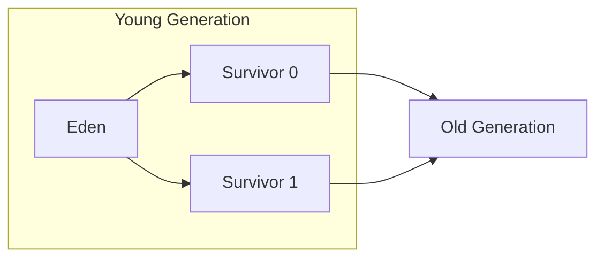

# 런타임 데이터 영역

## 핵심 정의
런타임 데이터 영역(Runtime Data Area)은 JVM이 프로그램 실행 중 사용하는 메모리 공간의 집합이다. 크게 모든 스레드가 공유하는 영역(Method Area, Heap)과 스레드마다 독립적으로 갖는 영역(PC Register, JVM Stack, Native Method Stack)으로 나뉜다.

이 구조를 이해하면 `OutOfMemoryError`나 `StackOverflowError`가 어느 영역의 문제인지 즉시 구분할 수 있고, `-Xms`/`-Xmx`/`-Xss` 같은 JVM 옵션이 정확히 어떤 메모리를 제어하는지 판단할 수 있다.

## 동작 원리 / 구조

| 영역                      | 공유 여부 | 저장 내용                                         |
| ----------------------- | ----- | --------------------------------------------- |
| Method Area (HotSpot 구현: 주로 Metaspace) | 공유    | 클래스 메타데이터, 상수 풀, 메서드 바이트코드                    |
| Heap                    | 공유    | 객체 인스턴스, 배열, static 변수의 실제 값(Class 미러 객체를 통해) |
| PC Register             | 스레드별  | 현재 JVM 명령 위치; native 메서드 실행 시 값은 미정의                         |
| JVM Stack               | 스레드별  | 스택 프레임(지역 변수, 피연산자 스택, 메서드 호출 정보)             |
| Native Method Stack     | 스레드별  | JNI 등 네이티브 메서드 호출 정보                          |

> **static 변수는 Method Area가 아니라 Heap에 있다**: "static 변수는 Method Area(Metaspace)에 저장된다"는 설명은 널리 퍼진 단순화이지만 HotSpot 기준으로는 부정확하다. PermGen 제거 작업 과정에서 인터닝된 문자열(interned String)은 Java 7부터, Java 8의 PermGen 제거(JEP 122)는 클래스 static 필드의 힙 저장과 클래스 메타데이터의 네이티브 메모리 이전을 포함한다. JDK 25 HotSpot에서 `java.lang.Class` 미러와 static 필드 값은 힙에 있다. 미러 객체 자체의 역사적 이전 시점을 동일 작업으로 단정하지 않는다. 다만 심볼(Symbol)이나 메서드 바이트코드, 상수 풀 같은 클래스 메타데이터 자체는 Heap이 아니라 네이티브 메모리인 Metaspace로 옮겨졌으므로 "PermGen에 있던 것은 전부 Heap으로 갔다"는 것은 아니다. Method Area/Metaspace에는 그 static 필드가 "어떤 타입, 어떤 이름을 가지는지"에 대한 메타데이터만 남아 있고, 실제 값은 Heap의 Class 미러 객체가 들고 있다.

### Heap의 세대 구조 (Generational Hypothesis 기반)

위 그림은 Serial/Parallel 같은 전통적 세대형 힙의 개념도다. G1은 Eden/Survivor를 가변 개수의 리전으로 구성하고, 세대형 ZGC는 동일한 Eden+Survivor 2개 배치를 사용하지 않는다. 세대 구분 자체도 JVM 명세의 필수 조건은 아니다. 전통적인 세대형 수집의 일반적인 작은 객체는 Eden에 할당되고, Young GC에서 살아남으며 age가 증가해 Old로 승격(promotion)될 수 있다. 모든 객체가 이 경로를 거치는 것은 아니다. 예를 들어 JDK 25 G1의 humongous 객체는 처음부터 Old 리전에 할당한다.

### PermGen에서 Metaspace로
Java 7까지는 클래스 메타데이터를 Heap의 일부인 PermGen(Permanent Generation)에 저장했으나, Java 8부터 Metaspace라는 네이티브 메모리 영역으로 이전했다. 별도 초기/최대 용량 옵션으로 조절하던 PermGen과 달리 Metaspace는 기본적으로 시스템 메모리 한도까지 자동 확장된다(`-XX:MaxMetaspaceSize`로 제한 가능).

가상 스레드의 Java 스택은 HotSpot에서 힙의 스택 청크로 유지된다. `-Xss`와 플랫폼 스레드별 네이티브 스택 모델을 가상 스레드 하나마다 그대로 곱해서 계산하지 않는다.

### 객체 헤더 크기의 버전 의존성
HotSpot JDK 27은 압축 객체 헤더(compact object headers, JEP 534)를 기본 활성화한다. 기존 64비트 HotSpot의 흔한 구성인 12바이트 헤더(8바이트 mark + 4바이트 압축 클래스 포인터) 대신 8바이트 헤더를 사용한다. 실제 객체 크기는 필드 배치·배열 길이 필드·정렬 패딩·실행 옵션에도 영향을 받으므로 객체마다 4바이트씩 줄어든다고 계산하지 않는다.

Oracle JDK 27+35 macOS AArch64 기본 설정에서 Instrumentation으로 측정한 빈 Object는 8바이트, int 필드 두 개를 가진 객체는 16바이트였다. 같은 실행에서 `-XX:-UseCompactObjectHeaders`를 주면 각각 16·24바이트였다. 이는 해당 VM 설정의 관찰이며 Java 명세의 객체 크기 보장이 아니다. JDK를 올릴 때 힙 추정과 메모리 분석 도구가 해당 레이아웃을 지원하는지 확인한다.

## 실무 관점
- **OOM 종류별 원인 구분**
  - `java.lang.OutOfMemoryError: Java heap space` → Heap 부족, 힙 덤프로 원인 객체 추적
  - `java.lang.OutOfMemoryError: Metaspace` → 클래스 로더 누수, 과도한 동적 클래스 생성(프록시 등)
  - `java.lang.StackOverflowError` → 재귀 깊이 초과 또는 `-Xss` 부족
  - `Direct buffer memory` → NIO Direct Buffer, `-XX:MaxDirectMemorySize` 초과
- **튜닝 포인트**: `-Xms`/`-Xmx`(힙 초기/최대 크기), `-Xss`(스레드 스택 크기), `-XX:MaxMetaspaceSize`. 스레드를 많이 생성하는 애플리케이션은 플랫폼 스레드 수와 스택 예약/사용량이 네이티브 메모리를 압박해 `OutOfMemoryError: unable to create new native thread`로 이어질 수 있다.
- **컨테이너 환경**: 컨테이너 메모리 리밋 내에서 Heap + Metaspace + 스레드 스택 + Direct Memory + JVM 자체 오버헤드를 모두 고려해야 하며, Heap만 넉넉히 잡으면 다른 영역 부족으로 오히려 컨테이너가 OOMKilled 될 수 있다.

### 힙 사용량과 프로세스 사용량을 구분하는 지표
Java 25 `MemoryMXBean.getHeapMemoryUsage()`의 `used`에는 살아 있는 객체뿐 아니라 아직 수집하지 않은 쓰레기도 포함된다. `committed`는 JVM이 사용할 수 있도록 확보한 양, `max`는 관리 대상의 상한이며 실제 상주 메모리(RSS)와 같은 수치가 아니다. `used`가 `max`보다 작다고 추가 할당 성공까지 보장되지는 않는다. 힙·non-heap 메모리 풀의 합만으로 프로세스 전체 네이티브 사용량을 계산하지 않는다.

NIO 직접 버퍼는 `BufferPoolMXBean`의 `direct` 풀도 함께 본다. `getTotalCapacity()`는 버퍼 용량 합의 추정치이고 `getMemoryUsed()`는 정렬·할당기 비용으로 다를 수 있으며, 추정 불가 시 `-1`을 반환한다. JNI나 다른 네이티브 라이브러리까지 포괄하는 지표가 아니다. 힙이 안정적인데 RSS가 증가하면 직접 버퍼·메타스페이스·스레드 수와 OS 측 메모리 내역을 비교한다.

Linux에서 `unable to create new native thread`가 발생하면 메모리뿐 아니라 `RLIMIT_NPROC`, `threads-max`, `pid_max`, cgroup v2의 `pids.current`/`pids.max`도 확인한다. PID 컨트롤러는 커널 task/TID를 세므로 플랫폼 스레드 증가도 제한에 영향을 준다. 힙을 키우는 조치만으로 이 한도는 해결되지 않는다.

## 심화 Q&A

### Q. PermGen을 Metaspace로 교체한 근본적인 이유는 무엇인가?
PermGen은 HotSpot의 별도 크기 한도를 가진 클래스 메타데이터 영역이었고, 클래스 메타데이터 크기를 예측하기 어려운 애플리케이션(특히 동적 클래스 생성이 많은 프레임워크 기반 서버)에서 `OutOfMemoryError: PermGen space`가 빈번했다. Metaspace는 네이티브 메모리를 사용해 기본적으로 자동 확장되므로 이 문제를 완화했고, 부수적으로 Full GC 시 PermGen까지 함께 처리하던 부담도 줄였다.

### Q. StackOverflowError가 발생했을 때 Heap 영역의 객체들은 어떻게 되는가?
StackOverflowError는 JVM Stack 영역의 문제이며 Heap과는 독립적이다. 예외가 발생한 스레드의 스택 프레임들은 되감기(unwinding)되지만, 이미 Heap에 생성되어 다른 곳에서 참조 중인 객체는 영향받지 않는다. 다만 예외 처리 로직 자체가 추가로 스택을 소비할 수 있어 예외 핸들러 안에서 복구 로직이 실패하는 경우도 있다.

### Q. Heap이 넉넉한데도 OutOfMemoryError가 나는 경우는 어떤 것들이 있는가?
Direct Buffer Memory(NIO `ByteBuffer.allocateDirect`), Metaspace, JNI를 통한 네이티브 메모리 누수는 Heap 밖의 사용량을 조사해야 한다. 네이티브 스레드 생성 실패는 메모리 부족 외에 OS의 스레드 수·PID 제한도 원인이 될 수 있다. 특히 Netty 같은 비동기 I/O 프레임워크는 Direct Buffer를 적극 사용하므로 `-XX:MaxDirectMemorySize`를 별도로 관리해야 한다.

### Q. Escape Analysis(탈출 분석)와 Scalar Replacement가 Heap 할당을 줄이는 원리는?
JIT 컴파일러가 객체의 참조가 메서드 밖으로 전혀 빠져나가지 않는다(escape하지 않는다)고 판단하면, 해당 객체를 Heap에 할당하지 않고 필드별 스칼라 값으로 분해(scalar replacement)해 레지스터·스택 슬롯에 두거나 계산 자체를 제거할 수 있다. JDK 25 HotSpot C2가 객체를 통째로 스택에 할당하는 것은 아니다. 이는 GC 대상 객체 수를 줄여 Young GC 압박을 낮추지만, 어디까지나 JIT의 런타임 최적화이므로 항상 보장되는 동작은 아니다.

### Q. 멀티스레드 환경에서 PC Register와 JVM Stack이 스레드별로 독립적이어야 하는 이유는?
각 스레드는 독립적인 실행 흐름을 가지므로 현재 실행 위치(PC Register)와 호출 스택(JVM Stack)이 공유되면 서로 다른 메서드 호출 컨텍스트가 뒤섞여 정합성이 깨진다. 이 때문에 두 영역은 스레드 생성 시점에 함께 만들어지고 스레드 종료 시 함께 해제되며, 스레드 간 동기화 없이도 자유롭게 접근할 수 있다는 점이 락 없는 로컬 연산(예: 지역 변수 계산)의 성능 기반이 된다.

## 관련 개념
- [[JVM 구조와 클래스 로더]]
- [[가비지 컬렉션 알고리즘]]
- [[메모리 누수]]

## 참고 자료

확인 날짜: 2026-09-08. 아래 버전과 범위의 공식 문서·소스로 본문을 대조했다. 성능 비교와 운영 선택은 워크로드에 따라 달라지는 판단 기준이다.

- [JVMS 25 §2.5](https://docs.oracle.com/javase/specs/jvms/se25/html/jvms-2.html#jvms-2.5) — 논리 런타임 영역·PC·구현 자유.
- [JEP 122](https://openjdk.org/jeps/122) — Java 8 PermGen 제거와 저장 위치.
- [HotSpot JDK 25 Performance Enhancements](https://docs.oracle.com/en/java/javase/25/vm/java-hotspot-virtual-machine-performance-enhancements.html) — EA가 객체 단위 스택 할당을 하지 않음.
- [JEP 444](https://openjdk.org/jeps/444) — Java 21 가상 스레드 스택 청크.
- [JDK 25 java](https://docs.oracle.com/en/java/javase/25/docs/specs/man/java.html) — 메모리 옵션 적용 범위.

부분 재검증: 2026-09-22. 아래 확인 범위에 한하며 노트 전체의 기존 verified는 유지한다.

- [JDK 27 Migration Guide](https://docs.oracle.com/en/java/javase/27/migrate/significant-changes-jdk-27-release.html) — JEP 534의 기본 객체 헤더 변경. Oracle JDK 27+35의 UseCompactObjectHeaders 플래그와 Instrumentation 측정을 대조했다.

부분 재검증: 2026-10-04. 아래 적용 버전과 확인 범위에 한하며 노트 전체의 기존 verified는 유지한다.

- [Java 25 MemoryMXBean](https://docs.oracle.com/en/java/javase/25/docs/api/java.management/java/lang/management/MemoryMXBean.html), [MemoryUsage](https://docs.oracle.com/en/java/javase/25/docs/api/java.management/java/lang/management/MemoryUsage.html), [BufferPoolMXBean](https://docs.oracle.com/en/java/javase/25/docs/api/java.management/java/lang/management/BufferPoolMXBean.html) — used/committed/max와 직접 버퍼 추정치 범위. Oracle JDK 25.0.4+7-LTS-189 macOS AArch64에서 직접 버퍼 1 MiB 할당 시 풀 용량 증가와 slice의 저장소 공유를 확인했다. RSS·JNI 총량은 측정하지 않았다.
- [JDK 25 G1](https://docs.oracle.com/en/java/javase/25/gctuning/garbage-first-g1-garbage-collector1.html) — humongous의 직접 Old 할당.
- [Linux man-pages 6.19 pthread_create(3)](https://man7.org/linux/man-pages/man3/pthread_create.3.html), [Linux cgroup v2 PID controller](https://docs.kernel.org/admin-guide/cgroup-v2.html#pid) — 스레드 생성의 자원·개수 제한. Linux 제한 도달은 실행 재현하지 않았다.
