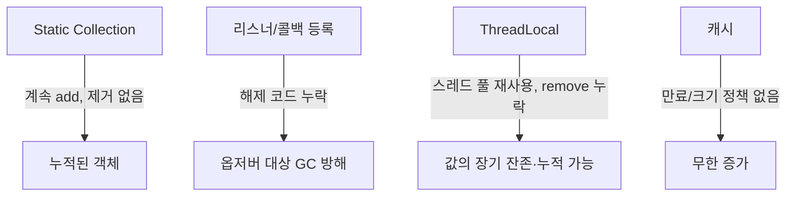

# 메모리 누수

## 핵심 정의
자바는 GC가 도달할 수 없는(unreachable) 객체를 자동으로 회수하지만, 코드상 실수로 더 이상 쓰지 않는 객체를 계속 참조하고 있으면 GC는 이를 "여전히 사용 중"으로 판단해 회수하지 않는다. 이렇게 논리적으로는 불필요하지만 참조 체인이 끊기지 않아 회수되지 못하고 누적되는 현상을 자바의 메모리 누수(memory leak)라고 한다.

네이티브 언어의 누수와 달리 자바의 누수는 대부분 "참조를 정리하지 않는" 설계/구현 실수에서 비롯되며, 결국 `OutOfMemoryError`로 이어지거나 GC 빈도 증가로 인한 성능 저하를 유발한다.

## 동작 원리 / 구조

### 대표적인 누수 패턴

- **static 컬렉션 누적**: `static` 필드로 선언한 `List`, `Map`에 계속 값을 추가만 하고 제거 로직이 없는 경우. 도달 가능한 클래스의 static 필드에서 유지하는 강한 참조는 회수를 막는다. 참조를 지우거나 클래스와 로더가 회수 가능해지면 대상도 회수될 수 있다.
- **리스너/콜백 미해제**: 옵저버 패턴에서 구독자를 등록만 하고 해제하지 않으면, 발행자(subject)가 이미 쓸모없어진 구독자 객체를 계속 참조해 구독자 전체 그래프가 회수되지 못한다.
- **ThreadLocal 미정리**: 스레드 풀 환경에서 스레드는 재사용되므로, `ThreadLocal.remove()`를 호출하지 않으면 이전 요청에서 설정한 값이 스레드 생명주기 동안(사실상 애플리케이션 종료까지) 살아남는다.
- **클래스 로더 누수(Metaspace leak)**: 동적 배포/리로딩을 반복하는 환경에서 이전 클래스 로더가 어딘가(정적 참조, 캐시, 스레드)에 계속 참조되어 언로드되지 못하고 Metaspace가 지속적으로 증가한다.
- **리소스 미종료**: 커넥션, 스트림, 파일 핸들을 `close()`하지 않아 외부 자원이나 네이티브 메모리가 고갈되는 경우. Java 래퍼가 도달 불가능해져도 외부 자원의 즉시 반납은 보장되지 않는다. `try-with-resources`로 대부분 예방 가능하다.

`WeakHashMap`의 값은 강하게 유지된다. 값이 키를 직접·간접 참조하면 약한 키만 사용해도 제거되지 않을 수 있다. PhantomReference/Cleaner의 통지는 메모리의 물리적 회수 완료나 정해진 처리 시각을 보장하지 않는다.

## 실무 관점
- **분석 절차**: 운영 중 힙 사용량이 지속적으로 우상향(계단식 증가 후 GC로도 안 내려감)하면 누수를 의심한다. `jmap -dump`로 힙 덤프를 뜬 뒤 Eclipse MAT의 Dominator Tree, Leak Suspects 리포트로 어떤 객체 그룹이 비정상적으로 많은 메모리를 점유하는지 찾는다.
- **Spring Bean 스코프 오용**: 싱글턴 빈이 요청(request) 스코프의 상태를 담은 필드를 가지고 있으면, 그 필드가 매 요청마다 교체되지 않는 한 이전 요청 데이터가 계속 살아남는다. 싱글턴 빈에 가변 상태를 두지 않는 것이 기본 원칙이다.
- **ThreadLocal in thread pool**: 요청 처리 완료 시점(필터, 인터셉터의 `finally` 블록 등)에 반드시 `ThreadLocal.remove()`를 호출해야 한다. MDC(로깅 컨텍스트) 누수가 실무에서 자주 나타나는 사례다.
- **캐시 관리**: 자체 `HashMap` 기반 캐시 대신 Caffeine, Guava Cache처럼 크기 제한(maximum size)이나 만료 정책(expire after write/access)을 기본 제공하는 라이브러리에서 실제 크기 상한을 설정한다. 기능이 제공된다는 사실만으로 기본 캐시가 제한되는 것은 아니다.
- **참조 유형 활용**: 캐시처럼 메모리 압박 시 자동으로 비워져도 되는 값은 `SoftReference`를, 키의 생명주기에 종속시키고 싶다면 `WeakHashMap`을 검토할 수 있다(단, 예측 가능성이 떨어져 만능 해법은 아니다).

### 힙과 프로세스 메모리를 분리해 진단하기

힙의 GC 후 잔여량이 안정적이어도 프로세스 상주 메모리(RSS)는 네이티브 할당, 스레드 스택, 코드 캐시, 메모리 매핑 등으로 증가할 수 있다. 힙 덤프만 반복하지 말고 어느 영역이 증가하는지 먼저 나눈다. 큰 힙이 OS에 즉시 반환되지 않는 현상도 그 자체로 도달 가능한 객체 누수의 증거는 아니다.

HotSpot JDK 25에서 네이티브 메모리 추적(Native Memory Tracking, NMT)은 시작할 때 `-XX:NativeMemoryTracking=summary` 또는 `detail`로 활성화한다. `jcmd <pid> VM.native_memory baseline` 후 `summary.diff`로 JVM 하위 시스템별 증가를 비교한다. NMT는 모든 JNI·외부 라이브러리 할당을 추적하는 도구가 아니며 reserved/committed가 곧 RSS도 아니다. NMT가 안정적이라는 사실만으로 네이티브 누수를 배제하지 않는다. JVM OOME와 커널 OOM kill은 달라 강제 종료 시 자동 힙 덤프를 기대할 수도 없다.

### Cleaner의 정리 콜백이 대상을 붙잡는 경우
Java 25 `Cleaner.register(target, action)`에서 action이 target을 강하게 참조하면 target이 phantom reachable 상태가 되지 않아 자동 정리가 실행되지 않는다. `cleaner.register(this, () -> this.release())`처럼 인스턴스 메서드·필드를 사용하는 람다가 대표적인 실수다. 정리에 필요한 핸들·상태만 별도 static 중첩 객체로 보관하고, 그 객체에서 원래 대상 객체를 참조하지 않게 한다.

Cleaner는 명시적인 close를 대신하는 수명 관리 수단으로 쓰지 않는다. `close()`가 등록된 `Cleanable.clean()`을 호출하도록 설계하면 정리 액션은 여러 번 호출해도 최대 한 번 실행된다. 자동 정리 시각과 JVM 종료 시 실행은 보장되지 않고, 오래 블로킹하는 액션은 같은 Cleaner의 다른 정리도 지연시킬 수 있다. 정리 지연과 힙 누수를 구분해 관찰한다.

## 심화 Q&A

### Q. ThreadLocal이 스레드 풀 환경에서 특히 위험한 이유와 remove()가 필수적인 이유는?
일반 스레드는 요청 처리가 끝나면 스레드 자체가 종료되며 스택과 함께 ThreadLocal 값도 자연히 사라진다. 하지만 스레드 풀은 스레드를 재사용하므로, 값을 지우지 않으면 다음 요청이 이전 요청의 ThreadLocal 값을 그대로 이어받거나(데이터 오염), 그 값이 스레드 풀이 살아있는 내내(사실상 애플리케이션 종료까지) 회수되지 않아 누수로 이어진다. 요청 소유 ThreadLocal 값은 처리 경계의 `finally`에서 `remove()`한다. 중첩 컨텍스트라면 기존 값을 복원해야 할 수도 있어 컨텍스트 소유권을 함께 정한다.

### Q. 캐시로 인한 메모리 누수를 방지하려면 구체적으로 어떤 정책을 둬야 하는가?
크기 상한(maximum size 또는 weight 기반 제거), 시간 기반 만료(expire after write/access), 참조 기반 회수(weak/soft values) 을 용도에 맞게 조합한다. 만료만으로는 만료 전 급증 입력을 제한하지 못하므로 엄격한 메모리 예산에는 크기·가중치 상한이 필요하다. Caffeine 같은 라이브러리는 이 세 가지를 선언적으로 조합할 수 있게 해주므로, 직접 `HashMap`으로 캐시를 구현하기보다 검증된 라이브러리를 쓰는 것이 안전하다. 정책 없이 "일단 넣고 나중에 지우겠다"는 접근은 트래픽 패턴이 바뀌는 순간 누수로 드러난다.

### Q. Strong, Soft, Weak, Phantom Reference는 GC 관점에서 어떻게 다르며 각각 언제 쓰는가?
Strong Reference는 일반적인 참조로, 도달 가능하면 절대 회수되지 않는다. Soft Reference는 GC 정책에 따라 더 이른 시점에도 해제될 수 있고 OOME 전 soft-reachable 대상 참조가 정리된다는 계약이 있어 캐시처럼 "있으면 좋고 없으면 다시 만들면 되는" 데이터에 적합하다. Weak Reference는 강한/소프트 도달 경로가 없는 weakly reachable 객체를 GC가 발견하면 해제되어 `WeakHashMap`처럼 키의 생명주기에 값을 종속시킬 때 쓴다. Phantom Reference는 객체 접근을 위한 것이 아니라 `finalize()`를 대체해 phantom reachable 상태가 감지되어 참조가 큐에 들어왔음을 이용(예: 네이티브 리소스 정리 트리거)하는 데 쓰인다.

### Q. 정상적인 힙 사용량 증가와 메모리 누수를 실무에서 어떻게 구분하는가?
정상적인 경우 Full GC(또는 Old 영역 회수) 이후 사용량이 기준선(baseline) 부근으로 돌아온다. 누수의 경우 GC를 반복해도 회수되지 않는 잔여 사용량(Old 영역 하한선)이 시간이 지날수록, 혹은 특정 이벤트(트래픽 스파이크, 배포)마다 계단식으로 계속 올라가는 패턴을 보인다. GC 로그나 APM에서 Old 영역의 GC 직후 최저점(post-GC baseline) 추이를 장기간 관찰하는 것이 핵심 진단 방법이다.

### Q. 반복 배포 환경에서 클래스 로더 누수(Metaspace 누적)가 발생하는 원인과 해법은?
애플리케이션 재배포/리로드 시 이전 버전의 클래스 로더가 새 클래스 로더로 완전히 교체되어야 하는데, 정적 필드, 서드파티 라이브러리의 내부 캐시(예: JDBC 드라이버 등록, 스레드 로컬, 셧다운 훅에 남은 참조)가 이전 클래스 로더가 로드한 객체를 계속 참조하면 이전 로더 전체가 회수되지 못한다. 결과적으로 재배포할 때마다 Metaspace 사용량이 누적되어 결국 `OutOfMemoryError: Metaspace`로 이어진다. WAS 자체 재배포 감지 로직 개선, 애플리케이션 종료 훅에서 정적 캐시/드라이버 명시적 해제, 가능하면 프로세스 자체를 재시작하는 배포 전략(Blue-Green)으로 회피하는 것이 실무적 해법이다.

## 관련 개념
- [[런타임 데이터 영역]]
- [[가비지 컬렉션 알고리즘]]
- [[JVM 구조와 클래스 로더]]
- [[GC 튜닝]]

## 참고 자료

확인 날짜: 2026-09-08. 아래 버전과 범위의 공식 문서·소스로 본문을 대조했다. 성능 비교와 운영 선택은 워크로드에 따라 달라지는 판단 기준이다.

- [Java SE 25 java.lang.ref](https://docs.oracle.com/en/java/javase/25/docs/api/java.base/java/lang/ref/package-summary.html) — 도달 가능성 단계·참조 처리.
- [Java SE 25 SoftReference](https://docs.oracle.com/en/java/javase/25/docs/api/java.base/java/lang/ref/SoftReference.html) — 해제 정책·OOME 계약.
- [Java SE 25 WeakHashMap](https://docs.oracle.com/en/java/javase/25/docs/api/java.base/java/util/WeakHashMap.html) — 강한 value가 key를 유지하는 제약.
- [JLS 25 §12.7](https://docs.oracle.com/javase/specs/jls/se25/html/jls-12.html#jls-12.7) — 클래스 언로딩.
- [JDK 25 jcmd](https://docs.oracle.com/en/java/javase/25/docs/specs/man/jcmd.html) — 힙 진단 명령과 영향도.

### 2026-09-23 부분 재검증

JDK 25 NMT 문서·jcmd 명령의 활성화 시점, baseline/diff, 추적 제외 영역을 확인했다. 기존 전체 검증일은 유지한다.

- [JDK 25 Native Memory Tracking](https://docs.oracle.com/en/java/javase/25/vm/native-memory-tracking.html) — 시작 옵션·추적 범위·실행 중 활성화 불가.

부분 재검증: 2026-10-04. 아래 적용 버전과 확인 범위에 한하며 노트 전체의 기존 verified는 유지한다.

- [Java SE 25 Cleaner](https://docs.oracle.com/en/java/javase/25/docs/api/java.base/java/lang/ref/Cleaner.html), [Cleanable.clean](https://docs.oracle.com/en/java/javase/25/docs/api/java.base/java/lang/ref/Cleaner.Cleanable.html#clean()) — 정리 액션의 referent 참조 금지·명시적 clean의 최대 한 번 실행·종료/지연 계약. Oracle JDK 25.0.4에서 살아 있는 대상의 Cleanable.clean을 두 번 호출해 액션 1회 실행을 확인했다. self-capture 때문에 GC 자동 정리가 영원히 실행되지 않는지는 유한 시간의 GC 실험으로 증명하지 않았으며 공식 도달 가능성 계약을 근거로 썼다.

- 도식·표 대조(2026-10-04): [OpenJDK jdk-25-ga ThreadLocal](https://raw.githubusercontent.com/openjdk/jdk/jdk-25-ga/src/java.base/share/classes/java/lang/ThreadLocal.java) — 도식도 stale 정리 기회에 따라 값이 먼저 제거될 수 있음을 배제하지 않도록 장기 잔존 가능성으로 표현했다. 실행 시험 추가 없이 명세·소스와 기존 본문을 대조했으며 verified는 유지한다.
