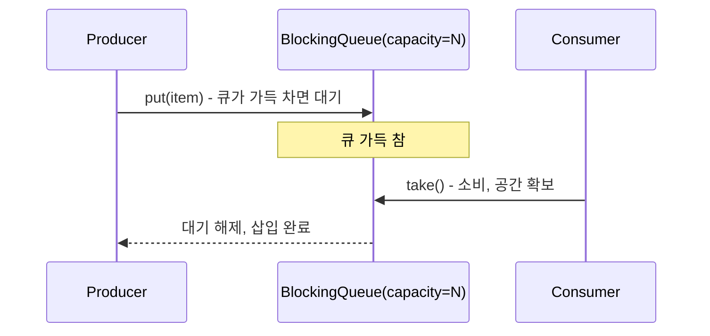

# BlockingQueue

## 핵심 정의
`BlockingQueue`는 `put`은 삽입 공간을, `take`는 제거 가능한 요소를 기다리도록 블로킹(blocking)하는 연산을 추가한 큐 인터페이스다. 모든 삽입·조회가 블로킹하는 것은 아니다. 생산자(producer)-소비자(consumer) 패턴을 구현할 때 락, 조건 변수(wait/notify)를 직접 다루지 않고도 스레드 간 안전한 데이터 전달과 배압(backpressure)을 얻을 수 있는 표준 도구다.

`java.util.concurrent` 패키지에 속하며, `ExecutorService`의 작업 큐, 로그 비동기 처리, 이벤트 버퍼링 등 실무 전반의 생산자-소비자 구조에서 기반 컴포넌트로 쓰인다.

## 동작 원리 / 구조

주요 구현체 비교:

| 구현체 | 내부 구조 | 용량 | 특징 |
|---|---|---|---|
| `ArrayBlockingQueue` | 배열 기반 원형 버퍼 | 고정(생성 시 지정) | 락 하나로 삽입/제거 모두 보호, 공정 모드 선택 가능 |
| `LinkedBlockingQueue` | 연결 리스트 | 기본 무제한(`Integer.MAX_VALUE`), 지정 가능 | 삽입용/제거용 락 분리(2-lock)로 높은 동시 처리량 |
| `PriorityBlockingQueue` | 힙(heap) | 무제한 | 우선순위 정렬, 블로킹은 조회 시에만(삽입은 무제한이라 블로킹 없음) |
| `SynchronousQueue` | 버퍼 없음 | 0 | 생산자와 소비자가 직접 만나야 전달 완료(rendezvous) |
| `DelayQueue` | 힙 기반 | 무제한 | 제거는 만료된 요소만 가능; peek은 미만료 head도 반환 |

각 메서드는 블로킹 여부와 실패 처리 방식에 따라 네 가지 계열로 나뉜다.

| 동작 | 예외 발생 | 특수값 반환 | 블로킹 | 타임아웃 블로킹 |
|---|---|---|---|---|
| 삽입 | `add()` | `offer()` | `put()` | `offer(e, time, unit)` |
| 제거 | `remove()` | `poll()` | `take()` | `poll(time, unit)` |

```java
BlockingQueue<Task> queue = new LinkedBlockingQueue<>(1000); // 용량 1000으로 제한 (배압)

// 생산자
void produce(Task task) throws InterruptedException {
    queue.put(task); // 큐가 가득 차면 자리가 생길 때까지 블로킹
}

// 소비자
void consume() throws InterruptedException {
    while (true) {
        Task task = queue.take(); // 큐가 비면 항목이 들어올 때까지 블로킹
        process(task);
    }
}
```



`LinkedBlockingQueue`는 삽입 락(putLock)과 제거 락(takeLock)을 분리해 생산자와 소비자가 동시에 각자의 락만 잡으면 되므로, 단일 락을 쓰는 `ArrayBlockingQueue`보다 생산자·소비자가 모두 활발한 상황에서 처리량이 높을 수 있지만 노드 할당 등 비용도 비교해야 한다. `size()`는 AtomicInteger를 읽으며 두 락을 잡지 않는다. `clear()`·`toArray()` 등의 전체 구조 연산은 양쪽 락이 필요할 수 있다.

큐 삽입 이전의 쓰기는 다른 스레드가 그 요소를 접근·제거한 이후 작업에 happens-before를 제공한다. 삽입 후 가변 객체를 계속 수정하는 것은 별도 동기화가 필요하다. null 요소와 표준 close 연산은 지원하지 않으므로 종료는 인터럽트·종료 표식·별도 프로토콜로 설계한다.

## 실무 관점
- 무제한 큐(`LinkedBlockingQueue` 기본 생성자, `PriorityBlockingQueue`, `DelayQueue`)를 그대로 쓰면 소비 속도가 생산 속도를 못 따라갈 때 큐가 무한정 자라 메모리 부족(OOM)으로 이어진다. 이는 [[ExecutorService와 스레드 풀]]에서 다룬 스레드 풀 큐 문제와 같은 원인이다. `LinkedBlockingQueue`처럼 상한을 지정할 수 있는 구현체는 용량을 제한한다. `PriorityBlockingQueue`의 initialCapacity는 상한이 아니며 `DelayQueue`도 용량 제한 기능이 없으므로, 필요하면 진입 허가나 별도 유한 버퍼로 대기 작업 수를 제한한다.
- `SynchronousQueue`는 버퍼가 전혀 없어 `put()`한 생산자는 소비자가 `take()`로 직접 받아갈 때까지 블로킹된다. `Executors.newCachedThreadPool()`이 이 큐를 쓰는 이유가 여기 있다. 작업을 큐에 쌓지 않고 즉시 처리할 스레드가 없으면 새 스레드를 만들도록 유도하는 설계다.
- 생산자와 소비자의 처리 속도 차이가 크게 벌어지는 상황(버스트 트래픽)에서는 유한 용량 큐 + 적절한 백오프/재시도 또는 `offer(timeout)`을 이용한 명시적 실패 처리가 무한 대기보다 안전하다. `put()`만 쓰면 큐가 가득 찼을 때 생산자 스레드가 통제 불가능하게 오래 블로킹될 수 있다.
- `take()`/`put()`은 인터럽트에 반응하는 메서드이므로, 스레드 종료 로직에서 `InterruptedException`을 단순히 무시하지 말고 `Thread.currentThread().interrupt()`로 인터럽트 상태를 복원하거나 루프를 빠져나가는 처리를 해야 한다. 이를 빼먹으면 종료 신호가 무시되고 소비자 스레드가 애플리케이션 셧다운을 막는 원인이 된다.
- `PriorityBlockingQueue`는 우선순위가 같은 요소 간 순서(FIFO)를 보장하지 않는다는 점, 그리고 요소가 `Comparable`이거나 별도 `Comparator`가 필요하다는 점을 놓치기 쉽다.

## 심화 Q&A

### Q. `BlockingQueue`가 내부적으로 `wait()`/`notify()` 대신 `Condition`을 쓰는 구현이 많은 이유는?
`ArrayBlockingQueue`, `LinkedBlockingQueue` 등은 `ReentrantLock` 기반으로 구현되어 있고, 삽입 대기와 제거 대기용 Condition을 구분한다. ArrayBlockingQueue는 한 락에 두 Condition을, LinkedBlockingQueue는 putLock/takeLock에 각각 하나씩 둔다. 객체 내장 모니터의 `wait()`/`notifyAll()`은 조건 변수가 하나뿐이라 삽입 대기자와 제거 대기자를 구분 없이 모두 깨워야 하지만, `Condition`을 분리하면 큐에 공간이 생겼을 때는 `notFull`만, 항목이 들어왔을 때는 `notEmpty`만 신호를 보내 불필요하게 깨어나는 스레드를 줄일 수 있다. 이는 [[synchronized와 Lock]]에서 다룬 `Condition` 다중화 패턴이 실제로 표준 라이브러리에 적용된 사례다.

### Q. `LinkedBlockingQueue`가 삽입 락과 제거 락을 분리했는데도 `size()`가 정확한 값을 반환하지 못할 수 있는 이유는?
`size()`는 원자적 카운터(`AtomicInteger`)를 읽어 반환하므로 값 자체는 정확하지만, 이 값을 확인한 순간과 실제로 그 값을 사용하는 시점 사이에 다른 스레드가 삽입/제거를 계속 수행할 수 있어 "지금 큐에 몇 개 있는지"는 언제나 스냅샷일 뿐 그 이후의 상태를 보장하지 않는다. 삽입 락과 제거 락이 분리되어 있어 두 락을 동시에 잡지 않는 한 삽입과 제거가 `size()` 호출과 동시에 일어날 수 있기 때문에, `size()` 기반으로 정확한 용량 판단을 하는 로직(예: "비었으면 종료")은 경쟁 상태에 취약하다.

### Q. 유한 용량 큐의 배압은 어떤 범위를 제한하고 무엇을 보장하지 않는가?
큐가 가득 차면 생산자의 `put()`이 블로킹되어 생산 속도가 소비 속도에 강제로 맞춰진다. 이 자연스러운 속도 조절이 배압(backpressure)이다. 배압이 없으면(무제한 큐) 생산자는 계속 빠르게 쌓기만 하고 큐 크기가 무한정 늘어나 메모리 문제로 이어지지만, 유한 큐는 생산자 스스로가 소비자의 처리 속도를 기다리게 만들어 큐 내부 요소 수를 제한한다. 큐 밖의 대기 요청·생산자 스레드·재시도는 별도 제한하지 않으므로 시스템 전체 안정성까지 자동 보장하지 않는다. 다만 생산자 스레드가 웹 요청 처리 스레드라면, 이 블로킹이 응답 지연으로 사용자에게 그대로 전파된다는 트레이드오프가 있다.

### Q. `SynchronousQueue`를 "큐"라고 부르지만 실제로 요소를 저장하지 않는다는 것이 어떤 실무적 함의를 가지는가?
저장 공간이 0이므로 `SynchronousQueue`에 대한 `size()`는 항상 0을 반환하고, 하나의 `put()`은 대응하는 `take()`가 나타나야만 완료된다. 즉 생산자와 소비자가 항상 짝을 맞춰 진행되는 핸드오프(hand-off) 구조를 강제한다. 이는 작업을 버퍼링하지 않고 즉시 처리 가능한 스레드에게만 넘기고 싶을 때(예: `newCachedThreadPool`이 유휴 스레드가 없으면 새 스레드를 만들도록 유도) 적합하지만, 일반적인 생산자-소비자 버퍼링 용도로는 부적합하다.

### Q. `DelayQueue`에서 지연 시간이 아직 끝나지 않은 요소가 존재할 때 `take()`를 호출한 소비자는 어떻게 동작하는가?
`DelayQueue`는 힙 구조로 가장 빨리 만료될 요소를 루트에 유지하며, `take()`는 그 요소의 남은 지연 시간만큼 대기했다가(단순히 블로킹만 하는 게 아니라 내부적으로 타이머를 계산해 대기) 만료 후 락 획득과 스케줄링이 가능해지면 반환한다. 중간에 더 빨리 만료되는 요소가 새로 삽입되면 대기 중인 소비자를 깨워 대기 시간을 재계산하도록 신호를 보낸다. 스케줄링 재시도 큐, 캐시 만료 처리 같은 "일정 시간 후에만 유효한 작업" 패턴에 적합하다.

### Q. 큐가 비었거나 종료 표식을 넣었다면 모든 작업이 끝났다고 볼 수 있는가?
A. `isEmpty()`는 이후 생산자가 다시 넣는 작업과 이미 소비자가 꺼내 처리 중인 작업을 포함하지 않는다. 종료는 신규 생산 중단 → 진행 중 생산 정리 → 소비자 종료 → 처리 완료 대기처럼 별도의 생명주기 프로토콜로 정한다. 종료 표식(poison pill)을 쓰면 소비자 수와 큐의 순서 정책도 고려해야 한다. 우선순위 큐에서는 표식이 미처리 작업보다 먼저 제거될 수 있다.

### Q. drainTo로 다른 컬렉션에 옮기면 두 자료구조에 걸친 트랜잭션인가?
A. 아니다. 대상 컬렉션에 추가하다 실패하면 일부 요소가 어느 쪽에 남았는지 일반 인터페이스 차원에서 원자적 이전을 보장하지 않는다. 배치 소비 이후 처리 실패·재시도·중복 허용 여부는 별도 설계한다. 큐에서 제거했다는 사실과 업무 처리가 성공했다는 사실도 분리한다.

## 관련 개념
- [[ExecutorService와 스레드 풀]]
- [[Semaphore와 CountDownLatch와 CyclicBarrier]]
- [[synchronized와 Lock]]
- [[ConcurrentHashMap]]

## 참고 자료

확인 날짜: 2026-09-08. 아래 버전과 범위의 공식 문서·소스로 본문을 대조했다. 성능 비교와 운영 선택은 워크로드에 따라 달라지는 판단 기준이다.

- [Java SE 25 BlockingQueue](https://docs.oracle.com/en/java/javase/25/docs/api/java.base/java/util/concurrent/BlockingQueue.html) — 메서드 종류·null·메모리 일관성·종료.
- [OpenJDK jdk-25-ga LinkedBlockingQueue](https://raw.githubusercontent.com/openjdk/jdk/jdk-25-ga/src/java.base/share/classes/java/util/concurrent/LinkedBlockingQueue.java) — size AtomicInteger·2-lock·Condition.
- [Java SE 25 DelayQueue](https://docs.oracle.com/en/java/javase/25/docs/api/java.base/java/util/concurrent/DelayQueue.html) — peek과 만료된 제거 구분.

### 2026-09-23 부분 재검증

Java SE 25 BlockingQueue의 종료·drainTo 계약과 PriorityBlockingQueue의 무제한 용량을 확인했다. 기존 전체 검증일은 유지한다.

- [Java SE 25 PriorityBlockingQueue](https://docs.oracle.com/en/java/javase/25/docs/api/java.base/java/util/concurrent/PriorityBlockingQueue.html) — initialCapacity는 저장 상한이 아니며 동일 우선순위 순서는 별도 보장하지 않음.

실행 확인: 2026-09-23, OpenJDK 25.0.2+10-69에서 PriorityBlockingQueue initialCapacity를 초과한 삽입을 재현했다. 구현 관측을 다른 JVM·버전의 추가 보장으로 일반화하지 않는다.
