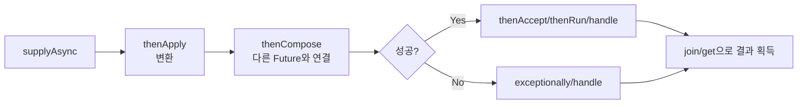

# CompletableFuture

## 핵심 정의
`CompletableFuture<T>`는 Java 8에서 도입된 비동기 프로그래밍 도구로, `Future`의 한계였던 "결과를 조합할 수 없고 블로킹으로만 값을 꺼낼 수 있다"는 문제를 해결한다. 여러 비동기 작업을 콜백 체이닝(callback chaining) 방식으로 연결하고, 성공/실패를 선언적으로 처리하며, 여러 작업의 결과를 조합할 수 있는 함수형 API를 제공한다.

내부적으로는 `CompletionStage` 인터페이스를 구현하며, Executor를 생략한 Async 메서드는 기본적으로 `ForkJoinPool.commonPool()`을 사용한다. 하위 클래스는 인스턴스 메서드의 기본 실행기를 바꿀 수 있다. Java 21 API에 있던 “공통 풀 병렬성이 2 미만이면 작업마다 새 스레드”라는 예외는 JDK 25부터 제거되었다. JDK 25.0.2·27에서 병렬성을 1로 설정해도 공통 풀에서 실행하는 것을 확인했다.

## 동작 원리 / 구조



주요 메서드 계열:

| 메서드 | 역할 | 비고 |
|---|---|---|
| `supplyAsync(Supplier)` | 비동기로 값 생성 시작 | 결과 반환 |
| `runAsync(Runnable)` | 비동기 실행 시작 | 결과 없음 |
| `thenApply(Function)` | 결과 변환 | 동기 콜백 (호출 스레드에서 실행될 수 있음) |
| `thenCompose(Function<T, CompletionStage<U>>)` | 다른 비동기 작업과 연결(flatMap) | 중첩 Future 평탄화 |
| `thenCombine(other, BiFunction)` | 두 개의 독립적인 Future 결과 결합 | |
| `allOf(futures...)` | 모두 완료됨을 나타내는 Future 생성 | 결과값은 없음(Void) |
| `anyOf(futures...)` | 먼저 끝난 성공/실패를 반영하는 Future 생성 | |
| `exceptionally(Function<Throwable, T>)` | 예외 발생 시 대체 값 반환 | 예외 흐름만 처리 |
| `handle(BiFunction<T, Throwable, R>)` | 성공/실패 모두 처리 | 결과와 예외 둘 다 받음 |
| `whenComplete(BiConsumer<T, Throwable>)` | 부수 효과(로깅 등) | 결과 관찰; 콜백이 던지면 반환 stage가 실패할 수 있음 |

`Async` 접미사는 콜백을 실행기에 위임할지를 구분한다. 실제 실행 스레드는 완료 시점과 실행기의 정책에도 달려 있다.

```java
CompletableFuture<String> future = CompletableFuture
    .supplyAsync(() -> fetchUser(id), executor)          // executor에 실행 위임
    .thenApply(user -> user.getName())                    // 완료 스레드 또는 등록 스레드 등에서 실행 가능
    .thenApplyAsync(name -> toUpperCase(name), executor)   // 명시한 executor에 실행 위임
    .exceptionally(ex -> "UNKNOWN");                       // 예외 시 기본값
```

`Async` 접미사가 없는 콜백(`thenApply` 등)은 이전 단계를 완료시킨 스레드에서 그대로 실행될 수도 있고, 이미 완료된 `CompletableFuture`에 콜백을 등록하면 호출한 스레드에서 즉시 실행되기도 한다. 실행 정책을 제어하려면 `Async` 버전에 `Executor`를 명시한다. 다만 `Executor`는 호출 스레드에서 직접 실행해도 되는 계약이다. `Runnable::run` 같은 직접 실행기나 포화 시 `CallerRunsPolicy`를 쓰는 풀에서는 `Async`여도 같은 스레드에서 실행될 수 있다. 이벤트 루프를 블로킹에서 격리해야 한다면 실행기의 거부 정책까지 함께 확인한다.

### 조합 결과와 실제 작업 종료
`allOf`는 하나가 먼저 실패해도 모든 구성 Future가 완료될 때까지 기다린다. 다른 작업을 즉시 취소하는 fail-fast 정책이 아니다. `anyOf`에서 먼저 결과가 나와도 나머지 작업을 자동 중단하지 않는다. 빈 `allOf()`는 null로 완료되지만 빈 `anyOf()`는 미완료 상태다.

`cancel(true)`도 CompletableFuture의 결과를 취소 상태로 만들 뿐 공급자 스레드에 인터럽트를 보내지 않는다. `orTimeout`의 시간 초과도 실행 중인 외부 호출을 자동으로 취소하지 않는다. 대기 종료와 실제 작업 종료를 연결하려면 [[인터럽트와 작업 취소]]에서 다루는 별도의 취소 경로가 필요하다.

### 공유 결과와 호출자별 타임아웃
`orTimeout`과 `completeOnTimeout`은 새 Future를 만드는 대신 **수신 객체 자신**을 완료하고 반환한다(Java SE 25). 여러 요청이 하나의 조회 Future를 공유할 때 한 요청이 짧은 타임아웃을 붙이면 다른 요청도 그 실패·대체 값을 보게 된다. 호출자별 대기 정책은 `shared.copy().orTimeout(timeout, unit)`처럼 별도 결과에 적용할 수 있다. 이 복사본의 실패가 원본 작업을 중단하지는 않는다. 원본 취소가 복사본으로 전달되면 `CompletionException`으로 감싸질 수 있으므로 `isCancelled()`까지 동일하다고 가정하지 않는다.

## 실무 관점
- 외부 API 여러 개를 병렬로 호출하고 결과를 합쳐야 할 때 `thenCombine`이나 `allOf` + 개별 `join()` 조합을 사용한다. 순차 호출 대비 전체 응답 시간을 각 호출의 최대값 수준으로 줄일 수 있다.
- 실행 스레드 풀을 지정하지 않으면 기본값인 `ForkJoinPool.commonPool()`을 애플리케이션 전역에서 공유하게 된다. 블로킹 I/O(JDBC, 외부 HTTP 호출 등)를 이 풀에서 수행하면 공통 풀의 스레드가 고갈되어, 전혀 관계없는 다른 병렬 스트림(`parallelStream()`)이나 다른 `CompletableFuture` 체인까지 영향을 받는 장애로 이어질 수 있다. 반드시 전용 `Executor`를 명시적으로 지정해야 한다.
- 예외 처리를 빠뜨리면 실패가 조용히 사라진다. 체인 끝에 `exceptionally` 또는 `handle`을 반드시 붙이거나, 최종적으로 `join()`/`get()`을 호출해 예외를 확인해야 한다. `join()`은 체크 예외를 `CompletionException`(unchecked)으로 감싸 던진다는 점도 `get()`(`ExecutionException`, checked)과 다르다.
- `thenApply`와 `thenCompose`를 혼동하면 `CompletableFuture<CompletableFuture<T>>`처럼 중첩된 타입이 생긴다. 콜백이 다시 `CompletableFuture`를 반환한다면 `thenCompose`(flatMap 개념)를 써야 한다.
- Spring MVC는 비동기 반환값을 통해 Servlet 요청 스레드를 반환할 수 있다. WebFlux는 별도의 반응형 실행 모델이므로 이를 동일한 Servlet 스레드 반환 과정으로 설명하지 않는다. 다만 스레드 풀 설정 없이 기본 풀을 쓰면 위의 공통 풀 고갈 문제가 그대로 발생한다.
- 타임아웃 처리가 기본적으로 없었으나, Java 9에 `orTimeout(long, TimeUnit)`과 `completeOnTimeout(T, long, TimeUnit)`이 추가되어 특정 시간 내에 완료되지 않으면 예외를 던지거나 기본값으로 대체할 수 있다. 이 메서드는 해당 Future를 완료할 뿐 실제 외부 IO나 공급자 작업을 중단하지 않는다. `cancel(true)`도 CompletableFuture에서는 실행 스레드를 인터럽트하지 않으므로 외부 클라이언트의 타임아웃·취소를 별도 설계한다.

## 심화 Q&A

### Q. `thenApply`와 `thenApplyAsync`는 언제 실행 스레드가 실제로 달라지는가?
원본이 이미 완료되어 있으면 등록 스레드에서 실행될 수 있고, 미완료 상태라면 완료시키는 스레드 또는 완료 메서드를 호출하는 다른 스레드가 콜백을 수행할 수 있다. 등록 시점만으로 특정 스레드를 보장하지 않는다. `Async` 메서드는 명시한 실행기 또는 기본 실행기에 위임하지만, 직접 실행기나 `CallerRunsPolicy`처럼 호출 스레드에서 실행하는 정책이면 스레드가 바뀌지 않는다. 실행 위치를 격리할 필요가 있을 때는 콜백 API와 실행기 정책을 함께 선택한다.

### Q. `allOf()`가 `List<CompletableFuture<T>>`의 결과 리스트를 직접 반환하지 않는 이유와 실무 우회 방법은?
`allOf(CompletableFuture<?>... cfs)`는 가변 인자로 서로 다른 타입의 `Future`도 받을 수 있게 설계되어 있어 이질적인 결과에 하나의 T를 정하지 않는 API 설계이며, 반환 타입이 `CompletableFuture<Void>`로 "모두 완료되었다"는 신호만 준다. 실무에서는 `CompletableFuture.allOf(futures.toArray(CompletableFuture[]::new)).thenApply(v -> futures.stream().map(CompletableFuture::join).toList())`(Java 16+) 패턴으로, 완료 신호를 받은 뒤 각 `Future`에서 `join()`으로 값을 꺼내 리스트로 조립한다.

### Q. `CompletableFuture` 체인에서 예외가 발생하면 이후 `thenApply` 콜백들은 어떻게 되는가?
체인 중간에서 예외가 발생하면 그 이후에 연결된 `thenApply`/`thenAccept`/`thenCompose` 등 정상 흐름 콜백들은 모두 건너뛰어지고, 예외가 그대로 다음 단계로 전파된다. `exceptionally`나 `handle`을 만나야 비로소 예외가 처리(또는 복구)되고, 그 이후에 연결된 정상 콜백이 다시 실행될 수 있다. `whenComplete`은 원래의 성공/실패를 관찰하며, 콜백이 던지면 성공 stage도 실패로 바뀔 수 있으므로 로깅 등 부수 효과 전용으로만 써야 한다.

### Q. 기본 `ForkJoinPool.commonPool()`을 쓰는 것이 왜 위험할 수 있는가?
공통 풀은 애플리케이션(및 JVM 내 다른 라이브러리, 병렬 스트림)이 공유하는 자원이며, 기본 목표 병렬성은 통상 `max(1, 프로세서 수 - 1)`이며 설정으로 바뀔 수 있고 보상 스레드 때문에 실제 스레드 수 상한과 같지 않다. 여기에 블로킹 I/O 작업(DB 쿼리, 외부 API 호출)을 넣으면 소수의 스레드가 오래 점유되어, 같은 풀을 쓰는 무관한 병렬 스트림 연산이나 다른 비동기 체인까지 함께 지연되는 자원 경합이 발생한다. 이는 특정 API 하나가 느려졌을 뿐인데 애플리케이션 전체의 병렬 처리 성능이 저하되는 형태로 나타나 원인 추적이 까다롭다.

### Q. 가상 스레드가 도입된 이후에도 `CompletableFuture`가 여전히 유용한 이유는 무엇인가?
가상 스레드는 블로킹 코드를 그대로 두고도 확장성을 확보하게 해주지만, 여러 비동기 작업의 결과를 조합·변환하고 실패를 선언적으로 처리하는 흐름 제어 자체를 대체하지는 않는다. 예를 들어 여러 외부 호출 결과를 합쳐야 하는 로직은 가상 스레드 환경에서도 `CompletableFuture`의 `thenCombine`, `allOf` 같은 조합 API로 표현하는 것이 명시적이고 읽기 쉽다. 다만 실행 매체(executor)로 가상 스레드 기반 `Executor`를 지정하면 블로킹 콜백을 넣어도 많은 블로킹 대기를 적은 캐리어로 처리할 수 있다는 점이 달라진다.

## 관련 개념
- [[ExecutorService와 스레드 풀]]
- [[인터럽트와 작업 취소]]
- [[가상 스레드]]
- [[스레드 생명주기와 상태]]

## 참고 자료

확인 날짜: 2026-09-08. 아래 버전과 범위의 공식 문서·소스로 본문을 대조했다. 성능 비교와 운영 선택은 워크로드에 따라 달라지는 판단 기준이다.

- [Java SE 25 CompletableFuture](https://docs.oracle.com/en/java/javase/25/docs/api/java.base/java/util/concurrent/CompletableFuture.html) — 실행 정책·allOf·whenComplete·cancel·Java 9 타임아웃.
- [Java SE 25 ForkJoinPool](https://docs.oracle.com/en/java/javase/25/docs/api/java.base/java/util/concurrent/ForkJoinPool.html) — 공통 풀 병렬성·블로킹 보상.

부분 재검증: 2026-09-22. 아래 확인 범위에 한하며 노트 전체의 기존 verified는 유지한다.

- [Java SE 27 CompletableFuture](https://docs.oracle.com/en/java/javase/27/docs/api/java.base/java/util/concurrent/CompletableFuture.html) — allOf/anyOf의 빈 입력·실패 완료, cancel과 orTimeout. allOf의 실패 대기 및 cancel 후 공급자 계속 실행을 JDK 27에서 확인했다.
- [Java SE 21 CompletableFuture](https://docs.oracle.com/en/java/javase/21/docs/api/java.base/java/util/concurrent/CompletableFuture.html)와 위 Java SE 25·27 클래스 실행 정책을 대조했다. JDK 25.0.2·27의 배포본 `src.zip`과 병렬성 1 실행으로 기본 풀 동작을 확인했다. 일부 `defaultExecutor()` 메서드 설명에 남은 이전 fallback 문구를 최신 구현 전체에 일반화하지 않는다.
- [JDK 25 Release Notes: Updates to ForkJoinPool and CompletableFuture](https://www.oracle.com/java/technologies/javase/25-relnote-issues.html) — JDK-8319447의 실행 정책 변경과 적용 시작 버전.

부분 재검증: 2026-10-04. 아래 적용 버전·범위만 확인했으며 노트 전체의 기존 verified는 유지한다.

- [Java SE 25 CompletableFuture](https://docs.oracle.com/en/java/javase/25/docs/api/java.base/java/util/concurrent/CompletableFuture.html) — non-async 실행 정책, copy·orTimeout·completeOnTimeout의 대상과 예외 전파.
- [Java SE 25 Executor](https://docs.oracle.com/en/java/javase/25/docs/api/java.base/java/util/concurrent/Executor.html)와 [ThreadPoolExecutor.CallerRunsPolicy](https://docs.oracle.com/en/java/javase/25/docs/api/java.base/java/util/concurrent/ThreadPoolExecutor.CallerRunsPolicy.html) — 직접 실행과 포화 시 호출 스레드 실행; Async가 스레드 전환을 보장한다는 본문·Q&A를 교정했다.

실행 확인: Oracle JDK 25.0.4+7-LTS-189에서 직접 실행기·CallerRunsPolicy의 실행 스레드, copy 타임아웃 격리, 원본 취소 후 복사본의 예외 상태. 실행 검사는 위 부분 재검증 범위에 한한다.

- 도식·표 대조(2026-10-04): [Java SE 25 CompletableFuture.handle](https://docs.oracle.com/en/java/javase/25/docs/api/java.base/java/util/concurrent/CompletableFuture.html) — 도식의 handle도 성공·실패 양쪽 완료에서 실행되는 범위로 맞췄다. 실행 시험 추가 없이 명세·소스와 기존 본문을 대조했으며 verified는 유지한다.
