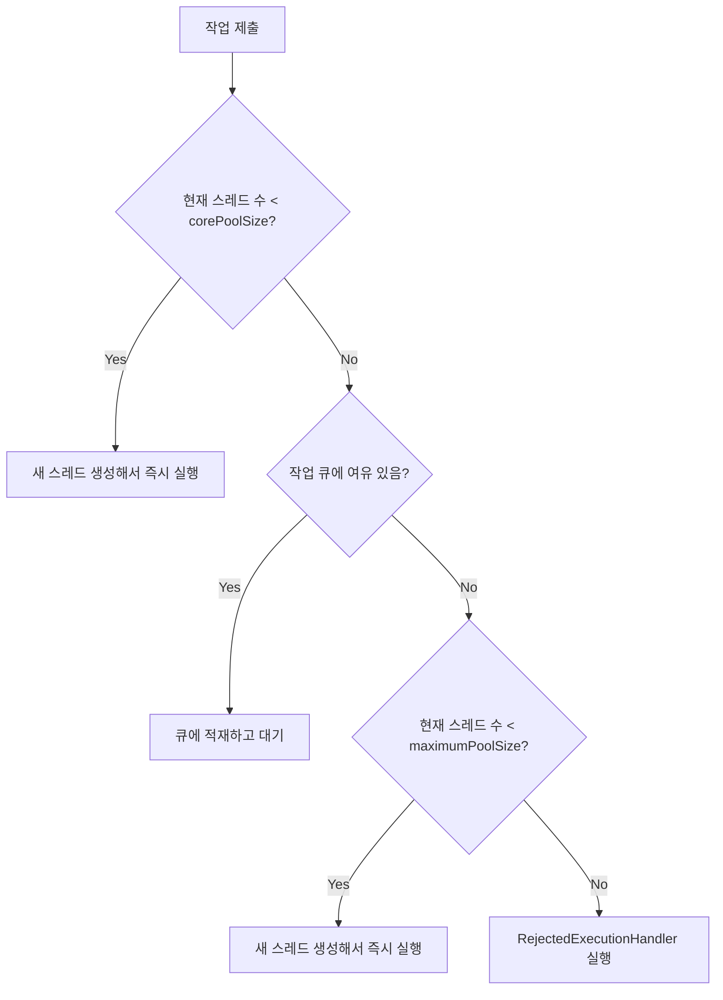

# ExecutorService와 스레드 풀

## 핵심 정의
`ExecutorService`는 스레드 생성과 작업 실행을 분리해 스레드를 직접 다루지 않고도 비동기 작업을 제출·관리할 수 있게 해주는 상위 추상화다. 대표 구현체인 `ThreadPoolExecutor`는 필요에 따라 생성한 스레드 풀(thread pool)에 작업을 큐잉해 재사용함으로써, 요청마다 스레드를 새로 생성/소멸하는 비용을 없애고 동시 실행 개수를 제어한다.

Java 21부터는 플랫폼 스레드 풀 대신 작업마다 가상 스레드(virtual thread)를 생성하는 `Executors.newVirtualThreadPerTaskExecutor()`도 표준 API로 제공되어, I/O 바운드 워크로드에서는 풀링 자체가 필요 없는 새로운 선택지가 생겼다.

## 동작 원리 / 구조

`ThreadPoolExecutor`의 핵심 파라미터와 동작 순서:

```java
new ThreadPoolExecutor(
    corePoolSize,      // 기본 유지 스레드 수
    maximumPoolSize,   // 최대 스레드 수
    keepAliveTime,     // core 초과 스레드의 유휴 대기 시간
    TimeUnit.SECONDS,
    workQueue,         // 작업 대기 큐
    threadFactory,     // 스레드 생성 전략
    rejectedExecutionHandler // 큐/풀이 가득 찼을 때 정책
);
```

작업 제출 시 처리 순서(중요, 흔히 오해하는 부분):



주의할 점은 **큐가 가득 차기 전까지는 `maximumPoolSize`까지 스레드가 늘어나지 않는다**는 것이다. `corePoolSize`만큼 스레드를 채우면 이후 작업은 무조건 큐로 먼저 간다. 무제한 큐(`LinkedBlockingQueue` 기본 생성자)를 쓰면 상한이 Integer.MAX_VALUE라 보통 메모리 고갈 전에는 가득 차지 않으므로 `maximumPoolSize`는 사실상 의미가 없어지고, 부하가 몰릴 때 큐가 무한정 쌓이며 메모리 부족(OOM)으로 이어질 수 있다.

**Executors 팩토리 메서드**와 실질 구성:

| 메서드 | core/max | 큐 | 특징 |
|---|---|---|---|
| `newFixedThreadPool(n)` | n / n | 무제한 `LinkedBlockingQueue` | 스레드 수 고정, 큐 무제한이라 OOM 위험 |
| `newCachedThreadPool()` | 0 / Integer.MAX_VALUE | `SynchronousQueue` | 필요할 때마다 무한정 스레드 생성 가능, 폭주 위험 |
| `newSingleThreadExecutor()` | 1 / 1 | 무제한 큐 | 순차 처리 보장 |
| `newScheduledThreadPool(n)` | n / MAX | 지연 큐 | 지연/주기 실행 |
| `newVirtualThreadPerTaskExecutor()` | 풀링 없음 | 없음 | 작업마다 가상 스레드 생성, I/O 바운드에 적합 |

`RejectedExecutionHandler`의 4가지 기본 정책: `AbortPolicy`(예외 던짐, 기본값), `CallerRunsPolicy`(종료 전에는 제출 스레드가 실행, shutdown 후에는 버림), `DiscardPolicy`(조용히 버림), `DiscardOldestPolicy`(큐 head를 버리고 다시 제출 시도; FIFO가 아니면 가장 오래된 작업과 다를 수 있음).

## 실무 관점
- `Executors.newFixedThreadPool`/`newCachedThreadPool`을 그대로 프로덕션에 쓰지 말라는 조언이 많다. 무제한 큐(OOM 위험) 또는 무제한 스레드 생성(리소스 고갈 위험) 문제가 있어, 실무에서는 `ThreadPoolExecutor`를 직접 생성해 큐 용량과 거부 정책을 명시하는 것이 안전하다. `Executors` 팩토리 메서드 자체가 폐기(deprecated)된 것은 아니지만, 정적 분석 도구(SpotBugs 등)가 이 패턴에 경고를 주는 경우가 많다.
- Spring 환경에서는 `ThreadPoolTaskExecutor`(`@Async` 처리용)가 `corePoolSize`, `maxPoolSize`, `queueCapacity`, `keepAliveSeconds`를 설정으로 노출한다. `queueCapacity`를 기본값(무제한에 가까운 `Integer.MAX_VALUE`)으로 두면 `maxPoolSize`가 무의미해지는 동일한 함정이 있다.
- CPU 바운드 작업은 `corePoolSize`를 `Runtime.getRuntime().availableProcessors()` 근처로, I/O 바운드 작업은 대기 시간 비율에 따라 코어 수보다 훨씬 크게 잡는 것이 일반적인 튜닝 방향이다. 다만 I/O 바운드라면 가상 스레드 도입을 우선 검토하는 것이 선택지다.
- 스레드 풀을 애플리케이션 종료 시 `shutdown()`/`shutdownNow()`로 명시적으로 종료하지 않으면 스레드가 살아남아 애플리케이션이 종료되지 않거나 리소스가 누수된다. `awaitTermination()`으로 정상 종료를 기다리는 그레이스풀 셧다운(graceful shutdown) 로직이 필요하다.
- `submit()`으로 제출한 작업의 예외는 일반적으로 반환 `Future`에 보관된다. 작업이나 실행기에서 따로 기록하지 않으면 `get()` 등으로 관측하기 전에는 드러나지 않는다. 반면 `ThreadPoolExecutor` 워커에서 직접 실행하는 일반 `Runnable`의 미처리 RuntimeException·Error는 워커를 종료시키고 `UncaughtExceptionHandler`로 전달될 수 있다. `execute(new FutureTask<>(...))`처럼 작업 자체가 예외를 보관하거나 `CallerRunsPolicy`가 제출 스레드에서 실행하는 경우는 구분한다. 이 차이를 모르면 예외가 로그에도 안 남고 사라지는 상황을 겪는다.
- 스레드 풀 크기를 무작정 늘리는 것이 항상 성능을 개선하지는 않는다. CPU 코어 수에 비해 지나치게 많은 CPU 바운드 스레드는 스케줄링 비용을 늘릴 수 있다. DB 커넥션 풀이 병목인 상태에서 실행 스레드만 늘리면, 실행기 큐에서 기다리던 작업이 커넥션 획득을 기다리는 스레드로 바뀔 수 있다. 하류 처리량은 그대로인데 대기 중인 스레드와 메모리 사용만 늘 수 있으므로 두 풀의 용량과 타임아웃을 함께 설계한다.

Java 19부터 `ExecutorService`는 `AutoCloseable`이다. `close()`는 정상 종료를 시작하고 작업 완료를 기다리므로, 짧은 메서드 안에서 새 풀을 만들고 닫으면 비동기 응답 자체를 기다리게 될 수 있다. 폐기 정책으로 `submit()` 작업을 버릴 경우 반환 Future가 영원히 미완료로 남지 않도록 취소/실패 처리도 설계한다.

### 종료 대기의 상한과 주기 작업
Java SE 25의 `ExecutorService.close()`는 기다리던 스레드가 인터럽트되어도 즉시 반환하지 않는다. `shutdownNow()`처럼 중단을 요청한 뒤 실행 중 작업이 끝날 때까지 계속 기다리고, 반환 전에 인터럽트 상태를 복원한다. 취소를 무시하는 작업이 있으면 try-with-resources 종료도 무기한 대기할 수 있다. 종료 시간 예산이 필요한 서비스는 제한 시간이 있는 `awaitTermination`과 종료 실패 관측을 설계하고, 워커 자신이 속한 실행기의 `close()`를 호출해 자기 종료를 기다리지 않게 한다.

`ScheduledThreadPoolExecutor`의 주기 작업은 한 번 예외가 나면 다음 실행이 억제된다. 실행기가 살아 있다는 것만으로 스케줄이 정상이라고 판단하지 말고 마지막 성공 시각·반환 Future의 실패를 관측한다. 취소한 지연 작업은 기본적으로 지연 시간이 만료될 때까지 큐에 남을 수 있다. 장기 예약의 생성·취소가 잦다면 `setRemoveOnCancelPolicy(true)`를 검토한다(Java SE 25 기본값 false).

## 심화 Q&A

### Q. `corePoolSize`와 `maximumPoolSize`를 같게 설정하고 큐도 무제한으로 두면 실질적으로 어떤 문제가 생기는가?
`newFixedThreadPool`이 바로 이 구성이다. 부하가 몰리면 고정된 스레드 수를 넘는 모든 작업이 무제한 큐에 쌓이기만 하고 거부되지 않으므로, 순간적으로는 안정적으로 보이지만 처리 속도보다 유입 속도가 빠른 상황이 지속되면 큐에 쌓인 작업 객체들이 힙 메모리를 계속 잠식해 결국 `OutOfMemoryError`로 이어진다. 배압(backpressure)이 없는 것이 근본 원인이므로, 큐 용량을 유한하게 잡고 `RejectedExecutionHandler`로 명시적인 거부/재시도 전략을 두는 것이 안전하다.

### Q. `CallerRunsPolicy`가 배압 제어 수단으로 동작하는 원리는 무엇인가?
큐와 풀이 모두 가득 찬 상태에서 `CallerRunsPolicy`가 걸리면, 작업을 제출한 스레드(예: 웹 요청을 받은 스레드) 자신이 그 작업을 직접 실행하게 된다. 이 동안 제출 스레드는 다음 작업을 제출할 수 없으므로 자연스럽게 유입 속도가 늦춰지는 효과가 생긴다. 다만 요청을 받는 스레드가 톰캣(Tomcat)의 워커 스레드라면, 그 스레드마저 묶여버려 전체 서버의 요청 처리 능력이 함께 저하될 수 있다는 트레이드오프가 있다.

### Q. `Future.get()`을 호출하지 않으면 작업 중 발생한 예외가 왜 조용히 사라지는가?
`submit()`은 작업 실행 결과와 예외를 `Future` 객체 내부에 저장해두고, 호출자가 `get()`을 호출하는 시점에 `ExecutionException`으로 감싸서 던지는 지연 전파(deferred propagation) 방식이다. 결과 조회나 별도의 실패 관측이 없으면 예외가 호출자에게 자동 전파되지 않는다. 이를 방지하려면 결과를 수집하거나 작업 경계에서 실패를 기록한다. `ThreadPoolExecutor.afterExecute`로 일괄 관측할 때도 `Throwable` 인자만 검사하면 `submit`의 실패를 놓친다. 완료된 `Future`인지 확인한 뒤 결과의 예외도 확인해야 한다. CompletableFuture로 작업을 구성했다면 `exceptionally()`/`whenComplete()` 등 별도의 완료 경로에서 관측할 수 있다.

### Q. 가상 스레드 환경에서 왜 스레드 풀링 자체를 지양하라고 권장하는가?
플랫폼 스레드는 OS 스레드 하나당 스택 메모리(수백 KB~1MB 이상)와 생성/소멸 비용이 크기 때문에 재사용(풀링)이 합리적이다. 반면 가상 스레드는 생성 비용이 매우 낮고(필요에 따라 커지는 힙 스택), 지원되는 블로킹 경로에서 캐리어(carrier)를 반환하므로 애초에 재사용할 이유가 적다. 오히려 가상 스레드를 고정 크기 풀에 넣으면 동시성 수준이 풀 크기로 제한되어 가상 스레드의 이점(수만~수십만 동시 작업)을 스스로 없애는 결과가 된다.

### Q. `newCachedThreadPool()`이 실무에서 위험할 수 있는 시나리오는 무엇인가?
`newCachedThreadPool`은 `maximumPoolSize`가 `Integer.MAX_VALUE`이고 큐가 `SynchronousQueue`(적재 없이 즉시 전달)이므로, 유휴 스레드가 없으면 작업마다 새 스레드를 계속 생성한다. 순간적으로 요청이 폭주하면 스레드가 통제 없이 급증해 컨텍스트 스위칭 비용 폭증과 메모리 고갈로 이어질 수 있다. 예측 가능한 리소스 사용을 위해서는 명시적으로 상한을 둔 `ThreadPoolExecutor`를 쓰는 것이 안전하다.

### Q. `shutdown()`과 `shutdownNow()`의 차이, 그리고 왜 그레이스풀 셧다운 로직이 별도로 필요한가?
`shutdown()`은 새 작업 제출을 막고 이미 큐에 있는 작업은 끝까지 처리한 뒤 종료하는 정상 종료 방식이고, `shutdownNow()`는 시작되지 않은 작업을 큐에서 꺼내 목록으로 반환하고 실행 중 작업의 인터럽트를 시도한다. 반환된 FutureTask를 자동으로 cancelled 상태로 만들지 않을 수 있으며, 인터럽트를 무시하는 작업을 강제로 종료하지 못한다. 애플리케이션 종료 시 `shutdown()` 후 `awaitTermination(timeout)`으로 일정 시간을 기다리고, 그래도 끝나지 않으면 `shutdownNow()`로 중단을 요청하는 2단계 패턴이 일반적이다. 이렇게 하지 않으면 진행 중이던 트랜잭션이 갑자기 끊기거나, 반대로 종료 신호를 줬는데도 스레드가 영원히 남아 프로세스가 죽지 않는 문제가 생긴다.

## 관련 개념
- [[가상 스레드]]
- [[CompletableFuture]]
- [[인터럽트와 작업 취소]]
- [[스레드 생명주기와 상태]]
- [[데드락과 경쟁 상태]]

## 참고 자료

확인 날짜: 2026-09-08. 아래 버전과 범위의 공식 문서·소스로 본문을 대조했다. 성능 비교와 운영 선택은 워크로드에 따라 달라지는 판단 기준이다.

- [Java SE 25 ThreadPoolExecutor](https://docs.oracle.com/en/java/javase/25/docs/api/java.base/java/util/concurrent/ThreadPoolExecutor.html) — 스레드 생성 순서·큐·거부 정책.
- [Java SE 25 ExecutorService](https://docs.oracle.com/en/java/javase/25/docs/api/java.base/java/util/concurrent/ExecutorService.html) — shutdownNow 비강제·Java 19 close.
- [Java SE 25 Executors](https://docs.oracle.com/en/java/javase/25/docs/api/java.base/java/util/concurrent/Executors.html) — 팩토리 구성·Java 21 가상 스레드.

부분 재검증: 2026-09-22. 아래 범위를 추가 확인했으며, 그 밖의 본문은 기존 검증 날짜를 유지한다.

- [Java SE 27 ThreadPoolExecutor](https://docs.oracle.com/en/java/javase/27/docs/api/java.base/java/util/concurrent/ThreadPoolExecutor.html) — 큐와 풀 크기의 상호작용. 하류 자원 병목 시 대기 위치에 관한 실무 설명을 바로잡았다.

부분 재검증: 2026-10-04. 아래 적용 버전·범위만 확인했으며 노트 전체의 기존 verified는 유지한다.

- [Java SE 25 ExecutorService.close](https://docs.oracle.com/en/java/javase/25/docs/api/java.base/java/util/concurrent/ExecutorService.html#close()) — 인터럽트 후 종료까지 계속 대기·상태 복원. 자기 실행기의 종료를 기다리는 교착 위험은 이 계약에서 도출했다.
- [Java SE 25 ThreadPoolExecutor.afterExecute](https://docs.oracle.com/en/java/javase/25/docs/api/java.base/java/util/concurrent/ThreadPoolExecutor.html#afterExecute(java.lang.Runnable,java.lang.Throwable)) — 일반 Runnable과 FutureTask 실패 관측 경계.
- [Java SE 25 ScheduledThreadPoolExecutor](https://docs.oracle.com/en/java/javase/25/docs/api/java.base/java/util/concurrent/ScheduledThreadPoolExecutor.html) — 주기 작업 예외 후 억제, 취소된 작업의 큐 보존, remove-on-cancel 기본값.

실행 확인: Oracle JDK 25.0.4+7-LTS-189에서 인터럽트된 close의 대기 지속·상태 복원, 주기 작업 예외와 취소 작업 큐 제거 정책. 실행 검사는 위 부분 재검증 범위에 한한다.
