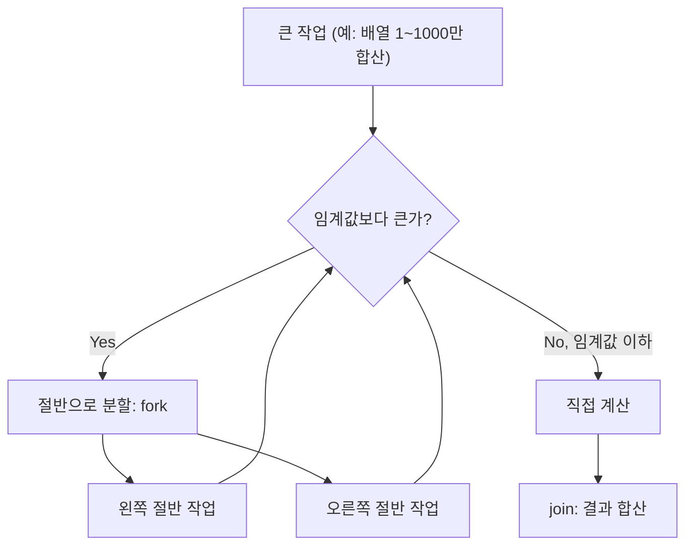

# Fork-Join 프레임워크

## 핵심 정의
Fork-Join 프레임워크(`java.util.concurrent.ForkJoinPool`, Java 7 도입)는 하나의 큰 작업을 재귀적으로 작은 단위로 쪼개고(fork), 각 조각을 병렬로 실행한 뒤 결과를 다시 합치는(join) 분할 정복(divide and conquer) 방식의 병렬 처리를 위한 실행 프레임워크다. 일반 `ThreadPoolExecutor`와 달리 작업 훔치기(work-stealing) 알고리즘을 사용해, 유휴 상태인 스레드가 다른 바쁜 스레드의 작업 큐에서 일을 가져가 실행함으로써 부하를 자동으로 분산시킨다.

`Stream.parallel()`, `Arrays.parallelSort()`, `CompletableFuture`의 비동기 콜백 등 자바 표준 라이브러리의 병렬 처리 상당수가 내부적으로 공용 풀(common pool)인 `ForkJoinPool.commonPool()`을 공유해서 사용한다.

## 동작 원리 / 구조



핵심 구성 요소:
- **RecursiveTask\<V\>**: 결과값을 반환하는 작업. `compute()`를 오버라이드.
- **RecursiveAction**: 결과값이 없는 작업(부수 효과만 수행).
- **각 워커 스레드의 이중 종단 큐(deque)**: OpenJDK 25의 기본 LIFO 모드에서 소유 워커는 새 작업을 넣은 `top` 쪽에서 꺼내고, 다른 워커는 반대쪽 `base`의 오래된 작업을 훔친다. `asyncMode`는 로컬 처리도 FIFO로 바꾸는 별도 모드다. 이 방식이 캐시 지역성(cache locality)과 훔치기 경합을 동시에 줄인다.

```java
class SumTask extends RecursiveTask<Long> {
    private static final int THRESHOLD = 10_000;
    private final long[] arr;
    private final int start, end;

    SumTask(long[] arr, int start, int end) {
        this.arr = arr; this.start = start; this.end = end;
    }

    @Override
    protected Long compute() {
        if (end - start <= THRESHOLD) {
            long sum = 0;
            for (int i = start; i < end; i++) sum += arr[i];
            return sum;
        }
        int mid = start + (end - start) / 2;
        SumTask left = new SumTask(arr, start, mid);
        SumTask right = new SumTask(arr, mid, end);
        left.fork();                 // 왼쪽을 스케줄링; 같은 워커가 실행할 수도 있음
        long rightResult = right.compute(); // 오른쪽은 현재 스레드가 직접 계산
        long leftResult = left.join();       // 왼쪽 결과 대기
        return leftResult + rightResult;
    }
}

long total = ForkJoinPool.commonPool().invoke(new SumTask(data, 0, data.length));
```

`fork()` 후 바로 `join()`하지 않고 오른쪽을 먼저 `compute()`하는 패턴이 중요하다. 한쪽을 직접 계산하면 불필요한 큐 연산을 줄인다. 양쪽을 fork해도 join 중 워커가 작업을 도울 수 있으므로 병렬성이 절반으로 줄어드는 것은 아니다.

작업 도난이 발생하는 조건: 워커 스레드가 자신의 큐를 비우고 나면, 무작위로 다른 워커의 큐 `base` 쪽에서 작업을 훔쳐 계속 실행한다. 이 덕분에 작업 크기가 균등하지 않아도(work skew) 전체 풀의 스레드가 놀지 않고 자연스럽게 부하 균형을 이룬다.

## 실무 관점
- CPU 바운드(computation-heavy)이고 재귀적으로 분할 가능한 작업(정렬, 이미지 처리, 대용량 배열 연산, 재귀 알고리즘)에 적합하다. I/O 바운드 작업에는 적합하지 않다. 블로킹 I/O가 워커 스레드를 점유하면 공용 풀 전체의 병렬성이 떨어지기 때문이다.
- OpenJDK의 일반적인 병렬 스트림은 `ForkJoinPool.commonPool()`을 활용하므로, 내부에서 오래 블로킹하면 같은 풀을 쓰는 다른 병렬 스트림과 `CompletableFuture` 비동기 단계도 지연될 수 있다. 커스텀 `ForkJoinPool`의 작업 안에서 스트림의 종단 연산을 실행하는 방법은 Oracle JDK 27에서 별도 풀을 사용하는 것을 확인했다. 다만 Stream API가 실행기 선택을 명시적으로 받거나 특정 풀을 보장하는 계약은 아니므로 사용 JDK에서 검증한다. 명확한 실행기 소유·취소 계약이 필요하면 작업을 실행기에 직접 제출하는 방식도 고려한다.
- 공용 풀의 기본 목표 병렬성은 통상 `max(1, availableProcessors() - 1)`이며 실제 스레드 수나 엄격한 상한과 같지 않다. 컨테이너 환경에서 CPU 제한(cgroup, 쿼터)이 있는데 JVM이 이를 인식하지 못하면 실제 할당된 코어 수보다 과도하게 큰 병렬성으로 설정되어 컨텍스트 스위칭 오버헤드가 발생할 수 있다. 최신 JVM은 컨테이너 CPU 제한을 상당 부분 인식하지만, 운영 환경에서는 `-Djava.util.concurrent.ForkJoinPool.common.parallelism`로 명시적으로 조정하거나 실측으로 검증하는 것이 안전하다.
- 임계값(threshold)을 너무 작게 잡으면 작업 분할/객체 생성 오버헤드가 실제 계산 비용을 초과해 순차 처리보다 느려질 수 있다. 반대로 너무 크게 잡으면 병렬성을 충분히 활용하지 못한다. 벤치마크로 조정해야 하는 값이다.
- `ManagedBlocker` 인터페이스를 이용하면 Fork-Join 작업 내부에서 불가피하게 블로킹이 필요할 때 풀이 일시적으로 추가 스레드를 보충하도록 알려줄 수 있다. 이를 쓰지 않고 그냥 블로킹하면 풀의 유효 병렬성이 그만큼 줄어든다.

## 심화 Q&A

### Q. 작업 훔치기(work-stealing)가 일반 스레드 풀의 공유 큐 방식보다 확장성이 좋은 이유는?
`ThreadPoolExecutor`는 모든 워커가 하나의 공유 큐에 접근하므로 큐 자체가 경합 지점(contention point)이 되어 스레드가 늘어날수록 락 경합 비용이 커진다. Fork-Join은 워커마다 자신만의 큐를 가지고 자신의 작업은 그 큐에서만 꺼내므로 대부분의 접근이 락 없는(lock-free) 로컬 연산이 되고, 훔치기가 필요할 때만 다른 워커의 큐 `base` 쪽에 접근한다. 경합 지점이 훨씬 적기 때문에 코어 수가 많아져도 확장성이 유지된다.

### Q. 한쪽을 fork한 뒤 다른 쪽을 compute하는 것과 바로 join하는 것은 어떻게 다른가?
`left.fork(); right.compute(); left.join();`은 왼쪽을 다른 워커가 가져갈 기회를 주고 현재 워커도 오른쪽 계산을 진행한다. 반면 `left.fork(); left.join(); right.compute();`는 왼쪽이 끝난 뒤 오른쪽을 시작하므로 이 두 분기의 실행이 겹치지 않는다. `join()` 중 워커가 작업을 도울 수 있어도 아직 시작하지 않은 오른쪽 분기까지 병렬화해 주지는 않는다. 양쪽을 먼저 fork하고 join하는 방식도 병렬 실행이 가능하지만 큐 연산이 늘 수 있다. 여러 작업을 join할 때는 보통 마지막에 fork한 작업부터 join하거나 `invokeAll()`을 사용한다.

### Q. `ForkJoinPool.commonPool()`을 여러 기능(병렬 스트림, CompletableFuture, 직접 제출한 작업)이 공유할 때 어떤 장애 패턴이 나타나는가?
공용 풀은 애플리케이션 전체에서 하나만 존재하므로, 한 곳에서 제출한 작업이 오래 걸리거나 블로킹되면 풀의 제한된 워커 스레드가 모두 그 작업에 묶여 다른 병렬 스트림이나 `CompletableFuture.supplyAsync()` 콜백이 실행되지 못하고 대기하는 현상이 생긴다. 이는 스레드 풀이 부족해서가 아니라 하나의 공유 자원을 여러 용도가 암묵적으로 나눠 쓰다가 서로를 굶기는(starvation) 전형적인 사례로, 원인 파악이 어려운 간헐적 지연 장애로 나타나는 경우가 많다.

### Q. `RecursiveTask`와 `RecursiveAction`을 넘어 일반 `Runnable`/`Callable`을 `ForkJoinPool`에 제출하면 작업 훔치기의 이점을 그대로 받는가?
`ForkJoinPool`은 `ExecutorService`이기도 해서 일반 `Runnable`/`Callable`도 `submit()`으로 받을 수 있지만, 이렇게 제출된 작업은 재귀적으로 `fork()`/`join()`을 호출하지 않으므로 작업 훔치기의 핵심인 "세분화된 하위 작업 분산"이라는 이점을 온전히 누리지 못한다. 단일 단위 작업으로 취급되어 일반 스레드 풀에 제출한 것과 큰 차이가 없어지며, 독립 작업도 부하 분산을 활용할 수 있다. 재귀 분할은 유용한 대표 사례이며 join하지 않는 이벤트형 작업에는 asyncMode도 있다.

### Q. Fork-Join 기반 병렬 스트림이 항상 순차 스트림보다 빠르지 않은 이유는?
병렬화에는 작업 분할, 스레드 간 조율, 결과 병합에 드는 고정 오버헤드가 있다. 데이터 크기가 작거나, 요소당 처리 비용이 매우 낮거나(단순 덧셈 등), 소스 자료구조가 분할하기 어려운 구조(예: `LinkedList`처럼 크기 파악과 분할이 비싼 컬렉션)라면 병렬화 오버헤드가 이득을 초과해 순차 스트림보다 느려진다. 병렬 스트림은 대용량 데이터 + 계산 비용이 큰 연산 + 분할이 쉬운 자료구조(배열, `ArrayList`) 조합에서 이득을 기대하기 쉬우며 실제 병목과 오버헤드를 측정해야 한다.

### Q. 실행 중인 RecursiveTask에 cancel(true)를 호출하면 작업이 즉시 멈추는가?
A. Java SE 25의 ForkJoinTask 기본 취소 구현은 `mayInterruptIfRunning` 값을 사용하지 않으므로, 이를 그대로 사용하는 RecursiveTask의 `compute()`를 인터럽트하지 않는다. 취소가 수락되어 `isDone()`·`isCancelled()`가 true이고 `join()`이 CancellationException을 던져도 작업 본문은 계속 실행 중일 수 있다. 취소 상태를 자원 정리 완료 신호로 사용하면 실행 중인 작업과 자원 해제가 충돌할 수 있다. 계산 루프가 취소 상태나 별도 종료 신호를 확인하고 정리한 뒤 완료를 알리도록 설계한다.

이 계약을 모든 ForkJoinTask 구현에 일반화하지는 않는다. Java SE 25의 `ForkJoinTask.adaptInterruptible(...)`로 만든 작업은 `cancel(true)`에서 실행 스레드의 인터럽트를 시도한다. Callable 오버로드는 Java 19, Runnable 오버로드는 Java 22부터 제공된다. 이 경우에도 인터럽트는 협력적 취소이므로 실제 종료·정리 완료와 취소 요청을 구분한다.

## 관련 개념
- [[ExecutorService와 스레드 풀]]
- [[CompletableFuture]]
- [[가상 스레드]]
- [[Stream API]]

## 참고 자료

확인 날짜: 2026-09-08. 아래 버전과 범위의 공식 문서·소스로 본문을 대조했다. 성능 비교와 운영 선택은 워크로드에 따라 달라지는 판단 기준이다.

- [Java SE 25 ForkJoinPool](https://docs.oracle.com/en/java/javase/25/docs/api/java.base/java/util/concurrent/ForkJoinPool.html) — work-stealing·목표 병렬성·ManagedBlocker·asyncMode.
- [Java SE 25 ForkJoinTask](https://docs.oracle.com/en/java/javase/25/docs/api/java.base/java/util/concurrent/ForkJoinTask.html) — fork/join 도움 실행·invokeAll·의존 관계.
- [Java SE 25 RecursiveTask](https://docs.oracle.com/en/java/javase/25/docs/api/java.base/java/util/concurrent/RecursiveTask.html) — 분할 예제와 compute 계약.

부분 재검증: 2026-09-22. 아래 범위를 추가 확인했으며, 그 밖의 본문은 기존 검증 날짜를 유지한다.

- [Java SE 27 ForkJoinTask](https://docs.oracle.com/en/java/javase/27/docs/api/java.base/java/util/concurrent/ForkJoinTask.html) — fork·join 의존 관계, 안쪽 작업부터 join하는 순서. 질문과 답변이 서로 다른 실행 순서를 설명하던 부분을 수정했다.

- [Java SE 27 Stream 패키지](https://docs.oracle.com/en/java/javase/27/docs/api/java.base/java/util/stream/package-summary.html) — 병렬 실행·스레드 선택 계약. 2026-09-22에 커스텀 풀 내부의 종단 연산을 Oracle JDK 27에서 실행하고 ForkJoinTask.getPool()로 확인했다. 관찰된 구현 동작과 API 보장을 구분했다.

### 2026-09-23 부분 재검증

- [Java SE 25 ForkJoinTask.cancel](https://docs.oracle.com/en/java/javase/25/docs/api/java.base/java/util/concurrent/ForkJoinTask.html#cancel(boolean)) 및 같은 문서의 adaptInterruptible — 기본 취소에서 인터럽트 인자를 무시하는 계약과 인터럽트 가능한 어댑터의 차이·도입 버전을 확인했다. OpenJDK 25.0.2+10-69에서 실행 중 RecursiveTask가 취소 상태가 된 후에도 대기하다 별도 신호로 종료하는 사례와 adaptInterruptible의 인터럽트를 재현했다.
- [OpenJDK jdk-25-ga ForkJoinPool](https://raw.githubusercontent.com/openjdk/jdk/jdk-25-ga/src/java.base/share/classes/java/util/concurrent/ForkJoinPool.java) — WorkQueue의 push/pop은 top, steal/poll은 base를 사용하고 FIFO 모드는 로컬 poll을 사용하는 소스에 맞춰 큐 방향 용어를 교정했다. 나머지 성능·컨테이너·Stream 설명은 기존 검증 날짜를 유지한다.
