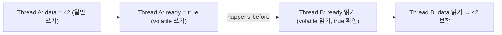

# Java Memory Model과 happens-before

## 핵심 정의
자바 메모리 모델(Java Memory Model, JMM)은 여러 스레드가 힙(heap)의 변수를 동시에 읽고 쓸 때 "어떤 스레드의 쓰기가 다른 스레드의 읽기에 언제 보여야 하는가"를 정의하는 명세다. JSR-133(Java 5, 2004)에서 정식화되었고, 컴파일러/JIT의 명령어 재정렬(instruction reordering)과 CPU의 캐시 구조를 그대로 노출하지 않으면서도 프로그래머가 예측 가능한 동시성 프로그램을 작성할 수 있도록 최소한의 순서 보장 규칙을 제공한다.

happens-before는 JMM이 이 보장을 표현하는 핵심 관계다. "액션 A가 액션 B보다 happens-before 관계에 있다"는 것은 B가 읽을 수 있는 값을 가시성·순서 제약으로 제한한다는 뜻이며, 이는 물리적 시간 순서와는 다른 개념이다. happens-before가 성립하지 않으면 두 액션의 순서는 재정렬될 수 있고 서로의 결과가 보이지 않을 수 있다.

## 동작 원리 / 구조

JMM이 보장하는 대표적인 happens-before 규칙:

| 규칙 | 내용 |
|---|---|
| 프로그램 순서 규칙 | 한 스레드 내에서는 코드 순서대로 happens-before 성립 |
| 모니터 락 규칙 | `synchronized` 블록의 unlock은 이후 같은 락의 lock에 happens-before |
| volatile 변수 규칙 | `volatile` 쓰기는 이후 같은 변수의 읽기에 happens-before |
| 스레드 시작 규칙 | `Thread.start()` 호출은 그 스레드 내부의 모든 액션에 happens-before |
| 스레드 종료 규칙 | 스레드의 모든 액션은 다른 스레드가 `join()` 등으로 실제 종료를 감지한 이후에 happens-before; 시간 제한 만료만으로는 불충분 |
| 인터럽트 규칙 | `interrupt()` 호출은 인터럽트를 감지하는 코드에 happens-before |
| 전이성(transitivity) | A happens-before B이고 B happens-before C이면 A happens-before C |



핵심은 `volatile` 쓰기 자체가 만드는 happens-before가 그 변수 하나에 국한되지 않는다는 점이다. `ready = true` 이전에 실행된 `data = 42`라는 일반 변수 쓰기까지, 전이성에 의해 `ready`를 읽은 이후의 코드에 함께 보이게 된다. 이 성질을 안전한 공개(safe publication)라고 부르며, 안전한 공개에는 락·volatile 외에도 클래스 초기화, 스레드 시작, 동시성 컬렉션 등 각 API의 보장을 사용할 수 있다. 예제는 writer가 data를 42로 설정한 후 변경하지 않는 일회성 공개를 가정한다.

```java
class Holder {
    int data;
    volatile boolean ready;

    void writer() {
        data = 42;      // (1) 일반 쓰기
        ready = true;    // (2) volatile 쓰기 - happens-before 경계
    }

    void reader() {
        if (ready) {              // (3) volatile 읽기
            System.out.println(data); // (4) 항상 42, happens-before 전이성 덕분
        }
    }
}
```

반대로 happens-before가 없는 경우, 재정렬로 인해 (1)과 (2)의 순서가 컴파일러/CPU 관점에서 뒤바뀔 수 있고, 다른 스레드는 `ready`가 `true`인데도 `data`가 아직 0인 상태를 관찰할 수 있다.

## 실무 관점
- happens-before는 "동시에 실행되지 않는다"는 상호 배제 보장이 아니라 "결과가 보이는 순서"에 대한 보장이다. 락은 상호 배제와 happens-before를 동시에 주지만, `volatile`은 happens-before만 주고 상호 배제는 주지 않는다는 점을 [[volatile과 가시성]]과 함께 구분해야 한다.
- 더블 체크 락킹, 지연 초기화 홀더(lazy initialization holder), 이벤트 발행 후 상태 공개 같은 패턴은 모두 happens-before 규칙에 의존한다. 락이나 `volatile` 없이 "생성자에서 다 채운 객체니까 안전하겠지"라고 가정하는 것이 실무에서 가장 흔한 오해다.
- `final` 필드는 생성자가 끝난 뒤 생성자 도중 `this`를 유출하지 않고 올바르게 구성된 객체를 다른 스레드가 관찰하면 별도 동기화 없이도 초기화 값이 보장된다. 이는 일반 필드까지 안전하게 공개하거나 참조의 발견 시점을 보장하는 규칙은 아니다. 이는 JMM이 `final` 필드에 대해 별도로 주는 보장으로, happens-before 일반 규칙과는 다른 특수 규칙이다.
- CPU 아키텍처(x86 vs ARM)마다 실제 메모리 재정렬 정도가 다르기 때문에, happens-before를 지키지 않은 코드가 x86 개발 환경에서는 우연히 잘 동작하다가 ARM 기반 서버나 클라우드 인스턴스에서 재현되는 버그로 나타나는 경우가 있다. "로컬에서는 문제없었다"는 근거가 되지 않는다.
- `java.util.concurrent`의 모든 동기화 클래스(`ReentrantLock`, `CountDownLatch`, `ConcurrentHashMap`의 put/get 등)는 각자의 방식으로 happens-before를 제공하도록 설계되어 있다. 직접 락을 설계하기보다 이런 검증된 컴포넌트를 우선 사용하는 것이 안전하다.

## 심화 Q&A

### Q. happens-before가 성립한다고 해서 두 스레드의 명령어가 실제로 그 순서대로 실행됨을 의미하는가?
아니다. happens-before는 실행 순서를 강제하는 것이 아니라 "결과의 가시성"을 보장하는 논리적 계약이다. 실제 CPU 파이프라인이나 컴파일러는 여전히 명령어를 재정렬할 수 있지만, happens-before 관계가 있는 두 액션 사이에서는 재정렬의 결과가 프로그래머가 기대한 것과 다르게 관찰되지 않도록 JVM이 필요한 메모리 배리어를 삽입한다. 즉 물리적 순서가 아니라 관찰 가능한 결과의 순서를 보장하는 것이다.

### Q. 왜 자바는 순차 일관성(sequential consistency)을 기본으로 채택하지 않고 약한 메모리 모델을 택했는가?
순차 일관성은 모든 스레드가 모든 메모리 연산을 동일한 전역 순서로 관찰하도록 강제하는데, 이를 모든 경쟁 있는 코드에 강제하면 여러 최적화를 제한한다. 그렇다고 캐시를 무력화해야 하는 것은 아니다. JMM은 데이터 경쟁이 없는 올바르게 동기화된 프로그램에 순차 일관성을 보장하면서 "동기화 지점(락, volatile 등)을 명시한 곳에서만 순서를 보장하고, 그 외에는 자유롭게 재정렬을 허용"하는 완화된 모델을 택했다. 이는 성능과 프로그래밍 편의성 사이의 트레이드오프이며, 개발자가 공유 상태에는 반드시 동기화 수단을 명시해야 하는 책임을 지게 된 이유다.

### Q. 두 스레드가 서로 다른 락 객체로 각각 동기화하면 happens-before가 성립하는가?
성립하지 않는다. 모니터 락 규칙은 "같은 락 객체"에 대한 unlock과 lock 사이에서만 happens-before를 만든다. 스레드 A가 락 X를 풀고 스레드 B가 락 Y를 잡는다는 사실만으로는 두 액션 사이에 관계가 생기지 않는다. 다른 volatile·스레드 시작 등의 연결이 있으면 별도의 happens-before가 성립할 수 있다. 서로 다른 락으로 같은 데이터를 보호하는 실수(lock의 불일치)는 상호 배제도, 가시성도 보장하지 못해 경쟁 상태(race condition)로 이어진다.

### Q. 왜 `synchronized` 블록 안에서 읽고 쓴 일반 변수까지 다른 스레드에 안전하게 보이는가?
모니터 락 규칙과 전이성이 함께 작동하기 때문이다. 락을 잡은 스레드가 블록 안에서 수행한 모든 쓰기는 그 스레드가 락을 해제하는 시점 이전에 일어난 것으로 취급되고, 그 unlock은 이후 같은 락을 획득하는 다른 스레드의 lock에 happens-before가 성립한다. 전이성에 의해 블록 안의 모든 쓰기가 다음 락 획득자에게 순서대로 보이게 된다. 이것이 `synchronized`가 원자성뿐 아니라 가시성까지 함께 해결하는 이유다.

### Q. 이중 검사 락킹(double-checked locking)에서 `volatile`을 빼면 왜 happens-before 관점에서 위험한가?
`instance = new Singleton()`은 (a) 메모리 할당, (b) 생성자 실행, (c) 참조 대입의 세 단계로 이루어지는데, `volatile`이 없으면 JIT이나 CPU가 (b)와 (c)의 순서를 바꿀 수 있다. 이 경우 다른 스레드가 첫 번째 null 체크에서 아직 생성자가 끝나지 않은 부분 초기화 객체의 참조를 보게 될 수 있다. `volatile`을 붙이면 쓰기 시점에 happens-before 경계가 생겨, 참조가 보이는 시점에는 생성자의 모든 초기화도 함께 보이는 것이 보장된다.

### Q. `ConcurrentHashMap`의 `get()`이 별도 락 없이도 최신 값을 보는 이유를 happens-before로 설명하면?
`ConcurrentHashMap`은 내부적으로 `volatile` 필드와 CAS(Compare-And-Swap) 연산, 그리고 특정 노드 접근 시의 메모리 배리어를 조합해 자체적인 happens-before 관계를 구축해 놓았다. 특정 키의 갱신과 그 갱신 결과를 반환하는 null이 아닌 조회 사이에 happens-before가 성립하도록 라이브러리 내부에서 설계되어 있어, 사용자는 락을 직접 걸지 않고도 안전하게 값을 읽을 수 있다. 이는 [[ConcurrentHashMap]] 내부 구현이 JMM 규칙 위에서 신중하게 설계된 결과다.

### Q. volatile로 데이터 경쟁을 없애면 여러 단계의 업무 연산도 안전한가?
A. 아니다. 데이터 경쟁(data race)은 같은 변수의 충돌 접근이 happens-before로 정렬되지 않은 상태이며, 경쟁 상태(race condition)는 실행 순서 때문에 업무 결과가 달라지는 더 넓은 문제다. `volatile int count`의 `count++`은 각 접근이 동기화되어도 읽기와 쓰기 사이에 다른 증가가 끼어들어 갱신을 잃을 수 있다. SC-for-DRF는 복합 연산의 원자성까지 제공하지 않는다.

### Q. 두 volatile 필드에 설정값을 각각 저장하면 일관된 설정 스냅샷인가?
A. 아니다. 읽는 쪽은 첫 필드의 이전 값과 둘째 필드의 새 값을 조합할 수 있다. 여러 필드의 불변식을 함께 유지하려면 같은 락으로 묶거나 불변 설정 객체 하나를 volatile 참조로 교체하고, 읽는 쪽에서 그 참조를 한 번만 읽어 사용한다.

## 관련 개념
- [[volatile과 가시성]]
- [[synchronized와 Lock]]
- [[ConcurrentHashMap]]
- [[데드락과 경쟁 상태]]

## 참고 자료

확인 날짜: 2026-09-08. 아래 버전과 범위의 공식 문서·소스로 본문을 대조했다. 성능 비교와 운영 선택은 워크로드에 따라 달라지는 판단 기준이다.

- [JLS 25 §17](https://docs.oracle.com/javase/specs/jls/se25/html/jls-17.html) — happens-before·SC-for-DRF·final 필드·volatile.
- [Java SE 25 java.util.concurrent](https://docs.oracle.com/en/java/javase/25/docs/api/java.base/java/util/concurrent/package-summary.html) — 작업 제출·결과 회수·컬렉션의 메모리 일관성 계약.

### 2026-09-23 부분 재검증

JLS 25 §17.4.3–17.4.5의 SC-for-DRF, 종료 감지, 복합 연산 원자성의 한계를 다시 확인했다. 기존 전체 검증일은 유지한다.
