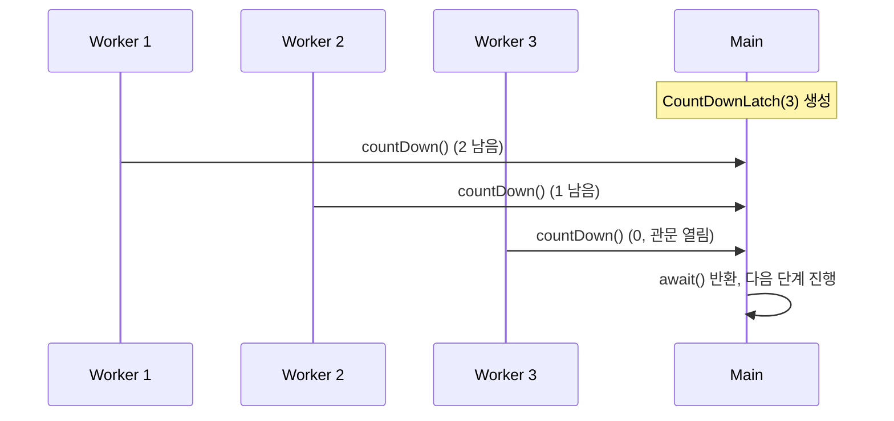

# Semaphore와 CountDownLatch와 CyclicBarrier

## 핵심 정의
세 클래스 모두 `java.util.concurrent`가 제공하는 스레드 간 조율(coordination) 도구로, 락처럼 자원 자체를 보호하는 게 아니라 "몇 개의 스레드가 어떤 조건을 만족할 때까지 기다리게 할 것인가"를 제어한다. `Semaphore`는 동시에 접근 가능한 자원 개수를 제한하는 카운팅 허가증(permit) 방식이고, `CountDownLatch`는 지정된 횟수만큼 카운트가 감소할 때까지 다른 스레드를 대기시키는 일회용 관문이며, `CyclicBarrier`는 지정된 수의 스레드가 모두 특정 지점에 도달할 때까지 서로를 기다렸다가 동시에 다음 단계로 진행하는 재사용 가능한 동기화 지점이다.

## 동작 원리 / 구조

| 구분 | Semaphore | CountDownLatch | CyclicBarrier |
|---|---|---|---|
| 목적 | 동시 접근 수 제한 | 다른 스레드(들)의 작업 완료 대기 | 여러 스레드의 상호 대기 후 동시 진행 |
| 카운트 방향 | 획득(acquire)/반환(release) 자유 | 감소만 가능, 0 도달 후 재사용 불가 | 도달할 때마다 감소, 0 되면 자동 리셋 |
| 재사용 | 가능 | 불가능(1회성) | 가능(cyclic) |
| 대기자-신호자 관계 | 대칭적(누구나 acquire/release) | 비대칭(신호자 다수, 대기자 다수 가능하지만 관문은 1회) | 대칭적(참가자 전원이 대기자이자 신호자) |
| 추가 기능 | 공정 모드(fair), 논블로킹 `tryAcquire` | 없음 | 배리어 도달 시 실행할 액션(barrierAction) 지정 가능 |



```java
// Semaphore: 동시 DB 커넥션 사용 수를 3개로 제한
Semaphore semaphore = new Semaphore(3);
void query() throws InterruptedException {
    semaphore.acquire();
    try {
        // 자원 사용
    } finally {
        semaphore.release(); // 반드시 짝을 맞춰 반환
    }
}

// CountDownLatch: 여러 초기화 작업이 끝난 뒤 서비스 시작
CountDownLatch latch = new CountDownLatch(3);
java.util.concurrent.atomic.AtomicReference<Throwable> failure =
    new java.util.concurrent.atomic.AtomicReference<>();
for (Runnable init : java.util.List.<Runnable>of(
        () -> initCache(), () -> initDb(), () -> initConfig())) {
    executor.execute(() -> {
        try { init.run(); }
        catch (Throwable ex) { failure.compareAndSet(null, ex); }
        finally { latch.countDown(); }
    });
}
if (!latch.await(30, TimeUnit.SECONDS)) throw new IllegalStateException("초기화 시간 초과");
if (failure.get() != null) throw new IllegalStateException("초기화 실패", failure.get());
startService();

// CyclicBarrier: 각 라운드마다 전원이 도착해야 다음 라운드 진행
CyclicBarrier barrier = new CyclicBarrier(4, () -> System.out.println("라운드 종료, 결과 취합"));
void worker() throws Exception {
    for (int round = 0; round < 10; round++) {
        doPartialWork(round);
        barrier.await(); // 4명 전원 도착 시 barrierAction 실행 후 전원 대기 해제 가능; 실행 순서는 스케줄러 결정
    }
}
```

`CyclicBarrier`는 `await()` 호출 스레드 수가 지정된 파티(party) 수에 도달하면 등록된 `Runnable`(barrierAction)을 마지막 도착 스레드가 실행한 뒤 카운트를 자동으로 리셋하고 대기자들이 재개할 수 있게 한다. 실제 동시 실행을 보장하지 않는다. 이 재사용성이 `CountDownLatch`와의 가장 큰 구조적 차이다.

예제는 작업 제출이 모두 수락된 상황을 가정한다. 제출 거부도 시작 실패로 처리해야 하며, 시간 초과만으로 실행 중 초기화 작업이 취소되는 것은 아니다. countDown은 완료 통지이며 성공을 의미하지 않으므로 실패 수집을 분리했다.

## 실무 관점
- `Semaphore`는 외부 자원(DB 커넥션, 외부 API 호출, 파일 핸들) 동시 사용량을 제한하는 동시성 스로틀링(throttling) 용도로 흔히 쓰인다. 초당 요청 수를 제한하는 rate limiter와 달리 동시 사용 수를 제한한다. 스레드 풀 크기 제한과 별개로, "동시에 이 자원을 쓸 수 있는 개수"를 명시적으로 통제하고 싶을 때 적합하다.
- `Semaphore.acquire()`와 `release()`의 짝을 맞추지 않는 실수(예외 발생 시 `release()` 누락)가 흔하다. `try-finally`로 반드시 반환을 보장해야 하며, 그렇지 않으면 허가증이 서서히 고갈되어 결국 모든 스레드가 영원히 `acquire()`에서 대기하는 자원 고갈 장애로 이어진다.
- `CountDownLatch`는 재사용이 불가능하므로, 반복적인 라운드 동기화가 필요하면 `CyclicBarrier`를 쓰거나 매 라운드 새 `CountDownLatch`를 생성해야 한다. `CountDownLatch`를 재사용하려는 시도(카운트가 0이 된 뒤 다시 세팅) 자체가 API로 지원되지 않는다는 점을 헷갈리는 경우가 많다.
- `CyclicBarrier`는 await 중 인터럽트·타임아웃, barrierAction 실패 또는 reset 등으로 현재 세대가 broken 상태가 되면, 이미 대기 중이던 다른 스레드는 BrokenBarrierException을 받는다. 원인이 된 스레드는 InterruptedException·TimeoutException·액션 예외를 받을 수 있다. await에 도달하기 전 일반 작업에서 발생한 예외는 배리어가 자동 감지하지 못한다. 인터럽트·타임아웃·액션 실패로 깨진 세대는 `reset()` 없이 정상 대기에 재사용할 수 없다. 반면 `reset()` 자체는 기존 대기자를 실패시키고 새 정상 세대를 시작하므로, reset 후에도 계속 broken이라는 뜻은 아니다. 재시작할 참가자들을 별도로 동기화하지 않으면 서로 다른 작업 라운드가 섞일 수 있어 새 배리어를 만드는 방법도 검토한다.
- `Semaphore(1)`은 상호 배제 락처럼 보이지만 `ReentrantLock`과 달리 소유권(ownership) 개념이 없다. 즉 스레드 A가 `acquire()`한 허가를 스레드 B가 `release()`할 수 있다. 이 특성은 "생산자가 만들고 소비자가 반환하는" 비대칭적 신호 전달에는 유용하지만, 단순 상호 배제 목적이라면 오히려 실수를 유발할 수 있어 용도를 명확히 구분해야 한다.

### 비동기 작업에서는 실제 자원 사용 수명에 맞춰 반환한다
허가증은 획득에 성공한 경우에만 반환한다. `tryAcquire`가 false를 반환하거나 `acquire`가 인터럽트로 실패했는데 공통 finally에서 `release()`하면 허가증이 부풀어 동시성 제한이 깨진다. Semaphore는 초기 허가증 수를 자동 상한으로 강제하지 않는다. 위 예제가 `acquire()`를 try 바깥에 둔 이유다.

또한 `CompletableFuture.whenComplete((v, e) -> semaphore.release())`를 붙인 Future가 취소·타임아웃으로 먼저 완료되면, 실제 외부 호출이 계속되는데 허가증만 돌아갈 수 있다. 자원을 쓰는 작업 본문의 finally에서 사용 종료·반납에 맞춰 반환하거나, 클라이언트가 보장하는 실제 종료 신호에 연결한다. 제출 전에 허가증을 잡는 설계에서는 제출 거부·미시작 취소의 반환 책임까지 따로 정하고 이중 반환을 막는다.

## 심화 Q&A

### Q. `Semaphore(1)`과 `ReentrantLock`이 둘 다 동시 접근을 1개로 제한하는데 실무에서 어떤 기준으로 선택하는가?
`ReentrantLock`은 소유 스레드만 해제할 수 있고 재진입(reentrant)이 가능하며 `Condition`을 지원해 "임계 구역 보호"라는 목적에 최적화되어 있다. `Semaphore(1)`은 소유권이 없어 다른 스레드가 대신 `release()`할 수 있고 재진입 개념도 없다. 따라서 자원 접근을 상호 배제하려면 `ReentrantLock`/`synchronized`가 적합하고, "다른 스레드에게 자원 사용 권한을 넘겨주는" 신호(signal) 패턴(예: A가 자원을 준비하고 B가 다 쓴 뒤 반환)이 필요하면 `Semaphore`가 더 자연스럽다.

### Q. `CountDownLatch`의 카운트가 0이 되기 전에 `await()`를 호출한 스레드가 타임아웃 없이 무한정 기다리면 어떤 문제가 생기는가?
카운트를 감소시켜야 할 작업 스레드 중 하나가 예외로 죽거나 데드락에 빠져 `countDown()`을 호출하지 못하면, `await()` 중인 모든 스레드가 영원히 깨어나지 못하는 응답 없음(hang) 상태가 된다. `countDown()`은 `finally` 블록에서 호출해 작업 성공/실패와 무관하게 카운트가 반드시 줄어들도록 설계하거나, `await(timeout, unit)`으로 타임아웃을 두어 무한 대기를 방지하는 것이 안전하다.

### Q. `CyclicBarrier`에서 barrierAction이 어느 스레드에서 실행되는지가 왜 중요한가?
barrierAction은 배리어를 채운 "마지막으로 도착한 스레드"가 실행한다. 즉 어떤 워커가 마지막이 될지는 실행마다 달라질 수 있으므로, barrierAction 안에서 스레드 로컬 상태(`ThreadLocal`)에 의존하거나 특정 워커의 문맥을 가정하는 코드를 넣으면 실행마다 다른 스레드 문맥에서 동작해 예측 불가능한 버그가 생길 수 있다. barrierAction은 공유 상태에만 의존하는 순수한 집계/로깅 용도로 제한하는 것이 안전하다.

### Q. `Semaphore`의 공정 모드(fair)와 비공정 모드는 어떤 상황에서 차이가 드러나는가?
비공정 모드는 `acquire()`를 요청한 순서와 무관하게 허가가 반환되는 순간 마침 실행 중이던 스레드가 먼저 채갈 수 있어(barging) 전체 처리량은 높지만 특정 스레드가 계속 순번에서 밀리는 기아(starvation)가 발생할 수 있다. 공정 모드는 내부 순서 결정 지점 기준으로 대기자를 우선하지만 시간 제한 없는 `tryAcquire()`와 `tryAcquire(n)`은 끼어들 수 있다. 공정성을 따르는 즉시 시도는 `tryAcquire(0, TimeUnit.SECONDS)`처럼 시간 제한형을 사용하며, 이 경로는 인터럽트도 확인한다. 공정성은 일반적으로 처리량과 맞바꾸는 선택이지만 성능 차이는 경합과 작업 길이에 따라 측정한다. 짧고 빈번한 자원 접근에는 비공정 모드가, 자원 배분의 형평성이 중요한 배치/큐 처리에는 공정 모드가 적합하다.

### Q. `CountDownLatch`와 `CyclicBarrier`를 조합해서 쓰는 실무 상황이 있는가?
있다. 예를 들어 여러 워커가 각자 데이터를 준비(phase 1)한 뒤, 전원이 준비를 마쳐야 다음 계산 단계(phase 2)로 넘어가고, 이 사이클을 여러 라운드 반복해야 하는 배치 작업이라면 `CyclicBarrier`가 라운드마다의 동기화를 담당한다. 여기에 더해 "전체 배치가 완전히 끝났음"을 메인 스레드에 한 번만 알려야 한다면, 마지막 라운드 종료 시점에 별도의 `CountDownLatch`를 `countDown()`해서 메인 스레드가 `await()`로 최종 종료를 감지하게 만드는 조합이 흔하다. 반복 동기화는 `CyclicBarrier`, 일회성 완료 신호는 `CountDownLatch`로 역할을 나누는 것이 핵심이다.

## 관련 개념
- [[synchronized와 Lock]]
- [[BlockingQueue]]
- [[ExecutorService와 스레드 풀]]
- [[데드락과 경쟁 상태]]

## 참고 자료

확인 날짜: 2026-09-08. 아래 버전과 범위의 공식 문서·소스로 본문을 대조했다. 성능 비교와 운영 선택은 워크로드에 따라 달라지는 판단 기준이다.

- [Java SE 25 Semaphore](https://docs.oracle.com/en/java/javase/25/docs/api/java.base/java/util/concurrent/Semaphore.html) — permit·소유권 없음·공정성 예외.
- [Java SE 25 CountDownLatch](https://docs.oracle.com/en/java/javase/25/docs/api/java.base/java/util/concurrent/CountDownLatch.html) — 일회성·완료 신호·happens-before.
- [Java SE 25 CyclicBarrier](https://docs.oracle.com/en/java/javase/25/docs/api/java.base/java/util/concurrent/CyclicBarrier.html) — broken 원인·예외 종류·barrierAction.

부분 재검증: 2026-09-22. [Java SE 27 CyclicBarrier](https://docs.oracle.com/en/java/javase/27/docs/api/java.base/java/util/concurrent/CyclicBarrier.html#reset())의 reset 계약과 Oracle JDK 27 소스의 breakBarrier → nextGeneration 순서를 확인했다. 실행 검사에서 기존 대기자는 BrokenBarrierException을 받고 새 세대는 정상 통과했다. Semaphore·CountDownLatch 전체 재검증은 아니다.

부분 재검증: 2026-10-04. 아래 적용 버전·범위만 확인했으며 노트 전체의 기존 verified는 유지한다.

- [Java SE 25 Semaphore](https://docs.oracle.com/en/java/javase/25/docs/api/java.base/java/util/concurrent/Semaphore.html) — acquire 실패와 반환, release 소유권 없음, 시간 제한 없는 tryAcquire의 공정성 예외와 시간 제한형 대안.
- [Java SE 25 CompletableFuture](https://docs.oracle.com/en/java/javase/25/docs/api/java.base/java/util/concurrent/CompletableFuture.html) — cancel·orTimeout의 결과 완료. 허가증을 실제 자원 사용 종료에 연결해야 한다는 설명은 두 계약을 함께 적용한 운영 판단이다.

실행 확인: Oracle JDK 25.0.4+7-LTS-189에서 미획득 후 release의 허가증 증가, CompletableFuture 취소 콜백의 반환과 본문 종료 시점 차이. 실행 검사는 위 부분 재검증 범위에 한한다.
