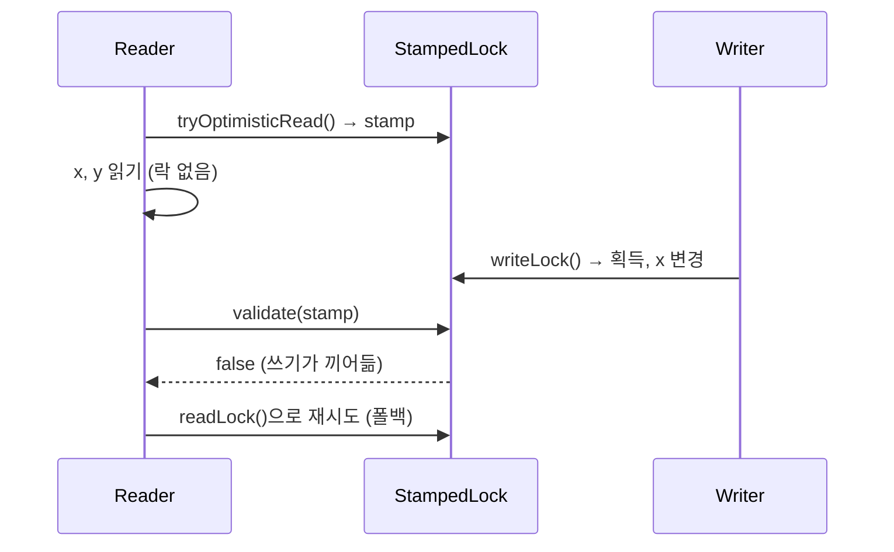

# StampedLock과 낙관적 읽기

## 핵심 정의
`StampedLock`(Java 8 도입, `java.util.concurrent.locks`)은 획득·변환에서 받은 스탬프(stamp, `long` 토큰)를 해제·검증에 사용하는 락으로, 쓰기 락(write lock)과 비관적 읽기 락(pessimistic read lock)에 더해 낙관적 읽기(optimistic read)라는 세 번째 모드를 제공한다. 낙관적 읽기는 락을 아예 획득하지 않고 스탬프만 받아 데이터를 읽은 뒤, 그 사이 쓰기가 있었는지를 스탬프 검증(`validate()`)으로 사후 확인하는 방식이라 읽기 작업이 다른 스레드를 블로킹하지 않는다.

`ReentrantReadWriteLock`과 목적은 비슷하지만(읽기 다수/쓰기 소수 상황에서 처리량 향상), `StampedLock`은 재진입(reentrant)을 지원하지 않고 `Condition`도 없는 대신, 락 자체를 잡지 않는 낙관적 읽기 모드로 더 높은 처리량을 낼 수 있다.

## 동작 원리 / 구조

세 가지 모드 비교:

| 모드 | 동작 | 블로킹 여부 | 반환값 |
|---|---|---|---|
| 쓰기 락 (`writeLock()`) | 배타적 잠금 | 읽기/쓰기 락 획득 차단; 낙관적 시도는 0 반환 | stamp |
| 비관적 읽기 락 (`readLock()`) | 공유 잠금 | 읽기끼리 공유 가능, 쓰기 상태·대기 정책에 따라 획득은 대기 가능 | stamp |
| 낙관적 읽기 (`tryOptimisticRead()`) | 잠금 없음 | 아무도 블로킹하지 않음 | stamp (검증 필요) |

```java
private final StampedLock lock = new StampedLock();
private double x, y;

// 낙관적 읽기 패턴
double distanceFromOrigin() {
    long stamp = lock.tryOptimisticRead(); // 락 없이 스탬프만 받음
    double currentX = x, currentY = y;      // 읽는 도중 쓰기가 끼어들 수 있음
    if (!lock.validate(stamp)) {            // 그 사이 쓰기가 있었는지 검증
        stamp = lock.readLock();            // 검증 실패 시 비관적 읽기로 폴백
        try {
            currentX = x;
            currentY = y;
        } finally {
            lock.unlockRead(stamp);
        }
    }
    return Math.sqrt(currentX * currentX + currentY * currentY);
}

// 쓰기
void move(double deltaX, double deltaY) {
    long stamp = lock.writeLock();
    try {
        x += deltaX;
        y += deltaY;
    } finally {
        lock.unlockWrite(stamp);
    }
}
```



`validate()`는 스탬프 발급 이후 쓰기 락이 한 번이라도 획득되었는지를 확인한다. 쓰기가 있었다면 `false`를 반환하며, 이때 읽은 값은 신뢰할 수 없으므로 결과를 버리고 다시 읽어야 한다. 비관적 읽기로 폴백하거나 횟수를 제한해 낙관적 읽기를 재시도할 수 있다. 이 특성 때문에 낙관적 읽기 구간에서 읽은 필드 값으로 즉시 부수 효과(다른 배열 인덱싱, 외부 호출 등)를 일으키면 안 되고, 로컬 변수에 복사해 `validate()` 통과 후에만 사용해야 한다.

`tryConvertToWriteLock()`, `tryConvertToReadLock()` 같은 모드 전환 메서드도 제공되어, 읽기 락 보유 중 조건에 따라 쓰기 락으로 승격을 시도하는 패턴도 가능하다(락을 풀었다 다시 잡는 것보다 원자적으로 안전).

쓰기 락을 획득한 채 같은 락을 다시 획득하면 자기 자신을 기다릴 수 있다. 변환 메서드가 0을 반환하면 변환 실패이며, 기존 읽기 락을 해제하고 쓰기 락을 다시 얻는 경로에서는 보호 조건을 재검사해야 한다. 스탬프는 장기간 영구 식별자가 아니고 재활용될 수 있다.

## 실무 관점
- 읽기가 압도적으로 많고 쓰기가 드문 데이터 구조(좌표, 캐시된 통계, 설정값 스냅샷)에서 `ReentrantReadWriteLock`보다 더 높은 처리량이 필요할 때 도입을 고려한다. 다만 재진입/`Condition`이 필요하면 `StampedLock`은 선택지에서 제외된다.
- `StampedLock`은 재진입을 지원하지 않는다. 같은 스레드가 읽기 락을 잡은 상태에서 다시 읽기 락이나 쓰기 락을 시도하면 데드락(deadlock)에 빠질 수 있다. `synchronized`나 `ReentrantLock`에 익숙한 개발자가 재진입을 당연하게 가정하고 재귀 호출 안에서 락을 다시 잡다가 겪는 실무 장애 패턴이다.
- 낙관적 읽기 구간에서는 읽은 필드를 로컬 변수로 복사만 하고, `validate()` 이전에 그 값으로 외부 시스템 호출이나 예외를 던지는 등 되돌릴 수 없는 부수 효과를 일으키면 안 된다. 검증에 실패해도 이미 발생한 부수 효과는 취소할 수 없기 때문이다.
- `StampedLock`은 `readLockInterruptibly()`·`writeLockInterruptibly()` 및 시간 제한 획득을 제공한다. `readLock()`·`writeLock()`은 인터럽트 가능 버전이 아니며, 공정성(fairness) 설정은 제공하지 않는다. 공정성이 중요한 경합 상황이라면 `ReentrantReadWriteLock`의 공정 모드가 더 적합할 수 있다.
- 언락 시 락 획득 때 받은 스탬프를 정확히 넘겨야 한다. 낙관적 읽기는 애초에 언락이 필요 없지만(락을 획득한 적이 없으므로), 비관적 읽기/쓰기 락은 획득 시 스탬프와 해제 시 스탬프가 일치해야 하며, 이를 다른 락 종류의 스탬프와 섞어 쓰면 `IllegalMonitorStateException`이 발생한다.

## 심화 Q&A

### Q. 낙관적 읽기가 다른 스레드를 전혀 블로킹하지 않는데도 데이터 일관성이 깨지지 않는 이유는?
낙관적 읽기는 데이터를 읽는 동안 다른 스레드의 쓰기를 막지 않으므로, 읽는 도중 값이 바뀔 가능성 자체는 열려 있다. 대신 읽기가 끝난 직후 `validate()`로 "내가 스탬프를 받은 시점부터 지금까지 쓰기 락이 한 번이라도 개입했는가"를 확인해, 개입이 있었다면 그 읽기 결과를 폐기하고 안전한 비관적 읽기로 재시도한다. 즉 일관성을 사전에 막는 게 아니라 사후에 검증하고 실패 시 재시도하는 낙관적 동시성 제어(optimistic concurrency control) 전략이며, 데이터베이스의 낙관적 락(버전 컬럼 검증) 방식과 개념적으로 동일하다.

### Q. `StampedLock`의 낙관적 읽기가 `AtomicReference`나 `volatile` 필드로는 대체할 수 없는 경우는 언제인가?
독립된 volatile 필드를 각각 읽는 것만으로 여러 필드의 일관된 조합이 보장되지는 않는다. 다만 불변 스냅샷 객체 하나를 volatile/AtomicReference로 교체하는 방식은 여러 값을 함께 공개하는 대안이다. `StampedLock`의 낙관적 읽기는 여러 필드(위 예시의 x, y)를 하나의 논리적 스냅샷으로 함께 읽고 그 사이에 어떤 쓰기도 끼어들지 않았음을 한 번에 검증할 수 있다는 점에서 다르다. 즉 여러 상태를 원자적으로 함께 읽어야 하는데 락으로 인한 블로킹은 피하고 싶은 경우가 낙관적 읽기가 진가를 발휘하는 지점이다.

### Q. 낙관적 읽기 재시도(폴백) 로직을 생략하고 `validate()` 실패 시 그냥 오래된 값을 반환하면 어떤 문제가 생기는가?
`validate()`가 실패했다는 것은 읽은 값이 쓰기와 겹쳐 일관성이 깨졌을 수 있다는 뜻이다(예: x는 새 값, y는 옛 값이 섞여 읽힌 상태). 이를 무시하고 그대로 반환하면 애플리케이션 로직이 절대 존재할 수 없는 상태 조합을 정상값으로 처리해 계산 오류나 잘못된 분기로 이어질 수 있다. 검증에 실패한 결과는 폐기하고, 비관적 읽기로 전환하거나 제한된 낙관적 재시도 등으로 유효한 결과를 확보해야 한다. 반드시 한 가지 폴백 방식만 허용되는 것은 아니다.

### Q. `StampedLock`이 재진입을 지원하지 않는 설계 트레이드오프는 무엇을 얻기 위한 것인가?
재진입을 지원하려면 락 내부에 현재 소유 스레드와 보유 횟수(hold count)를 추적하는 상태가 필요한데, 이 상태 추적을 생략하면 구현과 빠른 경로를 단순화할 수 있다. 낙관적 읽기와 재진입이 논리적으로 양립 불가능한 것은 아니다. `StampedLock`은 소유권 개념을 없애고 순수하게 스탬프(카운터) 기반으로 상태를 표현함으로써 오버헤드를 최소화하고 낙관적 읽기라는 락-프리(lock-free)에 가까운 경로를 가능하게 했다. 재진입 안전성을 포기하는 대신 더 가볍고 빠른 락을 얻은 것이다.

### Q. 쓰기 락 대기 중인 스레드가 있을 때 비관적 읽기 락 요청은 어떻게 처리되는가?
`StampedLock`은 일관된 읽기 우선·쓰기 우선 정책을 보장하지 않는다. 다만 `ReentrantReadWriteLock`의 공정 모드처럼 엄격한 FIFO를 보장하는 것은 아니며, 세부 스케줄링은 구현 최적화의 영역이라 애플리케이션이 정확한 순서를 가정해서는 안 된다. 엄격한 공정성이 요구사항이라면 `StampedLock`보다 공정 모드 `ReentrantReadWriteLock`이 더 적합하다.

### Q. `StampedLock`을 `synchronized` 블록과 함께 같은 자원에 사용하면 왜 위험한가?
`StampedLock`은 자바 객체의 내장 모니터(intrinsic monitor)와 완전히 별개의 동기화 메커니즘이다. 한 경로는 `StampedLock`으로, 다른 경로는 `synchronized`로 같은 필드를 보호하면 두 메커니즘이 서로의 락 상태를 전혀 인지하지 못해 상호 배제가 깨진다. 이는 [[synchronized와 Lock]]에서 다룬 "하나의 자원에는 하나의 락 전략만" 원칙이 `StampedLock`에도 동일하게 적용되는 사례다.

### Q. validate가 성공한 뒤 객체 필드를 추가로 읽어도 안전한가?
A. 검증은 앞서 로컬로 복사한 읽기에 대한 것이다. 성공 직후에도 writer가 진입할 수 있으므로, 검증 뒤 원본 필드를 다시 읽으면 같은 스냅샷이라는 보장이 사라진다. 참조를 로컬로 복사했어도 그 참조가 가리키는 가변 객체를 검증 후 순회하면 보호되지 않는다. 모든 변경 경로가 같은 쓰기 락을 사용해야 검증이 의미가 있다.

### Q. 읽기 락에서 쓰기 락으로 전환할 때 0을 반환하면 어떻게 해제하는가?
A. `tryConvertToWriteLock(readStamp)`가 0이면 기존 읽기 락은 그대로 남는다. 원래 stamp를 보존하고, 변환 성공 때만 새 stamp로 교체한다. 실패 후 읽기 락을 놓고 쓰기 락을 새로 얻었다면 그 사이 상태가 바뀔 수 있으므로 조건도 다시 검사한다. 여러 읽기 획득이 성공할 수 있다는 사실을 스레드 소유권에 기반한 재진입 보장으로 해석하지 않는다.

## 관련 개념
- [[synchronized와 Lock]]
- [[volatile과 가시성]]
- [[Java Memory Model과 happens-before]]
- [[데드락과 경쟁 상태]]

## 참고 자료

확인 날짜: 2026-09-08. 아래 버전과 범위의 공식 문서·소스로 본문을 대조했다. 성능 비교와 운영 선택은 워크로드에 따라 달라지는 판단 기준이다.

- [Java SE 25 StampedLock](https://docs.oracle.com/en/java/javase/25/docs/api/java.base/java/util/concurrent/locks/StampedLock.html) — 낙관적 검증·interruptible·변환·재진입·스케줄링 계약.

### 2026-09-23 부분 재검증

Java SE 25 StampedLock의 낙관적 검증 범위·변환 실패·소유권 없는 stamp 계약을 다시 확인했다. 기존 전체 검증일은 유지한다.

실행 확인: 2026-09-23, OpenJDK 25.0.2+10-69에서 복수 reader의 승격 실패·읽기 락 유지, 단일 reader 승격, 쓰기 후 낙관적 stamp 무효화을 재현했다. 구현 관측을 다른 JVM·버전의 추가 보장으로 일반화하지 않는다.
