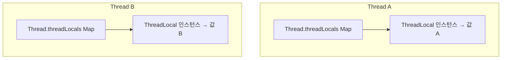

# ThreadLocal

## 핵심 정의
`ThreadLocal<T>`은 같은 변수를 여러 스레드가 공유하지 않고 스레드마다 독립된 값을 갖도록 해주는 클래스다. 각 스레드는 독립된 바인딩을 갖는다. 값 객체 자체를 자동 복사하지 않으므로 같은 가변 객체를 여러 스레드에 넣으면 그 객체는 별도 동기화가 필요하다. 대표적으로 요청 단위 컨텍스트 전파(사용자 인증 정보, 트랜잭션, 로그 추적 ID)에 널리 쓰인다.

`ScopedValue`는 Java 20 인큐베이터, Java 21~24 프리뷰를 거쳐 Java 25(JEP 506)에서 정식화되었으며, 가상 스레드 환경에서 `ThreadLocal`의 일부 문제(가변성, 상속 비용, 메모리 누수)를 개선한 대안으로 제시되고 있다.

## 동작 원리 / 구조



`ThreadLocal`의 값은 `ThreadLocal` 객체 자체가 아니라 **각 `Thread` 객체 내부의 `ThreadLocalMap`**에 저장된다. 이 맵의 키가 `ThreadLocal` 인스턴스(정확히는 그 인스턴스를 가리키는 약한 참조, `WeakReference`)이고 값이 실제 데이터다.

```java
public class RequestContext {
    private static final ThreadLocal<String> traceId = new ThreadLocal<>();

    public static void set(String id) { traceId.set(id); }
    public static String get() { return traceId.get(); }
    public static void clear() { traceId.remove(); } // 반드시 필요
}
```

- `set(value)`: 현재 스레드의 `ThreadLocalMap`에 `(this, value)`를 저장.
- `get()`: 현재 스레드의 맵에서 값을 조회, 없으면 `initialValue()`(기본 null) 반환.
- `remove()`: 현재 스레드의 맵에서 항목 제거.

`InheritableThreadLocal`은 부모 스레드의 값을 자식 스레드 생성 시점에 복사해 전파한다는 점에서 다르며, 스레드 풀 환경에서는 스레드가 재사용되므로 부모-자식 관계가 요청마다 형성되지 않아 기대한 대로 동작하지 않을 수 있다.

## 실무 관점
- **메모리 누수(memory leak)의 대표 원인**이다. `ThreadLocalMap`의 키는 약한 참조라 `ThreadLocal` 객체 자체는 GC될 수 있지만, 값(value)은 강한 참조로 남아있다. 스레드 풀처럼 스레드가 반영구적으로 재사용되는 환경에서 `remove()`를 호출하지 않으면, 키가 사라진 뒤에도(`null` 키) 값 객체가 다음 정리 기회나 스레드 종료까지 남을 수 있다. `try-finally`로 `remove()`를 강제하는 습관이 필수다.
  ```java
  traceId.set(id);
  try {
      // 요청 처리
  } finally {
      traceId.remove();
  }
  ```
- Spring MVC의 `RequestContextHolder`, MDC(Mapped Diagnostic Context, 로깅 프레임워크의 추적 ID 저장소)가 `ThreadLocal` 기반으로 구현되어 있다. 비동기 처리(`@Async`, 별도 스레드 풀로 작업 위임)로 넘어가면 원래 요청 스레드의 `ThreadLocal` 값이 새 스레드에 자동으로 전파되지 않아, 로그에 추적 ID가 빠지는 문제가 흔히 발생한다. `TaskDecorator`나 명시적 값 복사로 해결한다.
- 가상 스레드 환경에서는 `ThreadLocal`을 많은 가상 스레드 각각에 값을 설정하면, 각 가상 스레드가 독립된 `ThreadLocalMap`을 갖는 구조상 메모리 사용량이 커질 수 있다. `ScopedValue`는 바인딩을 스코프 동안 고정하고 스코프 종료 시 자동 해제되어 이 문제를 구조적으로 줄인다.
- `ThreadLocal`은 전역 상태처럼 코드 여러 곳에서 암묵적으로 값을 주고받게 만들어, 데이터 흐름이 메서드 시그니처에 드러나지 않는 단점이 있다. 테스트하기 어렵고, 값을 언제 설정/해제하는지 추적하기 힘든 코드가 되기 쉬워 남용을 경계해야 한다.
- `SimpleDateFormat`처럼 스레드 안전하지 않은 클래스를 스레드마다 하나씩 캐싱해 재사용하는 용도로도 쓰였으나, 현재는 스레드 안전한 `DateTimeFormatter`(java.time) 사용이 권장되므로 이 용도의 필요성은 줄었다.

### 중첩 호출에서는 정리보다 이전 문맥 복원이 먼저다
위 `set`/`finally remove` 예제는 그 경계가 값의 수명을 소유할 때 적절하다. 이미 값이 있는 스레드에서 중첩 호출이 같은 키를 바꾼 뒤 무조건 `remove()`하면 바깥 호출의 문맥도 사라진다. 작업 데코레이터가 `CallerRunsPolicy`로 호출 스레드에서 실행되는 경우에도 같은 문제가 생길 수 있다.

```java
// 기본 초기값 null, null은 문맥 없음이라는 애플리케이션 규칙
String previous = traceId.get();
traceId.set(id);
try {
    // 중첩 작업
} finally {
    if (previous == null) traceId.remove();
    else traceId.set(previous);
}
```

`get()` 자체가 초기화를 수행하며, `set(null)`과 `remove()`는 다르다. null도 유효 값이거나 `withInitial`의 초기화 상태까지 보존해야 한다면 이 예제를 일반화하지 말고 명시적인 문맥 스택·래퍼의 수명 규칙을 둔다. 읽기 전용 호출 문맥은 중첩 종료 시 복원이 내장된 [[ScopedValue]]도 선택지다.

## 심화 Q&A

### Q. `ThreadLocalMap`의 키가 약한 참조(WeakReference)인데도 메모리 누수가 발생하는 이유는?
키(`ThreadLocal` 인스턴스)는 약한 참조이므로 외부에서 그 `ThreadLocal`을 더 이상 참조하지 않으면 GC 대상이 되어 다음 GC 때 회수될 수 있다. 하지만 그 키에 매핑된 **값(value)은 강한 참조**로 `ThreadLocalMap` 안에 남아있다. 키가 `null`이 되어도 즉시 청소되지 않으며, 이후 같은 스레드의 `get()`/`set()`/`remove()`가 실행하는 일부 탐색·정리 경로에서 stale entry가 제거될 수 있다. 다른 ThreadLocal 접근 중에도 정리될 수 있지만 매 접근마다 전체 청소를 보장하지 않으므로, 정리 기회를 만나지 못한 값은 스레드 종료까지 남을 수 있다. 키에 접근할 수 있을 때 값의 수명을 소유한 경계에서 명시적으로 `remove()`해야 한다. 스레드 풀에서 스레드가 반영구적으로 살아있으면 이런 잔존 값이 누적되어 누수로 이어질 수 있다.

### Q. `InheritableThreadLocal`을 스레드 풀 환경에서 쓰면 왜 기대와 다르게 동작하는가?
`InheritableThreadLocal`은 자식 스레드가 **생성되는 시점**에 부모 스레드의 값을 복사한다. 스레드 풀의 워커 스레드는 보통 작업 제출에 따라 지연 생성되거나 명시적으로 미리 시작되며, 이후 요청마다 재사용될 뿐 새로 생성되지 않는다. 따라서 요청을 처리하는 스레드(부모, 예: 톰캣 워커)가 바뀔 때마다 그 값을 풀의 워커 스레드가 새로 상속받는 것이 아니라, 풀의 워커 스레드가 최초 생성될 때 상속받은 값(혹은 null)이 계속 유지되어 요청 간 값이 뒤섞이거나 예상과 다른 값을 보게 된다.

### Q. `ThreadLocal`과 `ScopedValue`(JEP 506)의 근본적인 설계 차이는 무엇인가?
`ThreadLocal`은 언제든 `set()`으로 값을 변경할 수 있는 가변(mutable) 상태이고, 값의 생명주기가 명시적인 `remove()` 호출에 의존한다. `ScopedValue`는 `ScopedValue.where(key, value).run(...)` 형태로 특정 코드 블록(동적 스코프) 동안 참조 바인딩이 유지되며, 그 블록을 벗어나면 자동으로 바인딩이 해제된다. 이 덕분에 값의 생명주기가 코드 구조와 일치해 바인딩 정리 누락을 줄인다. 값 객체의 깊은 불변성을 강제하거나 다른 곳에 저장한 참조까지 회수하는 것은 아니다. 자식 스레드 전파는 임의 Thread/Executor 전체가 아니라 StructuredTaskScope의 구조화된 경로에서 지원된다. `ScopedValue`는 중첩 범위에서 새 값에 재바인딩할 수 있고, 그 범위가 끝나면 바깥 값이 복원된다. 호출자의 값을 영구 갱신하는 용도로는 적합하지 않다. 자세한 계약과 예제는 [[ScopedValue]]를 참고한다.

### Q. 비동기 작업으로 위임된 스레드에서 `ThreadLocal` 값이 사라지는 문제를 어떻게 해결하는가?
근본적으로 `ThreadLocal`은 스레드 경계를 자동으로 넘지 못하므로, 작업을 다른 스레드로 위임하기 직전에 필요한 값을 꺼내 캡처하고, 새 스레드에서 작업을 시작하기 전에 그 값을 다시 `set()`해주는 명시적 전파가 필요하다. Spring의 `TaskDecorator`를 `ThreadPoolTaskExecutor`에 등록하면 작업 제출 시점의 `ThreadLocal`/MDC 값을 캡처해 실행 시점에 복원하고 종료 후 정리하는 로직을 표준화할 수 있다. 완전히 다른 접근으로는 애플리케이션 컨텍스트를 `ThreadLocal` 대신 메서드 인자나 `Reactor Context`(리액티브 스트림) 같은 명시적 전달 방식으로 바꾸는 것도 고려된다.

### Q. 같은 `ThreadLocal` 인스턴스를 여러 스레드가 `get()`으로 동시에 호출해도 동기화가 필요 없는 이유는?
각 스레드는 자신의 `Thread` 객체 안에 독립된 `ThreadLocalMap`을 갖고 있고, `get()`/`set()`은 항상 "현재 실행 중인 스레드"의 맵에만 접근한다. 즉 여러 스레드가 물리적으로 같은 `ThreadLocal` 객체를 참조하더라도 바인딩 저장소는 스레드별로 분리된다. 그러나 두 바인딩이 동일한 가변 객체를 가리키면 그 객체에는 경쟁이 생길 수 있다. 이것이 락 없이도 스레드 안전성을 얻는 `ThreadLocal`의 핵심 원리다.

## 관련 개념
- [[volatile과 가시성]]
- [[가상 스레드]]
- [[ScopedValue]]
- [[스레드 생명주기와 상태]]

## 참고 자료

확인 날짜: 2026-09-08. 아래 버전과 범위의 공식 문서·소스로 본문을 대조했다. 성능 비교와 운영 선택은 워크로드에 따라 달라지는 판단 기준이다.

- [Java SE 25 ThreadLocal](https://docs.oracle.com/en/java/javase/25/docs/api/java.base/java/lang/ThreadLocal.html) — 바인딩·initialValue·remove.
- [OpenJDK jdk-25-ga ThreadLocal](https://raw.githubusercontent.com/openjdk/jdk/jdk-25-ga/src/java.base/share/classes/java/lang/ThreadLocal.java) — 약한 키·강한 값·stale 정리.
- [Java SE 25 ScopedValue](https://docs.oracle.com/en/java/javase/25/docs/api/java.base/java/lang/ScopedValue.html) — 동적 바인딩·재바인딩·구조화된 상속.
- [JEP 506](https://openjdk.org/jeps/506) — 버전 이력·Java 25 정식화.

부분 재검증: 2026-09-22. 아래 확인 범위에 한하며 노트 전체의 기존 verified는 유지한다.

- [Java SE 27 ScopedValue](https://docs.oracle.com/en/java/javase/27/docs/api/java.base/java/lang/ScopedValue.html) — 중첩 재바인딩과 예외 종료 시 복원, 일반 Thread의 비상속. 실행 예제로 확인했다.

부분 재검증: 2026-10-04. 아래 적용 버전·범위만 확인했으며 노트 전체의 기존 verified는 유지한다.

- [Java SE 25 ThreadLocal](https://docs.oracle.com/en/java/javase/25/docs/api/java.base/java/lang/ThreadLocal.html) — get의 초기화, set·remove와 재초기화. 중첩 복원 예제는 null을 문맥 없음으로 쓰는 애플리케이션에 한정한다.
- [Java SE 25 ThreadPoolExecutor.CallerRunsPolicy](https://docs.oracle.com/en/java/javase/25/docs/api/java.base/java/util/concurrent/ThreadPoolExecutor.CallerRunsPolicy.html) — 호출 스레드 실행 시 기존 문맥이 있을 수 있는 경계.
- [OpenJDK jdk-25-ga ThreadLocal](https://raw.githubusercontent.com/openjdk/jdk/jdk-25-ga/src/java.base/share/classes/java/lang/ThreadLocal.java) — getEntry의 빠른 반환과 getEntryAfterMiss·set·remove의 stale 정리 경로. 모든 접근이 전체 정리를 실행하는 것은 아니다.

실행 확인: Oracle JDK 25.0.4+7-LTS-189에서 중첩 문맥의 정상·예외 후 복원, CallerRuns 실행, set(null)과 remove의 재초기화 차이. 실행 검사는 위 부분 재검증 범위에 한한다.
