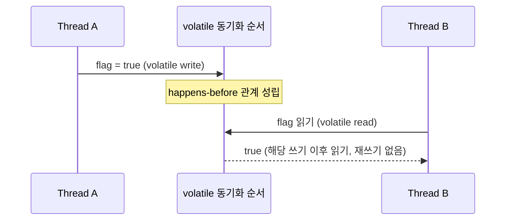

# volatile과 가시성

## 핵심 정의
`volatile`은 같은 변수의 쓰기와 이후 읽기 사이에 가시성·순서를 보장하는 키워드다. CPU 캐시를 우회해 매번 DRAM에 접근하거나 물리적으로 즉시 전파하라는 명령은 아니다. 자바 메모리 모델(Java Memory Model, JMM) 관점에서는 `volatile` 쓰기가 happens-before 관계를 형성해 가시성(visibility)과 명령어 재정렬(instruction reordering)에 제약을 주고, 단일 volatile 읽기·쓰기의 원자성(atomicity)은 보장하지만 `++` 같은 복합 연산은 원자적으로 만들지 않는다.

즉 `volatile`은 "값을 최신으로 보이게" 하는 도구이지 "동시에 하나만 접근하게" 하는 도구가 아니다. 이 차이를 혼동하면 여전히 경쟁 상태(race condition)가 발생한다.

## 동작 원리 / 구조



일반 변수는 스레드마다 로컬 캐시(CPU 캐시, 레지스터)에 값을 복사해두고 사용할 수 있어, 한 스레드의 변경이 다른 스레드에 언제 보일지 보장이 없다. `volatile`은 다음을 강제한다.

1. **쓰기와 읽기**: volatile 접근은 동기화 순서에 참여하고, 쓰기는 같은 변수의 이후 읽기에 happens-before를 만든다.
2. **주변 상태 공개**: 쓰기 이전 일반 필드 변경도 그 쓰기 이후 읽기를 거친 코드에 보이도록 제약한다.
3. **구현**: JIT과 CPU는 이 계약을 만족하는 배리어·캐시 일관성 연산을 사용한다. 모든 앞뒤 명령 재정렬을 일률적으로 금지하는 것은 아니다.

```java
private volatile boolean running = true;

// Thread A
void stop() { running = false; }

// Thread B
void loop() {
    while (running) {
        // 작업 수행
    }
}
```

이 예시에서 `running`이 `volatile`이 아니면 JIT 컴파일러가 `while (running)`을 `while (true)`로 최적화해버려(값이 바뀌지 않는다고 가정) Thread B가 영원히 루프를 빠져나오지 못하는 실제 장애가 발생할 수 있다.

반면 다음은 여전히 안전하지 않다.

```java
private volatile int count = 0;
void increment() { count++; } // read-modify-write, 원자적이지 않음
```

`count++`은 "읽기 → 증가 → 쓰기" 세 단계로 이루어지므로 두 스레드가 동시에 실행하면 값 손실(lost update)이 발생한다. `volatile`은 가시성만 보장할 뿐 복합 연산의 원자성은 보장하지 않기 때문이다.

## 실무 관점
- 플래그성 변수(종료 신호, 상태 전환 신호)처럼 "단순 읽기/쓰기"만 하는 경우에 `volatile`이 적합하다. 값 증가, 조건부 갱신처럼 read-modify-write가 필요하면 `AtomicInteger` 등 원자적 클래스나 락을 써야 한다.
- 더블 체크 락킹(double-checked locking) 패턴에서 인스턴스 필드에 `volatile`을 빼먹으면, 생성자가 완전히 끝나기 전에 참조가 다른 스레드에 보여 초기화되지 않은 객체를 사용하는 미묘한 버그가 생긴다.
  ```java
  private volatile static Singleton instance;
  static Singleton getInstance() {
      if (instance == null) {
          synchronized (Singleton.class) {
              if (instance == null) {
                  instance = new Singleton(); // volatile 없으면 재정렬로 부분 초기화 객체 노출 가능
              }
          }
      }
      return instance;
  }
  ```
- `volatile` 접근을 구현하는 명령과 메모리 배리어(memory barrier) 비용은 CPU·JIT·읽기/쓰기 종류에 따라 다르다. 캐시 라인(cache line) 경합이 심한 환경에서는 처리량에 눈에 띄는 영향을 줄 수 있어, 정말 여러 스레드가 공유해야 하는 변수에만 선택적으로 적용한다.
- `long`, `double`은 JVM 스펙상 원자적 쓰기가 보장되지 않을 수 있는데(non-atomic treatment of double and long, 32비트 두 조각으로 쓰일 가능성), `volatile`을 붙이면 이 문제도 함께 해결된다. 최신 64비트 JVM에서는 실제로 문제가 드물지만 스펙상 보장은 `volatile`이 필요하다.
- `volatile` 배열 필드는 참조 교체를 통한 공개를 보장하지만, 공개 후 요소를 수정하는 연산을 volatile 접근으로 바꾸지는 않는다. 요소 단위 가시성이 필요하면 `AtomicReferenceArray` 같은 클래스를 고려한다.

## 심화 Q&A

### Q. `volatile`이 happens-before 관계를 만든다는 것이 실제로 어떤 순서 보장을 의미하는가?
JMM에서 `volatile` 변수에 대한 쓰기는 그 이후에 같은 변수를 읽는 모든 스레드에 대해 happens-before 관계를 형성한다. 이는 단순히 그 변수 값만 보이는 게 아니라, 쓰기 이전에 해당 스레드가 수행한 다른 모든 일반 변수의 쓰기까지 함께 보이도록 보장한다는 뜻이다. 즉 `volatile` 쓰기는 그 지점까지의 모든 메모리 작업에 대한 "동기화 지점" 역할을 한다. 이 성질 때문에 `volatile` 플래그 하나로 그 이전에 준비해둔 다른 상태를 안전하게 다른 스레드에 공개(safe publication)할 수 있다.

### Q. `volatile`과 `synchronized`가 둘 다 가시성을 보장하는데 비용은 어떻게 비교하는가?
`synchronized`는 가시성뿐 아니라 상호 배제까지 제공하므로 락 소유권과 경합 시 대기를 다룬다. `volatile` 접근은 락 소유권을 관리하지 않지만 재정렬 제약과 캐시 일관성 트래픽 비용이 있다. 실제 명령·배리어는 CPU와 JIT에 따라 달라지고 락 자체가 최적화로 제거될 수도 있어 항상 어느 쪽이 더 빠르다고 단정하지 않는다. 우선 필요한 원자성 범위를 선택한 뒤 같은 조건에서 비용을 측정한다.

### Q. `volatile` boolean 플래그로 스레드를 멈추는 패턴이 `Thread.interrupt()`보다 나은 경우와 나쁜 경우는?
`volatile` 플래그는 블로킹 없는 루프(polling loop)에서 협조적으로 종료 신호를 줄 때 직관적이고 가볍다. 하지만 스레드가 `sleep()`, `wait()`, I/O 등으로 블로킹되어 있으면 플래그를 아무리 바꿔도 다음 루프 검사 시점까지 반응하지 않는다. 이런 경우엔 `interrupt()`를 사용해 `InterruptedException`을 던지게 하거나 블로킹 API 자체가 인터럽트에 반응하도록 설계해야 종료 요청에 반응할 수 있다. 모든 블로킹 IO가 인터럽트를 지원하거나 즉시 종료된다고 가정하지 않는다.

### Q. `volatile` 필드를 가진 객체의 참조를 다른 스레드에 넘겼다고 해서 그 객체 내부의 모든 필드가 안전하게 보이는가?
아니다. `volatile`은 해당 필드 자체의 읽기/쓰기에만 happens-before를 적용한다. 다만 객체 참조가 담긴 필드가 `volatile`이고, 그 객체가 완전히 생성된 이후(생성자 종료 후)에 그 참조를 `volatile` 필드에 대입했다면, 대입 시점의 happens-before 규칙 덕분에 그 객체의 필드들(대입 이전에 쓰인 것들)까지 함께 안전하게 공개된다. 하지만 참조를 넘긴 이후 그 객체의 내부 필드를 다시 변경한다면, 그 필드가 별도로 `volatile`이거나 다른 동기화 수단으로 보호되지 않는 한 가시성이 보장되지 않는다.

### Q. CPU 캐시 일관성 프로토콜(MESI 등)이 있는데 왜 애플리케이션 코드에서 `volatile`이 따로 필요한가?
하드웨어의 캐시 일관성 프로토콜은 캐시 간 데이터 일관성을 보장하지만, 컴파일러와 JIT은 성능을 위해 메모리 접근 순서를 재정렬하거나 변수를 레지스터에 캐싱해 메모리 접근 자체를 생략할 수 있다. `volatile`은 하드웨어 캐시 문제를 해결하는 것이 아니라, 컴파일러/JIT 최적화가 메모리 가시성 규약을 깨지 않도록 재정렬을 막고 매번 실제 메모리(또는 캐시 일관성 프로토콜)를 거치도록 강제하는 소프트웨어 계약이다.

### Q. volatile 배열을 한 번 대입한 뒤 원소만 바꾸면 다른 스레드에 공개되는가?
A. 배열을 채운 뒤 volatile 참조에 대입하고, 소비자가 그 참조를 읽으면 대입 이전의 원소 초기화는 함께 공개된다. 그러나 이후의 `array[0] = value`는 일반 쓰기다. 초기 공개와 후속 변경을 구분하고, 원소를 계속 갱신하려면 원자적 배열이나 동일 락을 사용한다. 여러 원소를 묶은 스냅샷이 필요하면 배열을 복사해 새 참조를 공개한다.

### Q. 루프 안에 sleep을 넣으면 일반 boolean 종료 플래그도 결국 보이는가?
A. JLS 25 §17.3은 `sleep()`과 `yield()`에 동기화 효과가 없다고 명시한다. CPU를 양보하거나 시간을 충분히 기다려도 happens-before를 대신하지 못한다. volatile 또는 인터럽트 등 명시적인 종료 프로토콜을 사용한다.

## 관련 개념
- [[synchronized와 Lock]]
- [[ThreadLocal]]
- [[데드락과 경쟁 상태]]
- [[Java Memory Model과 happens-before]]

## 참고 자료

확인 날짜: 2026-09-08. 아래 버전과 범위의 공식 문서·소스로 본문을 대조했다. 성능 비교와 운영 선택은 워크로드에 따라 달라지는 판단 기준이다.

- [JLS 25 §17.4·17.7](https://docs.oracle.com/javase/specs/jls/se25/html/jls-17.html) — 동기화 순서·가시성·long/double 단일 접근 원자성.
- [Java SE 25 Thread](https://docs.oracle.com/en/java/javase/25/docs/api/java.base/java/lang/Thread.html) — interrupt와 블로킹 API별 반응.

### 2026-09-23 부분 재검증

JLS 25 §17.3–17.4의 sleep/yield와 volatile 공개 경계, 배열 요소와 참조 변수의 구분을 다시 확인했다. 기존 전체 검증일은 유지한다.
