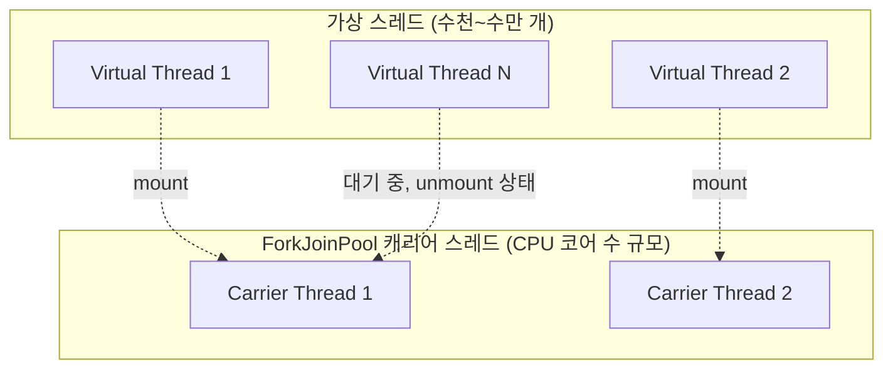

# 가상 스레드

## 핵심 정의
가상 스레드(virtual thread)는 JDK(Project Loom)가 관리하는 경량 스레드로, OS 스레드(플랫폼 스레드, platform thread)에 직접 매핑되지 않고 소수의 플랫폼 스레드(캐리어 스레드, carrier thread) 위에서 다대다(M:N)로 스케줄링된다. JEP 444로 Java 21에서 정식 기능(finalized)이 되었으며, 스레드당 요청(thread-per-request) 스타일의 단순한 블로킹 코드를 그대로 유지하면서도 수만~수십만 개의 동시 작업을 적은 리소스로 처리할 수 있게 해준다.

기존 Thread API를 제공하는 `java.lang.Thread`의 인스턴스이므로, 기존 코드/라이브러리/디버거/프로파일러가 별도 수정 없이 대부분 그대로 동작한다는 것이 핵심 설계 목표다.

## 동작 원리 / 구조



- 가상 스레드가 실행되려면 캐리어 스레드에 **마운트(mount)**되어야 하며, 언마운트를 지원하는 블로킹 지점(소켓 IO 대기 등)에 도달하면 캐리어 스레드에서 **언마운트(unmount)**되어 캐리어 스레드를 다른 가상 스레드에 양보한다.
- 언마운트된 가상 스레드의 실행 상태(스택 등)는 힙 메모리에 보관되며, 블로킹이 끝나면 다시 어떤 캐리어 스레드에든 마운트되어 이어서 실행된다.
- 캐리어 스레드 풀은 기본적으로 `ForkJoinPool`(work-stealing 방식)이며, 목표 병렬성은 기본적으로 `Runtime.getRuntime().availableProcessors()`에 대응한다. 이는 commonPool과 별도의 FIFO 모드 ForkJoinPool이며 일부 캐리어 점유형 블로킹에는 임시 보상 확장이 가능하다.
- **핀닝(pinning)**: 가상 스레드가 언마운트되지 못하고 캐리어 스레드를 계속 점유하는 상황. 전통적으로 `synchronized` 블록 내부에서 블로킹 호출을 하거나 네이티브 메서드 호출 중일 때 발생했다. JDK 24(JEP 491)에서 `synchronized` 관련 핀닝 문제가 크게 개선되어, JVM이 모니터를 캐리어 스레드와 독립적으로 획득/보유/해제할 수 있게 되었고 이 개선은 Java 25 LTS에도 반영되어 있다.

```java
// 작업당 가상 스레드 하나를 생성하는 ExecutorService
try (var executor = Executors.newVirtualThreadPerTaskExecutor()) {
    for (int i = 0; i < 100_000; i++) {
        executor.submit(() -> {
            // 일반적인 소켓 IO 대기는 언마운트 가능; 하류 동시성 한도는 별도 제어
            callExternalApi();
            return null;
        });
    }
} // AutoCloseable: 블록 종료 시 자동으로 모든 작업 완료 대기 후 종료
```

## 실무 관점
- I/O 바운드(외부 API 호출, DB 쿼리, 파일 처리처럼 대기 시간이 긴) 워크로드에서 효과가 크다. 스레드 하나당 요청 하나를 할당하는 단순한 프로그래밍 모델을 유지하면서도, 기존 플랫폼 스레드 풀 방식보다 훨씬 많은 동시 요청을 적은 메모리로 처리할 수 있다.
- CPU 바운드(순수 연산 위주) 작업에는 이점이 없다. 가상 스레드는 스레드 생성/컨텍스트 전환 비용을 줄여줄 뿐 CPU 코어 자체를 늘려주지 않으므로, 연산량이 많은 작업은 여전히 플랫폼 스레드 기반의 크기 제한된 풀로 처리하는 것이 적절하다.
- **가상 스레드는 절대 풀링(pooling)하지 않는다.** 생성 비용이 매우 낮게 설계되어 있으므로 필요할 때마다 생성해서 쓰고 버리면 되며, 고정 크기 풀에 가둬버리면 오히려 동시성 이점을 스스로 제한하는 결과가 된다.
- `synchronized` 블록 안에서 블로킹 I/O를 호출하는 레거시 코드는 JDK 24 이전 버전에서는 핀닝을 유발해 캐리어 스레드를 묶어버릴 수 있었다. 오래된 라이브러리나 `synchronized` 기반 커넥션 풀 클라이언트를 가상 스레드와 함께 쓸 때는 실행 중인 JDK 버전의 핀닝 개선 여부를 확인해야 한다.
- `ThreadLocal`을 가상 스레드에서 대량으로 쓰면 스레드 수만큼 `ThreadLocalMap` 인스턴스가 생겨 메모리 사용량이 커질 수 있다. Java 25에서 정식화된 `ScopedValue`(JEP 506)가 불변 값 전파에 더 적합한 대안으로 제시된다.
- 가상 스레드로 전환한다고 해서 하류 자원(DB 커넥션 풀, 외부 서비스의 동시 접속 제한)의 용량 제약이 사라지는 것은 아니다. 요청을 받는 쪽의 동시성은 늘어나도 DB 커넥션 풀 크기가 그대로면 병목이 애플리케이션 스레드에서 커넥션 풀 대기로 옮겨갈 뿐이다.
- 구조화된 동시성(structured concurrency, `StructuredTaskScope`)은 Java 27에서도 JEP 533의 일곱 번째 프리뷰(preview)다. Java 25에서 정식화된 [[ScopedValue]]와 상태가 다르며, 이전 프리뷰의 예제를 다른 JDK에서 그대로 컴파일할 수 있다고 가정하지 않는다. 운영 도입 시 프리뷰 활성화와 배포 JDK 고정, 변경 가능한 API의 유지보수 비용을 판단한다.

가상 스레드는 항상 데몬이고 우선순위는 NORM_PRIORITY로 고정된다. 따라서 main이 끝날 때 가상 스레드 작업이 남았다는 이유만으로 JVM이 유지되지 않는다. 예제의 ExecutorService.close()처럼 완료를 명시적으로 기다려야 한다. 제출한 Future의 예외를 close()가 대신 전파하지는 않으므로 결과/실패를 수집하는 코드도 필요하다.

### 실행 중 동시성과 대기 중 요청 수를 나눠 제한한다
가상 스레드 안에서 `Semaphore.acquire()`를 호출하면 하류 동시 사용 수는 제한할 수 있다. 하지만 이미 생성되어 허가증을 기다리는 가상 스레드와 요청 객체의 수까지 제한하지는 않는다. 유입이 계속 처리량을 넘으면 대기는 힙의 요청·스택·문맥 보유로 남는다. 진입 단계의 거부·제한 시간·전체 진행 중 요청 상한을 함께 설계한다.

허가증을 제출 전에 획득하면 수락한 작업 수를 제한할 수 있지만 제출 스레드를 대기시킨다. 이벤트 루프에서는 무제한 acquire 대신 거부 가능한 진입 정책을 사용하고, 제출 거부나 실행 전 취소에도 허가증이 누수되지 않게 한다. 허가증을 반환하는 정확한 시점은 [[Semaphore와 CountDownLatch와 CyclicBarrier#비동기 작업에서는 실제 자원 사용 수명에 맞춰 반환한다]]를 참고한다.

## 심화 Q&A

### Q. 가상 스레드가 블로킹 I/O를 만나면 어떻게 캐리어 스레드를 반환하는가?
JDK의 일반적인 소켓 IO와 java.util.concurrent 대기는 가상 스레드 상태를 저장하고 언마운트하도록 구현되었다. 그러나 파일 시스템 IO 등 모든 블로킹 API가 언마운트하는 것은 아니며 일부 경로는 캐리어를 점유하고 스케줄러가 보상 확장을 할 수 있다. 캐리어 스레드는 즉시 다른 대기 중인 가상 스레드를 마운트해 실행을 이어간다. I/O가 완료되면 스케줄러가 해당 가상 스레드를 다시 실행 가능한 캐리어 스레드에 마운트한다. 이 과정이 애플리케이션 코드에는 완전히 투명해서, 개발자는 평소처럼 블로킹 코드를 작성하면 된다.

### Q. 핀닝(pinning)이 발생하면 왜 문제가 되며, JDK 24/25의 개선이 이를 어떻게 해결했는가?
핀닝이 발생하면 가상 스레드가 블로킹 상태여도 캐리어 스레드를 반환하지 않아, 그 캐리어 스레드는 다른 가상 스레드를 실행할 수 없게 묶인다. 캐리어 스레드 수는 보통 CPU 코어 수 수준으로 적기 때문에, 여러 가상 스레드가 동시에 핀닝되면 사실상 플랫폼 스레드 풀과 다를 바 없는 낮은 동시성으로 퇴화한다. JDK 24의 JEP 491은 `synchronized` 블록/메서드 안에서의 블로킹이 핀닝을 유발하던 주요 원인을 없애, JVM이 모니터 락을 캐리어 스레드와 독립적으로 관리할 수 있게 했다. 다만 네이티브/외부 함수에서 Java로 콜백한 뒤 블로킹하는 경로 등 핀닝 요인은 남는다. 일반적인 Object.wait는 JEP 491에서 언마운트하도록 개선되었다.  JFR(JDK Flight Recorder)의 핀닝 이벤트로 모니터링하는 것이 권장된다.

### Q. 가상 스레드를 도입했는데도 처리량이 기대만큼 늘지 않는다면 무엇을 의심해야 하는가?
가장 흔한 원인은 병목이 애플리케이션 스레드가 아니라 하류 자원에 있는 경우다. DB 커넥션 풀, 외부 API의 동시 연결 제한, 파일 디스크립터 한도처럼 가상 스레드 도입과 무관하게 존재하는 용량 제약이 그대로 남아있으면, 애플리케이션 계층의 동시성만 높아지고 실제 처리량은 그 하류 자원의 한계에서 막힌다. 또한 CPU 바운드 연산이 섞여 있으면 가상 스레드 수를 아무리 늘려도 실제 실행 가능한 CPU 코어 수 이상으로는 병렬 처리가 불가능하다는 점도 확인해야 한다.

### Q. 가상 스레드 환경에서 `synchronized` 대신 `ReentrantLock`을 권장하는 경우가 있는데, 근거가 여전히 유효한가?
JDK 24 이전에는 `synchronized` 블록 내부에서의 블로킹이 핀닝을 유발했기 때문에, 가상 스레드와 함께 쓸 코드에서는 `ReentrantLock`(park 기반이라 핀닝을 유발하지 않음)으로 전환하는 것이 일반적인 권고였다. JDK 24의 JEP 491 이후로는 이 근거가 상당 부분 약화되었지만, 애플리케이션이 여전히 더 낮은 버전의 JDK를 지원해야 하거나, 이미 `synchronized`가 아닌 락으로 통일된 코드베이스라면 굳이 되돌릴 필요는 없다. 실행 환경의 JDK 버전을 먼저 확인하고 판단하는 것이 정확하다.

### Q. 가상 스레드가 `Thread`를 상속한다는 사실이 기존 코드와의 호환성에 어떤 의미를 갖는가?
가상 스레드도 `Thread.currentThread()`, 스택 트레이스, `ThreadLocal`, 인터럽트(interrupt) 처리 등 기존 `Thread` API를 동일하게 지원하므로, 기존에 플랫폼 스레드를 가정하고 작성된 코드 대부분이 별도 수정 없이 가상 스레드 위에서도 동작한다. 다만 `Thread.isVirtual()`로 가상/플랫폼 스레드를 구분할 수 있고, 스레드 우선순위 설정이나 스레드 그룹(ThreadGroup) 같은 일부 저수준 API는 가상 스레드에 대해 의미가 없거나 무시되므로, 이런 API에 의존하던 코드는 별도 확인이 필요하다.

### Q. 구조화된 동시성(structured concurrency)이 가상 스레드와 함께 필요한 이유는 무엇인가?
가상 스레드는 스레드를 저렴하게 대량 생성할 수 있게 해주지만, 그 자체로는 여러 스레드 간의 생명주기(하나가 실패하면 나머지를 취소하는 것, 부모 작업이 끝나기 전 자식 작업이 모두 끝나도록 보장하는 것)를 관리해주지 않는다. `StructuredTaskScope`는 여러 하위 작업(subtask)을 하나의 스코프로 묶어, 스코프 종료 시 미완료 작업에 취소를 요청하고 실제 종료를 기다리며 예외 전파와 취소를 일관되게 처리한다. 가상 스레드가 스레드 생성 비용 문제를 해결한다면, 구조화된 동시성은 스레드 누수(leak)와 예외 무시 문제를 해결하는 역할을 한다는 점에서 상호 보완적이다.

## 관련 개념
- [[ExecutorService와 스레드 풀]]
- [[ThreadLocal]]
- [[ScopedValue]]
- [[인터럽트와 작업 취소]]
- [[스레드 생명주기와 상태]]
- [[CompletableFuture]]

## 참고 자료

확인 날짜: 2026-09-08. 아래 버전과 범위의 공식 문서·소스로 본문을 대조했다. 성능 비교와 운영 선택은 워크로드에 따라 달라지는 판단 기준이다.

- [JEP 444](https://openjdk.org/jeps/444) — Java 21 스케줄러·스택·지원 IO와 캐리어 점유.
- [JEP 491](https://openjdk.org/jeps/491) — Java 24 synchronized·Object.wait 언마운트 및 잔여 pinning.
- [JEP 506](https://openjdk.org/jeps/506) — Java 25 ScopedValue.
- [JEP 505](https://openjdk.org/jeps/505) — Java 25 StructuredTaskScope 프리뷰·Joiner·취소.
- [Java SE 25 Thread](https://docs.oracle.com/en/java/javase/25/docs/api/java.base/java/lang/Thread.html) — daemon·priority·isVirtual 계약.

부분 재검증: 2026-09-22. 아래 확인 범위에 한하며 노트 전체의 기존 verified는 유지한다.

- [Java SE 27 Preview API 목록](https://docs.oracle.com/en/java/javase/27/docs/api/preview-list.html) — JEP 533 Structured Concurrency의 일곱 번째 프리뷰 상태. 가상 스레드의 기존 JDK 21/24 pinning 설명을 새 버전으로 일괄 변경한 것은 아니다.

부분 재검증: 2026-10-04. 아래 적용 버전·범위만 확인했으며 노트 전체의 기존 verified는 유지한다.

- [JEP 444](https://openjdk.org/jeps/444) — Java 21 가상 스레드 풀링 대신 Semaphore로 하류 동시성 제한, 가상 스레드의 힙 스택. 기존 핀닝 설명 전체를 다시 검증한 것은 아니다.
- [Java SE 25 Semaphore](https://docs.oracle.com/en/java/javase/25/docs/api/java.base/java/util/concurrent/Semaphore.html)와 [ExecutorService](https://docs.oracle.com/en/java/javase/25/docs/api/java.base/java/util/concurrent/ExecutorService.html) — acquire 대기·tryAcquire·제출 거부 계약. 대기 중 요청 수와 실행 중 자원 사용 수를 분리하는 운영 판단의 근거.

실행 확인: Oracle JDK 25.0.4+7-LTS-189에서 허가증 없이 대기 중인 가상 스레드가 각각 살아 있는 점; 대규모 부하·메모리 사용량은 측정하지 않았다. 실행 검사는 위 부분 재검증 범위에 한한다.
