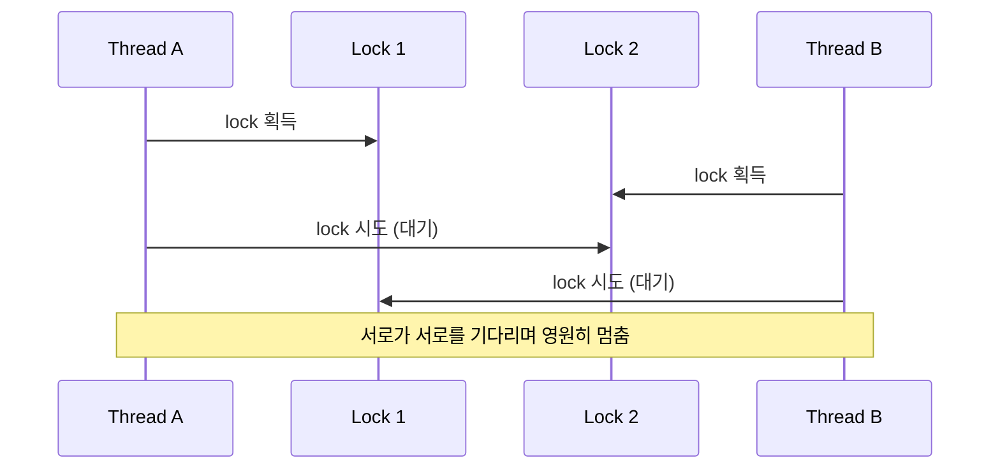

# 데드락과 경쟁 상태

## 핵심 정의
데드락(deadlock)은 작업이 필요한 자원을 서로 기다리거나 자신이 보유한 비재진입 자원을 다시 기다려 진행할 수 없는 상태다. 대표적으로 둘 이상의 스레드가 서로의 락을 기다리지만, `StampedLock`의 쓰기 락처럼 재진입을 지원하지 않는 락을 같은 스레드가 중복 획득하려는 자기 교착(self-deadlock)도 가능하다. 경쟁 상태(race condition)는 여러 스레드가 공유 자원에 동시에 접근할 때 실행 순서에 따라 결과가 달라져, 의도하지 않은(비결정적인) 결과가 나오는 상황이다. 둘 다 동시성 프로그램의 대표적인 결함 유형이지만, 데드락은 "멈춤"이고 경쟁 상태는 "잘못된 결과"라는 점에서 증상이 다르다.

## 동작 원리 / 구조

### 데드락의 4가지 필요 조건 (Coffman 조건)
아래 4가지가 모두 성립해야 데드락이 발생할 수 있으며, 하나라도 깨면 예방할 수 있다.

1. **상호 배제(mutual exclusion)**: 자원을 한 번에 하나의 스레드만 사용 가능.
2. **점유하며 대기(hold and wait)**: 자원을 쥔 채로 다른 자원을 추가로 기다림.
3. **비선점(no preemption)**: 다른 스레드가 강제로 자원을 뺏을 수 없음.
4. **순환 대기(circular wait)**: A는 B가 쥔 자원을, B는 A가 쥔 자원을 기다리는 순환 구조.



```java
// 전형적인 데드락 코드
void transfer(Account from, Account to, int amount) {
    synchronized (from) {
        synchronized (to) {
            from.debit(amount);
            to.credit(amount);
        }
    }
}
// transfer(A, B, 10)과 transfer(B, A, 5)를 동시에 호출하면
// 스레드1: A 락 획득 후 B 락 대기
// 스레드2: B 락 획득 후 A 락 대기 → 데드락
```

### 같은 실행기 안에서 종속 작업을 기다리는 경우
크기 1인 고정 풀에서 부모 작업이 `pool.submit(child).get()`을 호출하면 부모가 유일한 워커를 점유하고 자식은 큐에서 기다린다. 명시적 락이 없어도 진행할 수 없다. 크기 N인 풀도 N개의 부모가 모두 같은 행동을 하면 같은 구조가 된다. 무제한 큐를 쓴다면 `maximumPoolSize`만 올려도 자식 실행 스레드가 추가되지 않는다.

호출 그래프에서 어느 작업이 어느 실행 자원을 점유한 채 무엇을 기다리는지 확인한다. 불필요한 중첩 제출을 없애거나, 완료 콜백으로 연결해 부모 워커를 반환하거나, 부모와 자식의 실행 자원을 분리한다. 풀을 분리해도 DB 커넥션·허가증을 보유한 채 자식의 같은 자원 획득을 기다리면 순환 대기가 남는다. 가상 스레드로 바꾸는 것만으로 자원 순환이 해결되지는 않는다.

### 경쟁 상태
```java
private int count = 0;
void increment() { count++; } // 읽기-수정-쓰기 3단계, 원자적이지 않음
```
두 스레드가 동시에 `count++`을 실행하면 둘 다 같은 값을 읽은 뒤 각자 +1해서 저장할 수 있어, 두 번 증가해야 할 값이 한 번만 증가하는 값 손실(lost update)이 발생한다. 이는 `synchronized`나 `AtomicInteger`로 읽기-수정-쓰기를 원자적 단위로 묶어야 해결된다.

## 실무 관점
- 데드락을 근본적으로 예방하는 가장 실용적인 방법은 **락 순서 고정(lock ordering)**이다. 위 계좌 이체 예시라면 충돌 없는 계좌 ID처럼 안정적인 전역 순서로 잠그면 순환 대기 조건 자체가 성립하지 않는다. hashCode나 identityHashCode는 충돌할 수 있으므로 동률일 때의 전역 보조 락 등 별도 순서를 정해야 한다.
- `jstack` 또는 `kill -3`으로 얻은 스레드 덤프는 데드락이 감지되면 `"Found one Java-level deadlock"` 메시지와 함께 관련 스레드, 락, 대기 체인을 직접 출력해준다. 운영 중 애플리케이션이 특정 API에서만 멈춘다면 가장 먼저 확인해야 할 자료다.
- 경쟁 상태는 재현이 어렵다는 것이 가장 큰 실무적 어려움이다. 로컬 개발 환경에서는 스레드 스케줄링 타이밍이 맞지 않아 버그가 드러나지 않다가, 트래픽이 몰리는 운영 환경에서만 간헐적으로 나타나는 경우가 많다.
- 체크-후-행동(check-then-act) 패턴(`if (!map.containsKey(k)) map.put(k, v)`)은 대표적인 경쟁 상태 취약 패턴이다. `ConcurrentHashMap.computeIfAbsent()`처럼 확인과 행동을 원자적으로 묶은 API로 대체해야 한다.
- 데드락 회피 전략으로 `tryLock(timeout)`을 쓰는 방법도 있지만, 재시도 로직 없이 단순히 실패 처리만 하면 사용자에게 실패가 노출되므로 실패 반환·취소·제한된 재시도 중 요구에 맞게 정한다. 재시도가 항상 필요한 것은 아니며 중복 부수 효과와 전체 시간 예산을 고려한다.
- 라이브락(livelock)과 기아(starvation)도 함께 알아둬야 한다. 라이브락은 스레드들이 서로 양보만 하다 아무도 진행하지 못하는 상태(교착과 달리 상태는 계속 변함), 기아는 특정 스레드가 우선순위나 비공정 스케줄링 때문에 자원을 영원히 할당받지 못하는 상태다. 셋 다 증상이 "느려지거나 멈춘다"는 점에서 초기 진단 시 헷갈리기 쉽다.

## 심화 Q&A

### Q. 락 순서를 고정하는 것만으로 데드락을 예방할 수 있는 이유는 Coffman 조건 중 무엇을 깨는 것인가?
순환 대기(circular wait) 조건을 깬다. 모든 스레드가 항상 동일한 전역 순서(예: 객체의 고유 ID 오름차순)로 락을 획득하도록 강제하면, "A가 B를 기다리고 동시에 B가 A를 기다리는" 순환 구조 자체가 만들어질 수 없다. 나머지 세 조건(상호 배제, 점유 대기, 비선점)은 락 기반 동시성 제어의 본질적 특성이라 깨기 어려운 경우가 많아, 실무에서는 순환 대기를 제거하는 방식이 가장 적용하기 쉬운 예방책으로 쓰인다.

### Q. 스레드 덤프에서 데드락이 감지되지 않았는데도 애플리케이션이 멈춰있다면 무엇을 의심해야 하는가?
`jstack`의 데드락 감지는 주로 플랫폼 스레드의 모니터와 ownable synchronizer 소유·대기 순환을 탐지한다. 모든 Lock 구현체나 가상 스레드 대기를 탐지하는 것은 아니다. 스레드 풀 고갈(모든 워커가 다른 블로킹 작업 완료를 기다리며 대기 중인 상황), DB 커넥션 풀 고갈, 외부 API의 응답 없는 소켓 대기처럼 "락이 아닌 자원"에서 발생하는 순환 대기는 데드락으로 감지되지 않는다. 이런 경우는 각 스레드의 스택 트레이스를 읽고 무엇을 기다리는지(락 이름이 아니라 어떤 자원인지) 직접 분석해야 한다.

### Q. `count++`처럼 짧은 연산에서 경쟁 상태가 실제로 발생할 확률이 낮아 보이는데, 왜 반드시 수정해야 하는가?
경쟁 상태는 발생 확률이 아니라 정합성(correctness)의 문제다. 낮은 트래픽에서는 타이밍이 겹칠 확률이 작아 며칠, 몇 주 동안 문제없이 동작하는 것처럼 보이다가, 트래픽이 몰리는 특정 시점에만 재현되는 경우가 많다. 이런 결함은 발견 시점이 늦을수록 원인 추적이 어렵고, 이미 잘못된 값이 데이터베이스 등 영속 계층에 반영된 뒤라면 데이터 정합성 복구까지 필요해져 비용이 훨씬 커진다. 확률이 낮다는 것은 안전하다는 뜻이 아니라 재현이 어렵다는 뜻일 뿐이다.

### Q. 두 개의 락만 관련된 경우가 아니라, 락 A → B → C → A처럼 3개 이상이 얽힌 순환 대기는 코드 리뷰에서 어떻게 발견하는가?
락 개수가 늘어날수록 코드만 봐서 순환 관계를 파악하기는 현실적으로 어렵다. 실무에서는 락 획득 순서를 명시적으로 문서화하거나, 특정 자원 타입 간의 락 획득 규칙을 정적 분석 도구나 커스텀 린트 규칙으로 강제하는 방식을 쓴다. 또는 애초에 여러 락을 동시에 잡아야 하는 설계 자체를 재검토해, 하나의 상위 락으로 범위를 합치거나 낙관적 락(optimistic lock, 버전 필드 기반 충돌 감지)으로 전환해 다중 락 획득 자체를 없애는 것이 근본적인 해법이 되기도 한다.

### Q. `synchronized` 블록을 세밀하게(fine-grained) 나눌수록 항상 더 나은 설계인가?
아니다. 락을 잘게 쪼개면 동시성(병렬로 처리 가능한 정도)은 높아지지만, 여러 락을 동시에 다뤄야 하는 로직이 늘어나면서 데드락 위험(순환 대기 가능성)이 함께 커진다. 반대로 락을 거칠게(coarse-grained) 묶으면 데드락 위험은 줄지만 처리량이 떨어진다. 실무에서는 경합이 실제로 심한 부분만 세분화하고, 그렇지 않은 부분은 단순한 락 구조를 유지하는 것이 유지보수성과 성능의 균형점이 된다.

### Q. 낙관적 락(optimistic lock)이 데드락 문제를 어떻게 회피하는가?
낙관적 락은 자원을 미리 잠그지 않고, 데이터에 버전 필드를 두어 갱신 시점에 버전이 일치하는지 확인한 뒤 불일치하면 실패시키고 재시도하는 방식이다. 애플리케이션이 장기간 선행 락을 보유하는 상황을 줄일 수 있다. 다만 DB의 버전 조건 UPDATE도 실제 실행 시 행·인덱스 락을 획득할 수 있으므로 낙관적 락을 쓴다는 이유만으로 DB 데드락이 사라지지는 않는다. 다만 충돌이 잦은 환경에서는 재시도 비용이 커질 수 있어, 충돌 빈도가 낮은 자원에 적합한 전략이다.

## 관련 개념
- [[synchronized와 Lock]]
- [[스레드 생명주기와 상태]]
- [[volatile과 가시성]]

- [[ExecutorService와 스레드 풀]]
- [[Semaphore와 CountDownLatch와 CyclicBarrier]]

## 참고 자료

확인 날짜: 2026-09-08. 아래 버전과 범위의 공식 문서·소스로 본문을 대조했다. 성능 비교와 운영 선택은 워크로드에 따라 달라지는 판단 기준이다.

- [JLS 25 §17](https://docs.oracle.com/javase/specs/jls/se25/html/jls-17.html) — 모니터와 데이터 경쟁·deadlock 언어 보장 부재.
- [Java SE 25 ThreadMXBean](https://docs.oracle.com/en/java/javase/25/docs/api/java.management/java/lang/management/ThreadMXBean.html) — 플랫폼 스레드·ownable synchronizer 탐지 범위.
- [Java SE 25 ReentrantLock](https://docs.oracle.com/en/java/javase/25/docs/api/java.base/java/util/concurrent/locks/ReentrantLock.html) — tryLock·인터럽트·소유권.

부분 재검증: 2026-09-22. 아래 확인 범위에 한하며 노트 전체의 기존 verified는 유지한다.

- [Java SE 27 StampedLock](https://docs.oracle.com/en/java/javase/27/docs/api/java.base/java/util/concurrent/locks/StampedLock.html) — 비재진입 계약. 데드락에 반드시 둘 이상의 스레드가 필요하다는 정의를 수정했다.

부분 재검증: 2026-10-04. 아래 적용 버전·범위만 확인했으며 노트 전체의 기존 verified는 유지한다.

- [Java SE 25 ThreadPoolExecutor](https://docs.oracle.com/en/java/javase/25/docs/api/java.base/java/util/concurrent/ThreadPoolExecutor.html) — 내부 의존 작업과 큐 전략, 무제한 큐에서 최대 풀 크기의 효과. 같은 풀에서 자식 Future를 기다리는 예시는 이 실행 모델의 교착 사례다.
- [Java SE 25 ThreadMXBean](https://docs.oracle.com/en/java/javase/25/docs/api/java.management/java/lang/management/ThreadMXBean.html) — 플랫폼 스레드의 모니터·ownable synchronizer 탐지 범위. 실행기 큐·DB 자원까지 자동 탐지하는 계약은 아니다.

실행 확인: Oracle JDK 25.0.4+7-LTS-189에서 단일 워커가 자식 Future를 기다리는 동안 큐에 남은 자식이 실행되지 않는 상황. 실행 검사는 위 부분 재검증 범위에 한한다.
