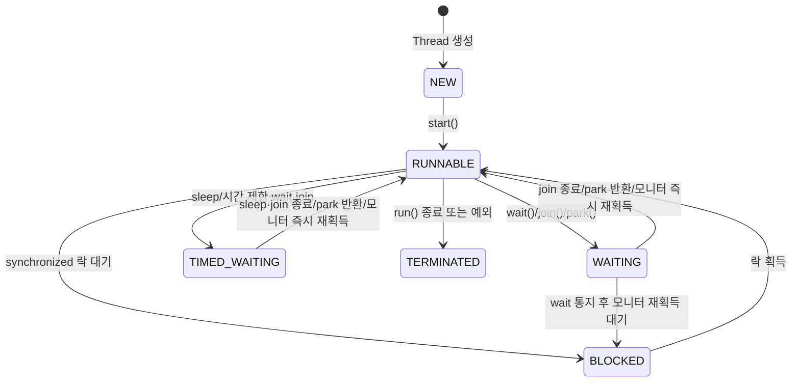

# 스레드 생명주기와 상태

## 핵심 정의
자바의 스레드(Thread)는 생성부터 종료까지 정해진 상태(state) 집합 사이를 전이하며 실행된다. `Thread.State` enum에 정의된 6가지 상태(`NEW`, `RUNNABLE`, `BLOCKED`, `WAITING`, `TIMED_WAITING`, `TERMINATED`)로 표현되며, 이는 OS 스케줄러가 보는 실제 물리적 상태가 아니라 JVM 수준에서 관리하는 논리적 상태다.

스레드 상태 모델을 이해하면 스레드 덤프(thread dump)를 읽고 어떤 스레드가 어디서 멈춰있는지, 왜 응답이 없는지를 진단할 수 있다.

## 동작 원리 / 구조

- **NEW**: `Thread` 객체는 생성되었지만 `start()`가 호출되지 않은 상태.
- **RUNNABLE**: 실행 중이거나 CPU 스케줄링을 기다리는 상태. OS 관점의 `RUNNING`과 `READY`를 JVM은 구분하지 않고 하나로 묶는다.
- **BLOCKED**: `synchronized` 블록/메서드의 모니터 락을 획득하지 못해 대기 중인 상태. `Lock` 인터페이스 기반 대기(`ReentrantLock.lock()`)는 내부적으로 park를 사용하므로 `WAITING`으로 표시된다.
- **WAITING**: `Object.wait()`, `Thread.join()`, `LockSupport.park()` 등 시간 제한 없이 대기하는 상태. 인터럽트나 허위 깨어남(spurious wakeup)도 가능해 대기 조건을 반복 확인해야 한다.
- **TIMED_WAITING**: `Thread.sleep(long)`, `wait(long)`, `join(long)`, `LockSupport.parkNanos()` 등 시간 제한이 있는 대기.
- **TERMINATED**: `run()`이 정상 종료되거나 처리되지 않은 예외로 종료된 상태. 한 번 종료된 스레드는 재시작할 수 없다.

핵심은 `BLOCKED`와 `WAITING`의 구분이다. `BLOCKED`는 오직 모니터 락 경쟁 상황에서만 나타나고, `WAITING`/`TIMED_WAITING`은 스레드가 스스로 대기를 선택한 상태다. 스레드 덤프에서 다수의 스레드가 `BLOCKED` 상태로 같은 락을 기다리고 있다면 락 경합(lock contention)을 의심해야 한다.

`wait()`에서 깨어난 스레드는 해당 모니터를 다시 획득해야 반환할 수 있다. 통지가 실행 재개나 락 획득을 즉시 보장하지 않는다. `wait()`는 해당 객체의 모니터만 놓으며 보유한 다른 락은 그대로 유지한다.

## 실무 관점
- 스레드 덤프(`jstack`, `kill -3`)를 읽을 때 `BLOCKED` 상태 스레드가 몰려 있으면 특정 임계 구역(critical section)이 병목임을 알 수 있다. 이때 어떤 락을 누가 들고 있는지(`locked <0x...>`, `waiting to lock <0x...>`)를 추적한다.
- `WAITING` 상태의 스레드 풀 워커가 다수라면 정상적인 유휴(idle) 상태일 수도 있고, 외부 리소스(DB 커넥션 풀, 원격 호출) 응답을 기다리는 것일 수도 있어 스택 트레이스로 구분해야 한다.
- `Thread.sleep()`은 락을 들고 있는 상태에서 호출하면 락을 반납하지 않으므로 다른 스레드를 계속 막는다. 반면 `wait()`은 호출 시 모니터 락을 반납한다는 차이를 실무에서 자주 놓친다.
- 데몬 스레드(daemon thread) 여부도 생명주기와 연결된다. 시작된 논데몬 스레드가 하나라도 종료되지 않고 남아있으면 JVM 프로세스가 종료되지 않는다. 배치 애플리케이션이 종료되지 않는 장애의 흔한 원인이다.
- 스레드 상태만으로는 CPU를 실제로 쓰고 있는지 알 수 없다. `RUNNABLE`이어도 스핀락(spin lock)이나 바쁜 대기(busy waiting) 때문에 CPU를 소모하며 멈춘 것처럼 보일 수 있어, `top -H`나 `async-profiler`로 실제 CPU 사용률을 함께 봐야 한다.

### 상태 관측과 시간 제한은 동기화 계약으로 확인한다
`Thread.getState()`는 관측·진단용이다. 순간적으로 WAITING을 읽었다는 사실로 작업 준비 완료나 안전한 결과 접근을 판단하지 말고 `CountDownLatch`, `Future.get()` 등 명시적 완료 신호를 사용한다. `Thread.getAllStackTraces()`는 Java SE 25에서 살아 있는 **플랫폼 스레드만** 반환하므로 목록에 가상 스레드가 없다는 이유로 작업이 없다고 판단해서도 안 된다.

시간 제한을 밀리초로 변환할 때도 주의한다. `thread.join(duration.toMillis())`에서 1밀리초 미만의 양수 기간이 0으로 잘리면 `join(0)`은 무기한 대기가 된다. Java 19부터의 `join(Duration)`은 0 이하이면 기다리지 않고, 시작하지 않은 스레드에는 `IllegalThreadStateException`을 던진다. 서로 다른 overload의 0과 반환값 의미를 확인한다.

## 심화 Q&A

### Q. `wait()`로 대기 중인 스레드와 `synchronized` 진입을 위해 대기 중인 스레드는 왜 상태가 다른가?
시간 제한 없는 `wait()`은 이미 획득한 해당 모니터를 놓고 대기하므로 `WAITING`이다. 반면 `synchronized` 진입 대기는 모니터 소유권 획득을 기다리므로 `BLOCKED`다. 모니터를 놓는다는 설명은 `Object.wait()`의 계약이며, 모든 `WAITING` 상태가 이전에 락을 보유했다가 놓았다는 뜻은 아니다. `join()`·`park()`의 대기도 포함되므로 호출 스택과 함께 구분한다.

### Q. `ReentrantLock.lock()`으로 대기하는 스레드는 왜 `BLOCKED`가 아니라 `WAITING`으로 나타나는가?
`ReentrantLock`은 JVM 모니터(intrinsic lock)를 쓰지 않고 `AbstractQueuedSynchronizer`(AQS) 기반으로 `LockSupport.park()`를 호출해 대기한다. `park()`는 `WAITING`(무제한) 또는 `TIMED_WAITING`(시간 제한)으로 분류되기 때문에, 같은 "락 대기"라도 `synchronized`와 `Lock` 구현체는 스레드 덤프상 다른 상태로 보인다. 이 차이를 모르면 스레드 덤프 분석 시 `Lock` 기반 경합을 놓치기 쉽다.

### Q. 데몬 스레드가 `TERMINATED`가 되지 않고 계속 `RUNNABLE`로 남아있으면 어떤 문제가 생기는가?
데몬 스레드는 JVM 종료를 막지 않으므로 프로세스 종료 자체에는 문제가 없다. 하지만 스케줄러나 커넥션 풀의 정리 스레드가 데몬으로 설정되어 있는데 무한 루프에 빠지면, 애플리케이션이 정상 응답을 못하면서도 프로세스는 살아있어 헬스체크가 오탐(false positive)을 낼 수 있다. 상태만으로는 정상/비정상을 구분할 수 없고 스택 트레이스 확인이 필수인 이유다.

### Q. `TERMINATED` 상태인 `Thread` 객체를 다시 `start()`하면 어떤 일이 발생하는가?
`IllegalThreadStateException`이 발생한다. Java 스레드의 시작·종료 수명은 되돌릴 수 없으며 `TERMINATED`에서 되돌아갈 수 없도록 설계되어 있다. 재사용이 필요하면 새 `Thread` 객체를 만들거나, 애초에 스레드를 직접 관리하지 않고 `ExecutorService`의 스레드 풀에 작업을 제출하는 방식으로 우회해야 한다.

### Q. 스레드 덤프에서 `RUNNABLE`인데 CPU를 거의 안 쓰는 스레드는 왜 생기는가?
`RUNNABLE`은 "실행 가능"이라는 JVM 논리 상태일 뿐, 실제로 OS 스케줄러에 의해 CPU를 할당받아 돌고 있는지는 별개다. 네이티브 I/O 호출(소켓 read/write) 중에도 JVM은 해당 스레드를 `RUNNABLE`로 표시하는 경우가 있어, CPU 사용률이 낮은데 `RUNNABLE` 스레드가 많다면 네트워크나 디스크 I/O 대기를 의심해야 한다. `jstack`만으로 부족하면 OS 레벨 스레드 상태(`/proc/<pid>/task/<tid>/status`)까지 봐야 정확하다.

## 관련 개념
- [[인터럽트와 작업 취소]]
- [[synchronized와 Lock]]
- [[데드락과 경쟁 상태]]
- [[ExecutorService와 스레드 풀]]
- [[가상 스레드]]

## 참고 자료

확인 날짜: 2026-09-08. 아래 버전과 범위의 공식 문서·소스로 본문을 대조했다. 성능 비교와 운영 선택은 워크로드에 따라 달라지는 판단 기준이다.

- [Java SE 25 Thread.State](https://docs.oracle.com/en/java/javase/25/docs/api/java.base/java/lang/Thread.State.html) — 6개 논리 상태와 대기 원인.
- [Java SE 25 Thread](https://docs.oracle.com/en/java/javase/25/docs/api/java.base/java/lang/Thread.html) — start·daemon·join·인터럽트 계약.
- [JLS 25 §17.2](https://docs.oracle.com/javase/specs/jls/se25/html/jls-17.html) — wait 재획득·허위 깨어남·다른 락 유지.

부분 재검증: 2026-10-04. 아래 적용 버전·범위만 확인했으며 노트 전체의 기존 verified는 유지한다.

- [Java SE 25 Thread](https://docs.oracle.com/en/java/javase/25/docs/api/java.base/java/lang/Thread.html) — getState의 진단용 계약, getAllStackTraces의 플랫폼 스레드 범위, join(long)의 0과 join(Duration)의 반환값·미시작 예외.
- [Java SE 25 Duration.toMillis](https://docs.oracle.com/en/java/javase/25/docs/api/java.base/java/time/Duration.html#toMillis()) — 밀리초 변환 시 남는 정밀도의 버림.
- [Java SE 25 Thread.State](https://docs.oracle.com/en/java/javase/25/docs/api/java.base/java/lang/Thread.State.html) — BLOCKED의 모니터 대기와 WAITING의 wait·join·park 범위. WAITING 자체에 기존 락 해제 의미를 부여하지 않는다.

실행 확인: Oracle JDK 25.0.4+7-LTS-189에서 getAllStackTraces의 가상 스레드 제외, 밀리초 절삭, join(Duration.ZERO)와 미시작 스레드 예외. 실행 검사는 위 부분 재검증 범위에 한한다.

- 도식·표 대조(2026-10-04): [Java SE 25 Object.wait](https://docs.oracle.com/en/java/javase/25/docs/api/java.base/java/lang/Object.html#wait(long)) — 도식의 시간 제한 대기를 무기한 wait(0)·join(0)과 구분하고 RUNNABLE 직접 전이는 모니터 즉시 재획득 경로로 한정했다. 실행 시험 추가 없이 명세·소스와 기존 본문을 대조했으며 verified는 유지한다.
