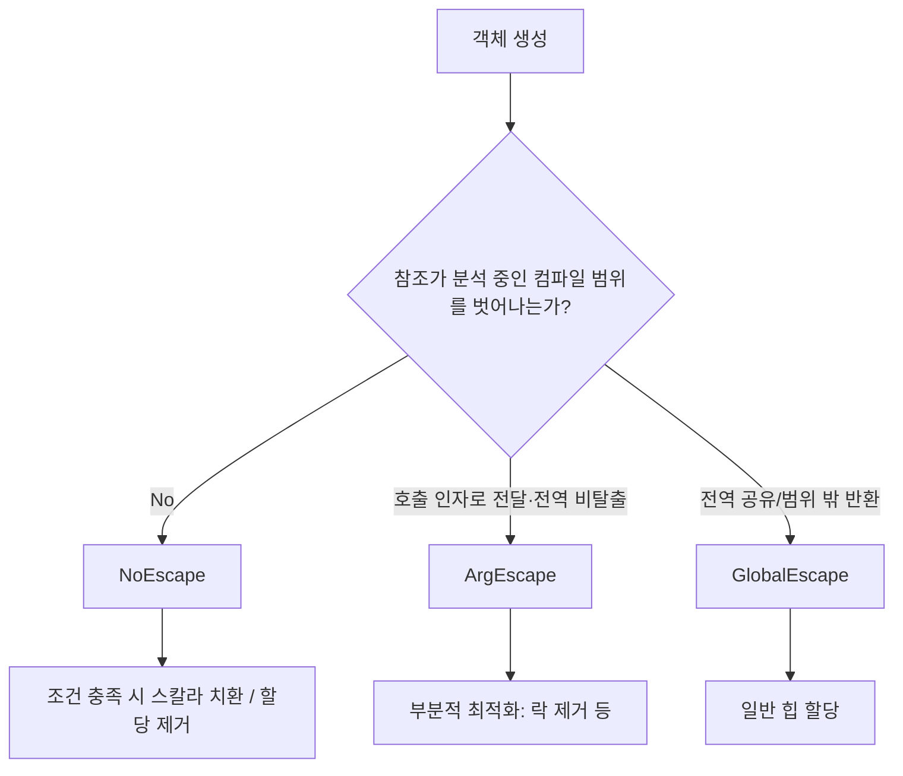

# Escape Analysis와 스칼라 치환

## 핵심 정의
탈출 분석(Escape Analysis, EA)은 HotSpot JIT 컴파일러(C2)가 객체의 참조가 메서드나 스레드 범위 밖으로 "탈출(escape)"하는지를 정적으로 판단하는 최적화 기법이다. 객체가 탈출하지 않는다고 판단되면 힙(heap) 할당을 생략하거나, 동기화(synchronization)를 제거하거나, 객체를 필드 단위 지역 변수로 분해하는 등의 최적화를 적용할 수 있다.

스칼라 치환(Scalar Replacement)은 EA의 결과로 이뤄지는 대표적인 최적화로, 탈출하지 않는 객체를 하나의 덩어리(heap object)로 할당하는 대신 그 객체를 구성하는 필드들을 개별 스칼라 변수(scalar variable)로 분해해 레지스터나 스택에 직접 두는 것이다. 이렇게 하면 객체 할당 자체가 사라지고, 결과적으로 GC 대상 객체 수도 줄어든다.

## 동작 원리 / 구조

### 탈출 상태 분류
C2는 객체를 다음 세 가지 상태로 분류한다.

| 상태 | 의미 | 최적화 가능 여부 |
|---|---|---|
| NoEscape | 분석 중인 컴파일 범위를 탈출하지 않음 | 스칼라 치환 가능 |
| ArgEscape | 호출 인자 또는 인자가 참조하는 객체로 전달되지만 호출 중 전역으로 탈출하지 않음 | 조건부 최적화 가능 |
| GlobalEscape | 현재 컴파일 범위에서 반환되거나 전역 접근 가능한 객체 등에 저장됨 | 힙 할당 필요 |



### 스칼라 치환 예시
```java
public int distanceSquared(int x1, int y1, int x2, int y2) {
    Point p1 = new Point(x1, y1);
    Point p2 = new Point(x2, y2);
    int dx = p1.x - p2.x;
    int dy = p1.y - p2.y;
    return dx * dx + dy * dy;
}
```
`p1`, `p2`는 생성자가 this를 유출하지 않고 필드 접근도 예제와 같이 한정된다면 NoEscape 후보가 된다. C2가 해당 코드를 컴파일하고 필요한 최적화 조건이 만족되면 `Point` 객체 할당 자체를 없애고 `x1, y1, x2, y2`를 그대로 스칼라 값처럼 다뤄 연산한다. `-XX:+PrintEscapeAnalysis -XX:+PrintEliminateAllocations` 플래그로 실제 어떤 할당이 제거됐는지 확인할 수 있는데, OpenJDK 25에서 이 두 옵션은 `develop` 플래그여서 일반 release 빌드에서는 사용할 수 없다는 점은 아래 실무 관점에서 다룬다.

### 락 제거 (Lock Elision)
객체가 특정 스레드 밖으로 탈출하지 않는다고 판단되면(스레드 로컬임이 보장되면), 그 객체에 대한 `synchronized` 락도 아무 효과가 없으므로 제거한다. 대표적으로 메서드 로컬 `StringBuffer`의 내부 락이 자주 제거되는 사례다.

## 실무 관점
- **JIT 컴파일 단계의 분석이라는 한계**: EA는 실행 중 JIT이 만드는 중간 표현을 대상으로 하는 정적 분석이다. 소스 컴파일러 javac의 분석과 구분하며, 런타임 프로파일과 인라이닝 결과가 분석 대상에 영향을 준다. 같은 코드라도 호출 경로, 인라이닝 깊이, JIT 티어에 따라 최적화 여부가 달라질 수 있어 "이 객체는 반드시 스택에 할당된다"고 코드 설계 단계에서 보장할 수 없다.
- **최적화를 방해하는 흔한 패턴**:
  - 객체를 이미 탈출한 컬렉션이나 객체의 필드에 대입(로컬 객체의 필드에 저장했다는 사실만으로 GlobalEscape는 아님)
  - 인라인되지 않을 만큼 크거나 깊은 호출 체인에 객체를 전달
  - 가상 메서드 호출(virtual call)로 인해 인라이닝이 실패하는 경우
  - 예외 객체 생성 후 `throw`하는 경우 (탈출로 간주)
  - `Object[]`나 제네릭 배열처럼 컴파일러가 크기/타입을 정적으로 확정하기 어려운 경우 스칼라 치환 후보에서 제외
- **관측 방법**: OpenJDK 25의 `-XX:+PrintEscapeAnalysis`, `-XX:+PrintEliminateAllocations`는 `develop` 플래그다. 일반 release(product) 빌드에서는 `-XX:+UnlockDiagnosticVMOptions`로도 사용할 수 없으며, fastdebug·slowdebug 등 이 옵션을 포함하는 디버그 빌드가 필요하다. `diagnostic` 옵션과 빌드에서 제외된 개발용 옵션을 구분한다. 운영 환경에서 쓰는 일반 JDK 배포판이라면 `-XX:+UnlockDiagnosticVMOptions -XX:+PrintCompilation -XX:+LogCompilation` 조합의 컴파일 로그를 JITWatch 같은 도구로 시각화하거나, JFR(Java Flight Recorder)의 할당 프로파일링으로 짧은 생명주기 객체(short-lived object) 할당량 변화를 간접 관측하는 편이 현실적이다.
- **설계 관점의 시사점**: 무조건 "작은 객체는 EA가 알아서 처리해줄 것"이라고 믿고 불변 값 객체(Value Object) 패턴을 남발하기보다는, EA가 실패해도 감내 가능한 수준인지(즉 짧은 생명주기 + Young GC로 저렴하게 회수되는지) 함께 고려해야 한다. EA는 GC 압박을 줄이는 보너스이지, 설계의 전제 조건으로 삼기엔 불확실성이 크다.

## 심화 Q&A

### Q. Escape Analysis가 있으니 객체 할당을 줄이는 노력(예: 객체 풀링)이 무의미해지는가?
아니다. EA는 컴파일러가 조건을 만족할 때만 선택적으로 적용하는 최적화이며, 인라이닝 실패, 다형성, 컬렉션 저장 등 조건이 조금만 어긋나도 실패한다. 실무에서는 EA를 신뢰해 설계를 단순화하되(불필요하게 미리 캐싱/풀링하지 않되), 실제로 할당이 병목인지는 JFR 프로파일링으로 확인 후 대응하는 것이 합리적이다. Loom(가상 스레드) 환경처럼 매우 많은 수의 짧은 생명주기 객체가 생기는 경우 EA의 성공률이 GC 압박에 실질적 영향을 준다.

### Q. ArgEscape 상태의 객체는 왜 부분 최적화만 가능한가?
ArgEscape는 호출된 메서드의 바이트코드 분석 등으로, 인자로 전달된 객체가 그 호출 동안 전역으로 탈출하지 않음을 확인한 상태다. 인라인 여부 자체가 ArgEscape의 정의는 아니다. 완전한 스칼라 치환을 하려면 객체를 참조하는 모든 코드 경로를 분석해야 하는데, ArgEscape는 호출된 메서드 내부에서 그 객체를 어떻게 다루는지에 따라 추가 제약이 생긴다. 예를 들어 그 메서드 내부에서 다시 필드에 저장하면 안 되므로, 완전한 스칼라 치환보다는 락 제거처럼 제한된 최적화만 안전하게 적용된다.

### Q. 배열 객체도 스칼라 치환 대상이 되는가?
크기가 컴파일 타임 상수로 확정되는 작은 배열이라면 대상이 될 수 있지만, 크기가 런타임 값에 의존하거나 매우 큰 배열은 일반적으로 제외된다. 배열을 스칼라 치환하려면 각 원소를 개별 스칼라 변수로 분해해야 하는데, 크기가 가변적이면 이 분해 자체가 불가능하기 때문이다. 따라서 고정 크기의 작은 로컬 배열(예: 좌표 3개짜리 배열)은 최적화 후보가 되지만 가변 길이 배열은 대체로 힙에 할당된다.

### Q. 스칼라 치환된 객체를 디버거로 관찰하면 어떻게 보이는가?
디버거로 중단점을 걸고 "이 객체를 보여달라"고 요청하면 JVM은 그 시점에 실제로는 존재하지 않던 객체를 스칼라화된 필드 값들로부터 역구성(deoptimize on demand, materialize)해서 보여준다. 즉 디버깅 목적의 관찰 행위 자체가 역최적화를 유발할 수 있다는 뜻이며, 프로덕션 환경에서 디버거를 붙였을 때 성능 특성이 평소와 달라지는 이유 중 하나다.

### Q. Escape Analysis와 Project Valhalla의 값 타입(value type)은 어떤 관계인가?
EA는 분석 결과와 컴파일러의 제약에 따라 적용되는 최적화이며 확률적으로 정확성을 판단하는 기법은 아니다. Project Valhalla의 JEP 401은 참조 동일성이 없는 불변 값 객체를 제안해 JVM의 표현 최적화 여지를 넓힌다. 값 객체라도 항상 힙 할당·참조가 없어지는 것은 아니며, JEP의 설계와 특정 배포판의 실제 지원 여부를 구분해야 한다. HotSpot C2의 EA 또한 객체를 통째로 스택에 옮기는 것이 아니라 스칼라 치환으로 할당을 제거한다.

### Q. `synchronized` 블록의 락 제거는 왜 `StringBuilder`가 아니라 `StringBuffer`에서 자주 언급되는가?
`StringBuffer`는 스레드 안전을 위해 내부 메서드에 `synchronized`가 걸려 있는 레거시 클래스다. 메서드 로컬 변수로 `StringBuffer`를 생성해 탈출 없이 사용하면 그 인스턴스는 애초에 다른 스레드와 공유될 수 없으므로 락이 실질적으로 무의미해지고, EA가 이를 감지해 락 획득/해제 코드를 제거한다. `StringBuilder`는 애초에 동기화가 없는 대체재이므로 이 최적화가 언급될 이유가 없다.

### Q. NoEscape라면 반드시 스칼라 치환되는가?
A. 아니다. OpenJDK 25 C2 소스는 탈출 상태와 `scalar_replaceable` 여부를 따로 관리한다. 동적인 배열 길이, 분석하기 어려운 메모리 접근·객체 병합 등은 추가 제약이 된다. "외부에 저장하지 않았다"는 소스 수준 조건 하나만으로 할당 제거를 보장할 수 없다.

### Q. new가 있는 메서드를 반환하지 않도록 고치면 언제나 EA에 유리한가?
A. 분석 경계는 소스 메서드 경계와 같지 않다. 호출자가 인라인한 메서드에서 객체를 반환하더라도 최종 컴파일 범위 밖으로 나가지 않으면 제거 후보가 될 수 있다. 반대로 전역에 게시하는 드문 분기 하나가 분석 결과에 영향을 줄 수 있다. 반환을 피하려고 API를 가변 출력 인자로 바꾸기 전에 실제 할당량과 인라이닝 결과를 확인한다.

## 관련 개념
- [[JIT 컴파일러]]
- [[GC 튜닝]]
- [[String 연산과 StringBuilder 최적화]]

## 참고 자료

확인 날짜: 2026-09-08. 아래 버전과 범위의 공식 문서·소스로 본문을 대조했다. 성능 비교와 운영 선택은 워크로드에 따라 달라지는 판단 기준이다.

- [HotSpot JDK 25 Performance Enhancements](https://docs.oracle.com/en/java/javase/25/vm/java-hotspot-virtual-machine-performance-enhancements.html) — Escape 상태·할당 제거·스택 할당 미지원.
- [OpenJDK jdk-25-ga escape.hpp](https://raw.githubusercontent.com/openjdk/jdk/jdk-25-ga/src/hotspot/share/opto/escape.hpp) — C2 EscapeState 정의와 분석 경계.
- [JEP 401 Value Objects](https://openjdk.org/jeps/401) — 값 객체 설계 목표; 릴리스 지원 여부 주장에 사용하지 않음.

### 2026-09-23 부분 재검증

JDK 25 HotSpot 성능 문서와 OpenJDK jdk-25-ga escape.cpp의 NoEscape·scalar_replaceable 별도 판정, 인라이닝 후 분석 범위를 확인했다. 기존 전체 검증일은 유지한다.

- [OpenJDK jdk-25-ga escape.cpp](https://raw.githubusercontent.com/openjdk/jdk/jdk-25-ga/src/hotspot/share/opto/escape.cpp) — 별도 스칼라 치환 적합성·배열 크기·메모리 접근 제약.

### 부분 재검증: 2026-10-04

OpenJDK jdk-25+36의 두 출력 플래그가 develop으로 선언됨과 빌드의 debug-level 종류를 확인했다. 기존 notproduct 명칭·fastdebug만 가능하다는 표현을 교정했으며, 전체 `verified`는 유지한다.

- [OpenJDK jdk-25+36 c2_globals.hpp](https://raw.githubusercontent.com/openjdk/jdk/jdk-25%2B36/src/hotspot/share/opto/c2_globals.hpp) — PrintEscapeAnalysis·PrintEliminateAllocations의 develop 선언.
- [OpenJDK jdk-25+36 빌드 문서](https://raw.githubusercontent.com/openjdk/jdk/jdk-25%2B36/doc/building.md) — --with-debug-level의 release·fastdebug·slowdebug 등 구분.

실행 확인: Oracle JDK 25.0.4+7-LTS-189(macOS AArch64)의 release JVM에서 UnlockDiagnosticVMOptions와 함께 각 옵션을 지정해도 `is develop and is available only in debug version of VM` 오류로 기동이 실패함을 확인했다. 디버그 JDK 빌드·할당 제거율 측정은 실행하지 않았다.

- 도식·표 대조(2026-10-04): [OpenJDK jdk-25+36 escape.hpp](https://raw.githubusercontent.com/openjdk/jdk/jdk-25%2B36/src/hotspot/share/opto/escape.hpp) — 도식도 컴파일 범위의 탈출 상태와 별도의 스칼라 치환 가능 조건을 구분한다. 실행 시험 추가 없이 명세·소스와 기존 본문을 대조했으며 verified는 유지한다.
