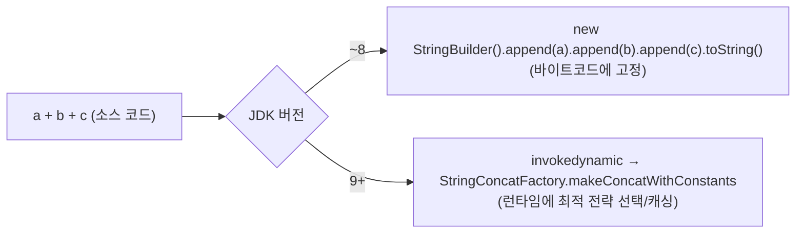

# String 연산과 StringBuilder 최적화

## 핵심 정의
`String`은 불변(immutable) 객체이므로 런타임 문자열 연결(concatenation)은 새 결과를 만들지만, 상수 표현식은 컴파일 시점에 접힐 수 있고 JIT이 중간 할당을 제거할 수도 있다. `StringBuilder`(비동기화 버전, 즉 스레드 안전을 보장하지 않는 버전)와 `StringBuffer`(동기화 버전)는 내부에 가변(mutable) 문자 배열(`byte[]`, 컴팩트 스트링 기준)을 유지하며 `append()`로 값을 누적한 뒤 마지막에 한 번만 `String`으로 변환하는 방식으로 불필요한 중간 객체 생성을 없앤다. (여기서 "비동기화"는 락을 걸지 않는다는 뜻으로, 논블로킹 I/O 등에서 말하는 "비동기(asynchronous)" 실행 모델과는 무관하다.)

자바 9부터는 컴파일러가 `+` 연산자 기반 문자열 연결을 `invokedynamic`과 `StringConcatFactory`를 이용한 방식으로 번역하기 때문에(JEP 280), 단순 반복이 없는 한 줄짜리 `+` 연결은 더 이상 수동으로 `StringBuilder`로 바꿀 필요가 없다. 다만 반복문 내부의 문자열 누적은 여전히 명시적인 `StringBuilder` 사용이 유리하다.

## 동작 원리 / 구조

### JEP 280: Indify String Concatenation (Java 9+)
JDK 8 javac의 일반적인 비상수 문자열 연결은 `StringBuilder` 체인으로 번역되었고, JDK 9 javac부터 `invokedynamic`과 `StringConcatFactory`를 사용하는 방식이 도입됐다. 이는 언어 명세가 요구하는 유일한 번역 방식은 아니다. 컴파일 타임 상수 연결은 미리 접힐 수 있고, JDK 8 대상으로 이미 컴파일한 클래스가 새 JVM에서 실행된다고 바이트코드가 자동으로 이 방식으로 바뀌지는 않는다.



이 방식의 이점은 연결 전략(문자열 결합 알고리즘)을 JDK가 바이트코드 재생성 없이 내부적으로 교체/개선할 수 있다는 것이다. 실제로 초기에는 `StringBuilder` 체인과 동일한 방식으로 링크됐다가, 이후 버전에서 `MethodHandle` 기반의 더 효율적인 결합 전략으로 교체된 이력이 있다.

### 반복문에서의 문제
```java
// 안티패턴: 반복마다 새 연결 대상이 됨
String result = "";
for (String s : items) {
    result += s; // 매 반복마다 invokedynamic 호출 → 새 String 할당
}
```
`+=`는 반복문 안에서도 여전히 매 반복마다 이전 결과와 새 값을 연결하는 별도의 연산으로 컴파일되며, `invokedynamic` 자체는 가볍지만 반복 횟수만큼 새 `String` 객체가 계속 생성되는 구조적 문제는 그대로 남는다. 명시적으로 `StringBuilder`를 반복문 밖에서 한 번 생성해 `append`만 반복하면 중간 `String` 생성이 완전히 사라진다.

```java
StringBuilder sb = new StringBuilder();
for (String s : items) {
    sb.append(s);
}
String result = sb.toString();
```

### 컴팩트 스트링(Compact Strings, JEP 254, Java 9+)
`String`, `StringBuilder`, `StringBuffer`는 내부 저장소가 `char[]`(2바이트/문자 고정)에서 `byte[]` + 인코딩 플래그(`LATIN1` 또는 `UTF16`)로 바뀌었다. 문자열 내용이 Latin-1 범위(ISO-8859-1)에 속하면 문자당 1바이트만 사용해 내용을 저장하는 배열의 바이트 수를 UTF-16 대비 절반으로 줄인다(객체 헤더 등 전체 메모리가 정확히 절반이 되는 것은 아님). `StringBuilder.append()` 도중 UTF-16 범위 문자가 섞이면 내부적으로 `UTF16`으로 승격(inflate)된다.

## 실무 관점
- **단순 로그/메시지 조합은 `+`로 충분**: `"user=" + userId + ", status=" + status`처럼 반복문 밖에서 한 번 실행되는 연결은 컴파일러가 `invokedynamic`으로 처리하므로 가독성을 우선해 `+`를 쓰는 것이 낫다.
- **반복문 내부 누적은 `StringBuilder` 명시 사용이 정석**: 대량의 로그 라인 조합, CSV 생성, 긴 SQL 문자열 조립 등에서 `+=` 남용은 O(n²) 수준의 메모리/CPU 낭비로 이어질 수 있다.
- **초기 용량(capacity) 지정**: 결합될 문자열의 대략적인 총 길이를 알고 있다면 `new StringBuilder(expectedLength)`로 초기 용량을 지정해 내부 배열 재할당(growth)을 줄인다. 기본 초기 용량은 16이며, 확장 시 기존 용량의 `2배 + 2`와 필요한 최소 용량 중 큰 쪽을 기준으로 하며, 배열 최대 길이 제약도 적용된다. 용량 단위는 바이트가 아니라 UTF-16 코드 유닛이다.
- **로깅 프레임워크의 지연 평가**: `log.debug("value=" + expensiveCall())`처럼 문자열 연결 자체가 로그 레벨과 무관하게 항상 실행되는 패턴을 피하고, `log.debug("value={}", value)` 같은 파라미터화로 연결 비용을 피한다. `log.debug("value={}", expensiveCall())`도 인자 메서드는 먼저 실행하므로 계산 비용까지 피하려면 `isDebugEnabled()`로 감싸거나 SLF4J 2.x fluent API의 `addArgument(Supplier)`를 쓴다.
- **`String.intern()`과 문자열 풀(String Pool)**: 문자열 풀 관련 최적화(중복 리터럴 재사용)는 [[String과 String Pool]]에서 다룬다. `StringBuilder` 최적화와는 목적이 다르므로(메모리 중복 제거 vs 중간 객체 생성 방지) 혼동하지 않는다.
- **정규식/`split` 남용 주의**: 문자열 처리 성능 문제는 연결 연산뿐 아니라 반복문 안에서 `Pattern.compile()`을 매번 호출하거나 불필요한 `split()`을 반복하는 경우에도 흔히 발생한다. `Pattern`은 미리 컴파일해 재사용한다.

## 심화 Q&A

### Q. Java 9 이후에도 반복문 안의 `String += ` 이 여전히 느린 이유는 `invokedynamic`이 느려서인가?
아니다. `invokedynamic` 자체의 호출 오버헤드는 최초 링크 이후 `MethodHandle`이 캐싱되어 매우 저렴하다. 문제는 호출 비용이 아니라 반복 횟수만큼 새로운 `String` 인스턴스(그리고 그 이전 결과였던 문자열)가 계속 생성되고 버려진다는 할당(allocation) 자체의 구조적 비용이다. `StringBuilder`를 루프 밖에서 재사용하면 이 반복 할당이 근본적으로 사라진다.

### Q. 컴팩트 스트링이 적용된 이후에도 여전히 한글/이모지가 섞인 문자열은 최적화 혜택이 없는가?
그렇다. 문자열에 Latin-1 범위를 벗어나는 문자(한글, 이모지, 일부 특수문자 등)가 하나라도 포함되면 해당 문자열 전체가 `UTF16` 인코딩(코드 유닛당 2바이트, 보충 문자는 2개 코드 유닛)으로 저장된다. 한글 위주의 로그/데이터를 다루는 백엔드에서는 컴팩트 스트링의 메모리 절감 효과를 거의 기대하기 어렵고, 오히려 `StringBuilder`가 append 도중 인코딩을 승격(inflate)하는 비용이 추가로 든다는 점도 고려 대상이다.

### Q. `StringBuilder`와 `StringBuffer`의 성능 차이는 실제로 얼마나 크며, 언제 `StringBuffer`가 필요한가?
`StringBuffer`는 모든 가변 메서드에 `synchronized`가 걸려 있어 단일 스레드 환경에서는 불필요한 락 획득/해제 오버헤드가 매 호출마다 발생한다(단, JIT의 락 제거(lock elision)로 메서드 로컬 사용에서는 상당 부분 상쇄될 수 있다). 여러 스레드가 동일한 빌더 인스턴스에 동시에 `append`해야 하는 극히 드문 경우가 아니면 `StringBuilder`를 쓰는 것이 표준이며, 실무에서 `StringBuffer`를 신규로 선택할 이유는 거의 없다.

### Q. `String.format()`이나 `Formatter`를 대량 반복 호출하면 왜 `StringBuilder`보다 느린가?
`String.format()`은 내부적으로 포맷 문자열을 매 호출마다 파싱하고, 가변 인자(varargs) 변환이나 기본형 인자의 박싱 비용이 생길 수 있다. 배열을 직접 전달하거나 캐시된 래퍼를 쓰면 매 호출의 새 배열·래퍼 생성이 필수는 아니다. 반면 `StringBuilder.append()`는 타입별 오버로드(`append(int)`, `append(long)` 등)로 오토박싱 없이 직접 값을 문자로 변환한다. 형식 지정이 복잡하지 않은 대량 결합은 `StringBuilder`가 비용을 줄일 수 있지만, 성능 우열은 대상 JDK와 입력으로 측정해야 한다.

### Q. `StringBuilder`의 초기 용량을 지나치게 크게 잡는 것도 문제가 되는가?
그렇다. 실제 사용량보다 훨씬 큰 초기 용량은 즉시 그만큼의 `byte[]`를 할당하므로 메모리 낭비로 이어지고, 특히 요청마다 대용량 버퍼를 생성하는 패턴이 누적되면 GC 압박으로 이어질 수 있다. 예상 길이를 정확히 추정하기 어렵다면 기본 생성자(초기 용량 16)를 쓰고 자동 확장에 맡기는 편이 과도한 사전 할당보다 안전한 경우가 많다.

### Q. 대용량 문자열을 여러 스레드에서 조립해야 할 때 `StringBuilder` 대신 무엇을 고려해야 하는가?
`StringBuilder` 자체는 스레드 안전하지 않으므로 공유하면 안 되고, `StringBuffer`는 동기화 오버헤드가 병목이 될 수 있다. 각 스레드가 독립적인 `StringBuilder`로 부분 결과를 만든 뒤 마지막에 병합(`Collectors.joining()` 또는 `String.join()`)하는 fork-join 스타일 접근이 일반적으로 더 확장성이 좋다. `Stream.collect(Collectors.joining())`은 내부적으로 이런 병합을 효율적으로 처리하도록 설계되어 있다.

### Q. StringBuilder.setLength(0)으로 재사용하면 큰 버퍼도 반환되는가?
A. OpenJDK 25는 길이를 줄여도 배열 용량을 유지한다. 요청별 ThreadLocal 빌더를 무제한 재사용하면 드물게 만든 큰 문자열의 버퍼가 스레드 수만큼 오래 남을 수 있다. 용량 상한을 두어 큰 인스턴스는 교체하고 재사용 효과와 보존 메모리를 함께 측정한다. 길이 초기화가 민감한 내용의 안전한 메모리 삭제를 보장하는 API도 아니다.

### Q. StringBuffer이면 여러 append를 묶은 메시지도 원자적인가?
A. 각 호출의 동기화와 호출 묶음은 다르다. `append(prefix).append(body)` 사이에 다른 스레드의 append가 끼어들 수 있다. 하나의 메시지 단위가 필요하면 그 전체를 같은 잠금으로 묶거나 스레드별로 완성한 문자열을 별도의 안전한 출력 경로로 전달한다. 동기화된 클래스라는 이유로 애플리케이션 연산 전체가 원자화되지 않는다.

## 관련 개념
- [[String과 String Pool]]
- [[Escape Analysis와 스칼라 치환]]
- [[가변인자와 오토박싱]]

## 참고 자료

확인 날짜: 2026-09-08. 아래 버전과 범위의 공식 문서·소스로 본문을 대조했다. 성능 비교와 운영 선택은 워크로드에 따라 달라지는 판단 기준이다.

- [JEP 280](https://openjdk.org/jeps/280) — Java 9 javac의 invokedynamic 기반 연결.
- [JEP 254](https://openjdk.org/jeps/254) — Java 9 Compact Strings와 관련 클래스 표현.
- [Java SE 25 StringBuilder](https://docs.oracle.com/en/java/javase/25/docs/api/java.base/java/lang/StringBuilder.html) — 용량·성장·스레드 안전성과 append 계약.
- [SLF4J Manual](https://www.slf4j.org/manual.html) — 2.x fluent API Supplier 지연 인자.

### 2026-09-23 부분 재검증

Java SE 25 StringBuilder·StringBuffer API, OpenJDK jdk-25-ga AbstractStringBuilder.setLength 구현과 JEP 280의 javac 적용 범위를 확인했다. 기존 전체 검증일은 유지한다.

- [OpenJDK jdk-25-ga AbstractStringBuilder](https://raw.githubusercontent.com/openjdk/jdk/jdk-25-ga/src/java.base/share/classes/java/lang/AbstractStringBuilder.java) — setLength와 버퍼 유지.
- [Java SE 25 StringBuffer](https://docs.oracle.com/en/java/javase/25/docs/api/java.base/java/lang/StringBuffer.html) — 메서드 수준 동기화.

실행 확인: 2026-09-23, OpenJDK 25.0.2+10-69에서 setLength(0) 이후 capacity 유지을 재현했다. 구현 관측은 해당 버전 범위로 한정한다.
