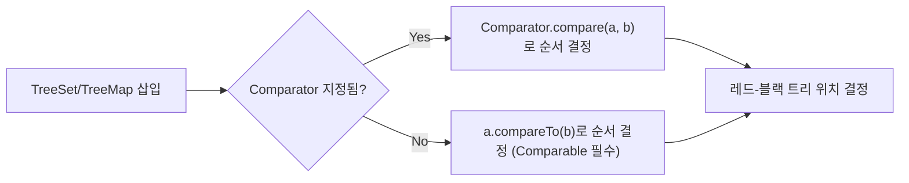

# Comparable과 Comparator

## 핵심 정의
`Comparable<T>`은 클래스 자신에게 "자연스러운 순서(natural ordering)"를 부여하는 인터페이스로, `compareTo(T o)` 메서드 하나를 구현한다. `Comparator<T>`는 클래스 외부에서 정렬 기준을 별도로 정의하는 인터페이스로, `compare(T a, T b)` 메서드를 구현한다. 전자는 "이 타입은 원래 이런 순서를 가진다"는 단일 기본 순서를, 후자는 "이 상황에서는 이런 기준으로 정렬한다"는 상황별 다중 순서를 표현한다.

## 동작 원리 / 구조
```java
public class Employee implements Comparable<Employee> {
    private final String name;
    private final int salary;
    private final String department;
    private final String middleName;

    public Employee(String name, int salary, String department, String middleName) {
        this.name = name;
        this.salary = salary;
        this.department = department;
        this.middleName = middleName;
    }
    public String getDepartment() { return department; }
    public int getSalary() { return salary; }
    public String getMiddleName() { return middleName; }

    @Override
    public int compareTo(Employee other) {
        return Integer.compare(this.salary, other.salary); // 연봉 오름차순이 자연 순서
    }
}
```

`Collections.sort()`, `Arrays.sort()`, `TreeMap`/`TreeSet`은 별도 `Comparator`가 없으면 `Comparable.compareTo()`를 기본 정렬 기준으로 사용한다.

`Comparator`는 정적/기본 메서드 조합으로 복잡한 다중 조건 정렬을 선언적으로 구성할 수 있다(Java 8 `Comparator` 인터페이스 개편).

```java
Comparator<Employee> byDeptThenSalaryDesc =
    Comparator.comparing(Employee::getDepartment)
              .thenComparing(Employee::getSalary, Comparator.reverseOrder());

employees.sort(byDeptThenSalaryDesc);
```

위 예제의 연봉 순서는 같은 연봉의 서로 다른 직원을 동등하게 비교한다. 이런 자연 순서는 `equals`와 일관되지 않으므로, 직원의 유일성을 보존할 `TreeSet`에는 식별자를 포함한 비교 기준을 별도로 설계해야 한다.

`compareTo`/`compare`는 계약에 따라 음수/0/양수를 반환하며, 절대적인 크기가 아니라 부호(sign)만 의미를 가진다. `a.compareTo(b) < 0`은 "a가 b보다 앞선다"는 뜻이다. 부호의 반대칭성, 추이성, `compare(a,b)==0`일 때 제3의 값과 비교한 부호가 같다는 조건도 지켜야 한다.



## 실무 관점
- 도메인 객체가 명확한 하나의 기본 정렬 기준(예: 날짜, ID)을 가진다면 `Comparable`을 구현해 `TreeSet`/`TreeMap`, `Collections.sort(list)`에서 별도 인자 없이 정렬되게 한다. 상황마다 다른 기준으로 정렬해야 한다면(관리자 화면에서는 이름순, 리포트에서는 매출순) `Comparator`를 그때그때 생성해서 넘긴다.
- `compareTo`의 결과와 `equals()`의 결과는 반드시 일관되어야 한다는 강제 규칙은 없지만, "일관성 있게 만드는 것을 강력히 권장"한다(`compareTo`가 0이면 `equals`도 `true`). 이 일관성이 깨지면 `TreeSet`/`TreeMap`은 `equals()`가 아니라 `compareTo() == 0`을 기준으로 중복을 판단하므로, `equals()`로는 다른 객체인데 `TreeSet`에 넣으면 하나만 남는 혼란스러운 상황이 생긴다.
- `Comparator.comparing(keyExtractor)`에 정렬 키로 기본형 래퍼(`Integer`, `Long`)를 쓰면 오토박싱 오버헤드가 붙는다. 대량 데이터 정렬에서는 `Comparator.comparingInt()`/`comparingLong()`/`comparingDouble()` 기본형 특화 오버로드를 쓰면 박싱을 피할 수 있다.
- 뺄셈으로 `compare`를 구현하는 `(a, b) -> a.getValue() - b.getValue()` 패턴은 오버플로(overflow) 위험이 있다. `int` 범위 경계 근처 값에서 부호가 뒤집혀 정렬이 깨질 수 있으므로 `Integer.compare()`나 `Long.compare()`를 쓰는 것이 안전하다.

## 심화 Q&A

### Q. compareTo()가 equals()와 일관되지 않을 때 TreeSet에서 어떤 문제가 나타나는가?
`TreeSet`은 원소의 중복 여부를 `equals()`가 아니라 `compareTo() == 0`으로 판단한다. 예를 들어 이름이 다르지만 우연히 같은 정렬 키(예: 생일)를 가진 두 객체를 `TreeSet`에 넣으면, `equals()`로는 서로 다른 객체임에도 `compareTo()`가 0을 반환해 두 번째 삽입이 무시된다. `List` 기반 코드에서는 정상 동작하다가 `TreeSet`/`TreeMap`으로 자료구조를 바꾸는 순간 이런 데이터 유실이 드러나는 경우가 실무에서 흔하다.

### Q. Comparator.comparing()으로 만든 정렬 기준이 null 값을 만나면 어떻게 처리해야 하는가?
키 추출 결과가 `null`일 수 있다면 `Comparator.nullsFirst()`/`Comparator.nullsLast()`로 감싸야 한다. 그렇지 않으면 내부적으로 `Comparable.compareTo()`를 호출하는 시점에 `NullPointerException`이 발생한다. `Comparator.comparing(Employee::getMiddleName, Comparator.nullsLast(Comparator.naturalOrder()))`처럼 명시적으로 null 정책을 선언하는 것이 안전하다.

### Q. thenComparing()을 여러 번 연결할 때 순서가 결과에 어떤 영향을 주는가?
`thenComparing()`은 앞선 비교 결과가 0(동률)일 때만 다음 기준을 적용한다. 따라서 가장 우선순위가 높은 정렬 기준을 첫 `comparing()`에, 그다음 우선순위를 이어지는 `thenComparing()`에 순서대로 배치해야 한다. 순서를 바꾸면 "부서 우선, 그다음 연봉" 정렬과 "연봉 우선, 그다음 부서" 정렬처럼 완전히 다른 결과가 나온다.

### Q. 뺄셈 기반 compare 구현이 위험한 구체적인 사례는?
`(a, b) -> a.getValue() - b.getValue()`에서 `a.getValue()`가 `Integer.MIN_VALUE`에 가깝고 `b.getValue()`가 양수라면 뺄셈 결과가 `int` 범위를 넘어 오버플로가 나 부호가 뒤집힌다. 이 경우 실제로는 `a`가 더 작은데 `compare`가 양수를 반환해 정렬 순서가 뒤바뀌거나, 정렬 알고리즘의 비교 일관성 가정이 깨져 `IllegalArgumentException("Comparison method violates its general contract!")` 같은 런타임 예외가 발생할 수 있다(일부 정렬 구현은 발견한 계약 위반에 예외를 던질 수 있지만 모든 위반을 검출하는 검증기는 아니다).

### Q. 자연 순서를 갖는 클래스를 상속으로 확장할 때 Comparable 재정의가 왜 어려운가?
`compareTo()` 결과의 부호는 반대칭성을 지켜야 하는데, 하위 클래스가 새 필드를 추가해 비교 기준에 포함시키면 상위 타입 인스턴스와 하위 타입 인스턴스를 비교할 때 규칙이 어긋나기 쉽다(`equals()`의 상속 문제와 동일한 근본 원인). 이 때문에 값 객체를 상속 확장하며 자연 순서를 바꾸는 대신, 컴포지션(composition)으로 별도 타입을 만들거나 `Comparator`를 상황별로 정의해 쓰는 편이 안전하다.

### Q. TreeMap/TreeSet의 내부 정렬이 성능에 미치는 영향과 HashMap 대비 트레이드오프는?
`TreeMap`/`TreeSet`은 레드-블랙 트리(Red-Black Tree) 기반이라 삽입/조회/삭제가 `O(log n)`이며, `compareTo`/`compare` 호출 비용이 삽입마다 트리 높이만큼 반복된다. `HashMap`/`HashSet`은 평균 `O(1)`로 더 빠르지만 순서를 보장하지 않는다. 정렬된 순회(range query, `firstKey()`, `ceilingKey()` 등)가 필요 없다면 `HashMap`이, 항상 정렬된 상태를 유지해야 하거나 범위 검색이 필요하면 `TreeMap`이 적합하다.

### Q. nullsLast를 쓴 Comparator에 reversed를 붙이면 null은 계속 뒤에 있는가?
A. 전체 비교기를 뒤집으면 null의 순서도 뒤집힌다. `Comparator.nullsLast(naturalOrder()).reversed()`는 null을 먼저 둔다. 내림차순이면서 null을 뒤에 두려면 `Comparator.nullsLast(reverseOrder())`처럼 값 비교기만 뒤집고 null 정책을 바깥에 둔다. 객체 자체의 null과 keyExtractor가 반환하는 null은 서로 다른 단계에서 처리한다.

### Q. TreeSet에 넣은 객체의 정렬 필드를 변경하면 자동으로 재배치되는가?
A. 아니다. 비교 기준이 바뀌어도 기존 트리 위치는 자동으로 갱신되지 않아 조회·삭제가 실패하거나 정렬 순서가 깨질 수 있다. 정렬 키를 불변으로 만들거나 값 변경 전에 제거한 뒤 새 상태로 다시 삽입한다. 비교기 자체가 외부의 가변 우선순위 설정을 읽는 경우에도 같은 문제가 생긴다.

## 관련 개념
- [[equals와 hashCode]]
- [[HashMap 내부 구조]]
- [[Stream API]]

## 참고 자료

확인 날짜: 2026-09-08. 아래 버전과 범위의 공식 문서·소스로 본문을 대조했다. 성능 비교와 운영 선택은 워크로드에 따라 달라지는 판단 기준이다.

- [Comparable API](https://docs.oracle.com/en/java/javase/25/docs/api/java.base/java/lang/Comparable.html) — Java SE 25 비교 계약과 equals 일관성.
- [Comparator API](https://docs.oracle.com/en/java/javase/25/docs/api/java.base/java/util/Comparator.html) — Java SE 25 조합·null 처리·기본형 특화 비교.
- [Arrays API](https://docs.oracle.com/en/java/javase/25/docs/api/java.base/java/util/Arrays.html) — Java SE 25 sort의 선택적 계약 위반 검출.
- [TreeMap API](https://docs.oracle.com/en/java/javase/25/docs/api/java.base/java/util/TreeMap.html) — Java SE 25 정렬과 로그 시간 계약.

### 2026-09-23 부분 재검증

Java SE 25 Comparator의 reversed·nullsFirst/nullsLast 조합과 TreeSet의 비교 기반 검색 계약을 확인했다. 가변 정렬 키의 문제는 해당 구조의 불변식에서 도출했다. 기존 전체 검증일은 유지한다.

- [Java SE 25 TreeSet](https://docs.oracle.com/en/java/javase/25/docs/api/java.base/java/util/TreeSet.html) — 비교 기반 순서·중복·검색.

실행 확인: 2026-09-23, OpenJDK 25.0.2+10-69에서 nullsLast의 reversed 효과·가변 트리 키의 검색 실패을 재현했다. 구현 관측은 해당 버전 범위로 한정한다.
