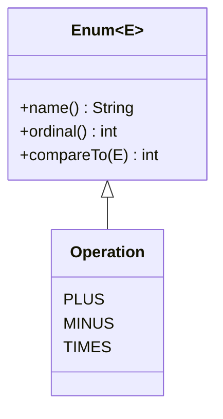

# Enum 활용법

## 핵심 정의
`enum`은 고정된 상수 집합을 표현하는 특수한 클래스로, 내부적으로 `java.lang.Enum`을 암묵적으로 상속하는 클래스로 컴파일된다. JLS 8.9.1에 따르면 상수별 몸체(constant-specific class body)를 가진 상수가 하나라도 있으면 그 enum은 암묵적으로 `sealed`가 된다(JLS 8.9, 허용 하위 타입은 상수별 익명 클래스)(각 상수가 이 enum의 익명 하위 클래스가 되어야 하므로). 다만 `abstract`로 컴파일되는지는 별개의 조건으로, 아래 `Operation`처럼 enum 자신이 구현을 제공하지 않는 추상 메서드(직접 선언한 `abstract` 메서드이거나, 구현한 인터페이스의 메서드를 enum 클래스 차원에서 구현하지 않은 경우)가 남아 있을 때만 컴파일러가 enum 자체를 `abstract` 클래스로 생성한다. 상수별 몸체가 있어도 enum 클래스 자신이 상속받은 추상 메서드를 모두 구현하고 있다면 `abstract`가 아닌 비-`final` 구체 클래스로 컴파일된다. 단순 상수 나열을 넘어 각 상수마다 필드, 생성자, 메서드 오버라이드(상수별 몸체)를 가질 수 있어, 타입 안전한 상수(type-safe enum) 패턴과 전략 패턴(strategy pattern)을 언어 차원에서 지원한다.

## 동작 원리 / 구조
```java
public enum Operation {
    PLUS("+") { public int apply(int a, int b) { return a + b; } },
    MINUS("-") { public int apply(int a, int b) { return a - b; } },
    TIMES("*") { public int apply(int a, int b) { return a * b; } };

    private final String symbol;
    Operation(String symbol) { this.symbol = symbol; }
    public abstract int apply(int a, int b);
    public String symbol() { return symbol; }
}
```

각 상수는 실제로는 `Operation`의 익명 하위 클래스 인스턴스이며, 컴파일러는 이를 `public static final Operation PLUS = ...;` 형태로 생성한다. 생성자는 암묵적으로 `private`이라 외부에서 `new Operation(...)`을 호출할 수 없고, 인스턴스는 해당 enum 클래스의 초기화(initialization) 시점에 한 번씩 생성된다. `Operation`은 `apply()`를 `abstract` 메서드로 선언하고 각 상수가 이를 개별 구현하는 구조라서, 컴파일 결과 `abstract class Operation extends Enum<Operation>`이 되고 `PLUS`/`MINUS`/`TIMES`는 각각 이를 상속한 익명 하위 클래스 인스턴스로 생성된다. 아래 `MemberGrade`처럼 구현한 인터페이스의 메서드를 enum 자신이 구현하지 않고 상수별로만 구현하는 경우도 동일하게 `abstract`로 컴파일된다(`javap`으로 직접 확인 가능). 반면 상수별 몸체가 있어도 상속받은 추상 메서드를 enum 클래스 자신이 전부 구현해 두었다면(예: 몸체 안에서 `toString()`만 오버라이드) `abstract`가 아닌 비-`final` 구체 클래스로 컴파일되며, `PENDING, PAID, CANCELLED`처럼 상수별 몸체가 전혀 없는 단순 나열형 enum만 `final` 클래스로 생성된다.

인터페이스를 구현할 수도 있어, 여러 enum이 같은 계약을 공유하거나 enum 자체를 전략(strategy)으로 주입할 수 있다. 다음 `public` 타입은 각각 같은 이름의 파일에 선언한다.

```java
public interface DiscountPolicy { int discount(int price); }

public enum MemberGrade implements DiscountPolicy {
    BRONZE { public int discount(int price) { return 0; } },
    GOLD   { public int discount(int price) { return price / 10; } };
}
```

`EnumMap`은 enum의 `ordinal()`(선언 순서 인덱스)을 배열 인덱스로, `EnumSet`은 비트 벡터의 위치로 활용한다. 해시 충돌 처리가 필요 없어 해당 용도에서 일반 해시 컬렉션보다 공간과 연산 비용을 줄일 수 있다. 실제 이득은 enum 상수 수와 사용 패턴에 따라 다르다.



## 실무 관점
- 상태 코드, 결제 수단, 주문 상태처럼 값의 집합이 고정된 도메인 개념은 `int`/`String` 상수 대신 `enum`으로 표현해 타입 안전성을 확보한다. 잘못된 문자열/숫자 값이 컴파일 타임에 걸러진다.
- `ordinal()`을 비즈니스 로직이나 영속화(persist)에 직접 쓰면 위험하다. enum 선언 순서를 바꾸거나 중간에 상수를 추가하면 `ordinal()` 값이 밀려, DB에 저장된 값과 실제 enum이 어긋난다. JPA에서 `@Enumerated(EnumType.ORDINAL)` 대신 `EnumType.STRING`을 쓰는 것이 안전하다.
- `switch`로 enum을 분기할 때 새 상수를 추가하면 처리 누락 위험이 있다. Java 21+ 패턴 매칭 switch와 `sealed` 타입을 함께 쓰면 완전성 검사를 얻을 수 있지만, `enum` 자체도 `default` 없는 switch expression에서 컴파일러가 누락을 감지해준다. 자세한 비교는 [[Switch Expression]] 참고.
- OpenJDK 25의 `javac`가 생성하는 `values()`는 배열을 복제(defensive copy)해 반환한다. 측정된 핫 패스(hot path)라면 내부에 캐시할 수 있지만, 캐시 배열을 외부에 노출하면 원소가 변조될 수 있으므로 비공개로 유지하거나 수정 불가 목록을 사용한다.
- 싱글턴(singleton)을 enum으로 구현하면 표준 Java 직렬화와 `Constructor.newInstance()`를 통한 중복 생성을 막을 수 있다. 유일성은 동일한 enum 클래스의 범위이며, 서로 다른 정의 클래스 로더가 로드한 타입이나 저수준 비표준 조작까지 막는 전역 보안 보장은 아니다.

### 상수의 런타임 클래스와 외부 식별자

상수별 몸체가 있는 enum에서 `value.getClass()`는 enum 선언 클래스가 아니라 해당 상수의 익명 하위 클래스를 반환할 수 있다. 동일 enum 타입인지 확인하거나 enum 타입별 메타데이터를 캐시할 때는 `getDeclaringClass()`를 사용한다. `PLUS.getClass() == MINUS.getClass()`가 false여도 서로 다른 enum 타입이라는 뜻이 아니다.

`name()`은 선언한 상수 이름이고 `toString()`은 재정의 가능한 표시 문자열이다. `valueOf`는 `toString()`의 출력이나 대소문자를 보정한 값을 찾아주지 않으며 정확한 선언 이름을 요구한다. 이름도 장기 API·저장 계약으로 쓰면 상수 이름 변경 때 마이그레이션이 필요하므로, 안정된 외부 코드가 필요하면 별도 필드와 명시적인 조회·미지원 값 정책을 둔다.

## 심화 Q&A

### Q. enum 상수별로 메서드를 오버라이드하는 방식과 하나의 메서드 안에서 switch로 분기하는 방식의 트레이드오프는?
상수별 오버라이드는 새 상수를 추가할 때 해당 상수의 구현을 빠뜨리면 컴파일 에러가 나서 안전하지만, 로직이 여러 상수에 흩어져 전체 흐름을 한눈에 보기 어렵다. switch 분기는 로직이 한곳에 모여 가독성이 좋지만 새 상수 추가 시 분기 처리를 빠뜨려도(하위 호환을 위해 `default`를 넣어둔 경우) 컴파일러가 잡아주지 못할 수 있다. 상수마다 동작이 확연히 다르면 전자를, 로직이 비슷하고 데이터 값만 다르면 후자를 선호한다.

### Q. ordinal()을 DB 저장값으로 쓰면 안 되는 이유를 구체적인 장애 시나리오로 설명하면?
`enum Status { PENDING, PAID, CANCELLED }`를 `ORDINAL`로 저장했다고 하자. 이후 요구사항 변경으로 `REFUNDED`를 `PAID`와 `CANCELLED` 사이에 추가하면, 기존에 `ordinal() == 2`(원래 `CANCELLED`)로 저장된 레코드가 배포 후에는 `REFUNDED`로 잘못 해석된다. `STRING`으로 저장했다면 상수 이름이 바뀌지 않는 한 이런 문제가 생기지 않는다.

### Q. enum이 어떻게 리플렉션이나 역직렬화 기반 공격에 안전한 싱글턴을 보장하는가?
동일한 enum 클래스의 초기화 과정에서 각 enum 상수는 정확히 한 번만 생성되도록 언어 명세 수준에서 보장된다. 리플렉션으로 `enum`의 생성자를 강제로 호출하려 하면 `IllegalArgumentException`이 발생하도록 `Constructor.newInstance()`가 명시적으로 막아두었고, 직렬화 시에도 필드 값을 직렬화하는 대신 상수 이름만 저장했다가 역직렬화 시 `Enum.valueOf()`로 기존 인스턴스를 조회하므로 새 인스턴스가 생성되지 않는다.

### Q. EnumMap/EnumSet이 일반 HashMap/HashSet보다 빠른 이유는?
`EnumMap`은 내부적으로 배열을 사용하고, key로 들어오는 enum 상수의 `ordinal()`을 배열 인덱스로 직접 활용한다. 해시 계산이나 충돌 처리, 버킷 탐색이 필요 없어 조회/삽입이 사실상 배열 접근 수준으로 빠르고, 키 공간에 대응하는 배열을 사용한다. 큰 enum에서 극히 적은 키만 저장하면 빈 슬롯 비용도 고려해야 한다. key는 같은 enum 타입이어야 한다. `EnumSet`은 배열형 map과 달리 상수의 포함 여부를 비트로 표현한다.

### Q. enum이 다른 클래스를 상속할 수 없는데도 인터페이스는 구현할 수 있는 이유는 무엇이고, 이게 실무에서 어떻게 쓰이는가?
모든 enum은 컴파일 시 이미 암묵적으로 `java.lang.Enum`을 상속하므로 다중 상속이 불가능한 Java에서 추가 클래스 상속은 애초에 불가능하다. 반면 인터페이스 구현은 제약이 없으므로, 여러 enum이 공통 전략 인터페이스(예: `DiscountPolicy`, `PricingRule`)를 구현하게 만들어 실질적으로 전략 패턴의 구현체 묶음처럼 사용할 수 있다. 이렇게 하면 `if-else`로 전략을 분기하지 않고 enum 값 자체를 전략 객체로 주입할 수 있다.

### Q. enum 상수를 여러 상수 그룹으로 나눠 관리하고 싶을 때(예: 활성/비활성 상태 그룹) 흔히 저지르는 실수는?
`ordinal()` 범위나 상수 이름 문자열 비교로 그룹을 나누려는 시도가 흔한데, 이는 상수 순서/이름 변경에 취약하다. 각 상수에 그룹을 나타내는 필드(예: `boolean active` 또는 `Category category`)를 두고 생성자에서 명시적으로 값을 지정하는 것이 안전하다. 그룹 분류 로직 자체를 enum의 데이터로 만들어야 순서 변경에 영향을 받지 않는다.

## 관련 개념
- [[Switch Expression]]
- [[Sealed Interface와 Pattern Matching]]
- [[불변 객체]]

## 참고 자료

확인 날짜: 2026-09-08. 아래 버전과 범위의 공식 문서·소스로 본문을 대조했다. 성능 비교와 운영 선택은 워크로드에 따라 달라지는 판단 기준이다.

- [JLS 25 §8.9](https://docs.oracle.com/javase/specs/jls/se25/html/jls-8.html#jls-8.9) — enum의 final/sealed 조건, 상수별 몸체와 생성 제한.
- [Enum API](https://docs.oracle.com/en/java/javase/25/docs/api/java.base/java/lang/Enum.html) — Java SE 25 이름·순서·복제 제한.
- [EnumMap API](https://docs.oracle.com/en/java/javase/25/docs/api/java.base/java/util/EnumMap.html) — Java SE 25 배열 표현과 제약.
- [EnumSet API](https://docs.oracle.com/en/java/javase/25/docs/api/java.base/java/util/EnumSet.html) — Java SE 25 비트 벡터 표현.
- [JLS 25 §12.4](https://docs.oracle.com/javase/specs/jls/se25/html/jls-12.html#jls-12.4) — 클래스 초기화 시점.
- [Java Serialization Specification](https://docs.oracle.com/en/java/javase/25/docs/specs/serialization/serial-arch.html) — Java 25 enum 이름 직렬화와 기존 상수 복원.
- [Jakarta Persistence 3.2](https://jakarta.ee/specifications/persistence/3.2/jakarta-persistence-spec-3.2.html) — enum 영속화의 ORDINAL/STRING 매핑.
- [Constructor API](https://docs.oracle.com/en/java/javase/25/docs/api/java.base/java/lang/reflect/Constructor.html) — Java SE 25 newInstance의 enum 생성 거부.
- [OpenJDK 25 javac Lower 소스](https://raw.githubusercontent.com/openjdk/jdk/jdk-25-ga/src/jdk.compiler/share/classes/com/sun/tools/javac/comp/Lower.java) — 생성된 enum values 메서드의 방어적 배열 복사.

### 2026-09-23 부분 재검증

[Java SE 25 Enum](https://docs.oracle.com/en/java/javase/25/docs/api/java.base/java/lang/Enum.html)의 getDeclaringClass·name/toString·valueOf 계약을 확인했다. OpenJDK 25.0.2+10-69에서 상수별 getClass 차이와 동일 getDeclaringClass, 표시 문자열로 valueOf 호출 시 거부를 실행 확인했다. JPA 매핑·직렬화 전체의 재검증은 아니므로 기존 verified를 유지한다.
