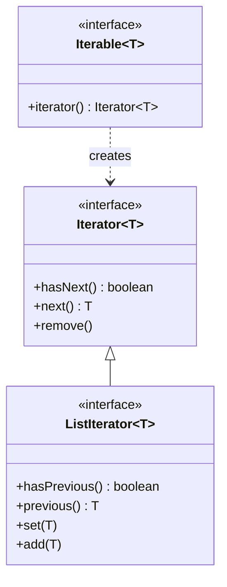

# Iterator와 Iterable

## 핵심 정의
`Iterable<T>`은 "향상된 for문(for-each)으로 순회할 수 있다"는 계약을 나타내는 인터페이스로, `iterator()` 메서드 하나만 요구한다. `Iterator<T>`는 실제 순회 상태(현재 위치)를 들고 있는 반복자(iterator pattern) 구현체로, `hasNext()`/`next()`/`remove()`를 제공한다. `Iterable`은 "순회 가능한 컬렉션 자체"를, `Iterator`는 "그 컬렉션을 훑고 있는 커서(cursor)"를 표현한다는 점에서 역할이 분리되어 있다.

## 동작 원리 / 구조
```java
for (String s : list) {
    System.out.println(s);
}
```
`list`가 `Iterable`일 때 위 for-each 문은 다음과 같은 순회로 변환된다. 배열에 대한 향상된 for문은 인덱스 기반 순회로 변환된다.

```java
Iterator<String> it = list.iterator();
while (it.hasNext()) {
    String s = it.next();
    System.out.println(s);
}
```

순회 중 컬렉션의 구조를 변경(원소 추가/삭제)하면 `ConcurrentModificationException`이 발생할 수 있다. 대부분의 JDK 컬렉션 구현체는 수정 횟수를 추적하는 `modCount` 필드를 두고, `Iterator`가 `next()`/`remove()`를 호출할 때마다 자신이 생성될 당시의 `modCount`와 비교하는 fail-fast 방식으로 이를 감지한다.

```java
List<String> list = new ArrayList<>(List.of("a", "b", "c"));
for (String s : list) {
    if (s.equals("a")) list.remove(s); // ArrayList에서는 이어지는 next()에서 CME
}
```

fail-fast 검출은 최선 노력(best effort)이다. 위에서 `"b"`를 제거하면 OpenJDK 25 `ArrayList`에서는 커서와 새 크기가 같아져 예외 없이 순회가 끝날 수도 있다. 예외 발생 자체를 정확성 조건으로 사용하지 않는다.

해당 반복자가 제거를 지원한다면 순회 중 제거에 `Iterator.remove()`를 쓴다.

```java
Iterator<String> it = list.iterator();
while (it.hasNext()) {
    if (it.next().equals("b")) it.remove(); // modCount를 iterator 내부에서 동기화
}
```

`ListIterator`는 `Iterator`를 확장해 양방향 순회(`hasPrevious()`, `previous()`)와 순회 중 원소 교체(`set()`)/삽입(`add()`)까지 지원한다.



Java 8에서 `Iterable`에 `forEach(Consumer)` 기본 메서드가, `Iterator`에 `forEachRemaining(Consumer)`가 추가되어 람다 기반 순회도 가능하다.

## 실무 관점
- 커스텀 컬렉션이나 트리/그래프 구조를 순회 가능하게 만들 때 `Iterable`을 구현하면 for-each 문법과 스트림(`StreamSupport.stream(iterable.spliterator(), false)`) 양쪽에서 자연스럽게 쓸 수 있다.
- `ConcurrentModificationException`은 컴파일 타임에 잡히지 않고 순회 도중 실제로 구조 변경이 일어나야 발생하므로, 조건에 따라 드물게 재현되는 버그로 나타나기 쉽다. 리스트에서 조건부 삭제가 필요하면 `Iterator.remove()`, `removeIf()`, 또는 새 리스트에 살아남을 원소만 모으는 방식을 쓴다.
- 멀티스레드 환경에서 `ArrayList`를 순회하며 다른 스레드가 수정하면 fail-fast 메커니즘도 완벽하지 않아(모든 경합을 감지하지 못함) `ConcurrentModificationException` 대신 예측 불가능한 동작이 나올 수 있다. 동시 접근이 필요하면 생성 시점 배열의 스냅샷을 순회하는 `CopyOnWriteArrayList`나 변경을 일부 반영할 수 있는 약한 일관성(weak consistency)의 `ConcurrentHashMap` 등 용도에 맞는 동시성 컬렉션을 선택한다. 자세한 내용은 [[컬렉션 동기화]], [[ConcurrentHashMap]] 참고.
- `Iterator.remove()`는 선택적 연산(optional operation)이라 `List.of()`로 만든 불변 리스트나 배열 기반 뷰(`Arrays.asList()`)에서 호출하면 `UnsupportedOperationException`이 발생한다.

## 심화 Q&A

### Q. ConcurrentModificationException은 왜 "감지"이지 "방지"가 아닌가?
fail-fast 메커니즘은 `modCount`라는 단순 카운터 비교에 불과하며 락(lock) 같은 동기화 장치가 아니다. 단일 스레드에서 순회 중 컬렉션을 직접 수정하는 실수를 빠르게 알아채게 해주는 안전장치일 뿐, 멀티스레드 환경의 진짜 경쟁 상태(race condition)를 막아주지는 못한다. JDK 문서도 이 예외에 절대적으로 의존해 정확성을 보장하지 말라고 명시한다("fail-fast 동작은 버그를 조기에 발견하기 위한 것으로, 정확성을 보장하지 않는다").

### Q. 순회 중 list.remove(item) 대신 iterator.remove()를 써야 안전한 이유는?
컬렉션 자신의 `remove()`는 내부 `modCount`를 증가시키지만, 이미 생성되어 순회 중인 `Iterator`는 이 변경을 알지 못한 채 자신이 기억한 이전 `modCount`와 비교해 불일치를 감지하고 다음 `next()` 호출에서 예외를 던진다. `Iterator.remove()`는 컬렉션을 수정함과 동시에 자신의 내부 상태(기대 `modCount`)도 함께 갱신하므로 다음 `hasNext()`/`next()` 호출이 안전하게 이어진다.

### Q. Iterable과 Iterator를 굳이 두 인터페이스로 분리한 설계 의도는?
하나의 컬렉션 객체에 대해 동시에 여러 개의 독립적인 순회가 진행될 수 있어야 하기 때문이다. 표준 컬렉션에서는 실제 순회 위치를 새 `Iterator`에 분리해 중첩 순회를 지원한다. `Iterable` 인터페이스 자체가 구현체의 무상태성이나 매 호출마다 새 반복자 생성을 강제하는 것은 아니며, 일회성 데이터 소스라면 재순회 제약을 문서화해야 한다. 만약 하나의 인터페이스로 합쳐 컬렉션 자체가 현재 위치를 들고 있었다면, 같은 리스트를 중첩 for-each로 두 번 순회하는 것 자체가 불가능했을 것이다.

### Q. for-each 문에서 Iterator를 명시적으로 얻지 않아도 되는데, 표준 컬렉션은 iterator()에서 왜 독립적인 커서를 반환하는가?
for-each는 매 순회 시작마다 `iterable.iterator()`를 새로 호출하도록 컴파일된다. 만약 `iterator()`가 항상 같은 인스턴스를 재사용해 반환한다면, 중첩 순회나 순회를 중간에 멈췄다가 다시 시작하는 시나리오에서 커서 위치가 서로 간섭해 예측 불가능한 결과가 나온다. 그래서 표준 컬렉션의 `iterator()`는 관례적으로 매 호출마다 초기 위치를 가진 새 `Iterator` 인스턴스를 생성해 반환한다.

### Q. ListIterator가 일반 Iterator보다 제공하는 기능이 왜 List에만 한정되는가?
`ListIterator`의 `previous()`(역방향 이동), `set()`(현재 위치 원소 교체), 인덱스 기반 `nextIndex()`/`previousIndex()`는 모두 "순서가 있고 인덱스로 접근 가능하다"는 `List`의 구조적 특성에 의존한다. `Set`이나 `Queue`도 구현체에 따라 순회 순서는 있지만 `List`식 위치 인덱스 계약을 제공하지 않으므로 이런 연산 자체가 의미를 가지기 어려워, JDK는 `ListIterator`를 `List` 계열에만 제공한다.

### Q. Iterable을 구현한 커스텀 클래스를 Stream API와 연결하려면 어떻게 해야 하는가?
`Iterable`은 기본적으로 `Collection`이 아니므로 `.stream()` 메서드를 바로 가지지 않는다. `StreamSupport.stream(iterable.spliterator(), false)`로 `Iterable`의 `spliterator()`(Java 8부터 기본 메서드로 제공, 내부적으로 `Iterator`를 감싸 구현됨)를 이용해 `Stream`으로 변환할 수 있다. 다만 기본 `spliterator()` 구현은 `Iterator` 기반이라 크기 추정이나 분할(split) 효율이 컬렉션 전용 구현체보다 떨어질 수 있어, 병렬 스트림 성능이 중요하다면 `Spliterator`를 직접 구현하는 것이 유리하다.

### Q. Iterator.remove는 next와 어떤 순서로 호출해야 하는가?
A. 지원하는 반복자에서도 remove는 직전 next로 반환한 요소에 대해 한 번만 허용된다. next 이전이나 연속 두 번째 remove는 IllegalStateException 대상이다. `forEachRemaining`의 콜백 안에서 remove를 호출하거나 예외가 난 뒤 같은 반복자로 이어 처리하는 동작은 일반 Iterator 계약상 정의되지 않는다. 삭제와 복구가 필요하면 next/remove를 직접 제어하는 루프를 쓴다.

### Q. Iterable이면 향상된 for문이 자원도 자동으로 닫는가?
A. 아니다. for-each 변환은 iterator를 얻어 순회할 뿐 AutoCloseable.close를 호출하지 않는다. 파일·DB 커서처럼 외부 자원을 소유하는 Iterable은 원래 자원을 try-with-resources로 관리해야 하며 break나 예외 경로도 포함한다. 순회 인터페이스와 자원 생명주기 계약은 별개다.

## 관련 개념
- [[컬렉션 동기화]]
- [[ConcurrentHashMap]]
- [[Stream API]]
- [[ArrayList와 LinkedList]]

## 참고 자료

확인 날짜: 2026-09-08. 아래 버전과 범위의 공식 문서·소스로 본문을 대조했다. 성능 비교와 운영 선택은 워크로드에 따라 달라지는 판단 기준이다.

- [Iterable API](https://docs.oracle.com/en/java/javase/25/docs/api/java.base/java/lang/Iterable.html) — Java SE 25 iterator·spliterator 기본 계약.
- [Iterator API](https://docs.oracle.com/en/java/javase/25/docs/api/java.base/java/util/Iterator.html) — Java SE 25 선택적 remove와 반복자 계약.
- [ArrayList API](https://docs.oracle.com/en/java/javase/25/docs/api/java.base/java/util/ArrayList.html) — Java SE 25 fail-fast의 최선 노력 성격.
- [CopyOnWriteArrayList API](https://docs.oracle.com/en/java/javase/25/docs/api/java.base/java/util/concurrent/CopyOnWriteArrayList.html) — Java SE 25 스냅샷 반복자.
- [JLS 25 §14.14.2](https://docs.oracle.com/javase/specs/jls/se25/html/jls-14.html#jls-14.14.2) — Iterable과 배열의 향상된 for 변환.

### 2026-09-23 부분 재검증

Java SE 25 Iterator의 remove 상태·forEachRemaining 미정의 동작과 JLS 25 §14.14.2의 for-each 변환을 재확인했다. 기존 전체 검증일은 유지한다.

실행 확인: 2026-09-23, OpenJDK 25.0.2+10-69에서 remove 호출 순서·for-each의 자원 미종료을 재현했다. 구현 관측은 해당 버전 범위로 한정한다.
