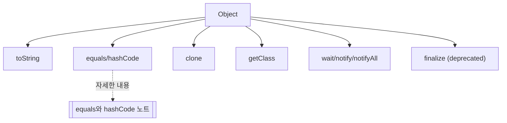

# Object 클래스와 메서드 오버라이드

## 핵심 정의
`java.lang.Object`는 모든 클래스의 최상위 부모로, `equals()`/`hashCode()` 외에도 `toString()`, `clone()`, `getClass()`, `wait()`/`notify()`/`notifyAll()`, `finalize()`(제거 예정) 등 객체 표현과 동시성 제어의 기본 계약을 정의한다. `equals`/`hashCode`는 [[equals와 hashCode]]에서 다루므로, 이 노트는 나머지 메서드들의 재정의(override) 규칙과 실무 함정에 집중한다.

## 동작 원리 / 구조
**toString()** — 기본 구현은 `클래스명@해시코드16진수`를 반환한다. 재정의하지 않으면 로그나 디버깅 출력이 무의미해진다.
```java
@Override
public String toString() {
    return "Point[x=%d, y=%d]".formatted(x, y);
}
```

**clone()** — `Cloneable` 인터페이스를 구현하지 않고 `clone()`을 호출하면 `CloneNotSupportedException`이 발생한다. 기본 구현은 필드를 그대로 복사하는 얕은 복사(shallow copy)라서, 참조 타입 필드는 원본과 복사본이 같은 객체를 공유한다.
```java
public class Box implements Cloneable {
    private List<String> items = new ArrayList<>();

    @Override
    public Box clone() {
        try {
            Box copy = (Box) super.clone();
            copy.items = new ArrayList<>(this.items); // 목록 구조 복사; String 요소는 불변이라 공유 가능
            return copy;
        } catch (CloneNotSupportedException e) {
            throw new AssertionError(e);
        }
    }
}
```

**getClass()** — 런타임 실제 타입을 반환하며 `final` 메서드라 재정의할 수 없다. 리플렉션(reflection) 기반 로직이나 `equals()` 구현에서 타입 비교에 쓰인다.

**wait() / notify() / notifyAll()** — 모니터(monitor) 락(lock)을 가진 스레드가 대기 집합(wait set)에 들어가거나 깨어나게 하는 저수준 동시성 원시 연산(primitive)이다. 반드시 `synchronized` 블록 안에서, 그리고 조건을 `while` 루프로 재검사하며 호출해야 한다(spurious wakeup 대응).
```java
synchronized (lock) {
    while (!condition) {
        lock.wait();
    }
    // 조건 충족 후 처리
}
```

**finalize()** — 객체가 GC(가비지 컬렉션)되기 직전 호출되도록 설계됐던 메서드이지만, 호출 시점 보장이 없고 성능 저하와 예외 처리 문제로 Java 9에서 deprecated, Java 18(JEP 421)에서 forRemoval=true가 되었다. JDK 25에서도 제거 예정 API로 남아 있다. 대안으로 `java.lang.ref.Cleaner`나 `try-with-resources` 기반 `AutoCloseable`을 쓴다.



## 실무 관점
- `toString()`을 재정의하지 않으면 로그에 `com.example.User@1a2b3c4d`처럼 의미 없는 문자열이 찍혀 장애 대응 시 디버깅 시간이 늘어난다. IDE 자동 생성이나 `record`(자동 생성됨), Lombok `@ToString`으로 관리하는 것이 일반적이다. 단 비밀번호, 토큰 등 민감 정보는 `toString()`에 포함하면 로그 유출 위험이 있으므로 제외해야 한다.
- `clone()`은 `Cloneable`의 설계 자체가 결함이 많다고 알려져 있다(Effective Java). 얕은 복사 기본 동작, 체크 예외 처리, 생성자를 거치지 않는 객체 생성 방식 때문에 실무에서는 복사 생성자(copy constructor)나 정적 팩터리 메서드(static factory method)로 명시적인 복사를 구현하는 것을 권장한다.
- `wait()`/`notify()`를 직접 다루는 코드는 거의 작성할 일이 없다. `java.util.concurrent`의 `Lock`, `Condition`, `BlockingQueue`, `CountDownLatch` 등이 이를 안전하게 감싼 상위 도구를 제공한다. 직접 구현이 필요하다면 [[synchronized와 Lock]] 참고.
- `finalize()`에 리소스 정리 로직을 넣는 것은 안티패턴이다. 호출 시점이 GC 스케줄에 종속되어 예측 불가능하고, `finalize()` 안에서 발생한 예외는 무시된다. 파일 핸들, 커넥션 등은 try-with-resources/close로 명시적으로 해제한다. Cleaner의 자동 실행은 시각을 보장하지 않는 보조 수단이다.

### 기본 출력·배열 복사·대기 해제의 경계

`Object.toString()`의 뒤쪽 16진수는 메모리 주소가 아니라 `hashCode()` 반환값이다. `hashCode`만 재정의하면 기본 `toString`에도 그 값이 반영되므로 객체 식별의 유일한 키로 쓰지 않는다. 배열도 `clone`을 지원하지만 `int[][]`를 복제하면 바깥 배열만 새로 만들어지고 각 `int[]`는 공유된다.

`wait`는 호출 대상 모니터에 대한 재진입 횟수만큼의 소유권을 모두 해제하고, 반환 전에 다시 획득한다. 다른 객체의 모니터는 계속 소유한다. `synchronized(a) { synchronized(b) { b.wait(); } }`에서 신호를 만들 스레드가 `a`를 필요로 하면 진행이 막힐 수 있다. 대기 전에 보유한 다른 락까지 함께 해제된다고 가정하지 않는다.

## 심화 Q&A

### Q. wait()를 호출할 때 조건을 if가 아니라 while로 감싸야 하는 이유는?
`notify()`로 깨어난 스레드가 다시 락을 획득했을 때 조건이 여전히 참이라는 보장이 없다. 여러 스레드가 동시에 대기 중이었다면 먼저 깨어난 다른 스레드가 조건을 이미 소비했을 수 있고, JVM 명세상 스퓨리어스 웨이크업(spurious wakeup, `notify` 없이 깨어나는 현상)도 허용된다. `if`로 한 번만 검사하면 조건이 거짓인 채로 임계 구역에 진입하는 버그가 생기므로, 깨어난 뒤에도 조건을 `while`로 재검사해야 한다.

### Q. notify()와 notifyAll()을 상황에 따라 선택하는 기준은?
대기 중인 스레드가 모두 동일한 조건을 기다리고 그중 하나만 깨어나도 충분하면 `notify()`로 오버헤드를 줄일 수 있다. 하지만 서로 다른 조건을 기다리는 스레드들이 같은 모니터에 섞여 있다면 `notify()`는 엉뚱한 스레드를 깨워 나머지가 영원히 대기하는 신호 손실(missed signal) 문제를 일으킬 수 있다. 확신이 없다면 `notifyAll()`이 안전하며, 성능이 중요한 경우에만 조건을 명확히 분리한 뒤 `notify()`를 검토한다.

### Q. clone()이 생성자를 호출하지 않는다는 것이 왜 문제가 되는가?
`super.clone()`은 객체의 필드를 메모리 수준에서 그대로 복제하는 방식으로 동작해, 생성자에서 수행하던 유효성 검증이나 불변식(invariant) 설정 로직을 건너뛴다. 이미 원본 필드에 저장된 값은 복사되므로 모든 필드 초기화가 사라진다는 뜻은 아니다. 그러나 새 인스턴스마다 필요한 외부 등록·고유 식별자 생성 같은 생성자의 부수 효과는 다시 실행되지 않고, 가변 참조를 공유하면 독립성에 관한 불변식도 깨질 수 있다. 이 때문에 Effective Java는 `clone()` 대신 복사 생성자나 정적 팩터리 메서드를 권장한다.

### Q. finalize()가 제거 예정(forRemoval)인 근본적인 이유와 Cleaner가 이를 어떻게 개선했는가?
`finalize()`는 GC 사이클에 종속되어 호출 시점을 예측할 수 없고, 객체가 `finalize()`에서 자기 자신을 다시 참조 가능하게 만들어 GC를 지연시키는(finalizer 부활, resurrection) 문제, 그리고 `finalize()` 내부 예외가 조용히 무시되는 문제가 있었다. `Cleaner`는 정리 대상 객체와 정리 로직을 분리해, 정리 액션이 대상 객체를 강하게 참조하지 않도록 개발자가 설계해야 하며, 그렇지 않으면 대상이 phantom reachable이 되지 않아 자동 정리가 실행되지 않는다. 올바른 설계에서는 대상의 부활 없이 정리할 수 있고, 별도 스레드에서 안전하게 실행된다. 다만 `Cleaner`도 명시적 `close()`(`try-with-resources`)의 보조 안전망일 뿐, 1차 리소스 해제 수단으로 권장되지는 않는다.

### Q. getClass()가 final인데도 equals() 구현에서 instanceof 대신 이를 쓰는 경우가 있는 이유는?
`instanceof`는 상속 관계에 있는 하위 클래스와의 비교도 `true`가 될 수 있어 대칭성(symmetry) 계약이 깨지기 쉽다. `getClass() != o.getClass()`로 비교하면 정확히 같은 런타임 클래스일 때만 동등하다고 판단해 이 문제를 피할 수 있지만, 대신 리스코프 치환 원칙과 충돌해 하위 클래스를 상위 타입으로 다루는 다형적(polymorphic) 코드에서 예상과 다른 결과를 줄 수 있다. 값 객체는 보통 `final` 클래스로 만들어 상속 자체를 막는 방식으로 이 딜레마를 회피한다.

### Q. toString()을 재정의할 때 성능 관점에서 주의할 점은?
로그 레벨이 비활성화된 상황에서도 `log.debug("data: " + heavyObject.toString())`처럼 문자열 연결이 인자로 먼저 평가되면, `toString()` 내부에서 컬렉션 순회나 지연 로딩(lazy loading) 프록시 초기화 같은 무거운 연산이 로그 레벨과 무관하게 항상 실행된다. SLF4J 스타일의 플레이스홀더(`log.debug("data: {}", heavyObject)`)를 쓰면 실제로 로그가 출력될 때만 `toString()`이 호출되도록 지연시킬 수 있다.

## 관련 개념
- [[equals와 hashCode]]
- [[synchronized와 Lock]]
- [[try-with-resources]]
- [[불변 객체]]

## 참고 자료

확인 날짜: 2026-09-08. 아래 버전과 범위의 공식 문서·소스로 본문을 대조했다. 성능 비교와 운영 선택은 워크로드에 따라 달라지는 판단 기준이다.

- [Java SE 25 Object](https://docs.oracle.com/en/java/javase/25/docs/api/java.base/java/lang/Object.html) — toString·clone·wait/notify·finalize.
- [Java SE 25 Cleaner](https://docs.oracle.com/en/java/javase/25/docs/api/java.base/java/lang/ref/Cleaner.html) — 액션의 강한 대상 참조 금지 책임·자동 실행 제약.
- [JEP 421](https://openjdk.org/jeps/421) — Java 18 finalization for removal.
- [SLF4J Manual](https://www.slf4j.org/manual.html) — 파라미터화 로그.

### 2026-09-23 부분 재검증

[Java SE 25 Object](https://docs.oracle.com/en/java/javase/25/docs/api/java.base/java/lang/Object.html)의 toString·배열 clone·wait 소유권 범위를 확인했다. OpenJDK 25.0.2에서 hashCode만 재정의한 출력, 중첩 배열의 내부 공유, ThreadMXBean으로 wait 중 다른 모니터가 유지됨을 확인하고 시험 스레드를 정상 종료했다. 기존 finalization·로깅 설명 전체를 재검증한 것은 아니다.
