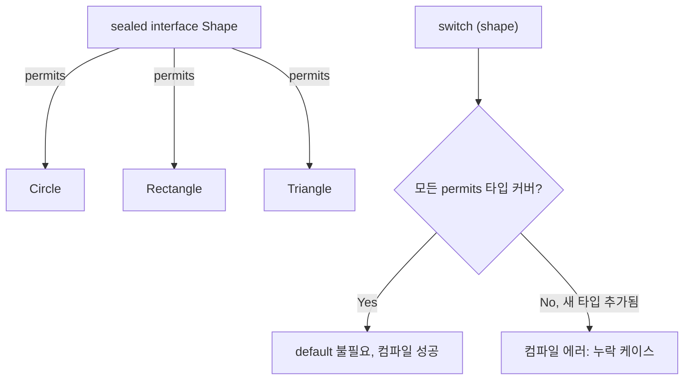

# Sealed Interface와 Pattern Matching

## 핵심 정의
`sealed`는 인터페이스나 클래스가 상속/구현될 수 있는 하위 타입을 컴파일 타임에 명시적으로 제한하는 제어자(modifier)로, JEP 409로 Java 17에서 정식 도입됐다. `permits` 절에 나열된 타입만 해당 sealed 타입을 확장/구현할 수 있다. Pattern Matching은 `instanceof`(JEP 394, Java 16)와 `switch`(JEP 441, Java 21)에서 타입 검사와 캐스팅, 변수 바인딩을 한 번에 처리하는 문법이다. 둘을 결합하면 "허용된 타입 목록이 고정된 계층 구조"에 대해 컴파일러가 분기 누락을 검증해주는 완전성 검사(exhaustiveness check)를 얻는다.

## 동작 원리 / 구조
허용된 직접 하위 클래스는 `final`, `sealed`(재귀적으로 제한), `non-sealed`(제한 해제) 중 하나여야 한다. record의 암묵적 final과 enum의 암묵적 final/sealed도 인정된다. 하위 인터페이스는 sealed 또는 non-sealed이며 final일 수 없다. 예제 타입은 같은 패키지의 한 파일에 둘 수 있도록 package-private으로 선언했다.

```java
sealed interface Shape permits Circle, Rectangle, Triangle {}

final class Circle implements Shape {
    public final double radius;
    public Circle(double radius) { this.radius = radius; }
}
non-sealed class Rectangle implements Shape { // 누구나 상속 가능하도록 개방
    private final double width, height;
    public Rectangle(double width, double height) { this.width = width; this.height = height; }
    public double width() { return width; }
    public double height() { return height; }
}
sealed class Triangle implements Shape permits IsoscelesTriangle { // 계층을 한 단계 더 제한
    private final double base, height;
    public Triangle(double base, double height) { this.base = base; this.height = height; }
    public double base() { return base; }
    public double height() { return height; }
}
```

위 선언에 다음 허용 하위 클래스도 함께 필요하다.

```java
final class IsoscelesTriangle extends Triangle {
    IsoscelesTriangle(double base, double height) { super(base, height); }
}
```

`permits`를 생략하면 같은 컴파일 단위에 선언된 직접 하위 타입만 추론한다. 명시한 허용 하위 타입의 위치는 named module에서는 같은 모듈, unnamed module에서는 같은 패키지로 제한된다.

instanceof pattern matching은 타입 검사에 성공하면 캐스팅 없이 바로 지역 변수를 바인딩한다.

```java
if (shape instanceof Circle c) {
    System.out.println(c.radius);
}
```

이 바인딩 변수는 흐름에 따라 스코프가 좁아지는 flow scoping을 따른다. 예를 들어 `if (!(shape instanceof Circle c)) return;` 뒤에서는 앞선 반환을 통과했다는 사실로 매칭 성공이 보장되어 `c`를 사용할 수 있다.

switch pattern matching은 타입 분기, 값 분해(record pattern), 조건부 가드(`when`)를 한 문장으로 표현한다.

```java
double area(Shape shape) {
    return switch (shape) {
        case Circle c when c.radius <= 0 -> 0.0;
        case Circle c -> Math.PI * c.radius * c.radius;
        case Rectangle r -> r.width() * r.height();
        case Triangle t -> 0.5 * t.base() * t.height();
    };
}
```

참조형 selector의 null은 `case null`을 따로 쓰지 않으면 NPE를 던지며 default도 null을 처리하지 않는다.

`Shape`가 `sealed`이고 모든 허용 하위 타입이 분기에 포함되면 `default` 없이도 컴파일이 통과한다. 허용 하위 타입을 추가하고 이 코드를 재컴파일하면 누락을 컴파일 오류로 찾을 수 있다. 기존 클라이언트 바이트코드를 재컴파일하지 않은 채 새 타입을 전달하면 Java 21+에서는 `MatchException`이 발생할 수 있다.



### Java 27의 기본형 패턴은 별도 프리뷰
이 노트의 sealed 타입과 참조형 패턴 switch는 정식 언어 기능이다. `long` 값에 `instanceof int i`를 적용하는 기본형 패턴과 확장된 기본형 switch는 Java 27에서 JEP 532의 다섯 번째 프리뷰이며 `javac --release 27 --enable-preview`와 실행 시 `java --enable-preview`가 필요하다. 기본형 패턴은 단순 강제 캐스팅과 달리 값을 정확히 표현할 수 있는지 검사한다. 기존 참조형 패턴의 정식화가 모든 기본형 패턴의 정식화를 뜻하지 않는다.

## 실무 관점
- 상태 머신(state machine), 도메인 이벤트 계층, 결제 수단·주문 상태처럼 "가능한 경우의 수가 유한하고 고정된" 도메인 모델링에 적합하다. `instanceof` 연쇄나 방문자 패턴(visitor pattern)보다 코드가 짧고 안전하다.
- 새 하위 타입 추가 후 재컴파일 시 그 타입을 다루는 상위 타입 case나 default가 없는 switch에서 누락이 드러나므로, 리팩터링 시 "빠뜨린 곳"을 컴파일러가 찾아준다. 이는 트레이드오프이기도 하다. 자주 확장되는 타입 계층에 `sealed`를 쓰면 하위 타입 추가마다 여러 파일을 함께 고쳐야 해서 변경 비용이 커진다.
- 라이브러리 공개 API에 `sealed`를 쓰면 외부 사용자가 임의로 구현체를 추가하지 못하게 막을 수 있다(API 안정성 보장). 반대로 확장 지점을 열어주고 싶다면 `non-sealed`로 명시해야 한다.
- 하위 타입 누락 없이 `default -> throw new IllegalStateException()`을 습관적으로 넣으면 sealed가 주는 컴파일 타임 안전성이 무력화된다. 완전성 검사를 활용하려면 `default`를 넣지 않는 것이 원칙이다.

## 심화 Q&A

### Q. sealed 대신 enum을 써도 되는 경우와 sealed가 필요한 경우의 차이는?
각 분기가 상태만 다르고 데이터 구조가 동일하면 `enum`으로 충분하다. 하지만 분기마다 보유하는 필드나 로직이 다르면(예: `Circle`은 반지름, `Rectangle`은 너비/높이) `enum` 상수는 이를 표현하기 어렵다. `sealed` 인터페이스 + `record` 조합은 분기별로 서로 다른 데이터 구조를 가지면서도 완전성 검사를 유지할 수 있다.

### Q. non-sealed 하위 타입을 하나라도 허용하면 sealed의 이점이 어떻게 줄어드는가?
`non-sealed` 타입은 제3자가 자유롭게 상속할 수 있으므로, 그 타입을 다시 상속한 미지의 하위 클래스가 `switch`에 나타날 수 있다. `case Rectangle r` 하나로 그 모든 하위 인스턴스를 처리하므로 위 예제는 여전히 default 없이 완전하다. 다만 Rectangle의 하위 클래스들을 유한하게 열거하고 누락을 검사하는 닫힌 계층의 이점은 그 아래에서 사라진다.

### Q. switch의 pattern case 순서가 왜 중요한가?
switch pattern matching은 라벨을 위에서 아래로 순서대로 평가하며 첫 번째로 일치하는 라벨을 선택한다. `case Circle c when c.radius <= 0`처럼 더 구체적인 가드 조건을 상위 타입 매칭보다 먼저 배치하지 않으면, 앞선 무가드 타입 패턴이 후속 가드 패턴을 지배(dominance)하므로 컴파일 오류가 난다. 상속 관계가 있는 타입 패턴을 섞어 쓸 때는 더 구체적인(하위) 타입이나 조건을 먼저 배치해야 한다.

### Q. Record Pattern과 결합하면 어떤 것이 더 가능해지는가?
위 예제의 `Rectangle`은 일반 클래스이므로 분해할 수 없다. 별도 모델 `record Rect(double w, double h) {}`라면 `case Rect(var w, var h) when w == h ->`처럼 타입 매칭과 컴포넌트 분해, 조건부 가드를 한 줄로 표현할 수 있다. 중첩된 record까지 한 번에 분해하는 것도 가능해 `outer.inner().value()` 같은 체이닝 호출 없이 `case Outer(Inner(var value)) ->`로 바로 값을 꺼낼 수 있다. 자세한 문법은 [[Record]] 참고.

### Q. instanceof pattern matching의 flow scoping이 실패하는 대표적인 예는?
```java
if (obj instanceof String s || obj instanceof Integer) {
    // s를 여기서 사용할 수 없다: || 우변에서 s가 바인딩되지 않을 수 있음
}
```
`||`의 양쪽 피연산자가 서로 다른 바인딩 변수를 갖거나 한쪽만 바인딩하면, 컴파일러는 해당 변수가 항상 확정적으로 할당됐다고 보장할 수 없어 컴파일 에러를 낸다. `&&`는 좌변이 참이어야 우변이 평가되므로 이런 문제가 없다.

### Q. sealed 계층에 하위 타입을 추가했는데 기존 switch가 컴파일 에러 없이 통과한다면 무엇을 의심해야 하는가?
해당 `switch`에 `default` 절이나 상위 타입(예: `Shape s ->`)을 잡는 catch-all 분기가 이미 있는 경우다. 이러면 새로 추가된 타입이 의도한 로직 없이 catch-all 분기로 빠져 조용히 처리될 수 있다. 완전성 검사의 이점을 살리려면 catch-all 분기를 지양하고, 정말 필요한 경우에만 의도적으로 추가해야 한다.

## 관련 개념
- [[Record]]
- [[Switch Expression]]
- [[Enum 활용법]]

## 참고 자료

확인 날짜: 2026-09-08. 아래 버전과 범위의 공식 문서·소스로 본문을 대조했다. 성능 비교와 운영 선택은 워크로드에 따라 달라지는 판단 기준이다.

- [JLS 25 §8.1.6](https://docs.oracle.com/javase/specs/jls/se25/html/jls-8.html#jls-8.1.6) — sealed 클래스 허용 타입과 위치.
- [JLS 25 §9.1.4](https://docs.oracle.com/javase/specs/jls/se25/html/jls-9.html#jls-9.1.4) — sealed 인터페이스 permits 추론.
- [JLS 25 §14.11](https://docs.oracle.com/javase/specs/jls/se25/html/jls-14.html#jls-14.11) — switch 완전성·지배 관계·null.
- [JEP 409](https://openjdk.org/jeps/409) — Java 17 sealed 정식화.
- [JEP 394](https://openjdk.org/jeps/394) — Java 16 instanceof 패턴과 흐름 스코프.
- [JEP 441](https://openjdk.org/jeps/441) — Java 21 패턴 switch·분리 컴파일 MatchException.
- [JEP 440](https://openjdk.org/jeps/440) — Java 21 record 패턴.

부분 재검증: 2026-09-22. [Java 27 Language Changes](https://docs.oracle.com/en/java/javase/27/language/primitive-types-patterns-instanceof-switch.html)의 프리뷰 상태를 확인했다. JDK 27에서 long→int 패턴이 옵션 없이 컴파일 오류이고, 프리뷰 활성화 시 int 범위 값과 Long.MAX_VALUE를 구분함을 실행 확인했다. sealed 계층의 나머지 설명은 기존 검증 범위를 유지한다.
