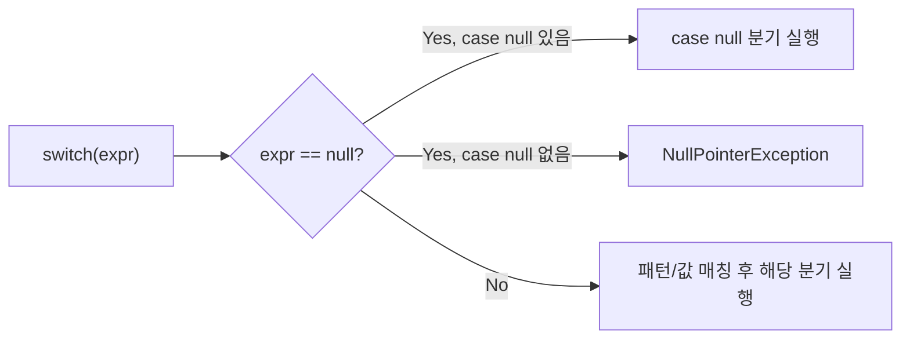

# Switch Expression

## 핵심 정의
Switch Expression은 `switch`를 값을 반환하는 표현식(expression)으로 쓸 수 있게 한 문법으로, JEP 361로 Java 14에서 정식화됐다. 기존 `switch` 문(statement)은 값을 만들지 못하고 분기 실행만 담당했지만, expression 형태는 `case` 라벨마다 값을 산출해 변수 대입이나 `return`에 바로 쓸 수 있다. `->` 화살표 문법과 여러 라벨을 콤마로 묶는 다중 라벨을 함께 도입해 화살표 분기에서 의도치 않은 폴스루(fall-through)를 방지한다. switch expression 자체는 `:` 라벨도 지원하므로, 폴스루 금지는 표현식 여부가 아니라 화살표 문법의 성질이다.

## 동작 원리 / 구조
```java
// 기존 statement 방식: fall-through 위험, break 누락 시 버그
String result;
switch (day) {
    case MONDAY:
    case TUESDAY:
        result = "평일 초반";
        break;
    default:
        result = "기타";
}

// switch expression: 화살표는 break 없이 자동 종료, 값 산출
String result2 = switch (day) {
    case MONDAY, TUESDAY -> "평일 초반";
    case SATURDAY, SUNDAY -> "주말";
    default -> "기타";
};
```

블록 본문이 필요하면 `yield`로 값을 넘긴다.

```java
int score = switch (grade) {
    case "A" -> 4;
    case "B" -> {
        System.out.println("B 학점 처리");
        yield 3;
    }
    default -> 0;
};
```

Java 21에서 Pattern Matching for switch(JEP 441)가 정식화되며 `case null`을 명시적으로 처리하는 문법이 추가됐다.

```java
String describe(Object obj) {
    return switch (obj) {
        case null -> "null 입력";
        case Integer i -> "정수: " + i;
        case String s -> "문자열: " + s;
        default -> "알 수 없음";
    };
}
```

기존에는 `switch(obj)`에 `null`이 들어오면 `NullPointerException`이 발생했지만, `case null`을 명시하면 이를 정상 분기로 처리할 수 있다. `case null`을 쓰지 않으면 기존과 동일하게 NPE가 발생한다(하위 호환 유지).



## 실무 관점
- `if-else if` 연쇄나 다중 `return`을 값 매핑 로직으로 바꿀 때 switch expression을 쓰면 각 분기의 반환값이 명확히 드러나고, 컴파일러가 (enum이나 sealed 타입 대상일 때) 분기 누락을 검증해준다.
- 한 `switch` 블록 안에서 `:`(콜론) 문법과 `->`(화살표) 문법을 섞어 쓸 수 없다. 혼용 금지는 하나의 switch 블록에만 적용되며, 같은 파일이나 메서드의 다른 switch는 별도 문법을 사용할 수 있다.
- `enum`을 대상으로 한 switch expression에서 모든 상수를 다루면 `default` 없이 컴파일된다. 이후 enum에 상수가 추가된 상태로 해당 switch를 재컴파일하면 컴파일 오류가 나므로, "값 추가 시 처리 누락"을 컴파일 타임에 잡아주는 안전장치로 활용할 수 있다.
- 화살표 문법에서도 `yield` 없이 블록 안에 여러 문장을 넣고 마지막에 값을 내지 않으면 컴파일 에러가 난다. 블록은 값을 내지 않고 정상 종료할 수 없다. 값이 필요한 경로는 yield로 결과를 내고, 다른 경로는 throw 등으로 비정상 종료할 수 있다.

## 심화 Q&A

### Q. 화살표 switch 라벨이 fall-through를 없앤 설계 의도는?
기존 `switch` 문의 fall-through는 `break` 누락이라는 흔한 버그의 원인이었다. 화살표 문법은 각 라벨을 독립된 분기로 취급해 다음 라벨로 넘어가지 않도록 설계했다. 여러 라벨을 콤마로 묶는 것은 동일한 하나의 본문을 공유하는 것이며 폴스루가 아니다. 결과적으로 "실수로 다음 케이스까지 실행되는" 버그 클래스 자체를 언어 차원에서 제거했다.

### Q. yield와 return의 차이는 무엇인가?
`yield`는 switch expression 블록의 값을 해당 switch 식 자체에 돌려주는 키워드이고, `return`은 메서드 전체를 종료하며 값을 돌려준다. switch expression 바깥 메서드를 종료하려는 `return`을 그 본문에 쓰면 컴파일 오류다. switch statement 본문의 return과 혼동하지 않는다. 값만 산출하고 switch 다음 로직을 계속 실행하고 싶다면 반드시 `yield`를 써야 한다.

### Q. 한 switch 블록에서 콜론 라벨과 화살표 라벨을 혼용할 수 없는 이유는?
두 문법은 서로 다른 제어 흐름 의미(폴스루 여부)을 가지므로 혼용을 허용하면 한 블록 안에서 라벨마다 다른 규칙이 적용돼 가독성과 예측 가능성이 심각하게 떨어진다. 언어 설계 차원에서 아예 문법적으로 금지해 혼란을 차단했다.

### Q. enum을 대상으로 한 switch expression에서 default를 생략했는데 나중에 enum 상수가 추가되면 어떤 일이 벌어지는가?
새 enum 정의를 사용해 해당 switch를 재컴파일하면 완전성 부족으로 컴파일 오류가 난다. 재컴파일 없이 새 상수를 기존 바이트코드에 전달하는 경우는 다르며, Java 21+에서는 `MatchException`이 발생할 수 있다. 이는 버그가 아니라 의도된 안전장치로, "새 값에 대한 처리를 빠뜨리지 않았는지" 컴파일 타임에 강제로 확인시킨다. 반대로 `default`를 넣으면 새 상수가 조용히 `default` 분기로 흡수돼 누락을 알아채기 어려워진다.

### Q. case null 문법이 도입되기 전에는 null을 switch에서 어떻게 처리했는가?
`switch` 진입 전에 별도로 `if (obj == null) { ... }`를 두어 사전에 걸러내야 했다. `case null`은 이 방어 로직을 switch 문법 안으로 통합해, null 처리와 타입/값 매칭을 한 곳에서 선언적으로 관리할 수 있게 한다. 다만 `case null`을 넣지 않은 기존 코드는 여전히 null 입력 시 NPE를 던지므로 하위 호환은 유지된다.

### Q. 패턴 매칭 switch에서 여러 case가 동시에 만족 가능한 타입일 때 어떤 것이 선택되는가?
switch는 라벨을 선언 순서대로 검사해 처음으로 일치하는 라벨을 선택한다. 상위 타입과 하위 타입을 같은 switch에 섞어 쓸 경우 하위 타입을 먼저 배치하지 않으면 상위 타입 라벨이 항상 먼저 매칭돼 하위 타입 전용 분기가 죽은 코드(dead code)가 되고, 이 경우 컴파일러가 도달 불가능(unreachable) 에러를 낸다.

Java 27의 기본형 확장 switch와 기본형 패턴은 정식 switch 표현식과 별도인 프리뷰 기능이다. 버전 구분은 [[Sealed Interface와 Pattern Matching#Java 27의 기본형 패턴은 별도 프리뷰]]를 참고한다.

## 관련 개념
- [[Sealed Interface와 Pattern Matching]]
- [[Enum 활용법]]
- [[Text Block]]

## 참고 자료

확인 날짜: 2026-09-08. 아래 버전과 범위의 공식 문서·소스로 본문을 대조했다. 성능 비교와 운영 선택은 워크로드에 따라 달라지는 판단 기준이다.

- [JLS 25 §14.11](https://docs.oracle.com/javase/specs/jls/se25/html/jls-14.html#jls-14.11) — switch 라벨·null·지배 관계.
- [JLS 25 §15.28](https://docs.oracle.com/javase/specs/jls/se25/html/jls-15.html#jls-15.28) — switch expression의 값·제어 이전 제약.
- [JEP 361](https://openjdk.org/jeps/361) — Java 14 화살표·콜론 expression과 yield.
- [JEP 441](https://openjdk.org/jeps/441) — Java 21 null 패턴과 MatchException.

부분 재검증: 2026-09-22. [Java 27 기본형 패턴·switch](https://docs.oracle.com/en/java/javase/27/language/primitive-types-patterns-instanceof-switch.html)의 프리뷰 상태만 추가 확인했다.
