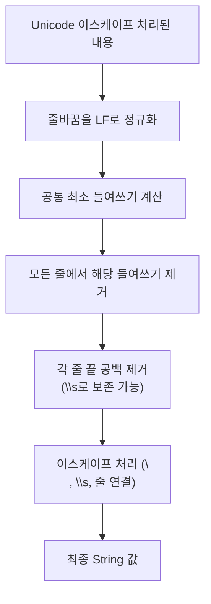

# Text Block

## 핵심 정의
Text Block은 여러 줄 문자열 리터럴을 `"""`(삼중 큰따옴표)로 감싸 작성하는 문법으로, JEP 378로 Java 15에서 정식 도입됐다. 줄바꿈이나 큰따옴표를 이스케이프(escape)할 필요가 없고, 컴파일러가 소스 코드의 들여쓰기를 분석해 불필요한 공백(부수적 공백, incidental whitespace)을 자동으로 제거한다. JSON, SQL, HTML처럼 여러 줄로 구성된 텍스트를 코드에 임베드할 때 가독성을 크게 높인다.

## 동작 원리 / 구조
```java
String json = """
    {
        "name": "Alice",
        "age": 30
    }
    """;
```

컴파일러는 다음 규칙으로 최종 문자열을 결정한다.
1. 여는 `"""` 뒤에는 선택적 공백 다음 줄바꿈이 반드시 와야 한다. 내용의 줄바꿈을 LF로 정규화한 뒤 부수적 공백을 제거하고 마지막에 escape sequence를 해석한다.
2. 각 줄에서 공통으로 나타나는 최소 들여쓰기를 찾아 모든 줄에서 동일하게 제거한다. 비어 있지 않은 내용 줄과 마지막 빈 줄이 최소 들여쓰기 계산에 참여한다. **닫는 `"""`가 단독 줄에 있으면 그 앞의 공백도 계산에 포함**되므로, 닫는 delimiter를 왼쪽으로 붙이면 본문 들여쓰기가 그대로 유지된다.
3. 각 줄 끝의 공백(trailing whitespace)은 자동 제거된다. 의도적으로 줄 끝 공백을 남기려면 `\s`(essential space) 이스케이프를 쓴다.
4. 줄 끝에 `\`(backslash)를 두면 그 줄바꿈이 결과 문자열에 포함되지 않는다(긴 한 줄을 소스 코드에서만 나눠 쓸 때 사용).

```java
String noNewline = """
    첫 줄 \
    두 번째처럼 보이지만 한 줄로 이어짐""";
```

Unicode 이스케이프(`\uNNNN`)는 어휘 분석보다 먼저 실제 문자로 치환된다. 예를 들어 `\u0020`은 공백 제거 단계의 대상이 된다. 공백 제거 이후 개행·공백을 추가하려면 `\n`, `\s`를 사용한다. Unicode 이스케이프 자체가 금지된 것은 아니다.



## 실무 관점
- SQL 쿼리, JSON/XML 샘플 데이터, 테스트 코드의 기대값 문자열처럼 여러 줄 텍스트를 다룰 때 이스케이프 지옥(`\"`, `\n` 연쇄)을 없애준다. JPA/QueryDSL의 네이티브 쿼리나 통합 테스트의 응답 본문 비교에 특히 유용하다.
- 문자열 보간(interpolation) 기능은 아니다. `+` 연산자나 `String.format()`, `formatted()` 메서드로 변수를 끼워 넣어야 한다. Java 21(JEP 430)과 22(JEP 459)에서 두 차례 미리보기(preview)로 제공됐던 String Templates는 JDK 23에서 세 번째 미리보기로 이어지는 대신, 커뮤니티 피드백을 반영해 설계 자체를 재검토하기로 하며 철회(withdrawn)되었고, 이 노트가 대조한 Java SE 25 언어 명세에는 포함되지 않는다. 따라서 텍스트 블록 안에서 변수를 쓰려면 여전히 줄바꿈을 갖춘 텍스트 블록 뒤에 `.formatted(value)`를 붙일 수 있다. SQL 값 입력은 문자열 보간 대신 PreparedStatement 바인딩을 사용한다.
- 들여쓰기 계산이 "소스 코드상의 시각적 들여쓰기"에 의존하므로, 코드 포매터(formatter)가 텍스트 블록 내부 들여쓰기를 건드리면 최종 문자열 값이 바뀔 수 있다. IDE 자동 정렬 기능이 텍스트 블록을 인식하지 못하는 경우 주의가 필요하다.
- 닫는 `"""`를 본문보다 왼쪽에 두면(들여쓰기 0) 원본 코드의 들여쓰기가 그대로 문자열에 포함돼 의도치 않게 공백이 섞여 들어가는 실수가 흔하다.

## 심화 Q&A

### Q. 닫는 delimiter의 위치가 왜 최종 문자열의 들여쓰기에 영향을 주는가?
컴파일러는 부수적 공백 제거를 위해 "비어 있지 않은 내용 줄 + 마지막 줄이 빈 줄이면 그 줄"을 함께 놓고 공통 최소 들여쓰기를 계산한다. 닫는 delimiter를 코드의 왼쪽 끝에 두면 그 줄의 들여쓰기가 0이 되어 전체 공통 최소 들여쓰기도 0이 되고, 결과적으로 본문 들여쓰기가 그대로 문자열 값에 남는다. 반대로 닫는 delimiter를 본문과 같은 열에 맞추면 그만큼의 들여쓰기가 공통분모로 제거된다.

### Q. 텍스트 블록에서 줄 끝 공백을 의도적으로 남기고 싶을 때 왜 `\s`가 필요한가?
텍스트 블록은 각 줄 끝의 공백을 자동으로 제거하도록 설계됐다(에디터가 저장 시 trailing whitespace를 지우는 경우와의 diff 충돌을 방지하기 위함). 하지만 고정폭 텍스트 포맷이나 특정 프로토콜 페이로드처럼 줄 끝 공백이 의미를 가지는 경우가 있어, `\s`라는 "제거 대상에서 제외되는 필수 공백" 이스케이프를 별도로 도입했다.

### Q. Unicode 이스케이프와 \n·\s의 결과가 다른 이유는?
Java 컴파일러는 Unicode 이스케이프(`\uNNNN`)를 어휘 분석(lexical analysis)보다도 앞선 "원시 소스 파일 읽기" 단계에서 실제 문자로 치환한다. 즉 텍스트 블록의 부수적 공백 제거나 이스케이프 처리 로직이 동작하기 전에 이미 실제 개행 문자나 공백 문자로 바뀌어 있어, 공백 제거와 줄바꿈 정규화의 대상이 된다. 반면 이 단계 뒤에 해석되는 `\n`, `\s` 같은 표준/전용 이스케이프를 써야 원하는 결과를 얻는다.

### Q. 텍스트 블록과 일반 문자열 리터럴을 `+`로 결합할 때 주의할 점은?
텍스트 블록도 컴파일 후에는 동일한 `String` 인스턴스이므로 일반 리터럴과 자유롭게 연결(concatenation)할 수 있다. 다만 텍스트 블록 자체가 이미 개행과 들여쓰기를 포함한 완성된 문자열이므로, 결합 시점에 추가로 이스케이프나 공백을 신경 쓰지 않아도 되는 대신, 부수적 공백 제거 규칙이 "텍스트 블록 리터럴 자체" 안에서만 적용된다는 점을 기억해야 한다. 즉 결합 이후 결과에 재적용되는 것이 아니다.

### Q. 텍스트 블록이 String Pool이나 컴파일 타임 상수 취급에서 일반 문자열과 다르게 동작하는가?
아니다. 컴파일이 끝난 시점에는 이스케이프 처리와 공백 정규화가 모두 끝난 순수한 `String` 리터럴로 취급되며, 다른 문자열 리터럴과 동일하게 String Pool에 인터닝(interning)된다. 상수 표현식으로도 동일하게 취급되어 `final` 필드에 대입하면 컴파일 타임 상수가 될 수 있다. 자세한 내용은 [[String과 String Pool]] 참고.

### Q. 여러 줄 SQL을 텍스트 블록으로 작성할 때 성능이나 캐싱에 영향이 있는가?
텍스트 블록이라는 문법 자체의 런타임 추가 비용은 없다. 최종 String 값이 같으면 호출받는 코드가 원래의 리터럴 작성 방식을 구별할 수 없다. 다만 들여쓰기·개행 때문에 SQL 텍스트가 달라지면 드라이버/DB별 캐시 키와 실행 계획 재사용에 영향을 줄 수 있으므로 최종 문자열과 사용 중인 캐시 구현을 확인한다.

## 관련 개념
- [[String과 String Pool]]
- [[Switch Expression]]
- [[불변 객체]]

## 참고 자료

확인 날짜: 2026-09-08. 아래 버전과 범위의 공식 문서·소스로 본문을 대조했다. 성능 비교와 운영 선택은 워크로드에 따라 달라지는 판단 기준이다.

- [JLS 25 §3.10.6](https://docs.oracle.com/javase/specs/jls/se25/html/jls-3.html#jls-3.10.6) — 텍스트 블록 어휘 규칙·정규화·이스케이프 순서.
- [JEP 378](https://openjdk.org/jeps/378) — Java 15 정식화와 incidental whitespace.
- [JEP 465](https://openjdk.org/jeps/465) — String Templates 세 번째 preview 제안의 Withdrawn 상태.
