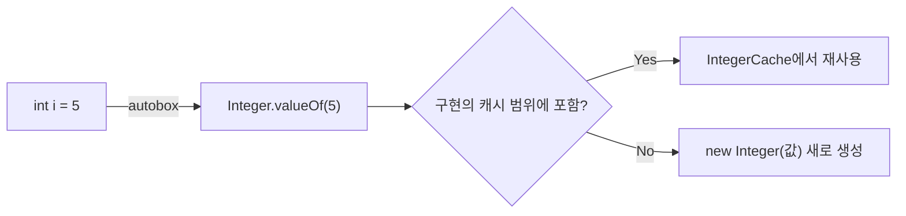

# 가변인자와 오토박싱

## 핵심 정의
가변인자(varargs, `Type... name`)는 메서드 호출 시 인자의 개수를 유동적으로 받을 수 있게 하는 문법으로, 컴파일러가 내부적으로 배열(array)로 변환해 처리한다. 오토박싱(autoboxing)/오토언박싱(auto-unboxing)은 기본형(primitive type, `int`, `long` 등)과 대응하는 래퍼 클래스(wrapper class, `Integer`, `Long` 등) 사이의 변환을 컴파일러가 자동으로 삽입해주는 기능이다. 둘 다 코드 작성을 편하게 해주지만, 내부적으로는 배열 할당이나 박싱 객체 생성이라는 숨은 비용을 동반한다.

## 동작 원리 / 구조
```java
public static int sum(int... numbers) {
    int total = 0;
    for (int n : numbers) total += n;
    return total;
}

sum(1, 2, 3);       // 컴파일러가 new int[]{1, 2, 3}으로 변환
sum();               // 빈 배열 new int[0] 전달
sum(new int[]{1,2}); // 배열을 직접 넘겨도 동일하게 동작
```

가변인자는 파라미터 목록의 마지막에만 올 수 있고, 한 메서드에 하나만 선언할 수 있다. 오버로딩(overloading) 해소 규칙상 가변 길이 호출 변환이 필요한 후보보다 고정 길이 호출로 적용 가능한 후보를 먼저 찾는다. varargs 선언도 배열 인자를 그대로 받는 고정 길이 후보로 참여할 수 있다.

오토박싱은 컴파일러가 `Integer.valueOf(int)` / `Integer.intValue()` 호출을 자동 삽입하는 것이다.

```java
Integer boxed = 127;      // Integer.valueOf(127) 자동 호출
int unboxed = boxed + 1;  // boxed.intValue() 자동 호출 후 연산
```

`Integer.valueOf()`는 `-128 ~ 127` 범위의 값을 내부 캐시(cache)에서 재사용한다. 이 범위는 API가 보장하는 최소 범위이며, 더 넓은 값도 캐시할 수 있다. OpenJDK HotSpot 25에서는 `-XX:AutoBoxCacheMax`가 상한에 영향을 줄 수 있다.

```java
Integer a = 100, b = 100;
System.out.println(a == b); // true, 캐시된 동일 인스턴스

Integer c = 200, d = 200;
System.out.println(c == d); // 기본 HotSpot 캐시 설정에서는 false; 확장 캐시에서는 true일 수도 있음
```



가변인자와 오토박싱이 겹치면 예상치 못한 동작이 나온다.

```java
static void print(Object... args) { System.out.println(args.length); }
print(1, 2, 3);       // int들이 각각 Integer로 박싱되어 3개 요소 배열
print((Object) null); // null 하나를 명시적으로 감싸 args.length == 1
print(null);           // 컴파일 경고: args 자체가 null 배열로 해석됨 (args.length에서 NPE)
```

## 실무 관점
- 로깅(logging) 메서드(`log.info("msg {} {}", a, b)`), `String.format()`, 컬렉션 팩토리 등에서 가변인자가 쓰인다. 실제 가변 길이 호출은 배열을 만들지만, 배열을 직접 넘기면 복사하지 않으며 JIT가 할당을 없앨 수도 있다. `List.of(1,2,3)`은 고정 인수 오버로드라 varargs 배열을 만들지 않는다. 따라서, 매우 빈번하게 호출되는 핫 패스에서는 고정 인자 오버로드(1~3개 전용 메서드)를 별도로 제공해 배열 할당을 피하는 경우가 있다(예: 로깅 프레임워크의 `info(String, Object)`, `info(String, Object, Object)` 오버로드).
- `List<Integer>`나 `Map<String, Integer>`처럼 제네릭(generic) 컬렉션에 기본형 값을 넣을 때마다 오토박싱이 발생한다. 대량의 숫자 데이터를 다루는 반복문에서 박싱된 `Integer` 컬렉션을 쓰면 기본형 배열 대비 메모리 오버헤드(객체 헤더, 참조 간접 비용)와 GC 압박이 커진다. 성능이 중요한 수치 연산에는 기본형 배열이나 스트림의 `IntStream`/`LongStream`/`DoubleStream`을 쓰는 것이 유리하다.
- `==`로 `Integer`를 비교하는 코드는 캐시 범위(`-128~127`) 안에서는 우연히 동작하다가 범위를 벗어나는 값에서 버그가 드러나는 전형적인 패턴이다. 래퍼 타입 비교는 항상 `equals()`를 써야 한다.
- 삼항 연산자(`condition ? intValue : integerObject`)에서 피연산자 타입이 섞이면 언박싱이 암묵적으로 일어나 `NullPointerException`이 발생할 수 있다. 한쪽이 `null`인 `Integer`와 `int`를 섞어 쓰면 `null`을 언박싱하려다 NPE가 터진다.

### 기본형 배열과 배열 공변성

`Arrays.asList(new int[]{1, 2})`는 `List<Integer>`가 아니라 원소 하나가 `int[]`인 `List<int[]>`다. 박싱은 기본형 배열 전체를 래퍼 배열로 변환하지 않는다. 원소별 숫자 목록이 필요하면 `Arrays.stream(values).boxed().toList()`처럼 변환을 명시한다.

`Object...` 메서드에 이미 존재하는 `Object[]`를 전달하면 그 배열을 그대로 받으므로 내부 대입이 호출자의 배열도 바꾼다. `String[]`는 배열 공변성(array covariance) 때문에 `Object[]`로 전달할 수 있지만 런타임 배열 타입은 여전히 `String[]`다. 그 배열에 Integer 등을 넣으면 `ArrayStoreException`이 발생한다. 읽기용 varargs API에서 전달받은 배열을 작업 버퍼처럼 덮어쓰지 않는다.

## 심화 Q&A

### Q. 가변인자 메서드와 고정 인자 오버로드가 동시에 존재할 때 어떤 것이 선택되는가?
Java 오버로딩 해소는 3단계로 진행된다. 1단계는 박싱/언박싱과 가변인자 변환 없이 일치하는 메서드를 찾고, 2단계는 박싱/언박싱을 허용해 찾고, 3단계에서야 가변인자(배열 변환)를 허용해 찾는다. 먼저 적용 가능한 단계 안에서 가장 구체적인 메서드를 고른다. `Object...` 선언도 `Object[]`를 받는 고정 길이 호출로 1·2단계에 참여하므로, 단순히 선언된 인자 개수만으로 우선순위를 정할 수 없다.

### Q. print(null)이 컴파일 경고를 내는 이유와 실제로 어떻게 해석되는가?
`Object... args`는 `Object[] args`와 동일하게 취급되는데, `null`은 `Object` 타입도 될 수 있고 `Object[]` 타입도 될 수 있어 컴파일러가 모호성 경고를 낸다. 실제로는 `Object[]`로 해석되어 `args` 자체가 `null`이 되므로, 메서드 안에서 `args.length`에 접근하면 `NullPointerException`이 발생한다. 의도가 "null 하나짜리 배열"이라면 `(Object) null`로 명시 캐스팅해야 한다.

### Q. Integer 캐시의 보장 범위가 -128~127이고, 이 범위를 벗어난 값에서도 캐시를 강제할 수 있는가?
`Integer.valueOf`는 최소 `-128~127` 재사용을 API로 보장한다. 이는 캐시의 최대 범위를 고정한다는 뜻은 아니다. JVM 옵션 `-XX:AutoBoxCacheMax=<n>`로 캐시 상한을 늘릴 수 있지만, 범위를 벗어난 값의 동일성 비교를 `==`에 의존하는 설계 자체가 취약하므로 옵션에 의존하기보다 `equals()`를 쓰는 것이 근본적인 해결책이다.

### Q. 삼항 연산자에서 Integer와 int를 섞을 때 NPE가 발생하는 구체적인 메커니즘은?
`condition ? intPrimitive : integerObject` 형태에서 두 피연산자의 타입이 다르면 컴파일러는 공통 타입으로 승격(promotion)시키기 위해 `Integer` 쪽이 아니라 `int` 쪽으로 통일하려 시도한다. 이 과정에서 `integerObject`가 오토언박싱되는데, 이 값이 `null`이면 `intValue()` 호출 시점에 NPE가 발생한다. 표현식의 타입은 컴파일 타임에 결정되지만 실행 시에는 선택한 피연산자만 평가한다. 따라서 이 예제에서 `condition`이 true이면 null인 `integerObject`를 평가하거나 언박싱하지 않아 NPE가 발생하지 않는다.

### Q. 가변인자를 받는 제네릭 메서드에서 "unchecked generic array creation" 경고가 뜨는 이유는?
제네릭 배열은 타입 소거(type erasure) 때문에 실체화(reify)될 수 없는데, 가변인자는 내부적으로 배열을 생성해야 한다. `List<String>... lists` 같은 선언은 실제로는 `List[]` 원시 배열을 만들면서 힙 오염(heap pollution) 가능성을 안게 되어 컴파일러가 경고를 낸다. `@SafeVarargs`는 해당 메서드가 가변인자 배열에 안전하지 않은 대입을 하거나 그 배열을 위험하게 노출하지 않음을 개발자가 보증한다는 애노테이션으로, `static` 메서드, `final` 또는 `private` 인스턴스 메서드(Java 9+), 생성자에만 붙일 수 있다(오버라이드 가능한 인스턴스 메서드에는 하위 클래스가 계약을 깰 수 있어 허용되지 않는다).

### Q. 대량의 int 값을 다루는 반복문에서 IntStream을 쓰는 것과 List<Integer>를 쓰는 것의 실질적인 성능 차이는 어디서 오는가?
`List<Integer>`는 Integer 참조를 저장하므로 캐시·공유 여부와 별개로 원소 접근 시 참조 역참조(dereference)와 캐시 미스(cache miss) 가능성이 생기고, 기본형을 넣거나 꺼낸 값을 기본형으로 사용할 때 박싱/언박싱이 발생한다. 이미 있는 Integer 참조의 추가·조회 자체가 항상 변환을 요구하는 것은 아니다. `IntStream`은 기본형 int 파이프라인으로 연산 사이의 박싱을 피할 수 있다. 소스는 배열뿐 아니라 range나 생성기일 수도 있어 `int[]` 기반이나 연속 메모리를 보장하지 않는다. 기본형 배열에서 출발하면 메모리 지역성(locality)의 이점을 함께 얻을 수 있다. 수백만 건 이상의 수치 연산에서는 이 차이가 눈에 띄는 처리량 차이로 이어질 수 있다.

## 관련 개념
- [[Stream API]]
- [[함수형 인터페이스와 람다]]
- [[제네릭]]

## 참고 자료

확인 날짜: 2026-09-08. 아래 버전과 범위의 공식 문서·소스로 본문을 대조했다. 성능 비교와 운영 선택은 워크로드에 따라 달라지는 판단 기준이다.

- [JLS 25 §5.1.7–8](https://docs.oracle.com/javase/specs/jls/se25/html/jls-5.html#jls-5.1.7) — 박싱·언박싱과 null.
- [JLS 25 §15.12.2 및 §15.25](https://docs.oracle.com/javase/specs/jls/se25/html/jls-15.html#jls-15.12.2) — 오버로드 적용 단계·조건식 평가.
- [Integer API](https://docs.oracle.com/en/java/javase/25/docs/api/java.base/java/lang/Integer.html) — Java SE 25 valueOf 최소 캐시 범위.
- [SafeVarargs API](https://docs.oracle.com/en/java/javase/25/docs/api/java.base/java/lang/SafeVarargs.html) — Java SE 25 안전성 주장과 적용 제한.
- [List API](https://docs.oracle.com/en/java/javase/25/docs/api/java.base/java/util/List.html) — Java SE 25 of의 고정 인수 오버로드.
- [IntStream API](https://docs.oracle.com/en/java/javase/25/docs/api/java.base/java/util/stream/IntStream.html) — Java SE 25 기본형 파이프라인과 소스.

### 2026-09-23 부분 재검증

[Java SE 25 Arrays.asList](https://docs.oracle.com/en/java/javase/25/docs/api/java.base/java/util/Arrays.html#asList(T...))와 [JLS 25 §15.12.4.2](https://docs.oracle.com/javase/specs/jls/se25/html/jls-15.html#jls-15.12.4.2)의 실제 인수 평가를 확인했다. OpenJDK 25.0.2에서 기본형 배열 한 원소 목록, 원본 배열 변경, 공변 배열의 ArrayStoreException을 확인했다. 캐시 옵션·전체 오버로드 규칙은 오늘 검증 범위 밖이다.
