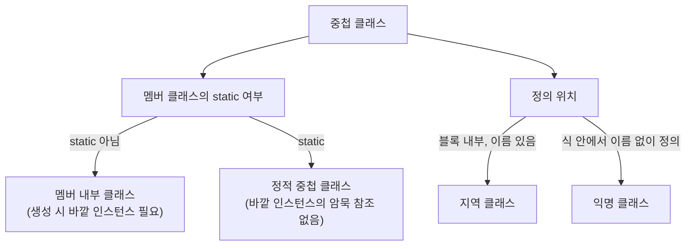

# 내부 클래스 종류

## 핵심 정의
중첩 클래스(nested class)는 다른 클래스나 인터페이스 안에 정의된 클래스로, 정의 위치와 `static` 여부에 따라 멤버 클래스(member inner class), 정적 중첩 클래스(static nested class), 지역 클래스(local class), 익명 클래스(anonymous class) 네 가지로 나뉜다. 내부 클래스(inner class)는 이 중 명시적·암묵적으로 static이 아닌 중첩 클래스다. 정적 중첩 클래스는 inner class가 아니며, 정적 문맥의 지역/익명 클래스는 바깥 인스턴스 없이 생성될 수 있다.

## 동작 원리 / 구조
```java
public class Outer {
    private int value = 10;

    // 1. 멤버 내부 클래스: Outer 인스턴스 없이 존재 불가, 암묵적으로 Outer.this 참조 보유
    class Inner {
        void print() { System.out.println(value); } // 바깥 필드에 직접 접근
    }

    // 2. 정적 중첩 클래스: Outer 인스턴스와 무관, 일반 최상위 클래스처럼 독립적
    static class StaticNested {
        void print() { System.out.println("Outer 인스턴스 불필요"); }
    }

    void method() {
        int localVar = 20; // 사실상 final(effectively final)이어야 캡처 가능

        // 3. 지역 클래스: 메서드 안에서만 유효, 지역 변수 캡처 가능
        class Local {
            void print() { System.out.println(value + localVar); }
        }
        new Local().print();

        // 4. 익명 클래스: 이름 없이 인터페이스/추상 클래스를 즉석에서 구현
        Runnable r = new Runnable() {
            @Override
            public void run() { System.out.println(value + localVar); }
        };
        r.run();
    }
}
```

멤버 내부 클래스는 인스턴스 생성 시 바깥 인스턴스를 반드시 필요로 한다.
```java
Outer outer = new Outer();
Outer.Inner inner = outer.new Inner(); // 바깥 인스턴스를 통해서만 생성 가능
```

컴파일 시 각 내부 클래스는 `Outer$Inner.class`, `Outer$StaticNested.class`, `Outer$1Local.class`, `Outer$1.class`(익명)처럼 별도의 `.class` 파일로 컴파일된다. 바깥 인스턴스가 필요한 내부 클래스에는 그 인스턴스를 전달하는 생성자 파라미터 등이 추가된다. 실제 참조가 필요하면 숨겨진 필드(synthetic field, 보통 `this$0`)에 저장한다. JDK 18 `javac`부터는 사용하지 않는 바깥 인스턴스 필드를 생략하는 최적화가 있어, 모든 비정적 클래스가 반드시 `this$0` 필드를 가진다고 단정할 수 없다.



지역 변수를 지역/익명 클래스가 캡처하려면 해당 변수가 사실상 final(effectively final, 선언 이후 재할당되지 않음)이어야 한다. Java 8부터 `final` 키워드 명시가 없어도 이 조건만 만족하면 캡처가 허용된다.

## 실무 관점
- 정적 중첩 클래스는 바깥 인스턴스 참조가 없어 메모리 누수(memory leak) 위험이 낮다. 빌더 패턴(builder pattern)의 `Builder` 클래스, 데이터 홀더(예: `Map.Entry` 구현체)처럼 바깥 클래스와 논리적으로만 연관되고 바깥 상태에 접근할 필요가 없다면 항상 `static`을 붙이는 것이 기본 원칙이다.
- 비정적 멤버 클래스나 익명 클래스가 바깥 인스턴스를 암묵적으로 참조하는 특성 때문에, 이 내부 클래스 인스턴스가 오래 살아남으면(예: 컬렉션에 담아 장기 보관, 콜백으로 등록) 바깥 인스턴스도 GC 대상에서 제외되어 메모리 누수로 이어질 수 있다. Android 개발에서 `Activity` 내부에 정적이지 않은 리스너/핸들러를 만들어 발생하는 누수가 대표적인 사례로 알려져 있으며, 서버 애플리케이션에서도 이벤트 리스너나 콜백 등록 시 동일한 패턴을 주의해야 한다.
- Java 8 이후로는 단일 추상 메서드(SAM, Single Abstract Method)를 즉석 구현하는 용도에는 익명 클래스 대신 람다(lambda)를 쓰는 것이 코드량과 가독성 면에서 유리하다. 람다도 인스턴스 필드·메서드나 `this`를 사용하면 바깥 인스턴스를 캡처할 수 있다. 표현식만 바꿨다고 메모리 누수가 사라지거나 항상 더 가벼워지는 것은 아니다. 다만 인터페이스가 함수형 인터페이스 조건을 만족하지 않거나, 상태를 가진 익명 클래스가 필요하면 여전히 익명 클래스를 써야 한다.
- 지역 클래스는 사용 범위가 정말 한 메서드 안으로 좁을 때만 쓴다. 재사용 가능성이 조금이라도 있다면 정적 중첩 클래스나 별도 최상위 클래스로 승격하는 것이 유지보수에 유리하다.

## 심화 Q&A

### Q. 비정적 멤버 클래스가 왜 메모리 누수의 원인이 될 수 있는지 구체적인 참조 사슬로 설명하면?
바깥 인스턴스를 사용하는 비정적 멤버 클래스는 보통 `this$0` 필드로 이를 보관한다. 이 내부 클래스 인스턴스를 리스너 목록이나 캐시처럼 오래 사는 컬렉션에 등록하면, GC 루트(root)에서 "컬렉션 → 내부 클래스 인스턴스 → this$0 → 바깥 인스턴스"로 이어지는 참조 사슬이 유지되어, 바깥 인스턴스를 명시적으로 해제해도 GC 대상이 되지 못한다. 정적 중첩 클래스로 바꿔 불필요한 참조를 없앨 수 있다. 람다나 정적 중첩 클래스도 명시적 필드·캡처를 통해 바깥 객체를 참조한다면 동일한 누수가 가능하다.

### Q. 익명 클래스와 람다가 바깥 지역 변수를 캡처하는 방식에 근본적인 차이가 있는가?
둘 다 사실상 final인 지역 변수만 캡처할 수 있고, 캡처 시점의 값을 복사해 내부적으로 들고 있다는 점은 동일하다. 차이는 `this` 바인딩에 있다. 익명 클래스 안에서 `this`는 그 익명 클래스 자신의 인스턴스를 가리키지만, 람다 안에서 `this`는 람다를 감싸고 있는 바깥 클래스(enclosing class)의 인스턴스를 가리킨다. 이 차이는 Java 언어가 정한 `this`의 의미이며, `invokedynamic` 구현 방식에서 필연적으로 도출되는 것은 아니다. 자세한 내부 동작은 [[함수형 인터페이스와 람다]] 참고.

### Q. 왜 지역/익명 클래스는 지역 변수를 참조가 아니라 값으로 캡처하고, 그 변수가 반드시 사실상 final이어야 하는가?
지역 변수는 스택 프레임(stack frame)에 존재하며, 메서드 실행이 끝나면 스택 프레임이 사라진다. 하지만 지역/익명 클래스 인스턴스는 메서드 종료 이후에도(예: 반환된 `Runnable`) 살아있을 수 있으므로, 컴파일러는 캡처 시점의 변수 값을 내부 클래스의 숨겨진 필드에 복사해 넣는다. 만약 캡처 이후 원본 변수 값이 바뀔 수 있다면, 그 시점 이후 내부 클래스가 참조하는 값과 실제 바깥 변수 값이 어긋나는 모순이 생기므로, 언어 차원에서 재할당을 금지(effectively final 강제)해 이 불일치 가능성을 원천 차단한다.

### Q. 정적 중첩 클래스가 바깥 클래스의 private 멤버에 접근할 수 있는 이유는 캡슐화 위반이 아닌가?
정적 중첩 클래스는 바깥 인스턴스 참조는 없지만, 동일한 최상위 클래스/인터페이스를 둘러싼 중첩 범위 안에서는 언어 명세상 서로의 `private` 멤버에 접근할 수 있다. 같은 `.java` 파일에 있는 서로 다른 최상위 클래스까지 허용되는 것은 아니다. 이는 캡슐화 위반이라기보다, "바깥-중첩 클래스는 하나의 논리적 단위"라는 설계 의도를 반영한 것이다. Java 10까지는 컴파일러가 바깥 클래스에 패키지 프라이빗(package-private) 접근자 메서드(synthetic accessor, `access$000` 형태)를 자동 생성해 바이트코드 수준의 `private` 규칙을 우회시켰지만, Java 11부터는 네스트메이트(nestmate, JEP 181) 기능으로 바깥 클래스와 중첩 클래스가 클래스 파일의 `NestHost`/`NestMembers` 속성으로 같은 "nest"에 묶여, JVM이 synthetic accessor 없이도 서로의 `private` 멤버에 직접 접근하도록 허용한다(`javap -v`로 컴파일 결과를 확인하면 synthetic 메서드 없이 `getfield`가 직접 호출되는 것을 볼 수 있다).

### Q. 빌더 패턴에서 Builder 클래스를 정적 중첩 클래스로 만드는 이유는?
`Builder`가 비정적 멤버 클래스라면 바깥 클래스의 인스턴스가 먼저 존재해야 `Builder`를 생성할 수 있는데, 빌더 패턴의 목적은 바깥 클래스의 인스턴스가 아직 없는 상태에서 단계적으로 값을 채워 최종 인스턴스를 만드는 것이다. 이 목적과 "바깥 인스턴스가 먼저 있어야 한다"는 비정적 멤버 클래스의 제약이 정면으로 충돌하므로, 새 객체 생성용 `Builder`는 보통 정적 중첩 클래스나 별도 최상위 클래스로 구현한다.

### Q. 로컬 클래스나 익명 클래스가 제네릭 타입 파라미터를 캡처할 때 타입 소거와 관련해 주의할 점은?
지역/익명 클래스도 바깥 메서드나 클래스의 제네릭 타입 파라미터를 참조할 수 있지만, 런타임에는 다른 제네릭 클래스와 마찬가지로 타입 소거(type erasure)가 적용되어 실제 타입 인자 정보가 사라진다. 따라서 익명 클래스 내부에서 `T` 타입의 배열을 생성하거나 `instanceof T` 검사를 시도하면 컴파일 에러가 나며, 이는 일반 제네릭 클래스의 제약과 동일하게 적용된다. 자세한 내용은 [[제네릭]] 참고.

## 관련 개념
- [[함수형 인터페이스와 람다]]
- [[제네릭]]
- [[메모리 누수]]

## 참고 자료

확인 날짜: 2026-09-08. 아래 버전과 범위의 공식 문서·소스로 본문을 대조했다. 성능 비교와 운영 선택은 워크로드에 따라 달라지는 판단 기준이다.

- [JLS 25 §8.1.3](https://docs.oracle.com/javase/specs/jls/se25/html/jls-8.html#jls-8.1.3) — 중첩·내부 클래스와 정적 문맥.
- [JLS 25 §15.27.2](https://docs.oracle.com/javase/specs/jls/se25/html/jls-15.html#jls-15.27.2) — 람다 this와 지역 변수 캡처.
- [JEP 181](https://openjdk.org/jeps/181) — Java 11 nestmate 접근 제어.
- [JDK 18 Release Notes](https://www.oracle.com/java/technologies/javase/18-relnote-issues.html#JDK-8271623) — javac의 사용하지 않는 enclosing instance 필드 생략.

부분 재검증: 2026-10-04. [JLS 25 §9.8](https://docs.oracle.com/javase/specs/jls/se25/html/jls-9.html#jls-9.8)로 람다 적용 여부를 메서드의 단순 개수로 판단하지 않는 범위를 확인했다. Object의 public 메서드와 일치하는 선언의 제외 및 호환되는 상속 추상 선언을 하나의 함수 계약으로 보는 조건을 재대조했다. 전체 verified는 유지한다.

- 도식·표 대조(2026-10-04): [JLS 25 §8.1.3](https://docs.oracle.com/javase/specs/jls/se25/html/jls-8.html#jls-8.1.3) — 도식의 중첩/내부 클래스 범주와 바깥 인스턴스 관계를 본문에 맞췄다. 지역·익명 클래스의 선언 위치도 메서드 내부에만 한정하지 않는다. 실행 시험 추가 없이 명세·소스와 기존 본문을 대조했으며 verified는 유지한다.
