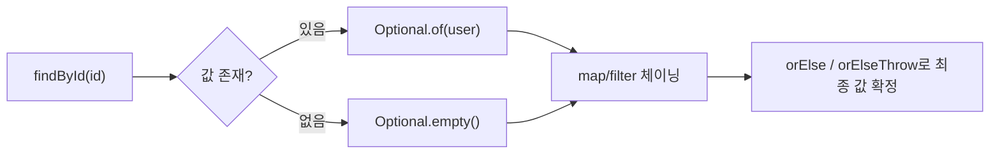

# Optional

## 핵심 정의
`Optional<T>`는 Java 8에서 도입된, 값이 있을 수도 없을 수도 있음을 명시적으로 표현하는 컨테이너 타입이다. 메서드 반환 타입으로 사용해 "이 메서드는 값을 못 줄 수도 있다"는 사실을 API 시그니처(signature)에 드러내고, 호출부가 `null` 체크를 빠뜨려 발생하는 `NullPointerException`을 줄이는 것이 목적이다.

## 동작 원리 / 구조
`Optional`은 내부에 값 하나를 감싸는 불변 래퍼(wrapper)로, 값이 있으면 `Optional.of(value)`, 없을 수도 있으면 `Optional.ofNullable(value)`, 명시적으로 빈 상태는 `Optional.empty()`로 생성한다.

```java
Optional<User> findById(Long id) {
    return userRepository.findById(id); // Optional<User> 반환
}

String name = findById(1L)
        .map(User::getName)
        .filter(n -> !n.isBlank())
        .orElse("이름 없음");
```

주요 API 그룹:
- 값 추출: `get()`(값 없으면 예외, 지양), `orElse(T)`, `orElseGet(Supplier)`, `orElseThrow()`(무인자 Java 10+) / `orElseThrow(Supplier)`
- 값 존재 여부: `isPresent()`, `isEmpty()`(Java 11+)
- 값 변환: `map()`, `flatMap()`, `filter()`
- 부수 효과: `ifPresent(Consumer)`, `ifPresentOrElse(Consumer, Runnable)`(Java 9+)
- 스트림 연동: `stream()`(Java 9+, 값이 있으면 단일 원소 스트림, 없으면 빈 스트림), `or(Supplier<Optional<T>>)`(Java 9+)



map의 함수가 null을 반환하면 빈 Optional이 되지만 flatMap의 함수가 null을 반환하면 NPE가 발생한다. Optional은 value-based 클래스이므로 empty()의 참조 동일성이나 인스턴스 락에 의존하지 않는다.

## 실무 관점
- `Optional`은 **메서드 반환 타입**으로 쓰는 것이 원래 설계 의도다. 클래스 필드, 메서드 파라미터, `Optional<List<T>>`처럼 빈 컬렉션과 별도의 부재 상태가 필요하지 않은 타입에 중복해서 감싸는 것은 피한다. 필드에 쓰면 `Serializable`을 구현하지 않아 직렬화 문제도 생긴다.
- `get()`을 `isPresent()` 없이 바로 호출하는 것은 `null` 체크를 안 하고 바로 역참조하는 것과 본질적으로 같은 실수다. `orElse`, `orElseGet`, `orElseThrow`, `map`/`filter` 체이닝으로 대체한다.
- `orElse(expensiveCall())`은 `Optional`이 값을 가지고 있어도 `expensiveCall()`을 항상 평가(eager evaluation)한다. 비용이 큰 기본값 생성은 `orElseGet(() -> expensiveCall())`로 지연 평가(lazy evaluation)해야 한다.
- JPA/MyBatis 등에서 `Optional<Entity>`를 리포지토리(repository) 반환 타입으로 쓰는 것은 흔한 패턴이지만, 엔티티 자체를 `Optional` 필드로 감싸 영속화하려 하면 안 된다.
- 컬렉션의 "없음"은 `null`이나 `Optional` 대신 빈 컬렉션(`Collections.emptyList()`)으로 표현하는 것이 Java 컨벤션이다.

## 심화 Q&A

### Q. `Optional`을 클래스 필드나 메서드 파라미터로 쓰면 안 되는 이유는?
`Optional`은 `Serializable`을 구현하지 않아 필드로 쓰면 엔티티나 DTO 직렬화 시 문제가 생긴다. 파라미터로 쓰면 호출부가 `null`을 넘길 가능성을 여전히 배제하지 못해(즉 Optional 매개변수에 null 자체를 전달하는 호출이 가능) 애초 목적인 "null 안전성 보장"을 달성하지 못하고, 오버로딩이나 빌더 패턴으로 표현 가능한 것을 불필요하게 복잡하게 만든다. 공식 API는 주 용도를 반환 타입으로 설명한다. 필드·파라미터 사용을 언어가 금지하는 것은 아니며, Java 기본 직렬화와 JSON 라이브러리 지원도 구분해야 한다.

### Q. `orElse()`와 `orElseGet()`의 차이를 성능 관점에서 설명하면?
`orElse(T value)`는 `Optional`에 값이 있든 없든 인자로 넘긴 표현식을 항상 즉시 평가한다. `orElseGet(Supplier<T>)`는 `Optional`이 비어 있을 때만 `Supplier`를 실행한다. 따라서 기본값 생성 비용이 크거나(DB 조회, 새 객체 생성 등) 부수 효과가 있는 경우 `orElseGet`을 써야 불필요한 연산을 피할 수 있다.

### Q. `map()`과 `flatMap()`을 언제 구분해서 써야 하는가?
변환 함수의 반환 타입이 일반 값(`T`)이면 `map()`을, 변환 함수가 이미 `Optional<T>`를 반환하면 `flatMap()`을 쓴다. `map()`에 `Optional`을 반환하는 함수를 쓰면 `Optional<Optional<T>>`처럼 중첩되어 버리므로, 중첩을 평탄화(flatten)하려면 `flatMap()`이 필요하다. `Stream`의 `map`/`flatMap` 관계와 동일한 패턴이다.

### Q. `Optional.of(null)`을 호출하면 어떻게 되며, `ofNullable()`과 어떻게 다른가?
`Optional.of(null)`은 즉시 `NullPointerException`을 던진다. 값이 절대 `null`이 아님을 호출부가 확신할 때만 `of()`를 쓰라는 의도적 설계다. 값이 `null`일 수도 있는 경우에는 `ofNullable()`을 써서, `null`이면 `Optional.empty()`를, 아니면 값을 감싼 `Optional`을 반환받는다.

### Q. `Optional`을 스트림(Stream) 파이프라인과 함께 쓸 때 흔한 패턴은?
Java 9부터 제공되는 `optional.stream()`을 이용하면 `Optional<T>`를 값이 있으면 원소 1개, 없으면 0개인 `Stream<T>`로 변환할 수 있다. 이를 활용해 `List<Optional<T>>`를 `flatMap(Optional::stream)`으로 걸러내며 평탄화하는 것이 `filter(Optional::isPresent).map(Optional::get)` 조합보다 간결하고 의도가 명확하다.

### Q. `Optional` 도입 이전 방식(null 반환, 예외 던지기, Null Object 패턴)과 비교했을 때 트레이드오프는?
`null` 반환은 컴파일러가 강제하지 않아 호출부가 체크를 빠뜨리기 쉽고, 예외를 던지는 방식은 값이 없는 것이 정상적인 흐름(예: 검색 결과 없음)일 때 예외 처리 비용과 스택트레이스 생성 비용이 부담스럽다. `Optional`은 타입에 부재 가능성을 드러내지만 반환값 무시·null 반환·무조건 get()까지 컴파일러가 금지하지는 않으며, 래퍼 객체 생성에 따른 약간의 오버헤드와 남용 시 코드 복잡도 증가라는 대가가 있다. 상황에 맞게 선택할 문제이며, 특히 성능이 극도로 민감한 hot path에서는 오버헤드를 고려해야 한다.

### Q. Optional이 비어 있다는 결과와 조회 실패를 같은 의미로 처리해도 되는가?
A. Optional은 정상적인 값 부재를 표현하며 실패 원인이나 재시도 가능성을 담는 타입은 아니다. 타임아웃·권한 오류까지 잡아 `Optional.empty()`로 바꾸면 "존재하지 않음"과 "확인하지 못함"이 합쳐진다. 부재·빈 결과·실패가 업무상 다른 상태라면 반환 계약이나 별도 결과 타입으로 구분한다. `Optional<List<T>>`도 조회 자체의 부재와 조회된 빈 목록을 구분할 필요가 있다면 의미가 있다.

### Q. orElseGet을 쓰면 인자 생성 비용과 null 결과까지 모두 안전한가?
A. `orElseGet(makeSupplier())`의 makeSupplier 호출은 일반 인자 평가이므로 먼저 실행된다. 지연되는 것은 반환된 Supplier의 get이다. 또한 Supplier가 null을 반환하면 최종 결과도 null일 수 있다. 지연하려는 작업을 람다 본문에 두고 기본값의 null 허용 여부도 명시한다.

## 관련 개념
- [[불변 객체]]
- [[함수형 인터페이스와 람다]]
- [[equals와 hashCode]]

## 참고 자료

확인 날짜: 2026-09-08. 아래 버전과 범위의 공식 문서·소스로 본문을 대조했다. 성능 비교와 운영 선택은 워크로드에 따라 달라지는 판단 기준이다.

- [Java SE 25 Optional](https://docs.oracle.com/en/java/javase/25/docs/api/java.base/java/util/Optional.html) — API 도입 버전·map/flatMap null·value-based·반환 용도.

### 2026-09-23 부분 재검증

Java SE 25 Optional의 반환 용도와 orElseGet 계약, JLS 25 §15.12.4.2의 인자 평가를 확인했다. 부재·실패 구분은 그 API 범위를 바탕으로 한 설계 기준이다. 기존 전체 검증일은 유지한다.

실행 확인: 2026-09-23, OpenJDK 25.0.2+10-69에서 orElseGet 인자 Supplier 생성 시점·null 반환을 재현했다. 구현 관측은 해당 버전 범위로 한정한다.
