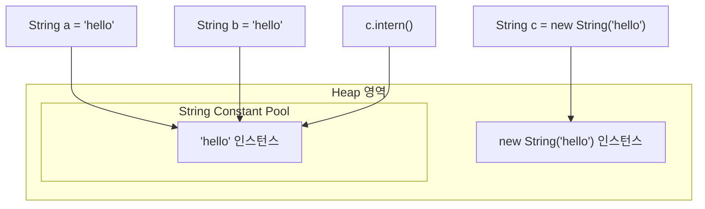

# String과 String Pool

## 핵심 정의
`String`은 Java에서 불변(immutable) 객체로 설계된 문자열 타입이다. 문자열 리터럴(literal)은 JVM의 **String Constant Pool**(문자열 상수 풀)에 저장되어, 동일한 내용의 리터럴을 여러 번 사용해도 하나의 인스턴스를 공유한다. 이는 문자열이 프로그램 전반에서 매우 자주 생성/비교되는 특성을 고려한 메모리 최적화 기법이다.

## 동작 원리 / 구조
- 리터럴로 생성한 문자열(`String s = "abc"`)은 String Pool을 먼저 조회해 동일한 값이 있으면 그 참조를 재사용하고, 없으면 새로 만들어 풀에 등록한다.
- `new String("abc")`는 풀을 거치지 않고 힙(heap)에 항상 새로운 인스턴스를 생성한다. intern()은 같은 내용의 기존 대표가 있으면 그것을 반환하고 없을 때만 현재 인스턴스를 등록하므로 반환값을 사용해야 한다. 생성자 인자인 리터럴 자체는 별도로 인터닝된다.
- HotSpot의 인터닝된 String 객체는 Java 7부터 일반 힙에 저장된다. StringTable이라는 관리 테이블 자체와 문자열 객체의 저장 위치는 구분하며, 도달 불가능한 문자열의 정리 시점은 컬렉터에 달려 있어 Full GC로 한정하지 않는다.
- Java 9부터는 **Compact Strings**가 기본 적용되어, 문자열 내용이 Latin-1 범위(대부분의 영숫자)면 `char[]`(2바이트/문자) 대신 `byte[]`(1바이트/문자)로 저장해 메모리 사용량을 줄인다.

```java
String a = "hello";
String b = "hello";
String c = new String("hello");
String d = c.intern();

System.out.println(a == b);        // true, 풀에서 같은 참조 공유
System.out.println(a == c);        // false, c는 heap의 새 인스턴스
System.out.println(a == d);        // true, intern()으로 풀 참조를 가져옴
System.out.println(a.equals(c));   // true, 내용 비교
```



## 실무 관점
- 문자열 비교는 항상 `equals()`를 써야 한다. `==`는 참조 비교이므로 리터럴끼리는 우연히 통과하지만 `new String()`이나 런타임에 조합된 문자열(`substring`, `+` 연산 결과 등)에서는 예기치 않게 `false`가 나오는 버그가 흔하다.
- 반복문 안에서 `+`로 문자열을 이어 붙이면 매번 새 `String` 객체가 생성되어 `O(n^2)` 비용이 든다. 대량의 문자열 조합에는 `StringBuilder`(단일 스레드)나 `StringBuffer`(스레드 안전, thread-safe)를 사용한다. Java 9+ javac는 일반적인 런타임 + 연결을 invokedynamic/StringConcatFactory로 변환하지만, 반복문 내부의 누적 연산까지는 최적화하지 않는다.
- `intern()`을 과도하게 호출하면 String Pool이 비대해져 오히려 GC 부담이 늘 수 있다. 대량의 동적 문자열(예: 사용자 입력, 외부 데이터)을 무분별하게 `intern()`하는 것은 지양한다.
- 로그, 캐시 키 등에서 동일 문자열이 매우 자주 반복 생성되는 경우에만 제한적으로 `intern()`이나 자체 캐시를 고려한다.
- `String.format()`, 정규식 컴파일(`Pattern.compile`)은 비용이 크므로 반복 호출 경로(hot path)에서는 미리 컴파일하거나 대안(문자열 결합, 수동 파싱)을 검토한다.

### 저장 형식과 문자열 인덱스는 다르다

Compact Strings가 내부 저장 공간을 줄여도 `length()`·`charAt`·`substring`의 인덱스는 UTF-16 코드 단위(code unit) 기준이다. 예를 들어 보조 문자 하나인 `"😀"`는 길이가 2이고 코드 포인트(code point)는 1개다. `substring(0, 1)`로 자르면 서로게이트 쌍(surrogate pair)의 절반만 남길 수 있다. 코드 포인트 경계가 필요한 처리는 `codePoints`·`offsetByCodePoints` 등을 사용하고, 사용자에게 보이는 글자 수와도 무조건 같다고 보지 않는다.

`equals`와 `intern`은 유니코드 정규화(Unicode normalization)를 자동 수행하지 않는다. 합성된 `é`와 `e` 뒤에 결합 악센트를 붙인 문자열은 화면상 같아 보여도 서로 다른 코드 단위 열이어서 동등하지 않고 서로 다른 intern 대표를 갖는다. 검색 키 등의 도메인에서 정규화가 필요하면 `Normalizer`의 NFC 등 정책을 입력·조회 양쪽에 명시적으로 적용한다.

### 키 정규화와 바이트 입력 검증

인자 없는 `toLowerCase()`·`toUpperCase()`는 기본 로케일(locale)에 의존한다. 예를 들어 터키어 환경에서 `"TITLE"`을 소문자로 바꾸면 점 없는 `ı`가 들어가, 서버 로케일이 다른 경우 캐시·프로토콜 키가 달라질 수 있다. 언어와 무관한 키에 대소문자 변환이 필요하면 `Locale.ROOT`를 명시하고 입력·조회에 같은 정책을 쓴다. 사람 이름·자연어의 언어별 변환 정책까지 ROOT로 대체하라는 뜻은 아니다.

`new String(bytes, StandardCharsets.UTF_8)`은 잘못된 UTF-8을 예외로 거부하지 않고 대체 문자로 바꾼다. 깨진 입력을 거부해야 하면 `CharsetDecoder`의 `onMalformedInput(REPORT)`·`onUnmappableCharacter(REPORT)` 정책으로 디코딩한다. 반대 방향의 `getBytes(Charset)`도 표현할 수 없는 문자를 대체할 수 있으므로, 손실 없는 출력이 계약이면 `CharsetEncoder`의 REPORT 정책을 사용한다. 인코딩을 지정했다는 사실과 유효성·무손실을 검증했다는 사실을 구분한다.

## 심화 Q&A

### Q. `new String("a") == "a"`가 왜 `false`인가?
리터럴 `"a"`는 클래스 파일의 문자열 상수를 통해 런타임에 인터닝된 참조를 가리키지만, `new String("a")`는 명시적으로 heap에 새 객체를 생성하라는 지시이기 때문에 풀을 거치지 않는다. 두 참조는 내용은 같아도 서로 다른 메모리 주소를 가리키므로 `==` 비교에서 `false`가 나온다.

### Q. 두 문자열을 `+`로 합친 결과(`"a" + "b"`)와 컴파일 타임 상수 결합은 String Pool 관점에서 어떻게 다른가?
`"a" + "b"`처럼 모두 컴파일 타임 상수(compile-time constant)로 구성된 표현식은 컴파일러가 상수 폴딩(constant folding)을 적용해 `"ab"`라는 리터럴로 취급하고 풀에 등록한다. 반면 상수 변수가 아닌 값을 포함한 s1 + s2는 런타임 연결로 처리되어 heap에 새 인스턴스가 생기며 풀에 자동 등록되지 않는다.

### Q. String Pool이 PermGen에서 Heap으로 이동한 것이 실무에 어떤 영향을 주는가?
Java 7 이전에는 PermGen 크기 제한(`-XX:MaxPermSize`) 때문에 대량의 `intern()` 호출이 `OutOfMemoryError: PermGen space`를 유발하는 경우가 있었다. Heap으로 이동한 뒤로는 일반 힙의 회수 대상이 되어 참조가 끊긴 풀 문자열이 회수될 수 있고, 메모리 관리가 유연해졌다. 다만 여전히 대량의 고유 문자열을 `intern()`하면 heap 사용량 증가와 GC 부담으로 이어질 수 있다.

### Q. Compact Strings는 어떤 문제를 해결하는가?
과거 `String`은 내부적으로 항상 `char[]`(문자당 2바이트, UTF-16)를 사용했는데, 실제 애플리케이션에서 다루는 문자열 대부분은 Latin-1 범위(영문/숫자/기본 기호)라 절반의 바이트가 낭비됐다. Java 9부터는 내용에 따라 `byte[]`(1바이트/문자, Latin-1)와 인코딩 플래그를 함께 저장해, Latin-1 저장 배열의 바이트 수를 UTF-16 대비 절반으로 줄인다. 헤더를 포함한 객체 전체 메모리가 절반이라는 뜻은 아니다. 개발자 코드 변경 없이 JVM 내부에서 투명하게 적용된다.

### Q. `String`이 불변으로 설계된 이유와 String Pool의 관계는?
문자열이 가변이었다면 여러 참조가 같은 풀 인스턴스를 공유하는 구조에서 한 참조의 변경이 다른 모든 참조에 영향을 미쳐 심각한 부작용이 발생한다. 불변성은 String Pool을 통한 참조 공유를 안전하게 만드는 전제 조건이며, 동시에 해시코드 캐싱(`String`은 `hashCode()`를 최초 계산 후 캐싱), 스레드 안전성, `HashMap` 키로서의 신뢰성도 함께 확보해준다.

### Q. 대량의 문자열 결합 시 `+` 연산자 대신 `StringBuilder`를 써야 하는 이유를 성능 관점에서 설명하면?
반복문에서 `result = result + s`를 반복하면 매 반복마다 새 연결 결과가 필요하고 이전 내용을 복사하는 비용이 누적되어 총 비용이 `O(n^2)`에 가까워진다. `StringBuilder`는 내부 `char[]`/`byte[]` 버퍼가 부족해지면 필요 최소 용량과 `(기존 용량 * 2) + 2`를 고려해 확장(`ArrayList`의 1.5배 증가와는 다른 공식)하며 재사용하므로 전체 비용이 상각(amortized) `O(n)`에 수렴한다.

## 관련 개념
- [[불변 객체]]
- [[equals와 hashCode]]
- [[Optional]]

## 참고 자료

확인 날짜: 2026-09-08. 아래 버전과 범위의 공식 문서·소스로 본문을 대조했다. 성능 비교와 운영 선택은 워크로드에 따라 달라지는 판단 기준이다.

- [Java SE 25 String](https://docs.oracle.com/en/java/javase/25/docs/api/java.base/java/lang/String.html) — intern·불변성·hashCode.
- [JLS 25 문자열 리터럴](https://docs.oracle.com/javase/specs/jls/se25/html/jls-3.html#jls-3.10.5) — 인터닝과 상수 표현식.
- [JEP 254](https://openjdk.org/jeps/254) — Compact Strings.
- [JEP 280](https://openjdk.org/jeps/280) — Java 9+ 문자열 연결.

### 2026-09-23 부분 재검증

[Java SE 25 String](https://docs.oracle.com/en/java/javase/25/docs/api/java.base/java/lang/String.html)의 UTF-16 인덱스·equals·intern과 [Normalizer](https://docs.oracle.com/en/java/javase/25/docs/api/java.base/java/text/Normalizer.html)의 정규화 계약을 확인했다. OpenJDK 25.0.2에서 보조 문자의 길이/코드 포인트, 서로게이트 분할, 합성/분해 문자열의 equals·intern 차이와 NFC 결과를 확인했다. 과거 저장 영역 변경·모든 JIT 최적화 설명은 오늘 범위 밖이다.

### 부분 재검증: 2026-10-04

Java SE 25의 로케일 의존 대소문자 변환, Charset 인자를 받는 String 생성자·getBytes의 대체 처리, decoder/encoder의 오류 보고 정책을 확인했다. 기존 전체 `verified`는 유지한다.

- [String](https://docs.oracle.com/en/java/javase/25/docs/api/java.base/java/lang/String.html) — toLowerCase/toUpperCase의 로케일, String(byte[], Charset), getBytes(Charset).
- [CharsetDecoder](https://docs.oracle.com/en/java/javase/25/docs/api/java.base/java/nio/charset/CharsetDecoder.html) — malformed/unmappable 입력과 REPORT 정책(기본 오류 정책도 REPORT).
- [CharsetEncoder](https://docs.oracle.com/en/java/javase/25/docs/api/java.base/java/nio/charset/CharsetEncoder.html) — 표현 불가능한 문자의 대체·오류 보고.

실행 확인: Oracle JDK 25.0.4+7-LTS-189(macOS AArch64)에서 터키어/ROOT의 TITLE 변환 차이, 잘못된 UTF-8의 대체와 엄격 디코더의 MalformedInputException, ASCII로 표현할 수 없는 한글의 대체와 엄격 인코더의 UnmappableCharacterException을 확인했다. 전역 기본 로케일은 바꾸지 않았고, 모든 언어의 정렬·검색·유니코드 보안 규칙을 검증한 것은 아니다.
