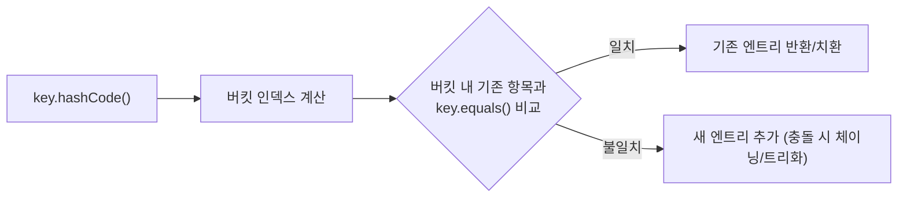

# equals와 hashCode

## 핵심 정의
`equals()`는 두 객체의 논리적 동등성(logical equality)을 판단하는 메서드이고, `hashCode()`는 객체를 해시 기반 자료구조(`HashMap`, `HashSet` 등)에서 빠르게 찾기 위한 정수 해시값을 반환하는 메서드다. 둘 다 `Object` 클래스에 정의되어 있으며 Object.equals의 기본 구현은 참조 동일성(reference equality, ==)을 비교한다. 기본 hashCode는 내용 기반이 아니지만 다른 객체에 다른 값이나 메모리 주소를 보장하지 않는다.

두 메서드는 반드시 함께 재정의(override)해야 한다. `equals()`만 재정의하고 `hashCode()`를 그대로 두면 해시 기반 컬렉션에서 동등한 객체를 다른 객체로 취급하는 문제가 생긴다.

## 동작 원리 / 구조
`Object` 명세는 `equals`-`hashCode` 계약(contract)을 정의한다.

- **equals 계약**: 반사성(reflexive), 대칭성(symmetric), 추이성(transitive), 일관성(consistent), `null`과 비교 시 `false`.
- **hashCode 계약**: `equals()`가 `true`인 두 객체는 반드시 같은 `hashCode()`를 반환해야 한다(역은 성립하지 않아도 됨, 즉 해시 충돌은 허용).

```java
public final class Point {
    private final int x, y;

    public Point(int x, int y) { this.x = x; this.y = y; }

    @Override
    public boolean equals(Object o) {
        if (this == o) return true;
        if (!(o instanceof Point p)) return false;
        return x == p.x && y == p.y;
    }

    @Override
    public int hashCode() {
        return Objects.hash(x, y);
    }
}
```

`HashMap`은 `hashCode()`로 버킷(bucket) 위치를 결정한 뒤, 같은 버킷 내에서 `equals()`로 최종 비교한다. 두 메서드가 어긋나면 논리적으로 같은 키가 서로 다른 버킷에 들어가 조회에 실패한다.



## 실무 관점
- IDE 자동 생성이나 `Objects.equals()` / `Objects.hash()`를 활용해 실수를 줄인다. 직접 구현 시 `null` 체크와 타입 체크(`instanceof`) 순서를 놓치기 쉽다.
- 가변 필드를 `HashMap`/`HashSet`의 키로 사용하는 객체에서 equals/hashCode 대상 필드로 넣으면, 저장 후 필드 값이 바뀌었을 때 해당 원소를 다시 찾을 수 없는 문제가 발생한다. 키로 쓰이는 객체는 불변으로 설계하는 것이 안전하다.
- JPA 엔티티(entity)의 equals/hashCode 구현은 특히 까다롭다. 프록시(proxy) 객체 비교, 식별자(id)가 아직 없는 신규 엔티티(transient) 비교 문제 때문에 ORM의 프록시 동작에 맞는 타입 검사·접근자를 사용하고 안정적인 비즈니스 키(business key) 등으로 동등성 기준을 정한다. Hibernate 7.1은 프록시를 고려해 instanceof 및 접근자 사용을 안내하므로 단순 getClass 비교로 치환하지 않는다. 모든 필드를 넣거나 IDE가 생성한 기본 코드를 그대로 쓰면 컬렉션에서 예기치 않은 동작이 나온다.
- `equals()`를 재정의하면서 `hashCode()`를 빼먹는 실수는 흔한 버그 패턴이다. 정적 분석 도구(lint)나 IDE 경고로 걸러진다.
- 상속 구조에서 하위 클래스가 필드를 추가하며 `equals()`를 재정의하면 대칭성이나 추이성이 깨지기 쉽다. `getClass()` 비교 대신 `instanceof`를 쓰면 상위-하위 클래스 간 비교에서 계약 위반이 생길 수 있으므로, 상속보다는 컴포지션(composition)으로 값 객체를 설계하는 편이 안전하다.

## 심화 Q&A

### Q. `equals()`만 재정의하고 `hashCode()`를 재정의하지 않으면 실제로 어떤 문제가 생기는가?
논리적으로 동등한 두 객체가 서로 다른 hashCode()를 반환할 수 있어 `HashMap`/`HashSet`에서 다른 버킷에 저장된다. `set.contains(equal객체)`가 `false`를 반환하거나, `map.get(equal키)`가 `null`을 반환하는 등 컬렉션 조회가 실패한다. 컴파일 오류가 아니라 런타임 로직 오류이므로 발견이 늦어질 수 있다.

### Q. `instanceof` 비교와 `getClass()` 비교 중 어떤 것을 써야 하는가?
`getClass() != o.getClass()`로 비교하면 상속받은 하위 클래스와의 비교가 항상 `false`가 되어 리스코프 치환 원칙(Liskov substitution)과 충돌할 수 있지만, 대칭성과 추이성은 지키기 쉽다. `instanceof`를 쓰면 상속 관계에서 유연하지만, 하위 클래스가 필드를 추가해 `equals()`를 재정의하면 `a.equals(b)`와 `b.equals(a)`의 결과가 달라지는 대칭성 위반이 생기기 쉽다. 값 객체는 대개 `final` 클래스로 만들고 상속을 막아 이 문제를 회피한다.

### Q. `equals()`가 `true`이면 `hashCode()`가 반드시 같아야 하지만, 역은 성립하지 않아도 되는 이유는?
`hashCode()`는 유한한 정수 공간에 무한한 객체를 매핑하므로 서로 다른 객체가 같은 해시값을 갖는 해시 충돌(collision)은 필연적이다. 계약은 "같으면 같은 해시"만 요구하며, "다르면 다른 해시"까지 요구하지 않는다. 다만 해시 충돌이 잦으면 `HashMap`의 조회 성능이 `O(1)`에서 `O(n)`(또는 트리화 시 `O(log n)`)에 가까워지므로 좋은 해시 분산이 중요하다.

### Q. JPA 엔티티에서 필드 전체 기반 equals/hashCode를 쓰면 왜 위험한가?
지연 로딩(lazy loading) 프록시와 비교할 때 프록시 클래스와 실제 엔티티 클래스가 달라 `getClass()` 비교가 깨지고, 아직 영속화되지 않아 식별자가 `null`인 두 신규 엔티티가 필드 값이 같다는 이유로 동등하다고 판단될 수 있다. 또한 엔티티를 `Set`에 넣은 뒤 변경 가능한 필드 값이 바뀌면 해시 버킷 불일치로 해당 엔티티를 찾지 못하게 된다. 그래서 비즈니스 키나 UUID 같은 불변 식별자 기반 구현이 권장된다.

### Q. `Objects.hash(a, b, c)`와 직접 `31 * result + field` 방식의 차이와 트레이드오프는?
`Objects.hash()`는 내부적으로 배열을 생성하고 `Arrays.hashCode()`를 호출하므로 가독성은 좋지만 가변 인자 배열·박싱이 필요할 수 있어(JIT 할당 제거 가능), 미세한 오버헤드가 있다. 직접 `31`을 곱하며 누적하는 방식은 할당이 없어 성능에 민감한 코드(예: 대량의 캐시 키 생성)에서 유리하다. 일반적인 도메인 객체에는 `Objects.hash()`로 충분하다.

### Q. `record`가 자동 생성하는 equals/hashCode와 직접 작성한 구현의 차이는?
`record`는 모든 컴포넌트(component) 필드를 기준으로 `equals()`(모든 필드 동등 비교)와 `hashCode()`(모든 필드 조합 해시)를 자동 생성한다. 필드 일부만 비교 대상으로 삼고 싶다면 `record`의 기본 생성 로직을 명시적으로 재정의해야 하며, 이 경우 `record`를 쓰는 이점(보일러플레이트 제거)이 줄어들므로 일반 클래스나 커스텀 값 객체가 더 적합할 수 있다.

### Q. BigDecimal을 키로 쓰면 HashSet과 TreeSet의 중복 판단이 같은가?
A. `new BigDecimal("1.0")`과 `new BigDecimal("1.00")`는 compareTo로는 같지만 equals는 scale도 보므로 다르다. 따라서 HashSet에는 둘 다 남고 자연 순서 TreeSet에는 하나만 남을 수 있다. 금액·측정값의 scale을 업무상 구분할지 먼저 정한 뒤 키 정규화와 동등성 기준을 일치시킨다. 자료구조 교체만으로 중복 제거 결과가 바뀔 수 있다.

### Q. Objects.hash(x)는 Objects.hashCode(x)와 같은가?
A. 아니다. `Objects.hash(x)`는 하나의 원소를 가진 가변 인자 배열의 해시를 계산하고, `Objects.hashCode(x)`는 x의 해시 또는 null이면 0을 반환한다. 단일 필드의 위임과 여러 필드의 합성을 구분한다. 배열 내용으로 equals를 구현했다면 hashCode도 `Arrays.hashCode`·중첩 배열은 `Arrays.deepHashCode` 등 같은 비교 기준을 사용한다.

## 관련 개념
- [[불변 객체]]
- [[Record]]
- [[String과 String Pool]]

## 참고 자료

확인 날짜: 2026-09-08. 아래 버전과 범위의 공식 문서·소스로 본문을 대조했다. 성능 비교와 운영 선택은 워크로드에 따라 달라지는 판단 기준이다.

- [Java SE 25 Object](https://docs.oracle.com/en/java/javase/25/docs/api/java.base/java/lang/Object.html) — equals·hashCode 계약.
- [Java SE 25 Objects](https://docs.oracle.com/en/java/javase/25/docs/api/java.base/java/util/Objects.html) — hash 가변 인자·equals.
- [Hibernate ORM 7.1 Introduction](https://docs.hibernate.org/orm/7.1/introduction/html_single/) — 3.24 equals/hashCode·프록시와 비즈니스 키.

### 2026-09-23 부분 재검증

Java SE 25 BigDecimal의 scale 기반 equals·수치 기반 compareTo와 Objects의 단일 인자 hash 경고를 확인했다. 기존 전체 검증일은 유지한다.

- [Java SE 25 BigDecimal](https://docs.oracle.com/en/java/javase/25/docs/api/java.base/java/math/BigDecimal.html) — 자연 순서와 equals의 불일치.
- [Java SE 25 Arrays](https://docs.oracle.com/en/java/javase/25/docs/api/java.base/java/util/Arrays.html) — 배열 동등성과 대응 해시 계약.

실행 확인: 2026-09-23, OpenJDK 25.0.2+10-69에서 BigDecimal의 HashSet/TreeSet 차이·Objects.hash 단일 인자 차이을 재현했다. 구현 관측은 해당 버전 범위로 한정한다.
