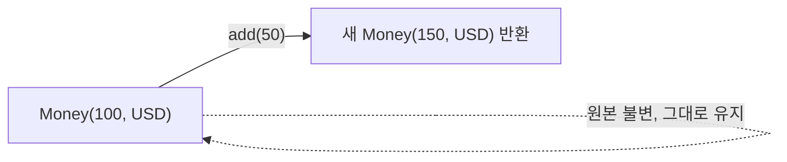

# 불변 객체

## 핵심 정의
불변 객체(immutable object)는 생성된 이후 내부 상태(state)가 절대 변경되지 않는 객체를 말한다. 상태를 바꿔야 할 경우 기존 객체를 수정하는 대신 변경된 값을 가진 새 객체를 반환한다. `String`, 박싱 타입(`Integer`, `Long` 등), `LocalDate` 등 `java.time` 패키지, 불변 컴포넌트로 구성한 record가 대표적인 불변 설계 사례다.

## 동작 원리 / 구조
불변 클래스를 만들기 위한 일반적인 규칙은 다음과 같다.

1. 클래스를 `final`로 선언하거나 생성자를 `private`으로 막아 하위 클래스에서 상태를 변경할 여지를 없앤다.
2. 모든 필드를 `private final`로 선언한다.
3. 필드를 변경하는 setter를 제공하지 않는다.
4. 가변 객체(mutable object)를 필드로 가질 경우, 생성자에서 받을 때와 getter로 반환할 때 **방어적 복사(defensive copy)** 를 수행한다.
5. 객체 초기화가 끝나기 전에 `this` 참조가 외부에 노출되지 않도록 한다.

```java
public final class Money {
    private final BigDecimal amount;
    private final Currency currency;

    public Money(BigDecimal amount, Currency currency) {
        this.amount = java.util.Objects.requireNonNull(amount);
        this.currency = java.util.Objects.requireNonNull(currency);
    }

    public Money add(Money other) {
        validateSameCurrency(other);
        return new Money(this.amount.add(other.amount), this.currency); // 새 객체 반환
    }

    private void validateSameCurrency(Money other) {
        if (!this.currency.equals(other.currency)) {
            throw new IllegalArgumentException("통화가 다릅니다: " + this.currency + " vs " + other.currency);
        }
    }
}
```

방어적 복사가 필요한 대표 사례:

```java
public final class Schedule {
    private final List<LocalDate> dates;

    public Schedule(List<LocalDate> dates) {
        this.dates = List.copyOf(dates); // 입력 리스트를 복사 + 불변화
    }

    public List<LocalDate> getDates() {
        return dates; // List.copyOf 결과 자체가 불변이므로 추가 복사 불필요
    }
}
```



Schedule 예제의 List.copyOf는 목록 구조만 복사하지만 LocalDate가 불변이라 요소를 공유해도 안전하다. 요소가 Date 등 가변 타입이면 입력·출력 양쪽에서 요소의 변경 경로도 차단해야 한다.

## 실무 관점
- 불변 객체는 스레드 간 공유가 안전하다. 상태가 바뀌지 않으므로 동기화(synchronization) 없이도 여러 스레드가 동시에 읽을 수 있어 동시성 프로그래밍의 부담을 크게 줄인다.
- 값 객체(value object, 예: 금액, 좌표, 기간)는 불변으로 설계하는 것이 기본이다. 도메인 주도 설계(DDD)에서 Value Object 패턴과 직결된다.
- 방어적 복사를 빠뜨리면 "불변인 척하는" 객체가 된다. 생성자에 넘긴 리스트나 getter로 반환한 컬렉션을 호출부에서 그대로 수정하면 불변성이 깨진다. List.copyOf()로 구조의 스냅샷을 만든다. Collections.unmodifiableList()는 원본 변경이 반영되는 뷰이므로 외부 원본을 그대로 감싸는 것만으로는 부족하다.
- 불변 객체는 상태 변경 시마다 새 인스턴스를 생성하므로, 매우 큰 객체를 빈번히 "수정"하는 경우 메모리 할당과 GC 압박이 늘어날 수 있다. 이런 트레이드오프가 부담되면 빌더 패턴이나 가변 누적기(예: `StringBuilder`)로 중간 상태를 만들고 마지막에 불변 객체로 확정하는 방식을 쓴다.
- `HashMap`의 키, 캐시 키, 멀티스레드 환경에서 공유되는 설정값 객체는 불변으로 만들어야 예기치 않은 부작용을 막을 수 있다.

## 심화 Q&A

### Q. 필드를 `final`로 선언하는 것만으로 객체가 불변이 되는가?
아니다. `final`은 참조 자체의 재할당만 막을 뿐, 참조가 가리키는 객체의 내부 상태 변경은 막지 못한다. 예를 들어 `private final List<String> items`는 `items = ...`로 재할당은 불가능하지만 `items.add(...)`로 내부를 변경하는 것은 막지 못한다. 진짜 불변을 보장하려면 가변 필드에 대해 방어적 복사와 불변 컬렉션 래핑이 함께 필요하다.

### Q. 방어적 복사는 생성자와 getter 양쪽에서 왜 모두 필요한가?
생성자에서 복사하지 않으면 호출부가 넘긴 원본 컬렉션을 나중에 수정해 객체 내부 상태가 몰래 바뀔 수 있다. getter에서 복사하지 않으면(또는 불변 래핑하지 않으면) 반환받은 참조를 호출부가 수정해 객체 내부 상태를 외부에서 직접 조작할 수 있다. 두 지점 모두 막아야 완전한 캡슐화(encapsulation)가 유지된다.

### Q. 불변 객체는 왜 스레드 안전(thread-safe)한가?
상태가 생성 이후 절대 바뀌지 않으므로 여러 스레드가 동시에 읽어도 경쟁 상태(race condition)가 발생할 여지가 없다. 가시성(visibility) 문제도, 모든 필드가 `final`이면 생성자 실행이 완전히 끝난 뒤 참조가 공개되는 한 JMM(Java Memory Model)의 final 필드 규칙이 초기화 가시성을 보장한다. 일반 필드의 안전한 공개나 생성 후 재변경까지 같은 규칙으로 보호되는 것은 아니다. 단, 생성 도중 `this` 참조가 유출되면 이 보장이 깨질 수 있다.

### Q. 불변 객체를 남용했을 때의 성능 트레이드오프는 무엇인가?
상태 변경마다 새 객체를 생성하므로 변경이 매우 잦고 객체 크기가 큰 경우 할당/복사 비용과 GC 부담이 누적된다. 예를 들어 대용량 문자열을 반복 연결하면 `String` 불변성 때문에 `O(n^2)` 비용이 발생하는 것과 같은 패턴이다. 이런 경우 가변 빌더(`StringBuilder`, 커스텀 Builder)로 중간 단계를 처리하고 최종 결과만 불변 객체로 만드는 절충이 일반적이다.

### Q. `record`로 만든 타입은 항상 완전한 불변 객체인가?
`record`는 필드를 `private final`로 만들고 setter 없는 접근자만 생성해 얕은 불변성(shallow immutability)을 기본 제공한다. 하지만 컴포넌트 타입이 가변 객체(예: `List<String>`, `Date`)라면 그 내부까지 불변이 되는 것은 아니다. 완전한 불변을 원하면 컴팩트 생성자(compact constructor)에서 직접 방어적 복사를 추가해야 한다.

### Q. 불변 객체와 캐싱/동일성 최적화(예: `Integer` 캐시, String Pool)는 어떤 관계가 있는가?
불변성이 보장되면 동일한 값을 가진 여러 참조가 같은 인스턴스를 안전하게 공유할 수 있다. `Integer.valueOf(-128~127)` 캐시나 String Pool이 이 원리를 활용한 대표 사례다. 만약 객체가 가변이었다면 공유된 인스턴스를 한쪽에서 변경했을 때 다른 모든 참조에 의도치 않은 영향을 미치므로 이런 최적화 자체가 불가능했을 것이다.

### Q. 불변 스냅샷을 volatile로 교체하면 동시에 수행한 갱신도 보존되는가?
A. 초기화된 스냅샷의 공개와 복합 갱신은 별개다. 두 스레드가 같은 이전 스냅샷을 읽고 각자 새 객체를 만든 뒤 대입하면 한쪽 변경이 덮어써질 수 있다. 필요한 불변식 전체를 락으로 보호하거나 `AtomicReference.updateAndGet` 같은 원자적 갱신을 쓴다. 이 함수는 경합으로 재호출될 수 있으므로 외부 부수 효과를 넣지 않는다.

### Q. List.copyOf는 언제나 새 객체를 만들고 모든 입력을 보존하는가?
A. 아니다. Java SE 25는 이미 수정 불가능한 리스트를 받으면 기존 인스턴스를 재사용할 수 있고, null 원소는 거부한다. 계약은 원본의 이후 구조 변경이 결과에 반영되지 않는 것이며 참조 동일성이나 원소의 깊은 복사는 아니다. 다른 스레드가 원본을 동시에 수정하는 상황의 원자적 스냅샷까지 일반적으로 보장하지 않으므로 입력의 소유권·잠금도 확인한다.

## 관련 개념
- [[String과 String Pool]]
- [[Record]]
- [[equals와 hashCode]]

## 참고 자료

확인 날짜: 2026-09-08. 아래 버전과 범위의 공식 문서·소스로 본문을 대조했다. 성능 비교와 운영 선택은 워크로드에 따라 달라지는 판단 기준이다.

- [JLS 25 §17.5](https://docs.oracle.com/javase/specs/jls/se25/html/jls-17.html#jls-17.5) — final 초기화 보장.
- [Java SE 25 List](https://docs.oracle.com/en/java/javase/25/docs/api/java.base/java/util/List.html) — copyOf 얕은 구조 스냅샷.
- [Java SE 25 Collections](https://docs.oracle.com/en/java/javase/25/docs/api/java.base/java/util/Collections.html) — unmodifiableList 원본 연동 뷰.
- [JLS 25 record](https://docs.oracle.com/javase/specs/jls/se25/html/jls-8.html#jls-8.10) — 컴포넌트 final 의미.

### 2026-09-23 부분 재검증

Java SE 25 List.copyOf의 null·재사용·구조 스냅샷과 AtomicReference.updateAndGet의 재시도 함수를 확인했다. 기존 전체 검증일은 유지한다.

- [Java SE 25 AtomicReference](https://docs.oracle.com/en/java/javase/25/docs/api/java.base/java/util/concurrent/atomic/AtomicReference.html) — updateAndGet 함수의 재적용과 부수 효과 금지.

실행 확인: 2026-09-23, OpenJDK 25.0.2+10-69에서 List.copyOf의 null 거부와 unmodifiableList 뷰의 원본 반영 차이을 재현했다. 구현 관측은 해당 버전 범위로 한정한다.
