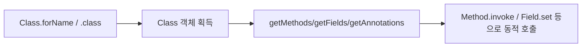

# 애노테이션과 리플렉션

## 핵심 정의
애노테이션(annotation)은 코드에 부착하는 메타데이터(metadata)로, 그 자체로는 로직을 수행하지 않고 컴파일러나 도구, 런타임 프레임워크에 정보를 전달하는 역할을 한다. 리플렉션(reflection)은 런타임에 클래스, 메서드, 필드, 애노테이션 등의 구조 정보를 조회하고 조작할 수 있는 API(`java.lang.reflect`)다. Spring, JPA/Hibernate 등 대부분의 Java 프레임워크는 애노테이션으로 선언된 메타데이터를 리플렉션으로 읽어 동작을 결정하는 방식으로 동작한다.

## 동작 원리 / 구조
애노테이션은 `@Retention`으로 생명주기를, `@Target`으로 적용 대상을 지정한다.

| Retention | 유지 범위 | 예시 용도 |
|---|---|---|
| `SOURCE` | 소스 코드에만 존재, 컴파일 시 제거 | `@Override`, Lombok 애노테이션 |
| `CLASS` | 클래스 파일에 남지만 표준 런타임 애노테이션 조회 대상이 아님(기본값) | 바이트코드 처리 도구 |
| `RUNTIME` | 런타임까지 유지, 리플렉션으로 조회 가능 | `@Component`, `@Autowired`, `@Transactional` |

```java
@Retention(RetentionPolicy.RUNTIME)
@Target(ElementType.METHOD)
public @interface LogExecutionTime {
}

// 리플렉션으로 애노테이션 조회
Method method = MyService.class.getMethod("process");
if (method.isAnnotationPresent(LogExecutionTime.class)) {
    // AOP 프록시나 인터셉터가 이 정보를 보고 부가 로직 삽입
}
```

리플렉션 기본 흐름:



Spring의 컴포넌트 스캔(component scan)은 클래스패스를 훑으며 `@Component` 계열 애노테이션이 붙은 클래스를 찾고(ASM 바이트코드 분석 또는 리플렉션), 빈(bean)으로 등록한 뒤 `@Autowired`가 붙은 필드/생성자를 리플렉션으로 찾아 의존성을 주입한다. `@Transactional`, `@Cacheable` 같은 AOP 애노테이션은 프록시(proxy) 객체가 메서드 호출을 가로챌 때 리플렉션으로 애노테이션 존재 여부와 속성을 읽어 부가 기능을 적용한다.

### final 필드 변경 제한(Java 26~27)
Java 26부터 일반 인스턴스의 `final` 필드를 깊은 리플렉션(deep reflection)으로 변경하면, 기본 `warn` 모드에서 변경한 모듈별로 첫 경고가 발생한다. Java 27도 이 기본값을 유지한다. `setAccessible(true)`나 `--add-opens`는 접근 경계를 여는 기능이며 `final` 변경 권한까지 부여하지 않는다.

`--illegal-final-field-mutation=deny`로 점검하면 허용되지 않은 변경은 `IllegalAccessException`이 된다. 불가피한 호환성 조치는 변경을 수행하는 모듈에 `--enable-final-field-mutation=모듈명`을 지정하고, 대상 패키지도 그 모듈에 열어 두는 것이다. 클래스패스 코드에는 `ALL-UNNAMED`를 쓴다. 이 옵션도 record 컴포넌트 필드나 `static final`처럼 수정 불가능한 필드를 쓰기 가능하게 만들지는 않는다. 장기적으로는 생성자·팩토리에서 값을 초기화하는 방식으로 바꾼다.

## 실무 관점
- 리플렉션은 컴파일 타임 타입 검사를 우회하므로 오타나 시그니처 변경에 취약하다. 접근 검사·인수 변환 비용과 JIT(Just-In-Time)의 호출 대상 최적화 가능성은 구현·사용 방식에 따라 달라지므로 직접 호출과의 성능 차이는 측정한다. 프레임워크 내부에서는 널리 쓰이지만, 애플리케이션 코드에서 성능이 중요한 반복 경로(hot path)에 직접 리플렉션을 쓰는 것은 지양한다.
- Java 9의 모듈 시스템(JPMS)은 강한 캡슐화(strong encapsulation)를 도입했지만 JDK 9~15는 과거 내부 패키지 일부에 완화된 기본 접근을 제공했다. Java 16부터 `--illegal-access` 옵션의 기본값이 `deny`로 바뀌었고 Java 17에서 --illegal-access의 완화 효과가 없어져(obsolete), 필요한 경우 `--add-opens 모듈/패키지=대상모듈`로 명시적으로 열어줘야 한다. 레거시 라이브러리를 최신 JDK로 올릴 때 흔히 마주치는 이슈다.
- 커스텀 애노테이션 + 리플렉션(또는 AOP)으로 반복 로직(로깅, 권한 체크, 캐싱, 재시도)을 선언적으로 뽑아내는 것은 실무에서 자주 쓰는 패턴이다. 다만 과도하게 사용하면 실행 흐름이 애노테이션 뒤로 숨어 디버깅이 어려워지는 트레이드오프가 있다.
- 리플렉션으로 `private` 필드/메서드에 접근(`setAccessible(true)`)하는 것은 캡슐화를 깨는 행위이므로 테스트 코드나 프레임워크 내부 구현 외에는 지양한다.
- 애노테이션 프로세서(annotation processor, APT)를 이용하면 컴파일 시점에 코드를 생성해 리플렉션 없이도 애노테이션 기반 기능을 구현할 수 있다(예: Lombok, MapStruct, Dagger). 런타임 리플렉션 오버헤드가 부담스러운 경우의 대안이다.

### 애노테이션 탐색과 호출 실패의 경계

`@Inherited`는 클래스 조회에서 상위 클래스의 애노테이션을 찾는 규칙이다. 구현한 인터페이스나 오버라이드 메서드의 애노테이션을 자동 상속시키지 않는다. 프레임워크가 인터페이스·메타 애노테이션까지 탐색하는 기능은 별도 정책이므로, `getAnnotation` 한 번으로 같은 결과가 나온다고 가정하지 않는다.

`Method.invoke`에서 인수 개수·타입이 맞지 않아 호출 전에 실패하면 `IllegalArgumentException` 등이 발생한다. 실제 대상 메서드가 던진 예외는 `InvocationTargetException`의 원인으로 전달되므로 둘을 구분해 진단한다. 기본형 인수는 언박싱과 확대 변환(widening)을 허용하지만 축소 변환(narrowing)을 대신 수행하지 않는다.

대상이 `void work(String... values)`여도 리플렉션 호출이 전달한 여러 문자열을 대상 배열로 자동 수집해 주지는 않는다. 메서드 조회에는 `String[].class`를 쓰고 호출은 `method.invoke(target, (Object) new String[]{"a", "b"})`처럼 배열 하나를 인수 하나로 넘긴다. 여기의 캐스팅은 `invoke` 자신의 `Object...`와 대상 메서드의 varargs를 구분하기 위한 것이다.

## 심화 Q&A

### Q. `RetentionPolicy.RUNTIME`이 아닌 애노테이션은 리플렉션으로 조회할 수 없는가?
맞다. `getAnnotation()` 계열 메서드는 클래스 파일에 남아있더라도 런타임까지 로드되는 `RUNTIME` 정책의 애노테이션만 조회할 수 있다. `SOURCE`는 컴파일 시 완전히 제거되고, `CLASS`(기본값)는 바이트코드에는 남지만 표준 리플렉션의 런타임 애노테이션 조회 대상이 아니므로 리플렉션 API로는 보이지 않는다. `CLASS`는 주로 바이트코드 조작 도구(예: 정적 분석기)가 `.class` 파일을 직접 파싱할 때 활용된다.

### Q. Spring의 `@Autowired` 필드 주입은 내부적으로 어떻게 동작하는가?
빈 생성 후처리기(`BeanPostProcessor`, 구체적으로 `AutowiredAnnotationBeanPostProcessor`)가 리플렉션으로 대상 클래스의 필드를 스캔하며 `@Autowired`가 붙은 필드를 찾고, 타입에 맞는 빈을 컨테이너에서 조회한 뒤 `Field.setAccessible(true)`와 `Field.set()`으로 `private` 필드에도 직접 값을 주입한다. 생성자 주입은 리플렉션으로 생성자를 찾아 파라미터에 맞는 빈들을 조회한 후 `Constructor.newInstance()`로 인스턴스를 생성한다.

### Q. 리플렉션 호출이 일반 메서드 호출보다 느린 근본적인 이유는?
직접 호출은 호출 형태와 대상 타입을 JIT이 분석하기 쉬워 인라이닝(inlining) 등 최적화를 적용할 기회가 많다. 가상 메서드의 최종 구현은 런타임 수신 객체에 따라 선택될 수 있다. 리플렉션 호출(`Method.invoke()`)은 접근 제어 검사, 인자 박싱/언박싱, 가변 인자 배열 생성 등 부가 작업이 필요할 수 있고, JIT이 호출 대상을 정적으로 알기 어려워 최적화 여지가 줄어든다. 이전 HotSpot의 inflation/MethodAccessor 생성 설명을 최신 구현에 그대로 적용하지 않는다. Java 18(JEP 416)부터 core reflection은 메서드 핸들 기반으로 재구현되어, Method/Field를 상수로 유지하는지에 따라 JIT 최적화 결과가 달라진다. 성능 우열은 측정해야 한다.

### Q. `setAccessible(true)`로 `private` 멤버에 접근하는 것이 항상 가능한가?
Java 9 이후 모듈 시스템 하에서는 대상 모듈이 해당 패키지를 리플렉션에 열어주지 않으면(`opens` 선언이나 `--add-opens` 플래그 부재 시) `InaccessibleObjectException`이 발생한다. 이름 없는 모듈(unnamed module, 클래스패스 기반 애플리케이션)이나 자체 모듈 내부 접근은 대체로 허용되지만, JDK 내부 패키지처럼 강하게 캡슐화된 대상은 기본적으로 차단된다.

### Q. 애노테이션 기반 설정과 애노테이션 프로세서(컴파일 타임 코드 생성)의 트레이드오프는?
런타임 리플렉션 기반(Spring 클래식 방식)은 유연성이 높고 동적으로 빈 구성을 바꾸기 쉽지만, 애플리케이션 시작 시점에 클래스패스를 스캔하고 리플렉션 메타데이터를 구성하는 비용이 들어 구동 시간(startup time)이 늘어난다. 컴파일·빌드 시 생성(MapStruct의 표준 APT, Lombok의 javac AST 확장, 별도 빌드 단계의 Spring AOT 등)은 컴파일 시점에 코드를 미리 생성해 런타임 리플렉션 비용을 없애고 구동 속도와 네이티브 이미지(GraalVM) 호환성을 높이지만, 빌드 과정이 복잡해지고 생성된 코드 디버깅이 필요할 수 있다.

### Q. 커스텀 애노테이션으로 AOP 스타일 부가 기능(예: 재시도, 로깅)을 구현할 때 유의점은?
애노테이션 자체는 아무 동작도 하지 않으므로 반드시 이를 해석해 실행하는 주체(AOP 프록시, `BeanPostProcessor`, 인터셉터 등)가 있어야 한다. 프록시 기반 AOP(Spring 기본 방식)는 같은 클래스 내부에서 자기 자신을 호출(self-invocation)하면 프록시를 거치지 않아 애노테이션이 무시되는 문제가 흔히 발생한다. 이 문제를 피하려면 다른 빈으로 로직을 분리하거나 AspectJ 컴파일 타임 위빙(compile-time weaving) 같은 대안을 검토한다.

## 관련 개념
- [[Record]]
- [[함수형 인터페이스와 람다]]
- [[제네릭]]

## 참고 자료

확인 날짜: 2026-09-08. 아래 버전과 범위의 공식 문서·소스로 본문을 대조했다. 성능 비교와 운영 선택은 워크로드에 따라 달라지는 판단 기준이다.

- [JLS 25 §9.6](https://docs.oracle.com/javase/specs/jls/se25/html/jls-9.html#jls-9.6) — 애노테이션 타입·Retention·Target.
- [Java SE 25 AccessibleObject](https://docs.oracle.com/en/java/javase/25/docs/api/java.base/java/lang/reflect/AccessibleObject.html) — 모듈 경계와 접근 제한.
- [JEP 396](https://openjdk.org/jeps/396) — Java 16 강한 캡슐화 기본.
- [JEP 403](https://openjdk.org/jeps/403) — Java 17 illegal-access obsolete.
- [JEP 416](https://openjdk.org/jeps/416) — Java 18 메서드 핸들 기반 reflection.

부분 재검증: 2026-09-22. 아래 범위를 추가 확인했으며, 그 밖의 본문은 기존 검증 날짜를 유지한다.

- [JDK 26 Migration Guide: final Field Mutation](https://docs.oracle.com/en/java/javase/26/migrate/preparing-final-field-mutation-restrictions.html) — Java 26 도입 시점, 변경 모듈 허용과 패키지 개방의 별도 조건.
- [JDK 27 java 명령](https://docs.oracle.com/en/java/javase/27/docs/specs/man/java.html) — Java 27의 warn 기본값 및 deny/enable 옵션. Oracle JDK 27+35에서 기본 경고·deny 거부·ALL-UNNAMED 허용·record 필드 거부를 실행 확인했다.

- [Java SE 27 Field.setAccessible](https://docs.oracle.com/en/java/javase/27/docs/api/java.base/java/lang/reflect/Field.html#setAccessible(boolean))에서 static final·record·hidden class의 수정 불가능한 필드 계약도 확인했다.

### 2026-09-23 부분 재검증

[Java SE 25 Inherited](https://docs.oracle.com/en/java/javase/25/docs/api/java.base/java/lang/annotation/Inherited.html)와 [Method.invoke](https://docs.oracle.com/en/java/javase/25/docs/api/java.base/java/lang/reflect/Method.html#invoke(java.lang.Object,java.lang.Object...))의 탐색·변환·예외 계약을 확인했다. OpenJDK 25.0.2에서 상위 클래스/인터페이스/오버라이드 차이, 확대/축소 변환, 원인 예외 포장과 배열 인수 전달을 실행 확인했다. 기존 Java 26~27 final 필드 제한과 Spring 내부 설명은 이번 검증 범위 밖이다.
