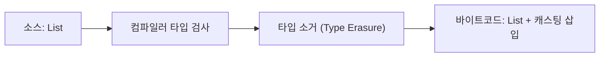

# 제네릭

## 핵심 정의
제네릭(Generics)은 클래스, 인터페이스, 메서드가 다루는 데이터 타입을 컴파일 시점의 타입 매개변수(type parameter)로 지정할 수 있게 하는 기능이다. Java 5에서 도입됐으며, 컬렉션 등에서 반복적으로 발생하던 캐스팅과 `ClassCastException`을 컴파일 타임 타입 검사로 대체하는 것이 목적이다.

`List<String>`처럼 타입 인자를 명시하면 컴파일러가 일반적인 타입 안전 코드의 잘못된 삽입을 막고(로우 타입·unchecked cast·리플렉션 등은 예외), 꺼낼 때도 캐스팅 없이 바로 사용할 수 있다.

## 동작 원리 / 구조
Java 제네릭은 **타입 소거(type erasure)** 방식으로 구현된다. 컴파일러는 제네릭 코드를 검사한 뒤 타입 파라미터 정보를 제거하고, 필요한 지점에 캐스팅 코드를 자동 삽입해 바이트코드를 생성한다. 즉 런타임에는 `List<String>`과 `List<Integer>`가 동일한 `List` 클래스로 취급된다.

```java
// 소스 코드
List<String> list = new ArrayList<>();
list.add("a");
String s = list.get(0);

// 컴파일러가 생성하는 바이트코드 관점(의사코드)
List list = new ArrayList();
list.add("a");
String s = (String) list.get(0);
```

- **Bounded type**: `<T extends Number>`처럼 상한을 지정해 타입 범위를 제한.
- **와일드카드(wildcard)**: `? extends T`(상한, T 값을 읽는 생산자에 적합), `? super T`(하한, 쓰기에 적합), `?`(비한정).
- **PECS 원칙**: Producer-Extends, Consumer-Super. 컬렉션에서 값을 꺼내기만 하면 `extends`, 넣기만 하면 `super`.
- **Bridge method**: 제네릭 타입을 오버라이드할 때 컴파일러가 타입 소거로 인한 시그니처 불일치를 보정하기 위해 자동 생성하는 합성 메서드.



## 실무 관점
- 로우 타입(raw type, `List list`) 사용은 레거시 호환 목적 외에는 지양한다. unchecked warning이 발생하면 원인을 파악하고 억제(`@SuppressWarnings("unchecked")`)는 범위를 최소화해서 사용한다.
- 제네릭과 배열은 공존이 까다롭다. `new T[]`처럼 제네릭 배열을 직접 생성할 수 없으므로 내부적으로 `Object[]`를 만들고 캐스팅하는 패턴(예: `ArrayList` 내부 구현)을 쓴다.
- API 설계 시 파라미터 타입은 PECS에 따라 와일드카드를 적용하면 호출부의 유연성이 커진다. 예: `Collections.copy(List<? super T> dest, List<? extends T> src)`.
- 제네릭 메서드의 타입 추론이 모호할 때는 명시적으로 타입 인자를 지정(`Collections.<String>emptyList()`)해서 컴파일 오류를 해결한다.
- 리플렉션으로 제네릭 타입 정보를 얻으려면 타입 소거 때문에 `getClass()`로는 알 수 없고, `TypeToken` 패턴이나 `ParameterizedType`을 활용해야 한다.

## 심화 Q&A

### Q. 제네릭 배열(`new T[]`)을 만들 수 없는 이유는?
타입 소거로 인해 런타임에는 `T`가 무엇인지 알 수 없는데, 배열은 런타임에 실제 컴포넌트 타입 정보를 유지하며 이를 이용해 공변성(covariance) 검사를 한다. `T`가 소거되면 배열 저장 시 타입 안정성을 보장할 방법이 없어 컴파일러가 원천적으로 금지한다. 내부 저장소는 Object[]로 두고 요소 접근 시 캐스팅하거나 Class<T> 토큰과 Array.newInstance를 사용한다. Object[]를 T[]로 캐스팅해 외부에 반환하는 것은 실제 런타임 배열 타입을 바꾸지 않아 ClassCastException을 낼 수 있다.

### Q. `List<Object>`와 `List<?>`는 어떻게 다른가?
`List<Object>`는 어떤 타입이든 담을 수 있는 리스트이며 `Object` 타입으로 원소를 추가/조회할 수 있다. `List<?>`는 "알 수 없는 어떤 타입 하나의 리스트"를 의미하며, 실제 타입을 모르기 때문에 `null` 외에는 값을 추가할 수 없고 조회 결과는 `Object`로만 받을 수 있다. `List<String>`을 `List<Object>` 파라미터에 넘길 수는 없지만 `List<?>`에는 넘길 수 있다.

### Q. `extends`와 `super` 와일드카드는 각각 언제 선택하는가?
데이터를 꺼내서 읽기만 하는(생산자, producer) 위치에는 `? extends T`를 써서 `T`의 하위 타입 컬렉션도 받을 수 있게 한다. 반대로 데이터를 넣기만 하는(소비자, consumer) 위치에는 `? super T`를 써서 `T`의 상위 타입 컬렉션에도 안전하게 쓸 수 있게 한다. T로 읽고 쓰는 양쪽 계약이 필요하면 정확한 T를 사용한다. extends는 불변·읽기 전용 타입이 아니므로 clear/remove와 null 삽입 등은 가능하며, super에서도 Object로 읽을 수 있다.

### Q. 타입 소거 때문에 생기는 대표적인 제약은 무엇인가?
Object형 obj를 List<String>으로 검사할 수는 없고 List<?> 검사는 가능하다. 다만 Java 16+는 정적 타입으로 안전성이 증명되는 일부 매개변수화 타입 검사를 허용하므로 모든 제네릭 instanceof가 금지되는 것은 아니다.  제네릭 타입 파라미터로 `new T()` 같은 인스턴스 생성이 불가능하며, 오버로딩 시 `void m(List<String>)`과 `void m(List<Integer>)`은 소거 후 시그니처가 동일해져 컴파일 오류가 난다. 또한 정적 컨텍스트에서는 클래스의 타입 파라미터를 참조할 수 없다.

### Q. 제네릭 메서드의 타입 추론이 실패하는 대표 상황은?
타겟 타입(target type)을 추론할 문맥이 없을 때, 체인 수신자에서 목표 타입이 전달되지 않거나, 서로 충돌하는 타입 제약을 만족해야 할 때 추론이 실패할 수 있다. emptyList를 메서드 인자로 넘기는 일반적인 경우는 대상 파라미터 타입으로 정상 추론된다. 이때는 `Collections.<String>emptyList()`처럼 명시적 타입 인자를 지정해 해결한다.

### Q. 힙 오염(heap pollution)이란 무엇이고 언제 발생하는가?
타입 소거로 인해 실제로는 다른 타입의 객체가 제네릭 컬렉션에 섞여 들어가는 상황을 말한다. 로우 타입과 제네릭 타입을 혼용하거나, `varargs`와 제네릭을 함께 쓸 때(`@SafeVarargs`가 필요한 이유) 컴파일러가 unchecked 경고를 내며 발생 가능성을 알린다.

### Q. 타입 소거는 제네릭 선언 정보까지 모두 지운다는 뜻인가?
A. 런타임의 객체 클래스에 타입 인자별 별도 클래스가 생기지 않는다는 뜻과 선언 메타데이터를 구분한다. `List<String> names` 같은 필드 선언은 class 파일의 `Signature` 속성에 남아 `Field.getGenericType()`으로 읽을 수 있다. 반면 임의의 `new ArrayList<String>()` 객체에 `getClass()`를 호출하는 것만으로 실제 타입 인자를 복원할 수는 없다. `TypeToken<T>`의 T도 구체 타입으로 결합되지 않았다면 마찬가지다.

### Q. 제네릭은 모두 Object로 소거되고 제네릭 배열은 모두 금지되는가?
A. 타입 변수는 가장 왼쪽 상한의 소거 타입이 된다. `<T extends Number>`는 Number이며 무제한 T의 상한이 Object다. 또한 `new List<String>[2]`는 금지되지만 모든 타입 인자가 비한정 와일드카드인 `new List<?>[2]`는 런타임 표현 가능한 타입(reifiable type)이므로 허용된다. 배열의 실제 컴포넌트 검사와 제네릭 요소 타입 검사를 혼동하지 않는다.

## 관련 개념
- [[불변 객체]]
- [[Record]]
- [[함수형 인터페이스와 람다]]
- [[애노테이션과 리플렉션]]

## 참고 자료

확인 날짜: 2026-09-08. 아래 버전과 범위의 공식 문서·소스로 본문을 대조했다. 성능 비교와 운영 선택은 워크로드에 따라 달라지는 판단 기준이다.

- [JLS 25 §4](https://docs.oracle.com/javase/specs/jls/se25/html/jls-4.html) — 소거·raw type·reifiable·heap pollution.
- [JLS 25 §5](https://docs.oracle.com/javase/specs/jls/se25/html/jls-5.html) — 캐스팅·와일드카드 capture.
- [JLS 25 §15.20.2](https://docs.oracle.com/javase/specs/jls/se25/html/jls-15.html#jls-15.20.2) — Java 16+ instanceof 매개변수화 타입 제약.

### 2026-09-23 부분 재검증

JLS 25 §4.6–4.7의 소거·reifiable type과 JVMS 25 Signature 속성, Java SE 25 Field.getGenericType 계약을 확인했다. 기존 전체 검증일은 유지한다.

- [JVMS 25 §4.7.9 Signature](https://docs.oracle.com/javase/specs/jvms/se25/html/jvms-4.html#jvms-4.7.9) — 제네릭 선언 메타데이터.
- [Java SE 25 Field.getGenericType](https://docs.oracle.com/en/java/javase/25/docs/api/java.base/java/lang/reflect/Field.html#getGenericType()) — 선언 타입 반환.

실행 확인: 2026-09-23, OpenJDK 25.0.2+10-69에서 필드의 제네릭 선언 유지·상한 Number로 소거·List<?> 배열 생성을 재현했다. 구현 관측은 해당 버전 범위로 한정한다.
