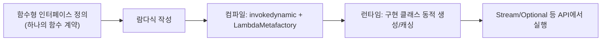

# 함수형 인터페이스와 람다

## 핵심 정의
함수형 인터페이스(functional interface)는 하나의 함수 계약을 가진 비sealed 인터페이스로, `@FunctionalInterface` 애노테이션으로 명시하는 것이 관례다. 람다식(lambda expression)은 이런 함수형 인터페이스의 구현체를 간결한 문법으로 즉석에서 작성하는 방법이며, Java 8에서 함수형 프로그래밍 스타일을 지원하기 위해 함께 도입됐다.

Object의 public 메서드와 일치하는 추상 선언은 함수형 계약 계산에서 제외한다. 상속된 추상 선언이 여러 개여도 override-equivalent이고 반환 타입 등이 호환되면 하나의 함수 계약이 될 수 있다. default/static/private 메서드는 추상 계약 수에 포함하지 않는다.

## 동작 원리 / 구조
```java
@FunctionalInterface
interface Calculator {
    int calculate(int a, int b);
}

Calculator add = (a, b) -> a + b;      // 람다식
Calculator sum = Integer::sum;          // 메서드 참조(method reference)로도 동일한 인터페이스 구현 가능
int result = add.calculate(3, 4);       // 7
```

람다식은 컴파일 시 익명 클래스(anonymous class)로 변환되는 것처럼 보이지만, 실제로는 `invokedynamic` 바이트코드와 `LambdaMetafactory`를 이용해 런타임에 동적으로 구현 클래스를 생성한다. 이는 익명 클래스마다 별도의 `.class` 파일을 만드는 방식보다 클래스 로딩 부담이 적고, 매번 새 인스턴스를 생성하지 않아도 되는 경우(캡처 변수가 없는 경우) 인스턴스를 재사용할 수 있는 여지를 준다.

`java.util.function` 패키지가 제공하는 표준 함수형 인터페이스:

| 인터페이스 | 시그니처 | 용도 |
|---|---|---|
| `Function<T, R>` | `R apply(T t)` | 입력을 받아 변환 |
| `Consumer<T>` | `void accept(T t)` | 입력을 소비, 반환값 없음 |
| `Supplier<T>` | `T get()` | 입력 없이 값 생성/제공 |
| `Predicate<T>` | `boolean test(T t)` | 조건 판별 |
| `BiFunction<T, U, R>` | `R apply(T t, U u)` | 두 입력을 받아 변환 |
| `UnaryOperator<T>` | `T apply(T t)` | 같은 타입으로 변환 (`Function<T, T>` 특수화) |

메서드 참조(method reference)는 람다의 축약 표현이다.

```java
list.forEach(System.out::println);   // 참조 대상 메서드를 직접 지목
list.stream().map(String::toUpperCase);
```



## 실무 관점
- 람다가 외부의 지역 변수를 캡처(capture)할 때 그 변수는 사실상 `final`(effectively final)이어야 한다. 캡처 후 변경 시도는 컴파일 오류가 되며, 이는 람다가 실행되는 시점과 정의되는 시점이 다를 수 있어(비동기 콜백 등) 값이 바뀌면 안전하지 않기 때문이다.
- `Runnable`, `Comparator`, `ActionListener` 등 기존 단일 추상 메서드 인터페이스도 람다의 대상이 될 수 있다. 새 함수형 인터페이스를 만들기 전에 `java.util.function` 표준 인터페이스로 표현 가능한지 먼저 검토한다.
- 람다 안에서 체크 예외(checked exception)를 던지는 메서드를 호출하려면 함수형 인터페이스 시그니처가 해당 예외를 던지도록 선언돼 있어야 한다. 표준 함수형 인터페이스는 대부분 체크 예외를 허용하지 않으므로 try-catch로 감싸거나 언체크 예외로 래핑하는 어댑터가 필요하다.
- 스트림 파이프라인 내부의 람다에서 예외 스택 트레이스가 읽기 어려워지는 경우가 있다. 복잡한 로직은 람다 대신 명명된 메서드로 추출해 메서드 참조로 넘기면 가독성과 디버깅 편의성이 개선된다.
- 성능이 극도로 민감한 반복 구간에서는 람다/스트림이 전통적인 for문보다 약간의 오버헤드(박싱, 함수 호출 비용)를 가질 수 있다. 가독성과 성능 사이의 트레이드오프를 상황에 맞게 판단한다.
- `Stream.parallel()`/`parallelStream()`은 기본적으로 공용 `ForkJoinPool.commonPool()`(통상 기본 목표 병렬성 = `max(1, Runtime.getRuntime().availableProcessors() - 1)`)을 공유한다. 이 안에서 블로킹 I/O나 오래 걸리는 작업을 람다로 넘기면 애플리케이션 전역의 다른 병렬 스트림/`CompletableFuture` 작업까지 스레드가 고갈되어 지연될 수 있다. 공용 풀 크기 조정은 격리가 아니다. 병렬 스트림의 풀 지정은 표준 Stream API 계약이 아니므로 구현 의존성과 호출 경로를 확인하고, I/O 작업 격리가 목적이면 명시적인 실행기와 동시성 제한을 설계한다.

## 심화 Q&A

### Q. 람다가 지역 변수를 캡처할 때 왜 effectively final이어야 하는가?
람다는 정의된 시점과 다른 시점, 다른 스레드에서 실행될 수 있다(예: 비동기 콜백, 다른 스레드에 전달). 캡처한 변수가 가변이라면 람다 실행 시점의 값이 정의 시점과 달라지거나, 여러 스레드가 동시에 접근할 때 가시성/경쟁 상태 문제가 생길 수 있다. 컴파일러는 이를 원천 차단하기 위해 캡처 대상 변수가 재할당되지 않는 effectively final일 것을 강제한다. 참고로 인스턴스 필드는 이 제약이 없는데, 필드는 캡처한 this를 통해 접근하기 때문이다. 다른 스레드의 변경을 최신으로 볼 수 있는지는 별도 동기화에 달려 있다.

### Q. 람다식은 익명 클래스와 완전히 동일하게 컴파일되는가?
아니다. 익명 클래스는 컴파일 시점에 별도의 `.class` 파일(`Outer$1.class` 등)로 생성되지만, 람다는 `invokedynamic` 바이트코드 명령과 `LambdaMetafactory`를 통해 런타임에 구현 클래스를 동적으로 생성한다. 이 방식은 클래스 파일 개수를 줄이고, `this` 바인딩도 익명 클래스는 자기 자신을 가리키지만 람다는 바깥 스코프의 `this`를 그대로 가리킨다는 차이가 있다.

### Q. 람다 안에서 체크 예외를 던지는 메서드를 호출하면 왜 컴파일 오류가 나는가?
`Function<T, R>` 같은 표준 함수형 인터페이스의 추상 메서드 시그니처에는 `throws` 절이 없다. 람다는 그 추상 메서드를 구현하는 것이므로 시그니처에 없는 체크 예외를 던질 수 없다. 해결하려면 람다 내부에서 try-catch로 잡아 언체크 예외로 변환하거나, 체크 예외를 던질 수 있는 커스텀 함수형 인터페이스를 별도로 정의해야 한다.

### Q. `Function<T,R>`과 `UnaryOperator<T>`, `BiFunction`과 `BinaryOperator`처럼 특수화된 인터페이스가 따로 존재하는 이유는?
입력과 출력 타입이 같은 경우가 매우 흔하기 때문에, 타입 파라미터를 하나로 줄여 시그니처를 간결하게 만들고 API 설계 의도를 명확히 드러내기 위함이다. `UnaryOperator<T>`는 `Function<T, T>`를 상속(extends)한 특수화이므로 `Function<T,T>`가 필요한 곳에 `UnaryOperator<T>`를 그대로 넘길 수 있다.

### Q. 람다 표현식과 스트림을 남용하면 어떤 문제가 생길 수 있는가?
과도하게 체이닝된 스트림 파이프라인은 디버거로 단계별 값을 확인하기 어렵고, 예외 발생 시 스택 트레이스가 람다 내부의 익명 프레임들로 채워져 원인 추적이 힘들어진다. 또한 단순 반복문으로 충분한 로직을 억지로 스트림화하면 가독성이 오히려 떨어지고 약간의 성능 오버헤드(박싱, 중간 연산 객체 생성)도 감수해야 한다. 복잡한 람다는 이름 있는 private 메서드로 추출해 메서드 참조로 넘기는 것이 유지보수에 유리하다.

### Q. `@FunctionalInterface` 애노테이션을 붙이지 않아도 람다의 대상이 될 수 있는가?
가능하다. `@FunctionalInterface`는 컴파일러에게 "이 인터페이스가 함수형 인터페이스 조건을 만족하는지" 검증해달라고 요청하는 문서화/안전장치 역할일 뿐, 컴파일러가 람다 대상 여부를 판단하는 필수 조건은 아니다. 애노테이션이 없어도 JLS의 함수형 인터페이스 조건을 만족하면 람다의 대상이 될 수 있지만, 실수로 추상 메서드를 추가해 함수형 인터페이스 조건이 깨지는 것을 컴파일 타임에 막고 싶다면 애노테이션을 붙이는 것이 안전하다.

### Q. 메서드 참조와 동등해 보이는 람다는 수신 객체를 같은 시점에 평가하는가?
A. `getService()::run`은 메서드 참조를 만드는 시점에 getService를 평가하고 결과 객체를 저장한다. `() -> getService().run()`은 실행할 때마다 평가한다. 전자는 null 수신 객체면 참조 생성 시점에 NPE가 나지만 후자는 실행할 때까지 미뤄진다. 객체 교체·조회 비용·예외 시점이 중요하면 단순 문법 치환으로 보지 않는다.

### Q. 캡처 변수가 effectively final이면 가리키는 객체도 스레드 안전한가?
A. 참조를 재대입하지 못할 뿐, 캡처한 리스트나 객체의 필드는 계속 바뀔 수 있다. 배열 한 칸으로 지역 카운터를 감싸 람다에서 수정하는 편법도 동시성 안전을 제공하지 않는다. 또한 람다의 객체 동일성은 보장되지 않으므로, 리스너 등록·해제에 같은 인스턴스가 필요하다면 한 번 만든 참조를 저장해 사용한다.

## 관련 개념
- [[Optional]]
- [[제네릭]]
- [[애노테이션과 리플렉션]]

## 참고 자료

확인 날짜: 2026-09-08. 아래 버전과 범위의 공식 문서·소스로 본문을 대조했다. 성능 비교와 운영 선택은 워크로드에 따라 달라지는 판단 기준이다.

- [JLS 25 §9.8](https://docs.oracle.com/javase/specs/jls/se25/html/jls-9.html#jls-9.8) — SAM·Object 메서드 제외·비sealed 조건.
- [JLS 25 §15.27](https://docs.oracle.com/javase/specs/jls/se25/html/jls-15.html#jls-15.27) — 캡처·this·람다 동등성.
- [Java SE 25 LambdaMetafactory](https://docs.oracle.com/en/java/javase/25/docs/api/java.base/java/lang/invoke/LambdaMetafactory.html) — 연결·캡처·호출 단계.
- [Java SE 25 java.util.function](https://docs.oracle.com/en/java/javase/25/docs/api/java.base/java/util/function/package-summary.html) — 표준 함수형 인터페이스.

### 2026-09-23 부분 재검증

JLS 25 §15.13.3·15.27.4의 메서드 참조 수신자 평가·람다 객체 동일성, 캡처와 가변 객체의 경계를 확인했다. 기존 전체 검증일은 유지한다.

실행 확인: 2026-09-23, OpenJDK 25.0.2+10-69에서 메서드 참조와 람다의 수신자 평가 시점·null 예외 시점을 재현했다. 구현 관측은 해당 버전 범위로 한정한다.

부분 재검증: 2026-10-04. [JLS 25 §9.8](https://docs.oracle.com/javase/specs/jls/se25/html/jls-9.html#jls-9.8)로 @FunctionalInterface의 검증 대상이 선언 개수 자체가 아니라 함수형 인터페이스 조건이라는 범위를 확인했다. Object의 public 메서드와 일치하는 선언의 제외 및 호환되는 상속 추상 선언을 하나의 함수 계약으로 보는 조건을 재대조했다. 전체 verified는 유지한다.

- 도식·표 대조(2026-10-04): [JLS 25 §9.8](https://docs.oracle.com/javase/specs/jls/se25/html/jls-9.html#jls-9.8) — 도식의 단순 추상 선언 개수 표현도 본문의 함수 계약 조건으로 맞췄다. 실행 시험 추가 없이 명세·소스와 기존 본문을 대조했으며 verified는 유지한다.
