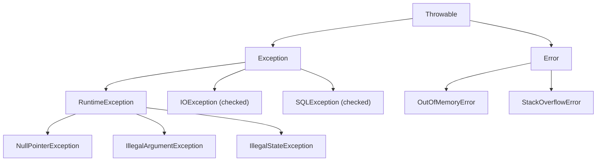

# Checked와 Unchecked 예외

## 핵심 정의
Java의 예외(Exception)는 컴파일 시점에 처리 강제 여부에 따라 checked 예외와 unchecked 예외로 나뉜다. Checked 예외는 `Throwable` 계층에서 `RuntimeException`·`Error`와 그 하위 타입을 제외한 타입이다. 일반적으로 `Exception`의 하위 클래스로 정의하며, 메서드 시그니처에 `throws`로 선언하거나 `try-catch`로 잡지 않으면 컴파일 에러가 발생한다. `IOException`, `SQLException`이 대표적이다. Unchecked 예외는 `RuntimeException`(및 그 하위 클래스)과 `Error`로, 컴파일러가 처리를 강제하지 않는다. `NullPointerException`, `IllegalArgumentException`, `IllegalStateException`이 대표적이며, 주로 프로그래밍 오류(버그)를 나타낸다.

설계 의도상 checked 예외는 "호출자가 복구 가능하고 복구해야 하는 상황"(파일 없음, 네트워크 단절 등)을, unchecked 예외는 "호출자의 계약 위반이나 사전조건 미충족"(잘못된 인자, null 참조 등)을 표현하기 위한 것이다.

## 동작 원리 / 구조



- `Error`, `RuntimeException` 및 각각의 하위 클래스는 unchecked이고, `Throwable` 자체와 나머지 하위 클래스는 checked이다. 이 구분은 상속 계층으로 결정되며 별도 마커 인터페이스가 있는 게 아니다.
- 컴파일러는 checked 예외를 던질 가능성이 있는 메서드 호출 지점에서 `throws` 선언 또는 `catch` 처리를 요구한다. 이는 JLS(Java Language Specification)의 "definite assignment" 검사와 유사하게 컴파일 타임에만 존재하는 규칙이며, JVM은 checked 예외의 선언·처리 의무를 검사하지 않는다(바이트코드 레벨에서는 동일하게 `athrow` 명령어로 처리됨).
- 제네릭과 결합 시 checked 예외를 우회하는 "sneaky throw" 기법이 존재한다. 제네릭 타입 소거(type erasure)를 이용해 checked 예외를 unchecked처럼 던질 수 있지만, 컴파일러를 속이는 방식이라 팀 컨벤션상 지양하는 경우가 많다.

```java
// checked 예외: 호출자가 처리 강제됨
public void readFile(String path) throws IOException {
    Files.readAllLines(Path.of(path));
}

// unchecked 예외: 처리 강제 없음, 버그성 상황
public void setAge(int age) {
    if (age < 0) throw new IllegalArgumentException("age must be >= 0");
}
```

## 실무 관점
- **API 설계 관점**: checked 예외는 API 사용자에게 처리를 강제하지만, 그만큼 시그니처 오염과 보일러플레이트(try-catch 남발, `throws` 전파)를 유발한다. Spring, Hibernate 등 현대 프레임워크는 checked 예외를 대부분 unchecked로 감싸서 던지는 방향으로 설계되어 있다(`DataAccessException` 계층이 대표적).
- **트레이드오프**: checked 예외는 "무시하면 안 되는 예외를 강제로 인지시킨다"는 장점이 있지만, 다층 아키텍처에서 하위 계층의 checked 예외가 상위 계층까지 `throws`로 전파되면 계층 간 결합도가 높아진다. 이 때문에 서비스 계층에서 checked 예외를 잡아 도메인 unchecked 예외로 변환(wrapping)하는 패턴이 널리 쓰인다.
- **흔한 실수**: `catch (Exception e) {}`처럼 빈 catch 블록으로 checked 예외를 삼켜버리는 패턴. 컴파일 에러를 피하려고 무의미하게 잡기만 하면 장애 발생 시 원인 추적이 불가능해진다. 최소한 로깅하거나 원인 예외를 포함해 재던지기(`throw new CustomException(e)`)해야 한다.
- **트랜잭션 관련 함정**: Spring `@Transactional`은 기본적으로 unchecked 예외(`RuntimeException`, `Error`)에서만 롤백한다. checked 예외로도 롤백해야 한다면 `rollbackFor`를 명시한다. Spring Framework 6.2+에서는 `@EnableTransactionManagement(rollbackOn = ALL_EXCEPTIONS)`로 전역 기본값을 바꿀 수도 있다. 실제 커밋 여부는 전파 방식, rollback-only 상태, 별도 롤백 규칙에도 좌우된다.
- **로깅/모니터링**: unchecked 예외 중에서도 `Error` 계열(`OutOfMemoryError`, `StackOverflowError`)은 애플리케이션이 정상적으로 복구하기 어려운 심각한 상황을 의미하므로 일반 예외 처리 로직과 분리해서 다뤄야 한다(예: `catch (Exception e)`는 `Error`를 잡지 않음).

## 심화 Q&A

### Q. Spring 계열 프레임워크가 checked 예외 대신 unchecked 예외 중심으로 설계된 이유는?
A. 다층 아키텍처에서 checked 예외는 인터페이스 시그니처에 구현 세부사항(예: JDBC의 `SQLException`)을 노출시켜 계층 간 추상화를 깨뜨린다. 예를 들어 DAO 구현체를 JDBC에서 JPA로 바꾸면 던지는 checked 예외 타입도 바뀌어 상위 계층 코드까지 수정해야 한다. Spring은 `DataAccessException`이라는 unchecked 예외 계층으로 이를 추상화해 구현 기술이 바뀌어도 호출부 코드가 영향받지 않도록 했다.

### Q. checked 예외를 unchecked로 감쌀 때 원본 예외 정보가 유실되지 않도록 하려면?
A. 새 예외를 생성할 때 원인(cause)을 반드시 함께 전달해야 한다. `throw new ServiceException("메시지", e)`처럼 원인 체이닝을 하지 않으면 스택 트레이스에서 원본 checked 예외의 발생 지점이 사라져 장애 원인 분석이 어려워진다. `Throwable(String message, Throwable cause)` 생성자를 활용하는 것이 표준 관행이다.

### Q. try 블록 안에서 발생한 예외를 finally 블록에서 새로운 예외로 덮어쓰면 어떤 문제가 생기는가?
A. finally 블록에서 예외가 발생하면 try 블록에서 발생한 원본 예외가 자동으로 cause/suppressed에 보존되지 않고 finally의 예외만 전파된다. 이는 checked/unchecked 여부와 무관하게 발생하는 문제로, 원인 파악이 어려운 장애의 흔한 원인이다. 이 문제를 구조적으로 해결한 것이 try-with-resources의 "suppressed exception" 메커니즘이다.

### Q. Unchecked 예외인데도 명시적으로 문서화(Javadoc `@throws`)해야 하는 이유는?
A. 컴파일러가 처리를 강제하지 않을 뿐 호출자가 알아야 할 계약은 동일하게 존재한다. 예를 들어 `Optional.get()`이 값이 없을 때 `NoSuchElementException`을 던진다는 사실을 문서화하지 않으면 호출자는 사전조건을 알 수 없다. API 설계 시 unchecked 예외라도 발생 조건과 의미를 명확히 문서화하는 것이 좋은 관례다.

### Q. 커스텀 예외를 만들 때 checked와 unchecked 중 무엇을 상속할지 판단 기준은?
A. 호출자가 그 예외를 받아 "합리적으로 복구 가능한 대안 로직"을 수행할 수 있다면 checked, 그것이 사실상 불가능하거나 버그/사전조건 위반에 가깝다면 unchecked를 선택하는 것이 원칙이다(Effective Java의 권고). 다만 실무에서는 계층 간 결합도를 낮추기 위해 도메인 예외를 대부분 unchecked(주로 `RuntimeException` 상속)로 설계하고, 정말 호출자의 즉각적인 분기 처리가 필요한 경우에만 checked를 쓰는 경향이 강하다.

### Q. multi-catch(`catch (IOException | SQLException e)`)와 예외 계층 설계는 어떤 관계가 있는가?
A. multi-catch는 공통 상위 타입으로 잡으면 의도하지 않은 다른 예외까지 잡게 되는 경우, 필요한 예외 타입만 하나의 catch 블록에서 처리할 때 쓴다. 단, multi-catch로 묶인 변수는 컴파일러 내부적으로 두 타입의 최소 상위 바운드로 취급되어 암묵적으로 `final`이며, 각 타입에 특화된 메서드를 호출할 수 없다. 예외 계층을 설계할 때 이런 카탈로그성 나열을 줄이려면 공통 의미를 갖는 상위 checked/unchecked 예외를 도메인 계층에 두는 것이 낫다.

### Q. finally에서 return하면 try에서 발생한 예외는 전파되는가?
A. 전파되지 않는다. JLS 25의 finally가 return 또는 새 throw로 급작스럽게 완료하면 이전 try/catch의 완료 이유를 대체한다. 원래 예외가 자동으로 suppressed에 보존되는 것도 아니다. finally는 정리 작업에만 사용하고 결과 반환을 두지 않는다. 정리 과정의 실패도 보존해야 하면 try-with-resources의 예외 결합 계약을 사용한다.

### Q. InterruptedException을 도메인 unchecked 예외로 바꾸기만 하면 충분한가?
A. 인터럽트 가능한 대기 API는 InterruptedException을 던지며 상태를 지우는 경우가 있으므로, 상위에 예외를 그대로 전파할 수 없다면 취소 정책에 맞춰 인터럽트 상태를 복원한 뒤 변환하거나 작업을 종료한다. 무조건 로그만 남기고 루프를 계속하면 취소 요청을 잃는다. checked/unchecked 분류는 복구·재시도 여부를 자동으로 결정하지 않는다.

## 관련 개념
- [[try-with-resources]]
- [[Java NIO]]

## 참고 자료

확인 날짜: 2026-09-08. 아래 버전과 범위의 공식 문서·소스로 본문을 대조했다. 성능 비교와 운영 선택은 워크로드에 따라 달라지는 판단 기준이다.

- [JLS 25 §11](https://docs.oracle.com/javase/specs/jls/se25/html/jls-11.html) — 예외 계층, 컴파일 시점 검사와 런타임 처리.
- [JLS 25 §14.20](https://docs.oracle.com/javase/specs/jls/se25/html/jls-14.html#jls-14.20) — multi-catch·finally·suppressed 예외.
- [Spring Framework: Rolling Back](https://docs.spring.io/spring-framework/reference/data-access/transaction/declarative/rolling-back.html) — 기본 롤백 규칙과 6.2+ ALL_EXCEPTIONS.

### 2026-09-23 부분 재검증

JLS 25 §14.20.2의 finally 완료 이유 대체와 Java SE 25 Thread의 InterruptedException·인터럽트 상태 계약을 확인했다. 기존 전체 검증일은 유지한다.

- [Java SE 25 Thread](https://docs.oracle.com/en/java/javase/25/docs/api/java.base/java/lang/Thread.html) — 인터럽트와 대기 API의 상태 처리.

실행 확인: 2026-09-23, OpenJDK 25.0.2+10-69에서 finally return의 기존 예외 유실을 재현했다. 구현 관측은 해당 버전 범위로 한정한다.
