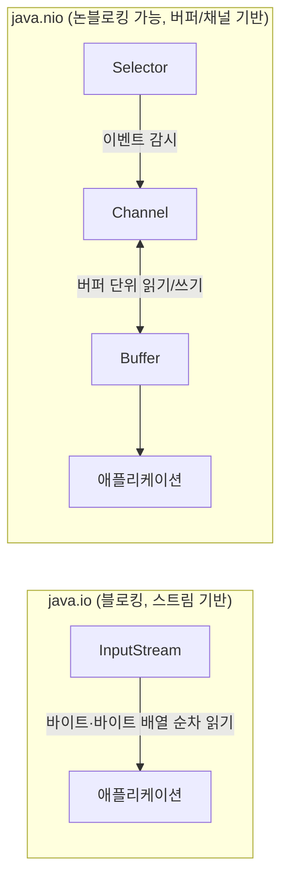

# Java NIO

## 핵심 정의
Java NIO(New IO, `java.nio` 패키지)는 Java 1.4에서 도입되고 Java 7의 NIO.2(`java.nio.file` 패키지)로 확장된 IO 프레임워크로, 기존 `java.io`의 스트림(stream) 기반 블로킹 IO와 달리 버퍼(Buffer)와 채널(Channel) 기반의 IO 모델을 제공한다. 핵심 구성 요소는 데이터를 담는 `Buffer`, 데이터가 오가는 통로인 `Channel`, 여러 채널의 이벤트를 감시하는 `Selector`이며, NIO.2에서는 `Path`, `Files`, `WatchService` 등 파일 시스템 API가 추가되었다.

`java.io`도 바이트 배열을 이용한 일괄 읽기를 지원한다. NIO는 명시적인 버퍼 상태와 채널을 결합하고, 선택 가능한 네트워크 채널을 논블로킹 모드로 등록하는 기능을 제공한다. 이 기능으로 하나의 스레드가 여러 채널을 동시에 감시하는 논블로킹(non-blocking) 멀티플렉싱 IO가 가능해진다.

## 동작 원리 / 구조



**Buffer**: `capacity`, `position`, `limit`, `mark` 네 가지 상태를 가진 데이터 컨테이너다. 쓰기 모드에서 읽기 모드로 전환할 때 `flip()`을 호출해 `position`을 0으로, `limit`을 이전 `position`으로 재설정해야 한다. 이 상태 관리를 놓치는 것이 NIO 사용 시 가장 흔한 버그 원인이다.

**Channel**: IO 연결을 나타내는 인터페이스다. 구현과 열린 모드에 따라 읽기·쓰기·양방향을 지원하며, `FileChannel`, `SocketChannel`, `ServerSocketChannel`, `DatagramChannel` 등이 있다. `InputStream`/`OutputStream`이 단방향인 것과 대비된다.

**Selector**: 하나의 스레드로 여러 `SelectableChannel`을 등록해두고, OS 레벨의 이벤트 통지(리눅스의 epoll, macOS/BSD의 kqueue 등)를 기다리다가 준비된(readable/writable/acceptable) 채널만 골라 처리하는 멀티플렉서다. 이것이 이른바 "NIO 기반 논블로킹 서버"의 핵심으로, Netty 같은 프레임워크의 이벤트 루프가 이 위에서 동작한다.

```java
// 채널 + 버퍼 기본 사용 예: 첫 블록의 원시 바이트를 읽음
try (FileChannel channel = FileChannel.open(Path.of("data.txt"), StandardOpenOption.READ)) {
    ByteBuffer buffer = ByteBuffer.allocate(1024);
    int bytesRead = channel.read(buffer);
    buffer.flip(); // 쓰기 모드 -> 읽기 모드
    while (buffer.hasRemaining()) {
        System.out.printf("%02x ", buffer.get() & 0xff);
    }
}
```

이 예제는 한 번 읽은 바이트만 출력한다. 파일 전체는 EOF까지 반복해서 읽어야 하며 UTF-8 텍스트를 바이트별 `char` 캐스팅으로 해석하면 다국어가 깨진다. 텍스트는 `Files.newBufferedReader()`나 상태를 유지하는 `CharsetDecoder`로 디코딩한다. `FileChannel`은 `SelectableChannel`이 아니므로 Selector에 등록할 수 없다.

**NIO.2 (`java.nio.file`)**: 기존 `java.io.File`의 한계(에러 코드 대신 예외 부재, 심볼릭 링크 미지원, 파일 속성 접근 제한)를 개선했다. `Path`는 `File`을 대체하며, `Files` 클래스는 파일 복사/이동/삭제/속성 조회 등을 정적 메서드로 제공한다. `WatchService`는 플랫폼에 따라 네이티브 이벤트 또는 폴링으로 파일 시스템 변경을 감시한다.

```java
Path source = Path.of("a.txt");
Path target = Path.of("b.txt");
Files.copy(source, target, StandardCopyOption.REPLACE_EXISTING);
List<String> lines = Files.readAllLines(source);
```

## 실무 관점
- **언제 쓰는가**: 대량의 동시 커넥션을 소수의 스레드로 처리해야 하는 고성능 네트워크 서버(예: Netty, Tomcat NIO 커넥터, Redis/Kafka 클라이언트 내부 구현)에서 채널+셀렉터 기반 논블로킹 IO를 사용한다. 반면 일반적인 파일 읽기/쓰기, 텍스트 처리 같은 애플리케이션 코드에서는 저수준 `Selector`를 직접 다루기보다 NIO.2의 `Files`/`Path` API를 `java.io`보다 우선 사용하는 것이 일반적이다.
- **트레이드오프**: 저수준 NIO(Selector, Buffer 상태 관리)는 코드 복잡도가 높고 버그 발생 가능성(특히 `flip()`/`clear()`/`compact()` 혼동)이 크다. 실무에서는 이 복잡도를 직접 다루기보다 Netty, Spring WebFlux(Reactor Netty 기반) 같은 프레임워크로 추상화해서 사용하는 경우가 대부분이다.
- **Virtual Threads와의 관계**: Java 21에서 정식화된 가상 스레드(virtual thread)는 블로킹 IO 코드를 그대로 두고도 대량의 동시성을 확보할 수 있게 해, "논블로킹 NIO + 이벤트 루프" 방식의 복잡성 없이도 높은 처리량을 낼 수 있는 대안을 제공한다. 다만 가상 스레드는 스레드 자체를 경량화하는 것이지 IO 모델을 바꾸는 것이 아니므로, 매우 많은 커넥션을 소수의 OS 스레드로 멀티플렉싱해야 하는 시나리오(예: 초대규모 커넥션 프록시)에서는 여전히 Selector 기반 이벤트 루프가 쓰인다.
- **흔한 실수**: `ByteBuffer`를 재사용할 때 `flip()` 없이 바로 읽거나, 다 읽은 뒤 `clear()`/`compact()`를 호출하지 않아 이전 데이터가 섞이는 버그. `MappedByteBuffer`(메모리 매핑 파일)를 대용량 파일에 사용할 때 명시적으로 unmap하지 않으면 Windows에서 파일 잠금이 풀리지 않는 문제도 알려진 함정이다.
- **관련 설정/튜닝**: `FileChannel.map()`으로 메모리 매핑 IO를 사용하면 대용량 파일 처리 성능을 개선할 수 있지만 접근 패턴과 OS 페이지 캐시에 따라 달라지며 힙 외부 메모리(off-heap)를 사용하므로 메모리 사용량 모니터링이 필요하다. `Selector` 기반 서버에서는 `SelectionKey` 등록/해제를 누락하면 메모리 누수나 CPU 스핀(busy-loop) 현상이 발생할 수 있다.

### transferTo의 부분 전송과 진행량
Java 25 `FileChannel.transferTo(position, count, target)`은 최대 count만큼 전송을 시도하고 실제 전송량을 반환한다. 파일이 작거나 대상이 더 받지 못하면 부분 전송 또는 0을 반환할 수 있다. 이 메서드는 원본 FileChannel의 현재 position을 바꾸지 않으므로, 반복 전송에서는 반환값만큼 별도의 offset을 전진시키고 남은 count를 줄여야 한다. 원래 position으로 반복하면 같은 바이트를 중복 전송한다.

0은 무조건 EOF라는 뜻이 아니다. 원본 파일 크기·변경 여부와 대상의 준비 상태를 구분하고, 논블로킹 소켓이라면 쓰기 가능 통지를 기다리는 등 진행 재개 조건과 전체 시간 제한을 둔다. 0을 반환하는 동안 같은 호출을 쉬지 않고 반복하면 CPU 스핀이 발생한다. 이 API는 플랫폼의 효율적인 전송 경로를 사용할 수 있다는 계약이며 모든 대상 채널에서 zero-copy를 보장하지 않는다.

## 심화 Q&A

### Q. NIO의 Selector가 어떻게 하나의 스레드로 수천 개의 커넥션을 처리할 수 있는가?
A. Selector는 운영체제의 IO 준비 상태 통지 기능을 사용하며 구체적인 백엔드는 JDK·OS·SelectorProvider 구현에 따라 다르다. Selector는 준비 상태(readiness)를 알리는 API이고, `AsynchronousSocketChannel`은 작업 완료(completion)를 전달하는 별도 API다. 애플리케이션은 관심 있는 이벤트(연결 수락, 읽기 가능, 쓰기 가능)를 채널마다 등록만 해두고, `select()` 호출로 블로킹하며 커널이 실제로 준비된 채널 목록만 돌려준다. 따라서 스레드 하나가 각 커넥션을 순회하며 폴링하는 대신, 커널이 이벤트를 모아 알려주는 방식으로 커넥션마다 전용 플랫폼 스레드를 두는 비용을 줄인다. 준비 통지는 이후 IO가 반드시 진행된다는 보장은 아니므로 0바이트 처리, 부분 쓰기, 관심 이벤트 변경을 처리해야 한다.

### Q. `ByteBuffer`에서 `flip()`, `clear()`, `compact()`의 차이와 잘못 쓸 때 생기는 버그는?
A. `flip()`은 쓰기 모드에서 읽기 모드로 전환(limit=position, position=0)하고, `clear()`는 버퍼를 완전히 비워 다시 쓰기 모드로 되돌리지만 기존 데이터는 논리적으로만 무시될 뿐 실제로 지워지지 않는다(position=0, limit=capacity). `compact()`는 아직 읽지 않은 데이터(position~limit)를 버퍼 앞으로 옮기고 그 이후부터 다시 쓸 수 있게 한다. `flip()` 없이 상대 읽기(`get()`)를 하면 방금 쓴 데이터 뒤의 현재 `position`부터 읽는다. 버퍼를 일부만 채웠다면 아직 쓰지 않은 영역이나 재사용 전 데이터가 읽히고, `position == limit`까지 채웠다면 `BufferUnderflowException`이 발생한다. 채널에 쓰는 경우에도 남은 범위를 잘못 전송하거나 0바이트를 쓸 수 있다. 부분적으로 읽은 상태에서 `clear()`를 호출하면 미처 읽지 않은 범위를 보존하지 못한다.

### Q. `Files.readAllLines()`와 `Files.lines()`의 차이는 언제 문제가 되는가?
A. `readAllLines()`는 파일 전체를 메모리에 `List<String>`으로 즉시 로드하므로 대용량 파일에서 `OutOfMemoryError` 위험이 있다. `lines()`는 `Stream<String>`을 지연 평가(lazy)로 반환해 파일을 스트리밍 처리할 수 있지만, 내부적으로 파일 핸들을 열어둔 상태이므로 반드시 try-with-resources로 감싸 스트림을 닫아야 한다. 닫지 않으면 파일 디스크립터 누수가 발생한다.

### Q. `FileChannel.map()`으로 만든 `MappedByteBuffer`는 왜 명시적으로 해제하기 까다로운가?
A. 메모리 매핑 파일은 OS 가상 메모리에 파일을 직접 매핑하는 방식이라 일반 객체처럼 `close()`로 즉시 해제되지 않고, 매핑 해제 시점이 가비지 컬렉션(garbage collection)에 의한 객체 회수 시점에 의존적이다. `MappedByteBuffer`에는 명시적 unmap API가 없어서 Windows처럼 매핑된 파일에 강한 잠금을 거는 OS에서는 GC가 늦게 일어나면 파일 삭제/이동이 실패하는 문제가 실무에서 자주 보고된다.

Java 22부터는 `FileChannel.map(MapMode, long, long, Arena)`로 매핑한 `MemorySegment`의 수명을 닫을 수 있는 `Arena`에 묶는 표준 대안도 있다. 이 대안은 기존 `MappedByteBuffer`에 close를 추가한 것이 아니다.

### Q. Selector 기반 논블로킹 서버와 가상 스레드 기반 블로킹 서버 중 어느 쪽을 선택해야 하는가?
A. 가상 스레드는 스레드당 처리 로직을 그대로 유지하면서(디버깅과 스택 트레이스가 직관적) 대량 동시성을 확보할 수 있어 일반적인 요청-응답형 서버(대부분의 웹 API)에는 개발 생산성과 유지보수성 면에서 유리하다. 반면 매우 낮은 지연시간이 요구되거나, 커넥션당 상태를 세밀하게 이벤트 기반으로 제어해야 하는 시스템(고빈도 트레이딩, 대규모 프록시/게이트웨이)에서는 여전히 Selector 기반 이벤트 루프(Netty 등)가 메모리 사용량과 스케줄링 예측 가능성 면에서 우위를 갖는 경우가 있다.

### Q. `WatchService`로 파일 변경을 감시할 때 신뢰성 관련 주의점은 무엇인가?
A. `WatchService`의 구현은 네이티브 이벤트 또는 폴링을 사용할 수 있는데, 플랫폼마다 지원 범위와 지연 특성이 다르고(네트워크 드라이브나 일부 클라우드 동기화 폴더에서는 이벤트가 누락될 수 있음), 이벤트가 폭주하면 `OVERFLOW` 이벤트로 일부 변경 사항이 통지 없이 누락될 수 있다. 따라서 `WatchService`만 신뢰하기보다 주기적인 폴링(polling)과 병행하거나, 파일 크기/수정 시각 등을 재검증하는 보완 로직을 두는 것이 안전하다.

### Q. ByteBuffer를 duplicate하거나 slice하면 바이트 순서와 데이터도 복사되는가?
A. Java SE 25의 `duplicate()`, `slice()`, `asReadOnlyBuffer()`는 바이트 내용을 공유하지만 position·limit·mark는 독립적으로 관리한다. 새 ByteBuffer의 바이트 순서(byte order)는 원본 설정과 무관하게 BIG_ENDIAN이다. LITTLE_ENDIAN 원본을 나눠 다중 바이트 값을 읽는 코드라면 `source.slice().order(source.order())`처럼 새 뷰에도 순서를 설정한다. 설정을 빠뜨리면 같은 네 바이트를 다른 정수로 해석해 프로토콜 길이·식별자 등이 조용히 잘못 읽힐 수 있다.

`asIntBuffer()` 같은 타입별 뷰는 생성 당시 원본의 바이트 순서를 고정한다. 이후 원본의 order를 바꿔도 기존 타입별 뷰의 순서는 바뀌지 않는다. 읽기 전용 뷰도 원본을 통한 바이트 변경은 보이므로 불변 스냅샷이 아니다. 원본 재사용이나 다른 스레드의 변경과 격리하려면 실제 바이트 복사 또는 명시적인 소유권·동기화가 필요하다.

## 관련 개념
- [[try-with-resources]]
- [[Checked와 Unchecked 예외]]

## 참고 자료

확인 날짜: 2026-09-08. 아래 버전과 범위의 공식 문서·소스로 본문을 대조했다. 성능 비교와 운영 선택은 워크로드에 따라 달라지는 판단 기준이다.

- [Java SE 25 FileChannel](https://docs.oracle.com/en/java/javase/25/docs/api/java.base/java/nio/channels/FileChannel.html) — 파일 IO·부분 읽기·MappedByteBuffer와 Java 22+ Arena 매핑.
- [Java SE 25 Selector](https://docs.oracle.com/en/java/javase/25/docs/api/java.base/java/nio/channels/Selector.html) — 선택 가능한 채널 및 readiness 계약.
- [Java SE 25 WatchService](https://docs.oracle.com/en/java/javase/25/docs/api/java.base/java/nio/file/WatchService.html) — 플랫폼 의존·폴링·OVERFLOW 제약.
- [Java SE 25 Buffer](https://docs.oracle.com/en/java/javase/25/docs/api/java.base/java/nio/Buffer.html) — position·limit·flip·clear 계약.
- [Java SE 25 Files](https://docs.oracle.com/en/java/javase/25/docs/api/java.base/java/nio/file/Files.html) — readAllLines와 lines 자원 수명.

부분 재검증: 2026-09-22. 아래 범위를 추가 확인했으며, 그 밖의 본문은 기존 검증 날짜를 유지한다.

- [Java SE 27 Buffer](https://docs.oracle.com/en/java/javase/27/docs/api/java.base/java/nio/Buffer.html) — 상대 접근의 position/limit, flip·clear·compact. Oracle JDK 27+35에서 부분 버퍼·재사용·compact 예제를 실행 확인했다.

### 2026-09-23 부분 재검증

- [Java SE 25 ByteBuffer](https://docs.oracle.com/en/java/javase/25/docs/api/java.base/java/nio/ByteBuffer.html) — slice·duplicate·asReadOnlyBuffer의 BIG_ENDIAN 초기 순서, 공유 내용과 독립 위치, 타입별 뷰의 생성 시 순서 고정을 확인했다. OpenJDK 25.0.2+10-69에서 LITTLE_ENDIAN으로 저장한 0x01020304가 순서를 다시 지정하지 않은 새 ByteBuffer 뷰에서는 0x04030201로 읽히는 사례와 원본 변경의 읽기 전용 뷰 반영을 재현했다. 네트워크·파일 매핑·가상 스레드 설명 전체를 재검증한 것은 아니다.

부분 재검증: 2026-10-04. 아래 적용 버전과 확인 범위에 한하며 노트 전체의 기존 verified는 유지한다.

- [Java SE 25 FileChannel.transferTo](https://docs.oracle.com/en/java/javase/25/docs/api/java.base/java/nio/channels/FileChannel.html#transferTo(long,long,java.nio.channels.WritableByteChannel)) — 부분 전송·0 반환·원본 위치 불변과 최적화 범위. Oracle JDK 25.0.4에서 3바이트만 받는 WritableByteChannel로 부분 전송, offset 갱신 후 중복 없는 결과, 원본 position 불변, EOF와 수신 불가의 두 0 반환을 확인했다. 실제 네트워크 backpressure·OS zero-copy 경로는 측정하지 않았다.

- 도식·표 대조(2026-10-04): [Java SE 25 InputStream](https://docs.oracle.com/en/java/javase/25/docs/api/java.base/java/io/InputStream.html) — 도식도 read(byte[])의 일괄 읽기를 포함해 본문과 맞췄다. 실행 시험 추가 없이 명세·소스와 기존 본문을 대조했으며 verified는 유지한다.
