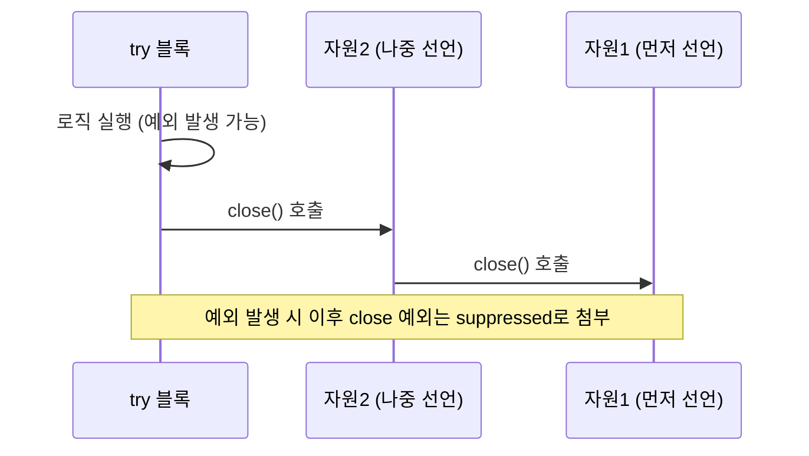

# try-with-resources

## 핵심 정의
try-with-resources는 Java 7에서 도입된 문법으로, `try` 괄호 안에 자원 선언을 명시하면 try 블록이 종료될 때(정상 종료든 예외 발생이든) 해당 자원의 `close()`가 컴파일러에 의해 자동으로 호출되는 기능이다. `AutoCloseable` 인터페이스를 구현한 객체만 이 문법을 사용할 수 있으며, `Closeable`(IO 계열)은 `AutoCloseable`의 하위 인터페이스로 `close()`가 `IOException`만 던지도록 좁혀져 있다. Java 9부터는 try 괄호 안에서 새 변수를 선언하지 않고 이미 선언된 effectively final 변수를 그대로 참조하는 것도 허용된다.

## 동작 원리 / 구조

컴파일러는 try-with-resources를 내부적으로 `try-finally`로 변환하며, 자원은 선언된 순서의 역순으로 close된다.

```java
// 작성한 코드
try (BufferedReader br = new BufferedReader(new FileReader(path))) {
    return br.readLine();
}

// 컴파일러가 생성하는 형태(개념적으로)
BufferedReader br = new BufferedReader(new FileReader(path));
Throwable primaryExc = null;
try {
    return br.readLine();
} catch (Throwable t) {
    primaryExc = t;
    throw t;
} finally {
    if (br != null) {
        if (primaryExc != null) {
            try {
                br.close();
            } catch (Throwable suppressedExc) {
                primaryExc.addSuppressed(suppressedExc);
            }
        } else {
            br.close();
        }
    }
}
```

핵심은 **suppressed exception** 메커니즘이다. try 블록에서 예외가 발생한 상태에서 close() 중 또 예외가 발생하면, close()의 예외를 던지지 않고 원본 예외에 `addSuppressed()`로 첨부한 뒤 원본 예외를 전파한다. 이는 기존 try-finally 방식에서 finally의 예외가 원본 예외를 덮어써버리는 문제를 구조적으로 해결한다. 여러 자원을 선언하면 세미콜론으로 구분하며, close 순서는 선언의 역순(LIFO)이다.



자원 초기화 도중 실패하면 그 전에 초기화된 자원만 역순으로 닫으며, 값이 `null`인 자원은 건너뛴다. JVM 강제 종료나 프로세스 종료처럼 제어 흐름이 정상적으로 빠져나오지 못하는 상황까지 close를 보장하지는 않는다.

Java 9부터는 아래처럼 기존 변수를 그대로 재사용할 수 있다(변수가 final 또는 effectively final이어야 함).

```java
BufferedReader br = new BufferedReader(new FileReader(path));
try (br) {
    return br.readLine();
}
```

## 실무 관점
- **언제 쓰는가**: `Connection`, `Statement`, `ResultSet`, `InputStream`/`OutputStream`, `Reader`/`Writer` 등 현재 코드가 수명 관리를 소유한 `AutoCloseable` 자원에 사용한다. 애플리케이션 전체가 공유하고 컨테이너가 관리하는 클라이언트·풀은 요청마다 닫지 않는다. Spring에서 `JdbcTemplate`이나 `Repository` 같은 추상화를 쓰면 프레임워크가 자원 반납을 대신 처리해주지만, 직접 JDBC나 파일 IO를 다루는 코드에서는 필수다.
- **트레이드오프**: try-with-resources는 반드시 `AutoCloseable`을 구현한 자원에만 쓸 수 있다. 커스텀 클래스가 외부 자원(파일 핸들, 네트워크 소켓, 스레드 풀)을 감싸고 있다면 `AutoCloseable`을 직접 구현해 이 패턴에 편입시키는 것이 안전하다.
- **흔한 실수**: close() 자체에서 예외가 나는 것을 무시하고 로그도 안 남기는 경우, suppressed exception이 스택 트레이스 안에 숨어 있어 놓치기 쉽다. 로깅 프레임워크나 예외 출력 시 `getSuppressed()`까지 확인하는 습관이 필요하다.
- **커넥션 풀과의 관계**: `Connection.close()`는 실제로 커넥션을 끊는 게 아니라 HikariCP 같은 풀에 반납하는 동작으로 오버라이드되어 있다. try-with-resources로 `Connection`을 선언하면 풀 반납 누락으로 인한 커넥션 고갈(connection leak) 장애를 크게 줄일 수 있다. 실무에서 흔한 장애 패턴 중 하나가 예외 발생 시 커넥션 반납 코드를 건너뛰어 풀이 고갈되는 것인데, try-with-resources는 정상적인 제어 흐름에서 이 정리 누락을 줄인다. close 자체의 실패나 초기화가 완료되지 않은 중첩 자원까지 해결하는 것은 아니다.
- **성능 관점**: try-with-resources 자체는 런타임 오버헤드가 거의 없다(컴파일 타임에 try-finally로 변환됨). 다만 close() 호출 자체가 비용이 큰 자원(예: 대용량 버퍼 flush)이라면 자원 개수와 선언 순서를 신경 써서 불필요한 반복 close를 줄여야 한다.

### 중첩 생성자의 실패와 소유권

`try (Wrapper w = new Wrapper(new Resource()))`에서 안쪽 Resource 생성은 성공했지만 Wrapper 생성자가 실패하면 `w`의 초기화가 완료되지 않는다. try-with-resources가 생성자 인수로 만든 모든 객체까지 찾아 닫아 주는 것은 아니므로, Wrapper 생성자에 실패 시 정리 계약이 없다면 안쪽 자원이 누수될 수 있다.

안쪽 자원도 호출자가 소유한다면 `try (Resource r = new Resource(); Wrapper w = new Wrapper(r))`처럼 별도로 선언해 뒤쪽 생성자 실패 시 먼저 초기화된 자원을 닫을 수 있다. 다만 정상 종료 때 Wrapper.close가 안쪽 자원까지 닫는다면 추가 close가 발생한다. Closeable의 반복 close 계약과 일반 AutoCloseable의 차이를 확인하고, 소유권 이전·중복 정리가 안전한 구조를 선택한다.

### 지연 실행 결과를 반환해도 자원 수명은 연장되지 않는다
try-with-resources 안에서 `BufferedReader.lines()`를 반환하면 스트림 객체는 만들어지지만 메서드를 나가기 전에 reader가 닫힌다. 이후 호출자가 최종 연산으로 읽기 시작하면 `UncheckedIOException`이 발생한다. 반환값이 iterator·Stream·Future라고 해서 그 안에서 사용할 자원의 close 시점이 자동으로 늦춰지지 않는다.

해당 메서드가 자원을 소유한다면 블록 안에서 소비를 마치고 분리된 결과를 반환한다. 호출자에게 스트리밍 수명을 넘기려면 `Files.lines()`처럼 자원 정리 계약이 있는 스트림을 반환하고 호출자가 닫도록 API 계약을 명확히 한다. 비동기 작업에서도 자원을 사용하는 작업이 끝나기 전에 외부 블록이 닫히지 않도록 소유권과 완료 대기를 설계한다([[Stream API]]).

## 심화 Q&A

### Q. try-with-resources와 일반 try-finally의 차이가 예외 처리 관점에서 실질적으로 어떤 장애를 예방하는가?
A. 일반 try-finally에서는 try 블록의 예외가 발생한 뒤 finally의 close()에서도 예외가 발생하면, finally의 예외가 원본 예외를 완전히 덮어써 원인 파악이 불가능해진다. try-with-resources는 이 경우 close()의 예외를 suppressed exception으로 원본에 첨부해 두 예외 정보를 모두 보존한다. 실무에서 "로그에 찍힌 예외와 실제 근본 원인이 다르다"는 혼란을 줄여준다.

### Q. `AutoCloseable`과 `Closeable`의 차이는 무엇이고 왜 나뉘어 있는가?
A. `Closeable`은 IO 패키지에서 유래한 인터페이스로 `close()`가 `IOException`만 던지도록 시그니처가 좁혀져 있고 여러 번 호출해도 안전(idempotent)해야 한다는 계약이 있다. `AutoCloseable`은 Java 7에서 try-with-resources를 위해 더 넓게 도입된 인터페이스로 `close()`가 임의의 `Exception`을 던질 수 있고 반복 호출에 대한 안전성을 강제하지 않는다. 기존 IO 클래스들과의 하위 호환을 유지하면서 더 일반적인 자원(DB 커넥션, 락 등)까지 포괄하기 위해 이렇게 분리되었다.

### Q. 여러 자원을 하나의 try-with-resources에 선언했을 때 close 순서가 왜 선언 역순(LIFO)인가?
A. 자원 간 의존 관계를 고려한 설계다. 보통 나중에 선언한 자원이 먼저 선언한 자원에 의존하는 경우가 많다(예: `Connection`으로 `Statement`를 만들고, `Statement`로 `ResultSet`을 만드는 구조). 의존하는 자원을 먼저 닫아야 안전하므로 선언의 역순으로 닫는다.

### Q. try-with-resources 블록 안에서 자원 변수를 재할당(reassign)하면 어떻게 되는가?
A. try 괄호 안에서 선언한 자원 변수는 암묵적으로 `final`이므로 재할당 자체가 컴파일 에러다. Java 9 이후 기존 변수를 참조하는 형태(`try (br) {...}`)를 쓸 때도 그 변수는 effectively final이어야 하며, try 블록 진입 이전에 이미 초기화가 끝나 있어야 한다. 이는 close 대상이 실행 중간에 바뀌는 모호함을 원천 차단하기 위한 설계다.

### Q. close() 도중 발생한 예외를 무시하고 싶을 때(로그만 남기고 싶을 때) 어떻게 처리하는 것이 관례적인가?
A. try 본문이나 앞선 close에서 주 예외가 있을 때만 후속 close 예외가 suppressed에 붙는다. 본문이 정상 종료했다면 close 예외 자체가 전파된다.  애초에 close() 실패가 비즈니스 로직에 영향을 주지 않아야 한다면 커스텀 `AutoCloseable` 구현에서 close() 내부에서 예외를 잡아 로깅만 하고 삼키는 방식을 택하기도 한다. 다만 이는 자원 반납 실패를 은폐할 위험이 있으므로, 반납 실패가 심각한 자원(파일 락, DB 커넥션)에는 권장되지 않고 모니터링/메트릭으로 별도 노출하는 것이 낫다.

### Q. Spring의 `@Transactional`과 try-with-resources로 감싼 `Connection`을 함께 쓸 때 주의할 점은?
A. 어떤 `DataSource`와 획득 API를 썼는지에 따라 다르다. `DataSourceTransactionManager`/`JdbcTransactionManager`의 로컬 JDBC 트랜잭션에서는 다음을 구분한다.

| 연결 획득 경로 | 트랜잭션 참여와 정리 |
|---|---|
| 일반 target `DataSource.getConnection()` | Spring이 현재 스레드에 바인딩한 연결을 자동으로 찾아주지 않는다. 별도 연결로 실행하면 그 쓰기는 외부 트랜잭션 롤백에 포함되지 않을 수 있다. 자체 획득한 연결은 닫아야 한다. |
| `DataSourceUtils.getConnection(dataSource)` | 같은 DataSource의 바인딩된 연결을 재사용한다. 정리는 `DataSourceUtils.releaseConnection(connection, dataSource)`로 하며 트랜잭션에 묶인 연결의 물리적 close는 관리자가 맡는다. 얻은 raw 연결을 무조건 try-with-resources로 닫으면 이 수명 관리를 우회한다. |
| `TransactionAwareDataSourceProxy.getConnection()` | Spring 동기화에 참여하는 연결 프록시를 반환한다. 프록시의 `close()`가 적절한 반환 처리를 하므로 try-with-resources를 사용할 수 있다. |

일반 애플리케이션 코드는 획득·예외 변환·반환을 처리하는 `JdbcTemplate`을 우선 사용한다. JTA/애플리케이션 서버가 자체적으로 관리하는 DataSource는 해당 자원 관리 계약을 별도로 확인한다.

## 관련 개념
- [[Checked와 Unchecked 예외]]
- [[Java NIO]]

## 참고 자료

확인 날짜: 2026-09-08. 아래 버전과 범위의 공식 문서·소스로 본문을 대조했다. 성능 비교와 운영 선택은 워크로드에 따라 달라지는 판단 기준이다.

- [JLS 25 §14.20.3](https://docs.oracle.com/javase/specs/jls/se25/html/jls-14.html#jls-14.20.3) — 자원 초기화·역순 종료·null·suppressed 변환과 예제.
- [Java SE 25 AutoCloseable](https://docs.oracle.com/en/java/javase/25/docs/api/java.base/java/lang/AutoCloseable.html) — close 계약 및 Closeable과의 차이.
- [Spring Framework: Controlling Database Connections](https://docs.spring.io/spring-framework/reference/data-access/jdbc/connections.html) — 트랜잭션 인식 자원 획득·반납.

부분 재검증: 2026-09-22. 아래 범위를 추가 확인했으며, 그 밖의 본문은 기존 검증 날짜를 유지한다.

- [Spring Framework 7.0.9 DataSourceUtils](https://docs.spring.io/spring-framework/docs/7.0.9/javadoc-api/org/springframework/jdbc/datasource/DataSourceUtils.html) — 바인딩된 연결 획득과 releaseConnection.
- [Spring Framework 7.0.9 TransactionAwareDataSourceProxy](https://docs.spring.io/spring-framework/docs/7.0.9/javadoc-api/org/springframework/jdbc/datasource/TransactionAwareDataSourceProxy.html) — 연결 프록시의 close와 트랜잭션 참여. Spring 7.0.9·H2 2.3.232·JDK 27에서 세 경로를 실행해 별도 연결의 자동 커밋, 바인딩 연결의 수명, 외부 롤백 결과를 확인했다. 이 예제 실행은 Spring의 JDK 27 공식 지원 인증을 뜻하지 않는다.

### 2026-09-23 부분 재검증

[JLS 25 §14.20.3](https://docs.oracle.com/javase/specs/jls/se25/html/jls-14.html#jls-14.20.3)의 자원 초기화/번역 규칙을 다시 확인했다. OpenJDK 25.0.2에서 실패한 중첩 Wrapper 생성자는 안쪽 자원을 닫지 않는 반례, 별도 자원 선언의 정리, 두 close가 실패해도 역순 실행되며 본문 예외의 suppressed에 붙는 순서를 확인했다. Spring 트랜잭션 경로는 이번에 다시 실행하지 않았다.

부분 재검증: 2026-10-04. 아래 적용 버전과 확인 범위에 한하며 노트 전체의 기존 verified는 유지한다.

- [JLS 25 §14.20.3](https://docs.oracle.com/javase/specs/jls/se25/html/jls-14.html#jls-14.20.3), [Java SE 25 BufferedReader.lines](https://docs.oracle.com/en/java/javase/25/docs/api/java.base/java/io/BufferedReader.html#lines()), [Files.lines](https://docs.oracle.com/en/java/javase/25/docs/api/java.base/java/nio/file/Files.html#lines(java.nio.file.Path)) — 스코프 종료와 지연 읽기·소유 자원의 정리 계약. Oracle JDK 25.0.4에서 reader를 닫고 반환한 lines의 findFirst 실패, 닫기 전 toList로 소비한 결과의 사용 가능성을 확인했다. 실제 JDBC 비동기 작업·Spring 자원 경로는 이번에 실행하지 않았다.
