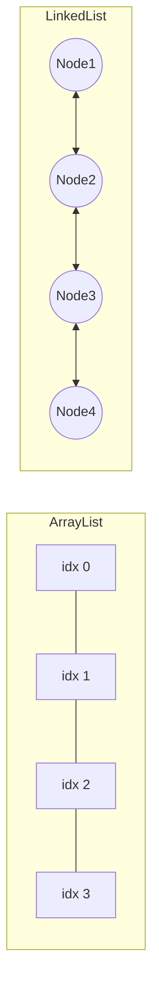

# ArrayList와 LinkedList

## 핵심 정의
`ArrayList`와 `LinkedList`는 모두 `List` 인터페이스를 구현하는 순서가 있는 컬렉션이지만 내부 자료구조가 근본적으로 다르다. `ArrayList`는 크기가 가변적으로 늘어나는 배열(dynamic array)을 기반으로 하고, `LinkedList`는 각 요소가 이전/다음 노드를 참조하는 이중 연결 리스트(doubly linked list)를 기반으로 한다. 이 차이가 인덱스 접근, 삽입/삭제, 메모리 사용 패턴 전반의 성능 특성을 결정한다.

## 동작 원리 / 구조

### ArrayList
내부적으로 `Object[] elementData` 배열을 가진다. 기본 생성자로 생성 시 실제로는 빈 배열을 참조하다가 최초 `add()` 호출 시 기본 용량 10으로 초기화된다(지연 초기화). OpenJDK 25는 용량이 부족하면 대체로 1.5배 성장을 선호하되 필요한 최소 용량과 배열 길이 한계를 반영한 새 배열을 만들고 기존 요소를 복사(`Arrays.copyOf`)한다.

- `get(index)`: 배열 인덱스 접근이므로 O(1)
- `add(element)` (끝에 추가): 개별 호출은 여유 용량이 있으면 O(1), 확장 시 O(n). 연속 삽입 전체의 분할 상환(amortized) 비용은 호출당 O(1)
- `add(index, element)` / `remove(index)`: 뒤의 요소들을 한 칸씩 밀거나 당겨야 하므로 O(n)

### LinkedList
`Node<E>` 객체들이 `prev`, `item`, `next` 3개 필드로 서로 연결된 이중 연결 리스트다. `first`, `last` 참조를 유지해 양 끝 삽입/삭제는 빠르다.

- `get(index)`: 처음이나 끝에서부터 순차 탐색해야 하므로 O(n) (내부적으로 index가 중간 지점보다 작은지 큰지 판단해 앞/뒤 중 가까운 쪽에서 탐색)
- `addFirst()` / `addLast()` / `removeFirst()` / `removeLast()`: O(1)
- 중간 삽입/삭제: 탐색 자체가 O(n)이라 "삭제 연산 자체는 O(1)"이라는 통념과 달리 전체적으로는 O(n)이 걸린다. 이미 `ListIterator`로 위치를 가지고 있는 경우에만 삽입/삭제가 실질적으로 O(1)이다.

### Deque로서의 LinkedList
`LinkedList`는 `Deque` 인터페이스도 구현하므로 스택(stack)이나 큐(queue)로도 사용할 수 있다. 다만 양 끝 삽입/삭제 성능만 필요하다면 배열 기반의 `ArrayDeque`가 노드 객체 오버헤드가 없어 대부분의 경우 더 빠르고 메모리 효율적이다.

## 실무 관점
- 실무에서는 압도적으로 `ArrayList`가 기본 선택지다. 대부분의 접근 패턴(인덱스 조회, 끝에 추가, 순회)에서 배열 기반 구조가 캐시 지역성(cache locality)이 좋아 실제 벤치마크에서도 `LinkedList`보다 빠른 경우가 많다.
- `LinkedList`가 유리한 경우는 "리스트 중간을 반복자(iterator)로 순회하면서 계속 삽입/삭제"하는 패턴 정도로 매우 제한적이다. 이 경우가 아니라면 굳이 선택할 이유가 적다.
- 큐/스택이 필요하면 `LinkedList`보다 `ArrayDeque`를 우선 고려한다. 노드마다 별도 객체를 할당하는 `LinkedList`는 GC 부담과 메모리 오버헤드(각 노드당 헤더 + 3개 참조 필드)가 크다.
- `ArrayList`를 사용할 때 최종 크기를 예측할 수 있으면 `new ArrayList<>(initialCapacity)`로 초기 용량을 지정해 리사이징 비용(배열 복사)을 줄인다.
- 대량의 요소를 앞쪽에 반복적으로 삽입하는 로직을 `ArrayList`로 구현하면 매번 O(n) 시프트(shift)가 발생해 전체가 O(n²)이 될 수 있다. 이런 패턴이 확인되면 자료구조 선택 자체를 재검토해야 한다(예: 뒤에서부터 채우고 나중에 뒤집기, 혹은 `Deque` 사용).
- `for (int i=0; i<list.size(); i++) list.get(i)` 형태로 `LinkedList`를 순회하면 매 호출마다 앞/뒤 중 가까운 끝에서 탐색해 O(n²)이 되는 흔한 성능 함정이 있다. `LinkedList`는 반드시 `Iterator`나 for-each로 순회해야 한다.

## 심화 Q&A

### Q. `ArrayList`의 용량 증가 비율이 1.5배인 이유는?
성장 배율이 크면 복사 횟수가 줄지만 남는 배열 공간이 늘고, 작으면 여유 공간은 줄지만 복사가 잦아진다. OpenJDK 25 소스는 기존 크기의 절반을 선호 증가량으로 쓰며, 이는 API의 고정 배율 보장이 아니다. 특정 배율이 해제된 블록을 반드시 재사용하게 한다는 설명은 HotSpot의 GC·배열 할당 방식까지 고려하지 않은 단정이다.

### Q. `LinkedList`에서 "삭제가 O(1)"이라는 말이 왜 틀리기 쉬운가?
연결을 끊는 포인터 조작 자체는 O(1)이 맞다. 하지만 삭제할 노드를 인덱스나 값으로 찾는 과정(탐색)이 O(n)이기 때문에, `remove(int index)`나 `remove(Object o)`처럼 위치를 모르는 상태에서 호출하면 전체적으로 O(n)이 걸린다. `ListIterator.remove()`처럼 이미 커서가 그 위치에 있는 경우에만 진짜 O(1) 삭제가 성립한다.

### Q. `ArrayList`와 `LinkedList`의 반복자(iterator)는 모두 fail-fast인가?
그렇다. 둘 다 `modCount`를 추적해 반복 도중 구조적 변경이 감지되면 `ConcurrentModificationException`을 던진다. 다만 이는 동시성 보장이 아니라 버그 조기 발견을 위한 장치이며, 단일 스레드에서 `for-each` 도중 컬렉션의 `remove()`를 직접 호출해도 발생할 수 있다. fail-fast는 최선 노력이며 예외가 반드시 발생한다는 보장은 없다.

### Q. 정렬(`Collections.sort`)이나 이진 탐색(`Collections.binarySearch`) 성능은 두 구조에서 어떻게 다른가?
Java 8+ `Collections.sort()`는 `List.sort()`에 위임한다. OpenJDK 25 `ArrayList`는 내부 배열을 직접 정렬하고, LinkedList가 상속한 기본 `List.sort`는 배열로 복사해 정렬한 뒤 반복자로 결과를 반영한다. `binarySearch()`는 `RandomAccess` 마커 인터페이스 구현 여부를 확인해, `ArrayList`처럼 `RandomAccess`를 구현한 경우 인덱스 기반 이진 탐색(O(log n))을 사용하고, `LinkedList`처럼 구현하지 않은 경우 순차 접근 기반 알고리즘으로 전환해 큰 리스트에서는 O(n) 링크 이동과 O(log n) 비교를 수행한다. 작은 리스트에는 구현상의 인덱스 경로를 사용할 수 있다.

### Q. 멀티스레드 환경에서 `ArrayList`를 안전하게 쓰려면 어떻게 해야 하는가?
`ArrayList` 자체는 스레드 안전하지 않다. `Collections.synchronizedList()`로 감싸거나, 읽기가 압도적으로 많고 쓰기가 드물다면 `CopyOnWriteArrayList`를 고려한다. 자세한 선택 기준은 [[컬렉션 동기화]] 참고.

### Q. `ArrayList.remove(int index)`와 `remove(Object o)`를 헷갈리면 어떤 문제가 생기는가?
`List<Integer>`에서 `remove(1)`을 호출하면 오버로드 해소(overload resolution) 규칙에 따라 `int` 인자는 `remove(int index)`(인덱스 1의 요소 제거)로, `Integer.valueOf(1)`처럼 객체를 넘기면 `remove(Object o)`(값이 1인 요소 제거)로 해석된다. 값 1을 지우려다 인덱스 1의 엉뚱한 요소를 지우는 실수가 실무에서 흔히 발생한다.

### Q. ArrayList.subList로 작은 구간만 보관하면 원본의 큰 배열은 회수되는가?
A. OpenJDK 25의 SubList는 원본 root를 참조하는 뷰이므로 작은 부분만 남겨도 큰 원본 배열을 유지할 수 있다. 장기간 보관할 독립 결과라면 `new ArrayList<>(list.subList(from, to))`처럼 복사한다. 이 복사는 요소 객체까지 복제하지는 않는다. 원본을 뷰 바깥에서 구조 변경하면 뷰 동작이 정의되지 않는다는 API 계약도 주의한다.

### Q. clear를 호출하면 ArrayList의 메모리가 최초 크기로 돌아가는가?
A. OpenJDK 25 clear는 요소 참조를 null로 지우고 size를 0으로 만들지만 내부 배열 용량은 유지한다. 다음 배치에서 재사용할 때는 이점이 있고, 일시적 대용량 피크가 끝났다면 큰 배열 보존이 부담이 될 수 있다. trimToSize나 새 리스트 교체는 복사·재할당 비용이 있으므로 매 변경마다 적용하지 않고 수명 경계에서 판단한다.

## 관련 개념
- [[Stream API]]
- [[컬렉션 동기화]]
- [[HashMap 내부 구조]]

## 참고 자료

확인 날짜: 2026-09-08. 아래 버전과 범위의 공식 문서·소스로 본문을 대조했다. 성능 비교와 운영 선택은 워크로드에 따라 달라지는 판단 기준이다.

- [ArrayList API](https://docs.oracle.com/en/java/javase/25/docs/api/java.base/java/util/ArrayList.html) — Java SE 25 분할 상환 삽입·fail-fast.
- [LinkedList API](https://docs.oracle.com/en/java/javase/25/docs/api/java.base/java/util/LinkedList.html) — Java SE 25 양방향 탐색·Deque.
- [Collections API](https://docs.oracle.com/en/java/javase/25/docs/api/java.base/java/util/Collections.html) — Java SE 25 sort 위임·binarySearch 비용.
- [List API](https://docs.oracle.com/en/java/javase/25/docs/api/java.base/java/util/List.html) — Java SE 25 기본 sort 구현.
- [OpenJDK 25 ArrayList 소스](https://raw.githubusercontent.com/openjdk/jdk/jdk-25-ga/src/java.base/share/classes/java/util/ArrayList.java) — 지연 할당·grow·직접 배열 정렬.
- [ArrayDeque API](https://docs.oracle.com/en/java/javase/25/docs/api/java.base/java/util/ArrayDeque.html) — Java SE 25 배열 기반 Deque와 성능 비교의 조건.

### 2026-09-23 부분 재검증

Java SE 25 ArrayList.subList의 뷰 계약과 OpenJDK jdk-25-ga SubList.root·clear·trimToSize 구현을 확인했다. 기존 전체 검증일은 유지한다.

실행 확인: 2026-09-23, OpenJDK 25.0.2+10-69에서 subList의 원본 연결·독립 복사·원본 구조 변경 감지을 재현했다. 구현 관측은 해당 버전 범위로 한정한다.
