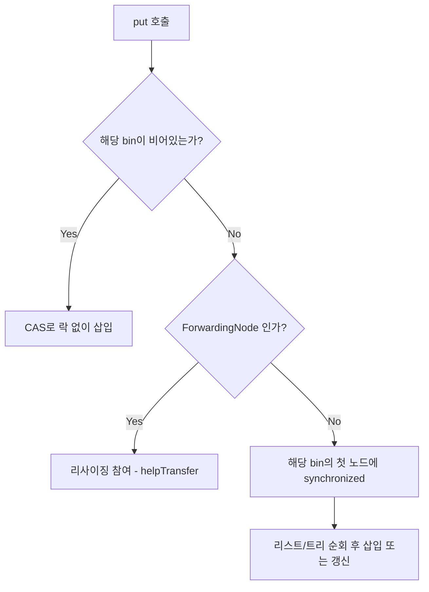

# ConcurrentHashMap

## 핵심 정의
`ConcurrentHashMap`은 `java.util.concurrent` 패키지에서 제공하는 스레드 안전(thread-safe)한 해시 맵 구현체다. `Collections.synchronizedMap()`으로 감싼 `HashMap`이 맵 전체에 하나의 락(lock)을 걸어 병목을 일으키는 것과 달리, 세밀한 동시성 제어(fine-grained locking)와 CAS(Compare-And-Swap) 연산을 조합해 높은 동시 처리량을 제공한다. `null` 키와 `null` 값을 허용하지 않는다는 점이 `HashMap`과의 중요한 차이다.

## 동작 원리 / 구조

### Java 7까지: 세그먼트 락(segment lock)
전체 테이블을 여러 `Segment`(내부적으로 작은 `HashMap`처럼 동작)로 나누고, 각 세그먼트마다 별도의 락을 두어 동시에 여러 스레드가 서로 다른 세그먼트에 접근할 수 있게 했다. 기본 동시성 수준(concurrency level)은 16이었다.

### Java 8 이후: CAS + synchronized(bin 단위)
Java 8부터 세그먼트 구조가 사라지고 `HashMap`과 유사한 `Node<K,V>[] table` 구조를 사용한다. 동시성 제어 방식은 다음과 같다.

- 버킷(bin)이 비어 있을 때의 삽입은 CAS 연산(OpenJDK 25 소스는 `Unsafe.compareAndSetReference` 사용)으로 락 없이 처리한다.
- 버킷에 이미 노드가 있어 충돌이 발생하면 해당 버킷의 첫 번째 노드를 락 대상으로 `synchronized` 블록을 걸어 그 버킷만 잠근다. 다른 버킷은 영향받지 않는다.
- 리사이징 시에는 여러 스레드가 함께 참여해 테이블 이전(transfer) 작업을 분담하는 `helping resize` 메커니즘을 사용한다. 이전 중인 버킷에는 `ForwardingNode`라는 특수 노드를 두어 다른 스레드가 이를 보고 새 테이블을 찾아가도록 한다.
- `size()`는 맵 전체 락 없이 `CounterCell` 배열에 분산된 카운터를 합산하는 방식(`LongAdder`와 유사한 아이디어)으로 집계한다. 동시 갱신 중에는 일관된 스냅샷이 아니며, 갱신이 멈춘 상태에서는 정확한 크기를 반환한다(int 범위를 넘으면 Integer.MAX_VALUE).

### 읽기 연산
읽기(`get`)는 원칙적으로 락을 걸지 않는다. `volatile`로 선언된 `Node.val`, `Node.next` 필드를 통해 업데이트와 그 값을 관찰하는 non-null get 사이에 happens-before를 제공하며, 약한 일관성(weak consistency)을 갖는 반복자를 제공한다.

## 실무 관점
- 여러 스레드가 동시에 접근하는 캐시(cache), 카운터 맵, 세션 저장소 등에 기본 선택지로 쓴다. `Collections.synchronizedMap(new HashMap<>())`보다 대부분의 시나리오에서 처리량이 높다.
- `null`을 허용하지 않는 이유는 동시성 환경에서 `get(key) == null`이 "키가 없다"인지 "값이 null이다"인지 구분할 수 없어 경쟁 조건(race condition)을 유발하기 때문이다. `containsKey()`로 재확인하는 것 자체가 원자적이지 않아 신뢰할 수 없다.
- `computeIfAbsent()`, `compute()`, `merge()` 같은 원자적 연산을 적극 활용하면 별도 동기화 블록 없이 read-modify-write 패턴을 안전하게 구현할 수 있다. 단, 이 콜백 안에서는 같은 맵을 수정하지 않아야 한다. 중첩 갱신을 호출하면 교착 상태(deadlock)나 `IllegalStateException`(재귀적 갱신 감지)이 발생할 수 있어 주의해야 한다.
- `size()`는 정확한 스냅샷이 아니라 근사치이므로, 정확한 개수에 의존하는 조건과 갱신은 하나의 원자적 설계로 묶어야 한다. 별도 AtomicInteger를 추가해도 맵 변경과 카운터 변경이 분리되면 둘 사이의 일관성이 자동으로 보장되지 않는다.
- 복합 연산(예: "값이 없으면 넣고, 있으면 갱신"을 `get` 후 `put`으로 따로 처리)은 원자성이 깨진다. 반드시 `putIfAbsent()`, `compute()` 계열의 원자적 API를 사용해야 한다.
- Java 8 전환기에 세그먼트 개수를 지정하던 `concurrencyLevel` 생성자 인자는 이제 참고값 정도로만 쓰이며 실제 동시성 수준을 좌우하지 않는다. 튜닝 포인트로 오해하지 않아야 한다.

### 항목의 교체·제거와 값 객체의 수명
진행 중 작업을 Future 값으로 저장할 때, 오래된 작업의 완료 콜백에서 무조건 `remove(key)`하면 그사이 같은 키에 들어온 새 작업까지 지울 수 있다. `remove(key, myFuture)`처럼 기대하는 값과의 일치를 원자적으로 확인하며 제거한다. 이 비교는 `equals` 기준이므로 값 타입을 사용자 정의했다면 작업 세대를 구별하는 동등성인지도 확인한다. 조건부 제거는 새 매핑을 보호할 뿐, 완료·취소된 Future 뒤에서 실행 중인 외부 작업까지 종료하지는 않는다([[CompletableFuture]]).

`computeIfAbsent(key, k -> new LongAdder()).increment()`도 매핑 획득과 increment 사이의 제거를 막지는 않는다. 다른 작업이 키를 제거하면 이미 받은 LongAdder에 증가분이 쌓여 맵을 통한 집계에서 빠질 수 있다. 키를 제거하지 않는 빈도 집계와, 주기적으로 삭제·교체하는 정확한 회계 카운터를 같은 설계로 취급하지 않는다. 제거까지 포함하는 키별 작업 순서를 직렬화하거나 세대 교체 정책을 정한다.

## 심화 Q&A

### Q. `ConcurrentHashMap`이 `HashMap`보다 항상 빠른가?
아니다. 단일 스레드 환경이거나 동기화가 전혀 필요 없는 경우에는 CAS/volatile 오버헤드 때문에 순수 `HashMap`보다 느릴 수 있다. `ConcurrentHashMap`의 이점은 다중 스레드 경쟁(contention) 상황에서 드러난다.

### Q. `size()`가 정확하지 않을 수 있다는 것은 무슨 의미인가?
`size()` 호출 시점과 실제 반환 시점 사이에 다른 스레드가 계속 삽입/삭제를 하고 있다면, 반환값은 그 순간의 정확한 스냅샷이 아니라 근사치가 될 수 있다. 내부적으로 `baseCount`와 `CounterCell[]`에 분산된 값을 합산하는 방식이라 합산 도중에도 값이 바뀔 수 있기 때문이다. 정합성이 중요한 카운팅에는 부적합하다.

### Q. 리사이징 중에 다른 스레드가 `get()`을 호출하면 어떻게 되는가?
문제없이 동작한다. 리사이징 중에는 아직 옮겨지지 않은 버킷은 기존 테이블에서, 이미 옮겨진 버킷은 `ForwardingNode`를 통해 새 테이블에서 값을 찾도록 설계되어 있다. `get()`은 일반적으로 업데이트에 블로킹되지 않는다. 트리 버킷에 쓰기 경합이 있으면 락을 기다리는 대신 리스트 경로를 탐색할 수도 있다. 전체 맵의 스냅샷은 아니며 같은 키의 동시 갱신과 read가 겹칠 때 관찰 시점을 구분해야 한다.

### Q. `compute()` 콜백 안에서 오래 걸리는 작업(예: 외부 API 호출)을 하면 왜 위험한가?
`compute()`는 해당 버킷을 잠근 상태에서 콜백을 실행한다. 콜백이 오래 걸리면 같은 버킷의 일부 갱신 연산을 수행하려는 다른 스레드가 블로킹되어 사실상 병목 지점이 된다. 무거운 계산을 밖으로 옮길 수 있지만 중복 실행과 경쟁 갱신이 생길 수 있다. `putIfAbsent`, 조건부 replace 등으로 결과 적용을 검증하고, 필요하면 Future를 값으로 저장해 진행 중 작업을 공유한다.

### Q. `ConcurrentHashMap`과 `Collections.synchronizedMap(HashMap)`의 반복자 특성 차이는?
`synchronizedMap`은 반복 중 다른 스레드의 수정에 대해 fail-fast(`ConcurrentModificationException` 발생 가능)이고, 반복 자체를 수동으로 `synchronized` 블록으로 감싸야 안전하다. `ConcurrentHashMap`의 반복자는 약한 일관성(weakly consistent)을 가져 동시 수정 때문에 ConcurrentModificationException을 던지지 않고, 반복 시작 이후의 변경 사항을 일부 반영하거나 반영하지 않을 수 있지만 안전하게 끝까지 순회된다.

### Q. 왜 `null` 값을 허용하지 않는가? `Map` 인터페이스 규약 위반 아닌가?
`Map` 계약은 구현체가 null을 거부하는 것을 허용하므로 규약 위반이 아니다. 그리고, 동시성 컬렉션에서는 `get()`이 `null`을 반환했을 때 "키가 아예 없다"와 "값이 null로 저장되어 있다"를 구분할 방법이 단일 스레드 맵보다 훨씬 위험해진다(확인 후 사용 사이에 다른 스레드가 개입할 수 있음). 설계자들은 이런 모호성을 원천 차단하기 위해 의도적으로 `null`을 금지했다.

### Q. computeIfAbsent는 키마다 외부 API를 한 번만 호출하도록 보장하는가?
A. Java SE 25의 보장은 해당 메서드 호출의 원자성이다. 키가 없으면 그 호출의 함수가 한 번 실행되지만, 함수가 null을 반환하거나 예외를 던져 매핑이 생기지 않거나 이후 키를 지우면 다음 호출에서 다시 실행될 수 있다. 외부 부수 효과의 exactly-once 보장이 아니므로 결제·발송 같은 작업의 중복 방지를 이 메서드에 맡기지 않는다.

### Q. compute에서 가변 값을 수정하다 예외가 나면 값도 롤백되는가?
A. 아니다. 매핑 교체가 일어나지 않아도 콜백이 기존 값 객체의 필드를 이미 바꿨다면 그 변경은 남는다. `map.compute(k, (key, old) -> { old.add(x); throw error; })`는 DB 트랜잭션이 아니다. 가변 값의 독립 동기화가 필요하고, 갱신 전후 상태를 통째로 교체하려면 불변 값으로 새 결과를 만든다. 여러 키에 걸친 불변식도 개별 compute만으로 원자화되지 않는다.

## 관련 개념
- [[HashMap 내부 구조]]
- [[컬렉션 동기화]]
- [[Stream API]]

## 참고 자료

확인 날짜: 2026-09-08. 아래 버전과 범위의 공식 문서·소스로 본문을 대조했다. 성능 비교와 운영 선택은 워크로드에 따라 달라지는 판단 기준이다.

- [ConcurrentHashMap API](https://docs.oracle.com/en/java/javase/25/docs/api/java.base/java/util/concurrent/ConcurrentHashMap.html) — Java SE 25 null·happens-before·원자적 콜백·크기 집계.
- [OpenJDK 25 ConcurrentHashMap 소스](https://raw.githubusercontent.com/openjdk/jdk/jdk-25-ga/src/java.base/share/classes/java/util/concurrent/ConcurrentHashMap.java) — CAS·helpTransfer·TreeBin 읽기 경로·count 집계.

### 2026-09-23 부분 재검증

Java SE 25 ConcurrentHashMap의 computeIfAbsent·compute 원자성, null·예외 반환 및 콜백의 맵 수정 금지 범위를 확인했다. 가변 값 롤백 부재는 매핑 계약과 객체 변경을 구분한 예제다. 기존 전체 검증일은 유지한다.

실행 확인: 2026-09-23, OpenJDK 25.0.2+10-69에서 null 계산의 재호출, 기존 키의 콜백 생략, 예외 뒤 가변 값 변경 유지을 재현했다. 구현 관측을 다른 JVM·버전의 추가 보장으로 일반화하지 않는다.

부분 재검증: 2026-10-04. 아래 적용 버전과 확인 범위에 한하며 노트 전체의 기존 verified는 유지한다.

- [Java SE 25 ConcurrentHashMap](https://docs.oracle.com/en/java/javase/25/docs/api/java.base/java/util/concurrent/ConcurrentHashMap.html#remove(java.lang.Object,java.lang.Object)) — 조건부 remove의 equals 기반 원자성 및 LongAdder 빈도 맵 패턴. Oracle JDK 25.0.4에서 옛 Future 완료가 교체 값을 지우는 실행 순서, 조건부 remove의 새 값 보존, 제거된 LongAdder의 독립 증가를 확인했다. 스트레스 테스트나 외부 작업의 exactly-once 검증은 아니다.
