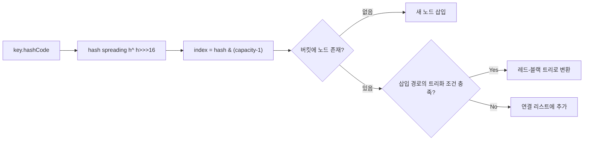

# HashMap 내부 구조

## 핵심 정의
`HashMap`은 키-값(key-value) 쌍을 해시 테이블(hash table) 기반으로 저장하는 자바 컬렉션 프레임워크(Java Collections Framework)의 대표적인 `Map` 구현체다. 키의 `hashCode()` 값을 이용해 버킷(bucket) 위치를 계산하고, 해당 버킷에 데이터를 저장함으로써 평균 O(1)의 삽입/조회 성능을 제공한다. 순서를 보장하지 않고, `null` 키를 하나까지 허용하며, 스레드 안전하지 않다.

Java 8부터는 버킷 내부 충돌(collision)이 일정 임계값을 넘으면 연결 리스트(linked list)를 레드-블랙 트리(red-black tree)로 변환해 많은 충돌 상황에서 탐색을 O(log n)으로 줄인다. 다만 같은 해시를 갖고 서로 비교 가능한 순서를 제공하지 않는 키는 트리의 여러 가지를 탐색해야 하므로 최악 O(n)이 남는다.

## 동작 원리 / 구조

### 저장 구조
`HashMap`은 내부적으로 `Node<K,V>[] table` 배열을 가지며, 각 배열 인덱스가 하나의 버킷이다.

```
key.hashCode() → 해시 스프레딩(hash spreading) → index = (table.length - 1) & hash
```

OpenJDK 8에서 도입되어 OpenJDK 25에서도 사용하는 해시 스프레딩 함수는 다음과 같다.

```java
static final int hash(Object key) {
    int h;
    return (key == null) ? 0 : (h = key.hashCode()) ^ (h >>> 16);
}
```

상위 16비트를 하위 비트와 XOR 연산해 낮은 비트의 분산성을 높인다. 배열 크기가 2의 거듭제곱이라 `%` 대신 `&` 연산으로 인덱스를 구해 성능을 확보한다.

### 충돌 처리
같은 버킷에 여러 키가 몰리면(hash collision) 연결 리스트로 체이닝(separate chaining)한다. OpenJDK 25의 구현 상수는 `TREEIFY_THRESHOLD=8`, `MIN_TREEIFY_CAPACITY=64`, `UNTREEIFY_THRESHOLD=6`이다. 일반 `putVal`의 리스트 경로는 기존 8개 노드 뒤에 9번째를 추가할 때 트리화를 요청하며, 용량이 64 미만이면 먼저 확장한다. `compute` 등 삽입 경로마다 임계값 적용 시점은 다를 수 있다. 6은 리사이징으로 트리 버킷을 분할할 때 리스트로 되돌리는 기준이며, 일반 삭제는 트리 모양도 검사하므로 단순히 노드가 6개가 되는 순간 전환한다는 규칙은 아니다. 이는 API 계약이 아닌 구현 세부사항이다.

### 리사이징
기본 생성자는 첫 삽입까지 테이블 할당을 미룬다. 기본 초기 용량(capacity)은 16, 기본 로드 팩터(load factor)는 0.75다. 일반 삽입 경로에서는 size가 정수 threshold를 넘으면 리사이징(resizing)이 발생해 배열 크기를 2배로 늘리고 기존 노드를 재배치(rehash)한다. Java 8부터는 리사이징 시 각 노드가 새 배열에서 `기존 인덱스` 또는 `기존 인덱스 + 기존 capacity` 둘 중 하나로만 이동하도록 최적화되어 있어, 해시값을 다시 계산하지 않고 비트 하나만 검사해서 재배치한다.



## 실무 관점
- 초기 용량을 예측 가능하면 생성자에 지정해 불필요한 리사이징을 줄인다. Java 19+에서는 예상 매핑 수 `n`을 받는 `HashMap.newHashMap(n)`을 사용할 수 있다. 생성자는 예상 원소 수와 버킷 용량을 구분해야 한다. 극단적 해시 충돌 때문에 발생하는 확장까지 막는 보장은 없다.
- 커스텀 객체를 키로 쓸 때는 반드시 `equals()`와 `hashCode()`를 함께 오버라이드해야 한다. 둘 중 하나만 재정의하면 조회가 실패하거나 논리적으로 같은 객체가 다른 버킷에 저장되는 문제가 생긴다.
- 가변(mutable) 객체를 키로 사용하다 필드 값을 바꾸면 `hashCode()`가 달라져 저장 당시 버킷과 조회 시 버킷이 어긋나 데이터를 찾지 못하는 흔한 장애 패턴이 있다. 키는 불변(immutable) 객체로 설계하는 것이 안전하다.
- `hashCode()` 구현이 나쁘면(예: 항상 같은 값 반환) 모든 데이터가 한 버킷에 몰려 사실상 연결 리스트/트리 순회가 되어 성능이 O(n) 또는 O(log n)으로 저하된다. 트리화는 이런 최악의 상황에 대한 방어책이지, 근본 해법은 아니다.
- 순서가 필요하면 `LinkedHashMap`, 정렬이 필요하면 `TreeMap`을 쓴다. `HashMap`의 순회 순서에 의존하는 코드는 버전이나 리사이징 시점에 따라 깨질 수 있다.
- 멀티스레드 환경에서 외부 동기화 없는 동시 수정은 데이터 경쟁이며 결과가 보장되지 않는다. 동시성이 필요하면 [[ConcurrentHashMap]]을 사용한다.

### computeIfAbsent는 실패와 부재를 자동 캐싱하지 않는다

`computeIfAbsent`는 키가 없거나 값이 null일 때 계산 함수(mapping function)를 호출한다. 함수가 null을 반환하거나 예외를 던지면 계산 결과를 저장하지 않으므로 다음 호출에서 다시 계산할 수 있다. 조회 결과가 없다는 사실도 캐싱해야 한다면 `Optional.empty()` 같은 null이 아닌 표현과 만료·무효화 정책을 별도로 둔다. 조회 실패를 정상적인 부재로 바꿔 저장하면 복구 뒤에도 실패를 숨길 수 있다.

계산 함수 안에서 같은 맵을 수정하는 것은 금지된 사용 방식이다. 단일 스레드라도 `ConcurrentModificationException`이 발생할 수 있으며, 이는 최선 노력의 감지일 뿐 롤백 기능이 아니다. OpenJDK 25 구현은 콜백 실행 후 변경 카운터를 검사하므로, 콜백이 다른 키에 수행한 put이 남은 채 예외가 발생할 수 있다. 외부 호출·부수 효과도 실패했다고 되돌아가지 않는다. 이 메서드를 트랜잭션이나 한 번만 실행되는 외부 작업으로 해석하지 않는다.

## 심화 Q&A

### Q. 리사이징할 때 키의 hashCode를 다시 호출해야 하는가?
OpenJDK 25는 노드에 저장한 hash를 사용한다. 용량을 두 배로 늘릴 때 `hash & oldCapacity` 비트가 0이면 기존 인덱스, 아니면 기존 인덱스+oldCapacity에 둔다. 연결 리스트는 low/high 그룹 안의 순서를 유지해 옮긴다. 가변 키의 hashCode가 변했다고 리사이징이 이를 재계산해 고쳐주는 것은 아니다.

### Q. `hashCode()`가 동일해도 `equals()`가 다르면 어떻게 되는가?
같은 버킷에 저장되지만 서로 다른 노드로 체이닝된다. 조회 시 인덱스는 같아도 `equals()` 비교를 통해 정확한 노드를 찾으므로 논리적 오류는 없다. 다만 해시 충돌이 늘어나 성능이 저하될 수 있다.

### Q. 트리화(treeify) 임계값이 8인 이유는?
OpenJDK 25 소스는 잘 분산된 해시에서 버킷 길이를 평균 약 0.5인 포아송 분포(Poisson distribution)로 근사하며 긴 버킷이 드물다는 근거를 설명한다. 트리 노드는 일반 노드보다 공간 비용이 커서 짧은 버킷에는 리스트를 유지한다. 실제 확률은 해시 분포·용량·삽입 이력에 따라 달라지며 긴 버킷이 생겼다고 악의적 입력임을 뜻하지는 않는다.

### Q. `capacity`가 2의 거듭제곱이어야 하는 이유는?
인덱스 계산을 `hash % capacity` 대신 `hash & (capacity - 1)`로 하기 위해서다. 나눗셈 연산보다 비트 AND 연산이 훨씬 빠르며, capacity가 양의 2의 거듭제곱이면 이 마스크는 `Math.floorMod(hash, capacity)`와 같다. Java `%`는 음수 hash에서 음수를 반환할 수 있으므로 단순히 `%`와 항상 동일하다고 하면 틀린다. 사용자가 임의의 초기 용량을 넣어도 내부적으로 가장 가까운 2의 거듭제곱으로 올림 처리된다.

### Q. `HashMap`을 순회하는 도중 기존 키의 값만 `put(existingKey, newValue)`로 갱신하면 `ConcurrentModificationException`이 발생하는가?
발생하지 않는다. `HashMap`의 fail-fast 감지는 `modCount`가 바뀌었는지만 확인하는데, `modCount`는 새 매핑 삽입·삭제 등 구조적 변경을 감지하는 구현 카운터다. size 변화와 완전히 같은 개념은 아니며 OpenJDK 25의 `clear()`는 빈 맵에서도 이를 증가시킨다. `putVal()` 내부에서 이미 존재하는 키를 찾아 `e.value = value`로 값만 교체하는 경로는 새 노드를 만들지도, 개수를 바꾸지도 않으므로 `modCount`가 그대로 유지되어 예외가 나지 않는다. 반면 순회 중 새 키를 추가하거나(`put`으로 신규 삽입) 기존 키를 제거하면 즉시 구조적 변경으로 간주되어 보통 다음 `next()`에서 검출되지만 fail-fast는 최선 노력이며 모든 변경의 검출을 보장하지 않는다. 값 교체와 구조적 변경을 구분하지 못하면 "왜 여기선 예외가 안 나지?"라는 혼란으로 이어지기 쉽다.

### Q. 로드 팩터를 0.75보다 낮추면 어떤 트레이드오프가 생기는가?
같은 초기 용량에서 로드 팩터를 낮추면 더 적은 원소 수에서 확장하므로 버킷당 평균 노드 수가 줄어 조회 성능(공간 대비 시간)이 좋아진다. 반대로 높이면 메모리는 절약되지만 충돌 확률이 늘어 조회 성능이 저하된다. 0.75는 시간과 공간의 균형점으로 경험적으로 선택된 기본값이다.

### Q. 미리 크게 만든 HashMap에서 대부분 지우면 순회 비용도 원소 수만큼 줄어드는가?
A. Java SE 25 API의 순회 비용은 `size + capacity`에 비례한다. OpenJDK 25는 일반 `remove()`나 `clear()`에서 테이블을 자동 축소하지 않으므로, 큰 버킷 배열이 남으면 적은 원소를 순회해도 빈 버킷 탐색과 공간 비용이 남는다. 장기간 재사용하는 희소 맵은 과도한 초기 용량을 피하고, 필요하면 동시 접근을 통제한 뒤 새 맵에 옮기는 비용과 효과를 비교한다.

값 교체가 fail-fast 예외를 내지 않는다는 사실은 동시 쓰기의 안전성을 뜻하지 않는다. 다른 스레드의 기존 값 교체에도 별도의 공개·동기화 규칙이 필요하다.

## 관련 개념
- [[ConcurrentHashMap]]
- [[컬렉션 동기화]]
- [[ArrayList와 LinkedList]]

## 참고 자료

확인 날짜: 2026-09-08. 아래 버전과 범위의 공식 문서·소스로 본문을 대조했다. 성능 비교와 운영 선택은 워크로드에 따라 달라지는 판단 기준이다.

- [HashMap API](https://docs.oracle.com/en/java/javase/25/docs/api/java.base/java/util/HashMap.html) — Java SE 25 용량·로드 팩터·동시성·fail-fast.
- [OpenJDK 25 HashMap 소스](https://raw.githubusercontent.com/openjdk/jdk/jdk-25-ga/src/java.base/share/classes/java/util/HashMap.java) — putVal·resize·treeifyBin·TreeNode.find/removeTreeNode의 조건.

### 2026-09-23 부분 재검증

Java SE 25 HashMap API의 순회 비용과 OpenJDK jdk-25-ga의 clear/remove·modCount·테이블 유지 경로를 확인했다. 기존 전체 검증일은 유지한다.

실행 확인: 2026-09-23, OpenJDK 25.0.2+10-69에서 기존 값 교체와 빈 clear의 modCount 차이을 재현했다. 구현 관측을 다른 JVM·버전의 추가 보장으로 일반화하지 않는다.

### 부분 재검증: 2026-10-04

Java SE 25 HashMap/Map의 computeIfAbsent null·예외·계산 중 수정 금지와 OpenJDK jdk-25+36의 콜백 후 modCount 검사를 확인했다. 기존 전체 `verified`는 유지한다.

- [Java SE 25 HashMap](https://docs.oracle.com/en/java/javase/25/docs/api/java.base/java/util/HashMap.html) — computeIfAbsent의 null·예외 및 최선 노력 변경 감지.
- [Java SE 25 Map](https://docs.oracle.com/en/java/javase/25/docs/api/java.base/java/util/Map.html) — 계산 결과 저장과 동시성 계약의 구현별 구분.
- [OpenJDK jdk-25+36 HashMap](https://raw.githubusercontent.com/openjdk/jdk/jdk-25%2B36/src/java.base/share/classes/java/util/HashMap.java) — computeIfAbsent의 mappingFunction.apply 이후 modCount 검사.

실행 확인: Oracle JDK 25.0.4+7-LTS-189(macOS AArch64)에서 null 반환·기존 null·예외 이후 재호출, Optional.empty의 저장, 계산 중 다른 키 수정 시 예외와 변경 잔존을 확인했다. 마지막 사례는 잘못된 사용 방식의 해당 구현 관찰이며, 그 결과 상태를 다른 구현·버전의 보장으로 삼지 않는다.
