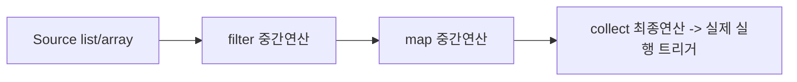

# Stream API

## 핵심 정의
`Stream API`는 Java 8에서 도입된, 컬렉션이나 배열 등의 데이터 소스를 선언적(declarative)이고 함수형(functional) 스타일로 처리하기 위한 API다. 데이터를 직접 담고 있지 않고 소스로부터 요소를 어떻게 처리할지에 대한 연산 파이프라인(pipeline)을 구성하며, 중간 연산(intermediate operation)은 지연 평가(lazy evaluation)되고 최종 연산(terminal operation)이 호출되는 시점에 실제 계산이 수행된다. 각 스트림은 한 번만 순회할 수 있으며, 재사용은 금지된다. 검출하면 `IllegalStateException`을 던질 수 있지만 모든 재사용을 검출할 수 있다는 보장은 없다.

## 동작 원리 / 구조

### 파이프라인 구성
스트림 연산은 크게 세 단계로 나뉜다.

1. 소스 생성: `collection.stream()`, `Arrays.stream()`, `Stream.of()` 등
2. 중간 연산(0개 이상, 체이닝 가능): `filter`, `map`, `sorted`, `distinct`, `limit`, `flatMap` 등 — 스트림을 반환하고 지연 실행된다. 일부 연산은 기존 receiver를 반환할 수 있다.
3. 최종 연산(정확히 1개): `collect`, `forEach`, `reduce`, `count`, `anyMatch` 등 — 이 시점에 결과에 필요한 계산이 수행되고 스트림이 소비(consume)된다.

지연 평가 덕분에 `filter().map().findFirst()` 같은 파이프라인은 요소 하나하나에 대해 filter→map→조건 확인을 수직으로(vertically) 수행하며, 순차 파이프라인에서는 결과가 확정되면 이후 처리를 멈출 수 있다(short-circuiting). 병렬 실행은 이미 진행 중인 다른 분할의 작업까지 즉시 중단하거나 콜백 호출 수를 최소로 제한하지는 않는다. 전체 요소에 대해 filter를 다 끝낸 뒤 map을 시작하는 방식이 아니다. 다만 sorted 같은 상태 유지 연산은 버퍼링할 수 있고, 크기를 아는 소스의 count처럼 결과에 영향 없는 중간 연산을 아예 생략할 수도 있다. peek 등의 부수 효과가 반드시 실행된다고 가정하지 않는다.

### Collector와 reduce
`collect(Collectors.toList())`, `Collectors.groupingBy()`, `Collectors.joining()` 등은 가변 리듀스(mutable reduction) 연산으로, 내부적으로 공급자(supplier), 누산자(accumulator), 결합자(combiner), 최종 변환 함수(finisher)와 특성(characteristics)으로 구성된 `Collector` 인터페이스를 구현한다. `reduce()`는 항등원과 결합 법칙 등의 계약에 따라 요소를 하나의 결과로 접는다. 타입 자체가 불변이어야 한다는 제약은 없지만, 공유된 가변 초기값을 누적 버퍼로 수정하면 병렬 리듀스 계약을 깨기 쉽다. 가변 컨테이너는 분할마다 supplier로 생성하는 collect를 사용한다.

Java 16부터는 `Collectors.toList()` 대신 더 간결한 `stream.toList()`를 바로 사용할 수 있다(단, 결과 리스트의 구조를 수정할 수 없으며 원소의 깊은 불변성까지 보장하지 않는다. `Collectors.toList()`는 결과의 구체 타입·가변성을 보장하지 않으므로 가변 ArrayList가 필요하면 `toCollection(ArrayList::new)`를 쓴다).

### 병렬 스트림
`parallelStream()` 또는 `stream().parallel()`은 내부적으로 공용 `ForkJoinPool`(기본적으로 `ForkJoinPool.commonPool()`)을 사용해 `Spliterator`로 데이터를 분할하고 여러 스레드에서 처리한 뒤 결과를 결합한다. 데이터 소스가 잘 분할 가능(splittable)하고, 요소 수가 충분히 많고, 연산이 무상태(stateless)이며 CPU 바운드일 때 이득을 얻기 쉽다. 실제 손익은 연산 비용과 분할·병합·스케줄링 비용을 측정해 판단한다.

### Stream Gatherers (Java 24+)
JEP 485로 Java 24에서 정식 도입되어 Java 25에도 포함된 기능으로, `Gatherer` 인터페이스를 통해 기존에 제공된 중간 연산의 조합만으로 표현하기 어려웠던 1:다, 다:1, 다:다 변환이나 상태를 유지하는 커스텀 중간 연산(예: 슬라이딩 윈도우, 고정 크기 배치 묶기)을 직접 정의할 수 있다. `stream.gather(Gatherers.windowFixed(3))` 같은 형태로 사용한다.

## 실무 관점
- 단순 반복문으로 처리해도 되는 짧은 로직을 억지로 스트림 체인으로 바꾸면 가독성이 오히려 떨어지고 디버깅이 어려워진다. 복잡한 필터링/변환/집계가 섞인 로직에서 선언적 표현의 이점이 크다.
- `parallelStream()`은 만능 성능 향상 도구가 아니다. 요소당 연산량에 비해 분할 비용이 크거나, I/O 바운드 작업(DB 호출, 외부 API 호출)이 섞여 있거나, 공용 `ForkJoinPool`을 다른 비동기 작업(`CompletableFuture` 등)과 공유하는 상황에서는 오히려 성능이 저하되거나 스레드 풀 고갈로 서비스 전체에 영향을 줄 수 있다.
- 스트림 파이프라인 내부의 람다 밖으로 해당 함수형 인터페이스가 선언하지 않은 체크 예외(checked exception)를 던지면 컴파일 오류가 나므로, 람다 안에서 처리하거나 언체크 예외로 감싸는 패턴이 필요하다.
- `Collectors.groupingBy()`와 `Collectors.toMap()`은 키 충돌이나 `null` 처리에서 실무 장애를 일으키는 대표적인 지점이다. `toMap()`은 중복 키가 있으면 기본적으로 `IllegalStateException`을 던진다. 중복이 허용되는 도메인에서만 병합 함수(merge function)를 정하고, 데이터 오류라면 이를 임의의 값 선택으로 숨기지 않는다.
- 무한 스트림(`Stream.iterate`, `Stream.generate`)은 전체 소비 연산에서 종료하지 않을 수 있다. findFirst·anyMatch 같은 단락 연산은 limit 없이도 끝날 수 있고, 반대로 limit이 있어도 앞선 sorted나 일치 원소 없는 filter 때문에 종료하지 않을 수 있다.
- 스트림 연산 중 부수 효과(side effect)를 주는 코드(`forEach` 안에서 외부 변수 변경 등)는 병렬 스트림에서 스레드 안전 문제를 유발할 수 있으므로 지양하고, 순수 함수 기반 파이프라인을 유지하는 것이 원칙이다.

### 평탄화한 내부 스트림과 수집 결과의 계약
Java 25 `flatMap`은 실제로 매핑해 소비한 내부 스트림을 닫는다. 다만 바깥의 I/O 스트림을 닫는 책임은 별개이고, 미리 만든 스트림들을 `Stream<Stream<T>>`에 담은 뒤 바깥만 닫아도 아직 방문하지 않은 내부 스트림까지 찾아 닫지는 않는다. 파일 스트림은 가능한 한 mapper가 호출될 때 열고, 바깥 파이프라인도 try-with-resources로 관리한다. 지연 실행 결과를 반환할 때의 자원 소유권은 [[try-with-resources]]를 따른다.

수집 결과가 `HashMap`이라고 해서 수집 과정의 null 정책도 HashMap.put과 같지는 않다. OpenJDK 25의 두 인자 `toMap`은 value mapper의 null을 거부하고, HashMap을 공급하는 네 인자 버전도 `Map.merge`의 non-null 입력값 계약을 따른다. `groupingBy` 역시 분류 함수가 null 키를 반환하면 실패한다. 반면 `toMap`의 충돌 병합 함수가 null을 반환하면 그 키의 매핑을 제거하며, 이후 같은 키가 다시 들어오면 새 매핑이 생길 수 있다. null을 “아무 변경 없음”으로 사용하지 말고 입력 정규화·제외·도메인 오류 중 정책을 먼저 정한다.

## 심화 Q&A

### Q. 스트림의 중간 연산이 왜 지연 평가되는가, 그리고 이것이 성능에 어떤 이점을 주는가?
지연 평가 덕분에 스트림 라이브러리는 각 요소에 대해 모든 중간 연산을 한 번에 수직으로 적용(loop fusion)할 수 있어, 중간 연산마다 전체 컬렉션을 순회하는 오버헤드를 없앤다. 또한 `findFirst()`, `anyMatch()`, `limit()` 같은 단락 평가(short-circuit) 연산과 결합하면 조건을 만족하는 즉시 이후 요소 처리를 생략할 수 있어, 특히 큰 데이터셋에서 불필요한 연산을 크게 줄인다.

### Q. `map()`과 `flatMap()`의 근본적인 차이는 무엇이며, 언제 `flatMap()`이 필요한가?
`map()`은 요소를 1:1로 변환해 `Stream<Stream<T>>`처럼 중첩 구조가 생길 수 있는 반면, `flatMap()`은 각 요소를 하나의 스트림으로 변환한 뒤 그 결과들을 평탄화(flatten)해 하나의 스트림으로 합친다. 예를 들어 `List<List<String>>`을 `List<String>`으로 펼치거나, 한 사용자 객체가 가진 여러 주문 목록을 전체 주문 스트림으로 합칠 때 `flatMap()`이 필요하다.

### Q. `reduce()`의 3-인자 버전(`identity, accumulator, combiner`)은 왜 필요한가?
순차 스트림에서는 `combiner`가 실제로 호출되지 않지만, 병렬 스트림에서는 데이터가 여러 부분으로 나뉘어 각 부분마다 독립적으로 `accumulator`가 적용된 뒤, 부분 결과들을 `combiner`로 합쳐야 하기 때문에 필요하다. `combiner`를 잘못 구현하면(예: 항등원과 결합 법칙을 만족하지 않는 연산) 병렬 실행 시 순차 실행과 다른 결과가 나올 수 있다.

### Q. 병렬 스트림에서 `ArrayList`처럼 분할이 쉬운 구조와 `LinkedList`처럼 분할이 어려운 구조는 성능 차이가 나는가?
그렇다. 병렬화 효율은 `Spliterator`의 분할 특성에 크게 좌우된다. 배열 기반 구조(`ArrayList`, 배열)는 인덱스 기준으로 균등 분할이 쉬워 병렬 처리 이점이 크지만, `LinkedList`는 순차 접근만 가능해 분할 비용이 크고 병렬화 이점이 거의 없거나 오히려 손해를 볼 수 있다.

### Q. 스트림 연산에서 상태를 가진(stateful) 람다를 쓰면 왜 위험한가?
`filter`나 `map`에 전달한 람다 내부에서 외부의 공유 변수를 수정하면, 순차 스트림에서는 우연히 문제없이 동작하는 것처럼 보여도 병렬 스트림으로 바꾸는 순간 경쟁 조건(race condition)이 발생해 결과가 실행할 때마다 달라질 수 있다. 스트림 연산은 부작용이 없는 순수 함수로 작성하는 것이 원칙이며, 상태가 필요하면 `Collectors`나 `reduce()` 같은 스트림 자체의 집계 메커니즘을 활용해야 한다.

### Q. Stream Gatherers는 기존 `Collector`와 어떻게 다른가?
`Collector`는 스트림을 최종적으로 하나의 결과로 모으는 최종 연산 도구인 반면, `Gatherer`는 중간 연산 자체를 커스텀할 수 있게 해준다. 기존에도 flatMap·mapMulti의 1:다 변환과 sorted·distinct 같은 상태 유지 연산은 있었다. 부족했던 것은 임의의 중간 연산을 재사용 가능한 표준 확장 객체로 정의하는 방법이었다. Gatherer는 이런 1:다, 다:다, 상태 유지 중간 연산을 표준 API 안에서 선언적으로 구성할 수 있게 한다.

### Q. 최종 연산을 끝내면 Files.lines의 파일도 자동으로 닫히는가?
A. 아니다. `Stream`은 `AutoCloseable`이지만 최종 연산은 자동 close가 아니다. `Files.lines(path)`처럼 I/O 자원을 소유한 스트림은 try-with-resources로 닫는다. 반대로 컬렉션에서 만든 일반 스트림에는 통상 닫아야 할 외부 자원이 없다. 단락 연산으로 일부만 읽었어도 자원 정리는 동일하다.

### Q. toList 결과를 읽기 전용 설정으로 공유하면 깊은 불변성까지 확보되는가?
A. `Stream.toList()`는 리스트의 변경 연산을 막지만 내부 가변 객체를 복사하거나 불변으로 만들지 않는다. 또한 `Collectors.toUnmodifiableList()`는 null을 거부하지만 `Stream.toList()`는 null 요소를 담을 수 있어 단순 치환할 때 의미가 달라진다. 구조의 수정 가능성, null 정책, 원소의 변경 가능성을 각각 확인한다.

## 관련 개념
- [[ArrayList와 LinkedList]]
- [[컬렉션 동기화]]
- [[ConcurrentHashMap]]

## 참고 자료

확인 날짜: 2026-09-08. 아래 버전과 범위의 공식 문서·소스로 본문을 대조했다. 성능 비교와 운영 선택은 워크로드에 따라 달라지는 판단 기준이다.

- [Stream API](https://docs.oracle.com/en/java/javase/25/docs/api/java.base/java/util/stream/Stream.html) — Java SE 25 지연·단락·연산 생략·재사용·toList.
- [Collector API](https://docs.oracle.com/en/java/javase/25/docs/api/java.base/java/util/stream/Collector.html) — Java SE 25 네 함수와 특성·결합 계약.
- [Collectors API](https://docs.oracle.com/en/java/javase/25/docs/api/java.base/java/util/stream/Collectors.html) — Java SE 25 수집 결과 계약과 중복 키.
- [Gatherer API](https://docs.oracle.com/en/java/javase/25/docs/api/java.base/java/util/stream/Gatherer.html) — Java SE 25 커스텀 중간 연산, Since 24.
- [Stream 패키지 명세](https://docs.oracle.com/en/java/javase/25/docs/api/java.base/java/util/stream/package-summary.html) — Java SE 25 비간섭·상태·병렬 리듀스.

### 2026-09-23 부분 재검증

Java SE 25 Stream·stream 패키지·Collectors의 단락 실행, reduce/collect, close 및 목록 수집 계약을 재확인했다. 기존 전체 검증일은 유지한다.

실행 확인: 2026-09-23, OpenJDK 25.0.2+10-69에서 toList의 null 허용·수정 금지, toUnmodifiableList의 null 거부, 최종 연산과 close 분리을 재현했다. 구현 관측을 다른 JVM·버전의 추가 보장으로 일반화하지 않는다.

부분 재검증: 2026-10-04. 아래 적용 버전과 확인 범위에 한하며 노트 전체의 기존 verified는 유지한다.

- [Java SE 25 Stream.flatMap](https://docs.oracle.com/en/java/javase/25/docs/api/java.base/java/util/stream/Stream.html#flatMap(java.util.function.Function)), [Map.merge](https://docs.oracle.com/en/java/javase/25/docs/api/java.base/java/util/Map.html#merge(K,V,java.util.function.BiFunction)), [OpenJDK jdk-25+36 Collectors](https://raw.githubusercontent.com/openjdk/jdk/jdk-25%2B36/src/java.base/share/classes/java/util/stream/Collectors.java) — 내부 스트림 정리, collector의 null 검사와 merge 삭제 계약. Oracle JDK 25.0.4에서 단락 처리한 내부 스트림의 close, 미소비 내부 스트림의 별도 정리 필요, toMap/groupingBy null 실패와 병합 null의 제거·재삽입을 확인했다. 병렬 I/O 부하·전체 Gatherer 계약은 재검증하지 않았다.
