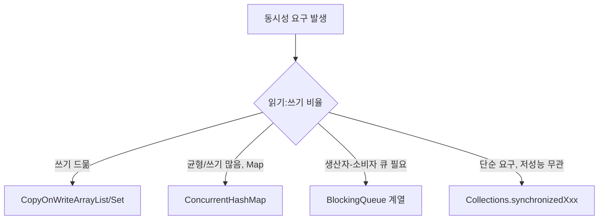

# 컬렉션 동기화

## 핵심 정의
자바 컬렉션 프레임워크(Java Collections Framework)의 표준 구현체(`ArrayList`, `HashMap`, `HashSet` 등)는 기본적으로 스레드 안전(thread-safe)하지 않다. 여러 스레드가 동시에 읽고 쓰는 환경에서 데이터 정합성을 지키려면 별도의 동기화(synchronization) 전략이 필요하며, 자바는 크게 세 가지 접근 방식을 제공한다: (1) `Collections.synchronizedXxx()`로 감싸는 방식, (2) `java.util.concurrent` 패키지의 동시성 컬렉션(`ConcurrentHashMap`, `CopyOnWriteArrayList` 등), (3) 명시적 락(`ReentrantLock` 등)을 애플리케이션 레벨에서 직접 사용하는 방식이다.

## 동작 원리 / 구조

### 1. Collections.synchronizedXxx()
내부 컬렉션을 감싸는 래퍼(wrapper)를 만들고, 주요 조회·갱신 메서드를 하나의 공통 락(mutex) 객체에 대해 동기화하는 방식이다. 구조가 단순하지만 컬렉션 전체에 대해 하나의 락만 사용하므로 동시 접근이 많을수록 병목이 커진다.

```java
List<String> list = Collections.synchronizedList(new ArrayList<>());
// 복합 연산(반복 등)은 별도로 락을 잡아야 안전
synchronized (list) {
    for (String s : list) { ... }
}
```
원본 컬렉션을 직접 우회해서 접근하지 않아야 한다. synchronizedMap의 keySet/values 뷰를 순회할 때도 뷰가 아닌 원래 map 래퍼를 잠근다. 반복(iteration)은 래퍼가 자동으로 동기화해주지 않으므로, 위처럼 반복 구간 전체를 수동으로 `synchronized`로 감싸지 않으면 `ConcurrentModificationException`이 발생할 수 있다.

### 2. java.util.concurrent 동시성 컬렉션
- `ConcurrentHashMap`: 버킷 단위 락과 CAS를 조합해 세밀한 동시성을 제공한다. 자세한 내부 구조는 [[ConcurrentHashMap]] 참고.
- `CopyOnWriteArrayList` / `CopyOnWriteArraySet`: 실제로 내용을 변경하는 쓰기에서 보통 내부 배열을 복사(copy-on-write)해 새 배열로 교체한다. 개별 읽기는 배열 참조를 읽어 수행하고 반복자는 생성 시 배열 스냅샷을 유지하므로 매우 빠르지만, 쓰기 비용이 O(n)으로 크고 메모리 사용량도 늘어난다. "읽기가 압도적으로 많고 쓰기가 드문" 시나리오(리스너 목록, 설정 캐시 등)에 적합하다.
- `ConcurrentLinkedQueue` / `ConcurrentLinkedDeque`: 락 없는(lock-free) CAS 기반 큐로, 생산자-소비자(producer-consumer) 패턴에 적합하다.
- `BlockingQueue` 계열(`LinkedBlockingQueue`, `ArrayBlockingQueue`): 큐가 가득 차거나 비어있을 때 스레드를 대기시키는(blocking) 기능까지 제공해, 스레드 풀의 작업 큐로 널리 쓰인다.
- `CopyOnWriteArrayList`의 반복자는 반복 시작 시점의 스냅샷을 순회하므로 반복 도중 원본이 바뀌어도 `ConcurrentModificationException`이 발생하지 않는다(대신 최신 데이터를 반영하지 못할 수 있다).

### 비교 표

| 방식 | 락 단위 | 읽기 성능 | 쓰기 성능 | 적합한 상황 |
|---|---|---|---|---|
| synchronizedMap/List | 전체 컬렉션 단일 락 | 보통 | 보통 | 낮은 동시성, 단순 구현 |
| ConcurrentHashMap | 버킷 단위 + CAS | 매우 빠름 | 빠름 | 높은 동시 읽기/쓰기 |
| CopyOnWriteArrayList | 쓰기 시 전체 복사 | 매우 빠름(락 없음) | 느림(O(n)) | 읽기 압도적, 쓰기 희소 |
| BlockingQueue | 내부 락/조건변수 | - | - | 생산자-소비자, 스레드 풀 큐 |



## 실무 관점
- 새 코드를 작성할 때는 `Collections.synchronizedXxx()`보다 `java.util.concurrent` 패키지의 컬렉션을 우선 검토한다. 대부분의 실무 시나리오에서 더 나은 처리량을 제공한다.
- "check-then-act" 패턴(예: `if (!map.containsKey(k)) map.put(k, v)`)은 동기화된 컬렉션을 쓰더라도 두 연산 사이에 경쟁 조건이 생길 수 있다. 해당 구현체의 `putIfAbsent()`, `computeIfAbsent()` 같은 원자적 API를 쓰거나 복합 연산 전체를 같은 외부 잠금으로 보호한다.
- 리스너 목록, 캐시된 설정값처럼 등록/변경이 드물고 조회가 압도적으로 많은 자료구조는 `CopyOnWriteArrayList`가 정답에 가깝다. 반대로 쓰기가 잦은 대용량 리스트에 이를 잘못 적용하면 매 쓰기마다 전체 배열을 복사해 심각한 성능 저하와 메모리 압박(각 쓰기마다 새 배열 GC 대상 생성)을 일으킨다.
- 스레드 풀의 작업 큐, 이벤트 버퍼링 등에는 `BlockingQueue` 계열이 적합하며, 큐 용량 제한(bounded queue)을 두어 생산자가 소비자를 압도하는 상황(메모리 폭증)을 방지하는 설계가 중요하다.
- `Vector`, `Hashtable` 같은 레거시 동기화 컬렉션은 새 코드에서 사용하지 않는다. 주요 메서드가 전체 객체 잠금을 사용해 경합 시 병목이 될 수 있으며, 현대적인 동시성 컬렉션으로 대체 가능하다.
- 컬렉션 자체를 동기화해도 그 안에 담긴 가변 객체(mutable object)까지 스레드 안전해지는 것은 아니다. 컬렉션 동기화와 요소 객체의 동시성 안전은 별개의 문제다.

## 심화 Q&A

### Q. `Collections.synchronizedList()`로 감싼 리스트를 `for-each`로 순회할 때 왜 예외가 발생할 수 있는가?
`synchronizedList()`의 각 메서드 호출(`get`, `add` 등)은 개별적으로 동기화되지만, `for-each`의 반복 자체는 여러 번의 메서드 호출로 이루어지므로 전체 반복 과정이 원자적이지 않다. 반복 도중 다른 스레드가 구조를 변경하면 fail-fast 반복자가 `ConcurrentModificationException`을 던질 수 있다. 이는 최선 노력의 버그 감지로, 예외가 없다고 안전한 것은 아니다. 이를 막으려면 반복 구간 전체를 리스트 객체에 대해 수동으로 `synchronized` 블록으로 감싸야 한다.

### Q. `CopyOnWriteArrayList`에서 반복 중 다른 스레드가 요소를 추가하면 반복자에 그 요소가 보이는가?
보이지 않는다. `CopyOnWriteArrayList`의 반복자는 생성되는 시점의 배열 참조를 그대로 캡처한 스냅샷을 순회하며, 이후 발생하는 쓰기는 새로운 배열을 만들어 참조를 교체할 뿐 기존 스냅샷에는 영향을 주지 않는다. 그래서 예외는 발생하지 않지만 최신 상태를 100% 반영하지는 못하는 스냅샷 일관성을 갖는다. 변경을 일부 반영할 수 있는 ConcurrentHashMap의 약한 일관성과 구분한다. 배열 안의 가변 객체 자체를 복사하는 것은 아니다.

### Q. `ConcurrentHashMap`과 `Collections.synchronizedMap(new HashMap<>())` 중 무엇을 기본값으로 선택해야 하는가?
특별한 이유가 없다면 `ConcurrentHashMap`을 기본으로 선택한다. null 지원뿐 아니라 맵 전체 순회·여러 키의 복합 연산을 하나의 잠금으로 보호해야 할 때도 synchronizedMap을 고려한다. 모든 접근자가 같은 래퍼 잠금 규칙을 따라야 한다. `ConcurrentHashMap`은 대부분의 동시 접근 패턴에서 더 높은 처리량을 낸다.

### Q. 명시적 락(`ReentrantLock`)을 직접 쓰는 것이 더 나은 경우는 언제인가?
여러 컬렉션이나 여러 필드에 걸친 상태를 하나의 원자적 단위로 갱신해야 하는 복합 트랜잭션성 로직에는, 개별 컬렉션이 제공하는 원자적 연산만으로는 부족하다. 이런 경우 `ReentrantLock`이나 `synchronized` 블록으로 여러 자료구조에 대한 갱신을 하나의 임계 구역(critical section)으로 명시적으로 묶어야 정합성을 보장할 수 있다.

### Q. 동기화된 컬렉션을 쓰는데도 데이터 경쟁(data race)이 발생하는 흔한 원인은 무엇인가?
컬렉션 자체의 동기화와, 그 컬렉션에 담긴 값 객체의 가변 상태 변경은 별개다. 예를 들어 `ConcurrentHashMap<String, List<Integer>>`에서 맵 자체는 안전해도, 꺼낸 `List<Integer>`를 여러 스레드가 동기화 없이 직접 수정하면 그 리스트 내부에서 경쟁 조건이 발생한다. 컬렉션 동기화는 조회·원소 교체·구조적 변경 등 해당 컬렉션 연산을 보호할 뿐, 담긴 요소의 동시성까지 책임지지 않는다.

### Q. 병렬 스트림(parallelStream)으로 동기화되지 않은 `ArrayList`에 결과를 채우면 무엇이 문제인가?
`forEach()` 안에서 공유 `ArrayList`에 `add()`를 호출하는 식으로 부수 효과(side effect)를 주면, `ArrayList`가 스레드 안전하지 않기 때문에 내부 배열 인덱스 충돌이나 요소 유실이 발생할 수 있다. 병렬 스트림 결과를 모을 때는 부수 효과 대신 `collect(Collectors.toList())`처럼 스트림 자체가 제공하는 스레드 안전한 병합(combiner) 메커니즘을 사용해야 한다. 관련 내용은 [[Stream API]] 참고.

### Q. CopyOnWriteArrayList에서 제거한 리스너가 계속 호출되거나 메모리에 남을 수 있는가?
A. 그렇다. 이미 시작한 반복자는 이전 배열 스냅샷을 계속 순회하므로 제거 이후에도 그 반복에서 리스너가 호출될 수 있다. 오래 보관한 반복자는 이전 배열과 그 원소를 유지해 회수를 늦출 수도 있다. `remove`를 진행 중 콜백의 취소·종료 대기와 동일시하지 않고, 필요하면 별도의 활성 상태나 완료 동기화를 둔다. 반복자의 remove/set/add는 지원하지 않는다.

### Q. synchronizedList의 subList를 잠그면 원본 접근도 보호되는가?
A. Java SE 25의 synchronized wrapper 뷰는 원본 래퍼의 mutex를 공유한다. 뷰를 순회할 때 뷰 자체가 아니라 최초 원본 래퍼를 잠근다. 더 큰 작업 단위가 필요하면 그 전체를 같은 mutex로 묶고, 원본 컬렉션을 래퍼 밖에 노출하지 않는다.

## 관련 개념
- [[ConcurrentHashMap]]
- [[ArrayList와 LinkedList]]
- [[HashMap 내부 구조]]
- [[Stream API]]

## 참고 자료

확인 날짜: 2026-09-08. 아래 버전과 범위의 공식 문서·소스로 본문을 대조했다. 성능 비교와 운영 선택은 워크로드에 따라 달라지는 판단 기준이다.

- [Collections API](https://docs.oracle.com/en/java/javase/25/docs/api/java.base/java/util/Collections.html) — Java SE 25 동기화 래퍼의 순회·뷰 잠금 규칙.
- [CopyOnWriteArrayList API](https://docs.oracle.com/en/java/javase/25/docs/api/java.base/java/util/concurrent/CopyOnWriteArrayList.html) — Java SE 25 스냅샷 반복자·복사 변경.
- [java.util.concurrent 패키지](https://docs.oracle.com/en/java/javase/25/docs/api/java.base/java/util/concurrent/package-summary.html) — Java SE 25 동시성 컬렉션과 메모리 일관성.
- [ConcurrentHashMap API](https://docs.oracle.com/en/java/javase/25/docs/api/java.base/java/util/concurrent/ConcurrentHashMap.html) — Java SE 25 원자적 연산과 약한 일관성.

### 2026-09-23 부분 재검증

Java SE 25 Collections의 동기화 뷰 mutex와 CopyOnWriteArrayList의 스냅샷·반복자 수정 제한을 확인했다. 오래 유지한 스냅샷의 객체 보존은 해당 참조 구조의 결과다. 기존 전체 검증일은 유지한다.

실행 확인: 2026-09-23, OpenJDK 25.0.2+10-69에서 원본 clear 후 기존 CopyOnWriteArrayList 반복자의 원소 유지·remove 금지을 재현했다. 구현 관측을 다른 JVM·버전의 추가 보장으로 일반화하지 않는다.
