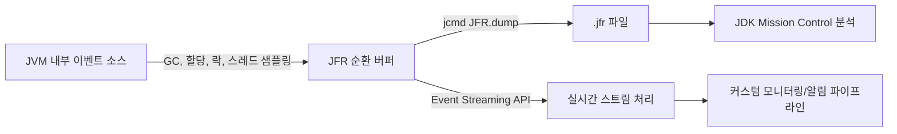

# JFR과 프로파일링

## 핵심 정의
JFR(JDK Flight Recorder)은 JVM에 내장된 이벤트 기반(event-based) 저오버헤드 프로파일링/진단 도구다. JEP 328로 OpenJDK 11에 공개 구현이 통합되었으며, GC 활동, 스레드 스택 샘플링, 락 경합, 객체 할당, I/O 등 수백 종의 이벤트를 순환 버퍼(circular buffer)에 기록해 `.jfr` 파일로 덤프하거나 실시간 스트리밍할 수 있다. 별도 에이전트나 바이트코드 계측 없이 JVM 자체 기능으로 동작해, 운영 환경에서도 상시 켜둘 수 있을 만큼 오버헤드가 낮은 것이 가장 큰 특징이다.

## 동작 원리 / 구조

### 이벤트 수집 흐름


### 레코딩 시작 방법
```bash
# JVM 시작 시점부터 레코딩 (애플리케이션 구동과 동시에)
java -XX:StartFlightRecording=filename=recording.jfr,duration=60s,settings=profile.jfc -jar app.jar

# 실행 중인 프로세스에 동적으로 부착 (jcmd)
jcmd <pid> JFR.start name=diag settings=profile duration=120s filename=diag.jfr
jcmd <pid> JFR.dump name=diag filename=snapshot.jfr
jcmd <pid> JFR.stop name=diag
```
`default.jfc`는 오버헤드를 극도로 낮춘 상시 운영용 설정, `profile.jfc`는 더 많은 정보를 수집하는 단기 진단용 설정이다. JEP 328의 1%는 SPECjbb2015 기본 설정에서의 성공 목표이며 모든 워크로드·이벤트 조합의 보장이 아니다.

### 샘플링 정확도 개선(JDK 25)
기존 JFR 실행 시간 프로파일링(execution sampling)은 세이프포인트(safepoint) 편향을 피하려고 비동기 스택 파싱을 했지만, 안전하지 않은 지점의 휴리스틱 파싱 때문에 안정성 문제가 있었다. JDK 25에 도입된 JEP 518(JFR Cooperative Sampling)은 "샘플 요청(시간 기반)"과 "스택 워킹(세이프포인트 기반)"을 두 단계로 분리해, 샘플 요청 때 대상 스레드를 잠깐 중단해 program counter와 stack pointer를 기록하고 다시 실행한 뒤 다음 세이프포인트에서 스택을 재구성하는 방식으로 바꿨다. 같은 릴리스의 JEP 509(JFR CPU-Time Profiling)는 벽시계 시간이 아닌 실제 CPU 소모 시간 기준 프로파일링을 실험적으로 지원하며 `jdk.CPUTimeSample` 이벤트는 기본 비활성이다. 이를 활성화하면, I/O 대기가 긴 스레드와 CPU를 실제로 많이 쓰는 스레드를 구분해준다. 다만 스레드별 CPU 시간 타이머를 얻기 위해 리눅스 전용 API를 사용하므로 이 기능은 리눅스에서만 동작하며, Windows/macOS에서는 쓸 수 없다.

### 민감정보 가림의 범위(JDK 27)
JDK 27(JEP 536)은 일부 명령행 인자와 최초 환경 변수·시스템 속성 값을 프로세스 안에서 가린다. `-XX:FlightRecorderOptions:redact-key=+audit.hidden`처럼 `+` 접두어를 쓰면 기본 키 필터에 애플리케이션 필터를 추가할 수 있다. `+` 없이 지정하면 기본 필터를 교체하므로 의도하지 않은 노출이 없는지 확인한다.

이 기능은 best-effort이며 `jdk.JVMInformation`, `jdk.InitialSystemProperty`, `jdk.InitialEnvironmentVariable`의 명시된 항목에 적용된다. 사용자 정의 이벤트, `jdk.ProcessStart`, 임의의 문자열 필드까지 자동 정제하는 기능은 아니다. Oracle JDK 27+35에서 테스트용 password 속성과 추가한 키는 `[REDACTED]`로 기록되었지만 사용자 정의 이벤트의 테스트 문자열은 그대로 남았다. 녹화 파일 접근 통제와 이벤트 데이터 최소화는 계속 필요하다.

### 이벤트 스트리밍
```java
try (RecordingStream rs = new RecordingStream()) {
    rs.enable("jdk.GCPhasePause").withThreshold(Duration.ofMillis(100));
    rs.onEvent("jdk.GCPhasePause", event -> {
        if (event.getDuration().toMillis() > 500) {
            alert("GC pause spike: " + event.getDuration());
        }
    });
    rs.start();
}
```
JDK 14부터 제공되는 Event Streaming API로 JFR 이벤트를 실시간으로 소비해, 자체 모니터링/알림 파이프라인에 연동할 수 있다.

## 실무 관점
- 전통적인 프로파일러(agent 기반, bytecode instrumentation)는 오버헤드가 커서 운영 환경에서 상시 가동이 부담스럽지만, JFR은 `default.jfc` 기준 오버헤드가 매우 낮아 운영 서버에 상시 켜두고 장애 발생 시점의 레코딩을 그대로 분석하는 전략이 가능하다.
- GC 일시 정지(pause) 급증, 메모리 할당량 폭증, 락 경합 핫스팟 등은 힙덤프나 스레드덤프 한 장으로는 원인을 특정하기 어렵고, JFR의 시계열 이벤트를 봐야 "언제부터" 문제가 시작됐는지 알 수 있다.
- async-profiler 같은 서드파티 도구는 `AsyncGetCallTrace`(비공식, POSIX 시그널 기반, Windows 미지원) 방식을 오래 써왔는데, JFR은 HotSpot에 통합되어 배포·운영하기 쉽지만 크래시가 불가능한 것은 아니다. 도구별 지원 JVM·OS·이벤트를 확인해야 한다. 다만 async-profiler는 네이티브 프레임(JNI, 커널) 가시성이 더 좋아 상호 보완적으로 쓰는 경우가 많다.
- 흔한 실수: 디스크 레코딩에서 `duration`·`maxage`·`maxsize` 제한 없이 계속 수집해 디스크를 소진하거나, 순환 버퍼 크기를 기본값 그대로 두어 장애가 발생한 시점의 이벤트가 이미 버퍼에서 밀려나 유실되는 경우. 장애 재현이 예측되는 상황이라면 `maxsize`/`maxage`를 넉넉히 잡거나 보관 시간과 크기 한도를 명시한 상시 레코딩을 유지한다. JDK 25 jcmd 문서에서 JFR.start의 maxage 기본값은 0s, maxsize는 0(무제한)이므로 둘을 설정해 보관 정책을 정한다.
- 튜닝 포인트: JDK Mission Control(JMC)의 자동 분석(Automated Analysis) 탭은 GC 압박, 락 경합, 예외 폭주 같은 패턴을 규칙 기반으로 미리 짚어주므로, 원시 이벤트를 처음부터 뒤지기 전에 먼저 확인하는 것이 효율적이다.

### 동시에 실행하는 녹화의 설정

JFR 녹화 여러 개는 이벤트 수집 비용과 데이터 범위를 완전히 격리하지 않는다. 실행 중인 녹화들이 요구한 이벤트를 충족하도록 설정을 합성하므로, 한 녹화가 더 낮은 threshold나 스택 수집을 요구하면 다른 녹화 파일에도 그 추가 정보가 포함될 수 있다. 녹화 하나의 설정만 보고 프로세스 전체의 수집량이나 파일의 데이터 범위를 판단하지 않는다.

상시 녹화 중 임시 profile 녹화를 시작할 때 전체 오버헤드·저장량을 관찰하고, 작업 후 임시 녹화가 종료됐는지 `JFR.check`로 확인한다. 이때 `JFR.dump`는 스냅샷을 저장하는 명령으로 녹화를 중지하지 않는다. 파일 저장과 진단 세션 종료를 별도로 관리한다.

### 스트리밍 콜백 밖으로 이벤트를 넘길 때의 수명
Java 25 `EventStream`은 기본적으로 같은 `RecordedEvent` 객체를 여러 이벤트에 재사용할 수 있다. 콜백에서 받은 객체를 그대로 리스트·큐에 저장하거나 다른 실행기의 작업으로 넘기면, 나중에 읽는 값이 다음 이벤트의 값으로 바뀔 수 있다. 비동기 전달 전 콜백 안에서 필요한 필드를 불변 DTO로 복사하거나, 시작 전에 `setReuse(false)`를 설정해 이벤트마다 새 객체를 받는다. 재사용을 끄면 할당량이 늘므로 필요한 값만 복사하는 방식과 함께 비교한다.

콜백은 하나의 처리 스레드에서 실행되므로 느린 외부 호출은 후속 이벤트 소비를 지연시킨다. 별도 큐로 넘길 때는 큐 용량·드롭 정책도 정한다. 객체 수명 문제를 해결해도 무제한 큐에 진단 데이터가 쌓이는 문제까지 해결되지는 않는다.

## 심화 Q&A

### Q. JFR과 async-profiler 중 무엇을 먼저 써야 하는가?
A. 지원되는 HotSpot 배포판에서 운영 환경 상시 관찰과 통합 이벤트가 중요하면 JFR이 기본 선택지다. 네이티브 코드(JNI, 커널 시스템콜) 구간까지 봐야 하거나 화염 그래프(flame graph) 생성 자동화가 필요한 정밀 진단 상황에서는 async-profiler를 보조적으로 사용한다. 두 도구는 배타적이지 않고, JFR로 상시 관찰하다가 이상 구간이 잡히면 async-profiler로 더 깊게 파는 흐름이 실무적이다.

### Q. 세이프포인트 편향(safepoint bias)이 왜 문제였고, JFR Cooperative Sampling은 이를 어떻게 해결했는가?
A. 세이프포인트에서만 실행 위치를 관찰하면 세이프포인트가 드문 코드가 과소 표집될 수 있다. JEP 518은 샘플 요청 시 위치를 기록해 두고 Java 스택 재구성을 다음 안전점으로 미뤄 안정성을 개선한다. 모든 편향을 없애지는 못하며 인트린식 내부에서는 마지막 Java 프레임만 기록할 수 있다. native code 실행 중 샘플에는 기존 접근을 유지한다.

### Q. JFR의 CPU-Time 프로파일링과 기존 실행 시간 샘플링의 차이는 무엇이고 언제 유용한가?
A. 기존 실행 시간 샘플링은 고정 주기(예: 20ms)마다 스레드가 어디서 실행 중이었는지 벽시계 기준으로 샘플링한다. 이는 스레드별 CPU 사용량에 비례한 표본이 아니며 native 호출에 소비한 CPU를 정확히 귀속하기도 어렵다. 어떤 스레드를 표집하는지는 이벤트·구현에 따라 다르므로 모든 I/O·park 대기를 동일하게 표집한다고 해석하지 않는다. CPU-Time 프로파일링은 실제 CPU 소모 시간을 기준으로 샘플링해, I/O 바운드 스레드와 CPU 바운드 스레드를 구분하고 진짜 연산 병목을 찾는 데 유리하다.

### Q. 운영 환경에서 JFR을 상시 켜두는 것이 왜 가능한가, 오버헤드는 어떻게 통제하는가?
A. JFR은 이벤트 발생 지점에 이미 계측 훅이 내장돼 있어 별도 바이트코드 재작성이 필요 없고, 이벤트 기록도 스레드 로컬 버퍼에 락 경합 없이 적재하는 구조라 오버헤드가 낮다. `default.jfc`는 스택 샘플링 주기를 길게, 세부 이벤트 threshold를 높게 잡아 오버헤드를 최소화하고, 더 정밀한 진단이 필요할 때만 일시적으로 `profile.jfc`나 커스텀 설정으로 전환하는 방식으로 통제한다.

### Q. JFR 레코딩만으로 메모리 누수 원인을 특정할 수 있는가?
A. 할당(allocation) 이벤트와 오래된 객체 샘플링(Old Object Sample) 이벤트로 "어떤 코드 경로가 어떤 타입의 객체를 계속 만들어내는지"는 파악할 수 있지만, 특정 시점의 힙 전체 객체 그래프와 참조 경로(GC Root까지의 도달 경로)를 정밀 분석하려면 [[힙덤프와 스레드덤프 분석]]에서 다루는 힙덤프와 Eclipse MAT 같은 도구가 더 적합하다. JFR로 의심 구간을 좁히고 힙덤프로 확정하는 조합이 효율적이다.

### Q. JFR 이벤트 스트리밍(Event Streaming API)은 전통적인 파일 덤프 방식과 무엇이 다르고 언제 선택하는가?
A. 파일 덤프는 진행 중인 레코딩에서도 스냅샷을 저장해 오프라인으로 JMC에서 분석하는 사후(post-mortem) 방식이다. 스트리밍 API는 이벤트를 실시간으로 소비할 수 있어, GC 일시 정지가 임계치를 넘으면 수집·flush 지연 후 알림을 보내는 등 온라인 모니터링/오토스케일링 트리거에 연동할 수 있다. 다만 위 RecordingStream 예제의 소비 로직은 애플리케이션 프로세스 안에서 돌기 때문에, 소비 로직이 무겁거나 블로킹되면 애플리케이션에 부담을 줄 수 있어 필요한 이벤트 값을 복사해 별도 실행기/큐로 넘기는 방식을 고려한다. EventStream.openRepository(Path)나 원격 관리 API를 통한 프로세스 밖 소비도 가능하며, 스트리밍은 이벤트 발생과 동기화된 즉시 콜백이 아니다.

## 관련 개념
- [[힙덤프와 스레드덤프 분석]]
- [[GC 튜닝]]
- [[메모리 누수]]

## 참고 자료

확인 날짜: 2026-09-08. 아래 버전과 범위의 공식 문서·소스로 본문을 대조했다. 성능 비교와 운영 선택은 워크로드에 따라 달라지는 판단 기준이다.

- [JEP 328](https://openjdk.org/jeps/328) — OpenJDK 11 공개 구현·버퍼·1% 성능 목표 범위.
- [JEP 518](https://openjdk.org/jeps/518) — JDK 25 cooperative sampling의 정지·요청·재구성 및 남는 편향.
- [JEP 509](https://openjdk.org/jeps/509) — JDK 25 Linux 실험적 CPU-time 표집과 기본 비활성.
- [JEP 349](https://openjdk.org/jeps/349) — JDK 14 스트리밍·외부 소비·flush 지연.
- [JDK 25 jcmd](https://docs.oracle.com/en/java/javase/25/docs/specs/man/jcmd.html) — JFR 명령·profile/default 설정·보관 한도.
- [JMC 9 Flight Recorder](https://docs.oracle.com/en/java/java-components/jdk-mission-control/9/user-guide/using-jdk-flight-recorder.html) — 자동 분석과 이벤트 탐색.
- [async-profiler 공식 저장소](https://github.com/async-profiler/async-profiler) — 열람 시 4.5 지원 플랫폼·CPU/할당/네이티브 프로파일 기능.

부분 재검증: 2026-09-22. 아래 확인 범위에 한하며 노트 전체의 기존 verified는 유지한다.

- [JDK 27 Release Notes](https://www.oracle.com/java/technologies/javase/27-relnote-issues.html) — JEP 536 기본 가림 기능 도입.
- [JDK 27 java: FlightRecorderOptions](https://docs.oracle.com/en/java/javase/27/docs/specs/man/java.html) — redact-key/argument 필터 추가·교체·적용 이벤트. 실제 JFR 파일을 기록한 뒤 jfr print로 결과를 확인했다. 기존 JDK 25 표집 구현 설명 전체의 재검증은 아니다.

### 2026-09-23 부분 재검증

[Java SE 25 SettingControl.combine](https://docs.oracle.com/en/java/javase/25/docs/api/jdk.jfr/jdk/jfr/SettingControl.html#combine(java.util.Set))의 동시 녹화 합성 계약과 [JDK 25 jcmd](https://docs.oracle.com/en/java/javase/25/docs/specs/man/jcmd.html)의 JFR.check/dump를 확인했다. OpenJDK 25.0.2에서 하루 threshold·스택 비활성 녹화와 0 threshold·스택 활성 녹화를 동시에 실행한 뒤 두 파일 모두에 짧은 사용자 이벤트가 들어가고 앞쪽 파일에도 스택이 저장됨을 확인했다. Java 27 가림 기능·Linux CPU-Time 표집은 이번 재검증 범위 밖이다.

부분 재검증: 2026-10-04. 아래 적용 버전과 확인 범위에 한하며 노트 전체의 기존 verified는 유지한다.

- [Java SE 25 EventStream](https://docs.oracle.com/en/java/javase/25/docs/api/jdk.jfr/jdk/jfr/consumer/EventStream.html), [RecordingStream.setReuse](https://docs.oracle.com/en/java/javase/25/docs/api/jdk.jfr/jdk/jfr/consumer/RecordingStream.html#setReuse(boolean)) — 기본 재사용 허용·콜백 수명·별도 단일 처리 스레드. Oracle JDK 25.0.4에서 사용자 이벤트 3개를 파일로 기록하고 EventStream의 ordered=false/reuse=true로 읽어 같은 객체 참조와 마지막 값 재사용을 관찰했다. reuse=false의 개별 객체 보존과 콜백 안 값 복사도 확인했다. 모든 녹화·스트림 설정에서 같은 재사용 빈도를 보장하지 않으며 실제 운영 큐 포화는 재현하지 않았다.
