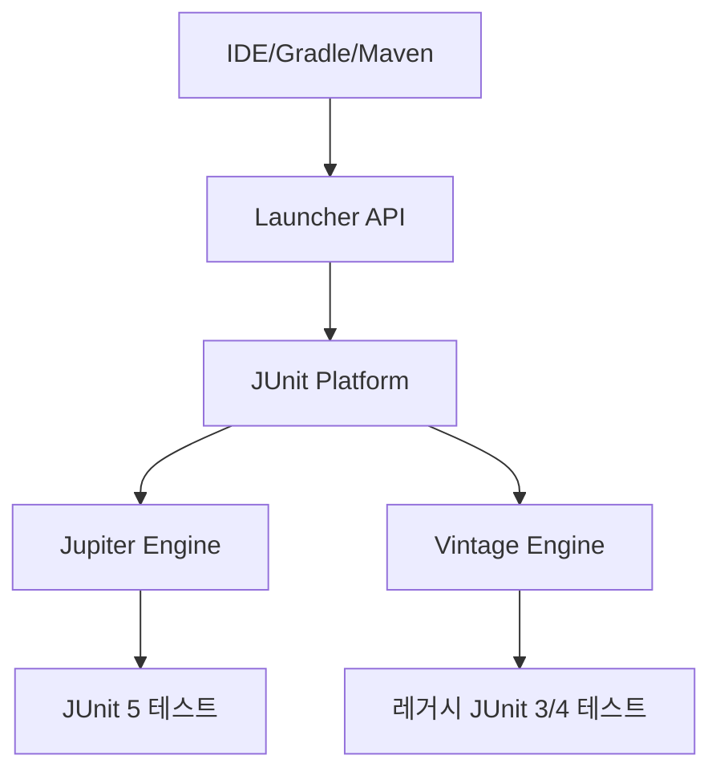

# JUnit5 심화와 테스트 전략

## 핵심 정의
JUnit 5는 Platform·Jupiter·Vintage로 구성되는 테스트 프레임워크이며, Jupiter는 그 위의 프로그래밍 모델과 테스트 엔진(test engine)이다. JUnit 5는 JUnit 4의 단일 모놀리식 구조를 Platform(실행 인프라)·Jupiter(신규 프로그래밍/확장 모델)·Vintage(JUnit 3/4 하위 호환 엔진) 3개 모듈로 분리했다. 확장 모델을 클래스당 하나의 runner를 선택하는 `@RunWith` 중심 구성에서 `Extension` 인터페이스 조합 방식으로 바꿔, 여러 확장을 동시에 조립할 수 있게 한 것이 JUnit 4 대비 가장 큰 구조적 변화다. 이 노트는 JUnit 5.13.4 User Guide의 Jupiter 계약을 기준으로 대조했다. 2026-09-22에 확인한 JUnit 6.1.3(2026-08-07 릴리스)도 실행 Java 버전으로 17 이상을 요구한다. JUnit 6의 Jupiter·Platform·Vintage 구성은 이어지지만 Vintage는 폐기 예정(deprecated)이므로 레거시 테스트의 임시 이행 경로로 사용한다. 프로젝트에서는 Spring Boot·빌드 도구의 실제 BOM과 호환 버전을 확인해 적용한다.

## 동작 원리 / 구조

### 아키텍처

IDE나 빌드 도구는 Launcher API 하나만 알면 되고, Platform이 등록된 엔진(Jupiter, Vintage, 혹은 Spock 같은 서드파티 엔진)에 실행을 위임한다. 덕분에 하나의 빌드에서 JUnit 4/5 테스트를 동시에 돌릴 수 있다(마이그레이션 과도기 지원).

### 확장 모델(Extension Model)
`@ExtendWith`로 등록하는 `Extension`은 목적별 인터페이스로 세분화되어 있다.

| 인터페이스 | 시점 | 용도 |
|---|---|---|
| `BeforeAllCallback` / `AfterAllCallback` | 클래스 단위 | 컨테이너 자원 시작/종료 |
| `BeforeEachCallback` / `AfterEachCallback` | 메서드 단위 | 상태 초기화/정리 |
| `ParameterResolver` | 메서드 인자 주입 시 | 테스트 메서드 파라미터 동적 주입 |
| `TestInstancePostProcessor` | 인스턴스 생성 직후 | 필드 주입, 프록시 설정 |
| `ExecutionCondition` | 실행 전 | 조건부 스킵(`@EnabledIf` 등) |

클래스/메서드의 `@ExtendWith` 목록 순서와 상속 규칙에 따라 확장이 등록되며, `@RegisterExtension` 필드로 프로그래밍 방식 등록도 가능하다. Spring의 `SpringExtension`, Testcontainers의 `@Testcontainers` 지원도 이 모델 위에 구현되어 있다.

### 테스트 생명주기(Lifecycle)
```java
@TestInstance(TestInstance.Lifecycle.PER_METHOD) // 기본값
class OrderServiceTest {
    @BeforeEach void setUp() { /* 매 테스트마다 새 인스턴스 */ }
}

@TestInstance(TestInstance.Lifecycle.PER_CLASS)
class SharedOrderServiceTest {
    @BeforeAll void setUpOnce() { /* static 없이도 1회 실행 가능 */ }
}
```
`PER_METHOD`(기본값)는 테스트 메서드마다 새 인스턴스를 생성해 인스턴스 필드의 공유를 줄인다. static 필드나 외부 DB 같은 상태까지 격리하는 것은 아니다. `PER_CLASS`는 인스턴스를 공유해 `@BeforeAll`을 non-static으로 쓸 수 있게 하지만, 필드에 상태를 저장하면 테스트 간 오염이 생길 수 있다.

### 파라미터화·동적 테스트
```java
@ParameterizedTest
@CsvSource({"1,2,3", "10,20,30"})
void sum(int a, int b, int expected) {
    assertEquals(expected, a + b);
}

@TestFactory
Stream<DynamicTest> dynamicPricingTests() {
    return Stream.of(100, 200, 300)
        .map(p -> DynamicTest.dynamicTest("price=" + p, () -> assertTrue(p > 0)));
}
```
`@ParameterizedTest`도 `@MethodSource`·`@ArgumentsSource` 등으로 런타임에 입력을 생성한다. 차이는 파라미터화 테스트가 같은 테스트 메서드를 인자별로 호출하는 반면 `@TestFactory`는 실행할 테스트 자체를 동적으로 만든다는 점이다. 파라미터화 호출마다 BeforeEach/AfterEach가 적용되지만, 개별 DynamicTest에는 적용되지 않고 factory 메서드를 둘러싸고 한 번 적용된다.

## 실무 관점
- `PER_CLASS`는 무거운 초기화(예: Testcontainers 컨테이너 기동)를 클래스당 1회로 줄여 속도를 높이지만, 인스턴스 필드를 가변 상태로 쓰면 테스트 순서에 따라 결과가 달라지는 취약한 테스트(flaky test)를 만든다. 기본은 `PER_METHOD`를 유지하고 무거운 리소스만 `@BeforeAll`(static) 또는 확장(Extension)의 `Store`로 캐싱하는 편이 안전하다.
- `@Tag("unit")`, `@Tag("integration")`로 태깅해 Maven Surefire의 `groups` 설정(예: `-Dgroups=unit`)이나 Gradle `useJUnitPlatform { includeTags("unit") }`로 필터링하면, 빠른 단위 테스트와 느린 통합 테스트를 파이프라인 단계별로 분리할 수 있다.
- 병렬 기능을 활성화(`junit.jupiter.execution.parallel.enabled=true`)한 뒤 실행 모드도 `concurrent` 또는 `@Execution(CONCURRENT)`로 선택해야 실제 동시 실행된다. 기본 mode는 same_thread다. 동시 실행은 속도를 높일 수 있지만, static 필드·싱글턴 목(mock)·공유 데이터베이스 스키마 같은 전역 상태를 공유하는 테스트는 경쟁 조건(race condition)으로 간헐적 실패가 난다. 리소스 잠금(`@ResourceLock`)으로 충돌 지점을 명시해야 한다.
- 흔한 실수: Vintage 엔진에 의존해 JUnit 4 스타일(`@Before`, `@RunWith(SpringRunner.class)`)과 JUnit 5 스타일을 섞어 쓰다가 확장 동작이 기대와 다르게 나오는 경우. 신규 코드는 Jupiter 확장(`@ExtendWith(SpringExtension.class)` 또는 `@SpringBootTest`)으로 통일한다.
- 튜닝 포인트: `junit-platform.properties`에 `junit.jupiter.testinstance.lifecycle.default=per_class`처럼 프로젝트 전역 기본값을 지정할 수 있지만, 팀 컨벤션 없이 전역 변경하면 기존 테스트의 격리 가정이 깨질 수 있어 신중해야 한다.

### 타임아웃의 실행 스레드와 자원 정리
JUnit 5.13.4의 `assertTimeout`은 호출 스레드에서 본문을 끝까지 실행한 뒤 소요 시간을 판정한다. 시간 초과를 감지해도 본문 실행을 중간에 멈추지 않으므로 무한 대기를 끊는 수단으로 쓰지 않는다. `assertTimeoutPreemptively`는 별도 스레드에서 실행하고 시간 초과 시 취소·인터럽트를 요청한다. 일반 `ThreadLocal` 값과 호출 스레드에 등록한 Mockito static mock은 그 스레드에 자동 전달되지 않는다.

특히 Spring 테스트 트랜잭션이 호출 스레드에 바인딩된 상태에서 preemptive assertion 안으로 DB 호출을 옮기면 테스트 트랜잭션 밖에서 변경이 커밋되어 롤백되지 않을 수 있다. `@Timeout`도 실행 모드에 따라 다르다. `SAME_THREAD`는 원래 스레드에서 실행하다 다른 스레드가 인터럽트하고, `SEPARATE_THREAD`는 위와 같은 스레드 경계가 생긴다. 기본 `INFERRED`는 설정을 따르며 별도 지정이 없으면 `SAME_THREAD`로 해석된다.

타임아웃 실패가 작업·소켓·트랜잭션의 종료까지 증명하지는 않는다. 인터럽트를 무시하는 본문은 assertion이 실패한 뒤에도 실행할 수 있다. 외부 호출 자체의 timeout을 설정하고, 테스트가 만든 작업의 종료와 자원 정리를 확인해 다음 테스트로 부작용이 넘어가지 않게 한다.

## 심화 Q&A

### Q. 여러 `Extension`을 동시에 등록했을 때 실행 순서는 어떻게 보장되는가?
A. 기본적으로 `@ExtendWith`에 나열한 순서, 클래스 계층에서는 상위 클래스의 확장이 먼저 등록된 순서를 따른다. `BeforeEachCallback`은 등록 순서대로, `AfterEachCallback`은 역순으로 실행되어 스택(stack)처럼 자원을 정리하는 wrapping 계약이다. `@RegisterExtension` 필드의 기본 순서는 결정적이지만 선언 순서가 아니다. 필드 확장 순서가 중요하면 해당 필드에 `@Order`를 사용한다.

### Q. 병렬 테스트 실행에서 Mockito의 static mock이나 Spring `@MockitoBean`을 쓸 때 왜 문제가 생기는가?
A. `MockedStatic`의 효과는 생성 스레드에만 적용되므로 다른 작업 스레드에서는 원래 구현이 호출될 수 있다. close 누락도 후속 테스트를 오염시킨다. Spring 컨텍스트는 같은 캐시 키인 테스트 사이에 재사용되며, 이때 같은 singleton mock을 병렬로 스텁·reset하면 서로 간섭한다. 서로 다른 키의 컨텍스트가 같은 항목을 공유하는 것은 아니다. 공유 목 테스트는 순차 실행하거나 공통 ResourceLock으로 접근을 조정하고, 비동기 코드에는 주입 가능한 의존성을 사용한다.

### Q. `@ParameterizedTest`와 `@TestFactory` 기반 동적 테스트는 언제 구분해서 써야 하는가?
A. 각 입력이 동일한 검증 메서드를 따르고 호출마다 생명주기·인자 변환·확장 지원이 필요하면 `@ParameterizedTest`가 리포트 가독성과 IDE 지원 면에서 유리하다. 런타임 입력이라는 이유만으로 DynamicTest가 필요한 것은 아니다. 실행할 검증 코드나 동적 컨테이너 계층 자체를 생성하려면 `@TestFactory`/`DynamicTest`가 적합하다. 다만 동적 테스트는 실패 시 스택 트레이스 추적이 다소 불편하므로 남용은 피한다.

### Q. JUnit 4의 `@Rule`/`@ClassRule`과 JUnit 5의 `Extension`은 근본적으로 무엇이 다른가?
A. JUnit 4 `TestRule`은 테스트 실행을 나타내는 Statement를 감싸는 방식이다. 바이트코드 위빙이 필수인 구조는 아니며 여러 Rule을 RuleChain 등으로 조합할 수 있다. `Extension`은 인터페이스 조합 방식이라 하나의 테스트 클래스에 목적이 다른 여러 확장(트랜잭션 롤백, 컨테이너 생명주기, 목 초기화 등)을 독립적으로 조립할 수 있고, `ParameterResolver`처럼 `@Rule`로는 불가능했던 메서드 파라미터 주입도 지원한다.

### Q. `@Nested` 클래스를 남용하면 어떤 문제가 생기는가?
A. BDD 스타일로 상황(context)별 테스트를 그룹화하는 데는 유용하지만, 중첩이 깊어지면 `@BeforeEach`가 계층마다 누적 실행되어 실제 실행 흐름을 추적하기 어려워지고, 실패 리포트의 계층 구조가 복잡해 CI 로그에서 원인 파악이 느려진다. 2단계 이상 중첩은 지양하고, 공통 설정은 별도 헬퍼 메서드나 확장으로 뽑아내는 편이 낫다.

## 관련 개념
- [[Mockito 활용법]]
- [[MockMvc]]
- [[단위 테스트와 통합 테스트 경계]]
- [[TestContainers]]

## 참고 자료

확인 날짜: 2026-09-08. 아래 버전과 범위의 공식 문서·소스로 본문을 대조했다. 성능 비교와 운영 선택은 워크로드에 따라 달라지는 판단 기준이다.

- [JUnit 5.13.4 User Guide](https://docs.junit.org/5.13.4/user-guide/) — Platform/Jupiter/Vintage·확장 순서·생명주기·동적/파라미터화 테스트·병렬 설정·빌드 태그.
- [JUnit 6.0.0 User Guide](https://docs.junit.org/6.0.0/user-guide/) — Java 17 실행 요구 사항.
- [JUnit 4.13.2 TestRule](https://junit.org/junit4/javadoc/4.13.2/org/junit/rules/TestRule.html) — Statement 장식과 Rule 조합.
- [Mockito 5.20.0 MockedStatic](https://raw.githubusercontent.com/mockito/mockito/v5.20.0/mockito-core/src/main/java/org/mockito/MockedStatic.java) — 스레드 범위와 종료.
- [Spring TestContext Caching](https://docs.spring.io/spring-framework/reference/testing/testcontext-framework/ctx-management/caching.html) — 열람한 Framework 문서의 캐시 키와 bean override.
- [Testcontainers Jupiter Integration](https://java.testcontainers.org/test_framework_integration/junit_5/) — static/인스턴스 컨테이너 생명주기와 확장.

부분 확인: 2026-09-22. JUnit 6.1.3의 릴리스 날짜·Java 요구 버전·Vintage 상태를 확인했다. 5.13.4 기준 본문의 전체 확장 계약을 6.1.3으로 재검증한 것은 아니다. Oracle JDK 27 + JUnit 6.1.3 실행에서 PER_METHOD 인스턴스·파라미터화 호출별 BeforeEach·DynamicTest별 BeforeEach 미실행을 확인했다.

- [JUnit 6.1.3 Overview](https://docs.junit.org/6.1.3/overview.html) — Java 17 이상 실행 요구와 Vintage deprecation.
- [JUnit 6.1.3 Release Notes](https://docs.junit.org/6.1.3/release-notes.html) — 2026-08-07 릴리스.

부분 재검증: 2026-10-04. 아래 적용 버전과 확인 범위에 한하며 노트 전체의 기존 verified는 유지한다.

- [JUnit 5.13.4 User Guide](https://docs.junit.org/5.13.4/user-guide/#writing-tests-assertions) — preemptive assertion의 ThreadLocal·Spring 트랜잭션 경계와 @Timeout thread mode. [5.13.4 AssertTimeoutPreemptively 소스](https://raw.githubusercontent.com/junit-team/junit5/r5.13.4/junit-jupiter-api/src/main/java/org/junit/jupiter/api/AssertTimeoutPreemptively.java) — Future 취소·실행기 shutdownNow 경로. JUnit Jupiter 5.13.4/Platform Console 1.13.4, Oracle JDK 25.0.4에서 스레드·ThreadLocal 차이, 비선점 timeout의 본문 완료, 인터럽트를 무시한 본문의 잔존과 명시적 종료를 확인했다. 실제 Spring DB 롤백은 재현하지 않았다.
