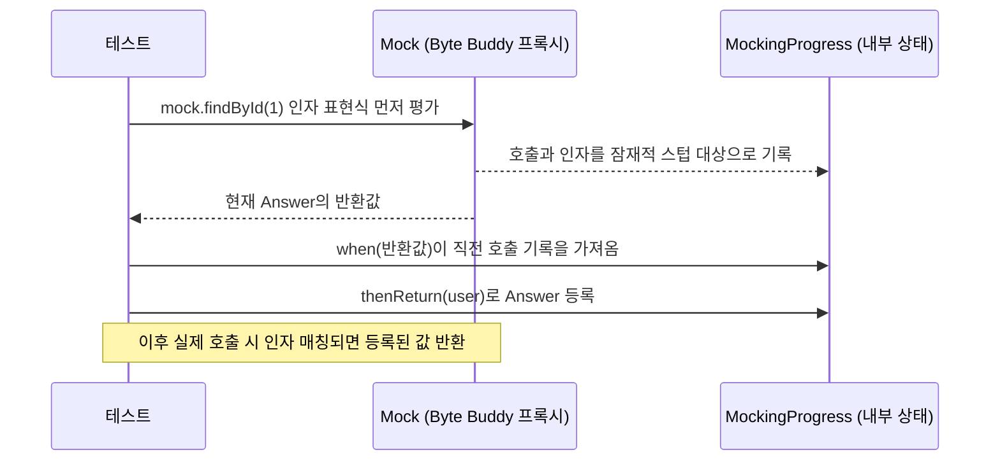

# Mockito 활용법

## 핵심 정의
이 노트는 Mockito 5.20.0 공식 소스를 기준으로 확인했다. Mockito는 협력 객체(collaborator)를 대체할 가짜 객체(mock/spy)를 런타임에 생성해, 의존성을 격리한 상태로 단위 테스트를 작성할 수 있게 해주는 자바 목킹 프레임워크다. 바이트코드 조작(Byte Buddy 기반)으로 인터페이스뿐 아니라 클래스, 최종(final) 클래스/메서드까지 목킹할 수 있는 inline mock maker가 Mockito 5부터 기본 동작으로 통합되어, 과거 별도 의존성이던 `mockito-inline` 아티팩트는 더 이상 필요 없다.

## 동작 원리 / 구조

### mock vs spy
```java
List<String> mockedList = mock(List.class);       // 미스텁 호출에 기본 Answer: null/0/false, 일부 타입은 빈 컬렉션 등
List<String> spiedList = spy(new ArrayList<>());  // 상태를 복사한 spy에서 실제 메서드 수행, 스텁한 부분만 대체

when(mockedList.get(0)).thenReturn("first");
doReturn("stubbed").when(spiedList).get(0); // spy는 when() 대신 doReturn()이 안전
```
일반 `mock`은 미스텁 호출에 기본 Answer를 사용한다. `spy(real)`는 원본 호출을 단순 위임하는 래퍼가 아니라 원본 상태를 복사한 별도 객체로 동작하므로 원본과 spy의 상태 변화가 항상 함께 반영된다고 가정하면 안 된다. 미스텁 메서드는 실제 로직을 실행하므로, `when(spy.method())`처럼 쓰면 스텁 이전에 실제 메서드가 먼저 호출되는 부작용이 생길 수 있어 `doReturn().when()` 패턴을 권장한다.

### 목 생성과 스텁 매칭 흐름

Mockito는 목 객체 호출을 가로채는 `InvocationHandler` 유사 구조로 동작하며, Java의 인자 평가 순서상 먼저 `mock.method()`가 실행되어 호출 기록과 잠재적 stubbing 정보가 남는다. 이어서 `when(...)`이 스레드별 MockingProgress에서 이 정보를 가져오고 `thenReturn`/`thenThrow`가 Answer를 등록한다. 검증(`verify`)도 같은 호출 기록(invocation log)을 근거로 동작한다.

### Strict Stubbing과 ArgumentCaptor
```java
@ExtendWith(MockitoExtension.class) // strict stubs가 기본 활성화
class OrderServiceTest {
    @Mock PaymentGateway gateway;
    @InjectMocks OrderService service;
    record PaymentRequest(int amount) {}
    interface PaymentGateway { void charge(PaymentRequest request); }
    static class OrderService {
        private final PaymentGateway gateway;
        OrderService(PaymentGateway gateway) { this.gateway = gateway; }
        void pay(int amount) { gateway.charge(new PaymentRequest(amount)); }
    }

    @Test
    void 결제_요청_금액_검증() {
        service.pay(10_000);

        ArgumentCaptor<PaymentRequest> captor = ArgumentCaptor.forClass(PaymentRequest.class);
        verify(gateway).charge(captor.capture());
        assertThat(captor.getValue().amount()).isEqualTo(10_000);
    }
}
```
`MockitoExtension`을 쓰면 strict stubbing이 기본값이 되어, 실행 중 한 번도 매칭되지 않은 스텁이 있으면 `UnnecessaryStubbingException`으로 테스트를 실패시킨다. 이는 죽은 스텁(불필요한 설정)이 테스트를 무의미하게 통과시키는 것을 방지한다.

### 호출 인자 캡처는 상태 스냅샷이 아니다
Mockito 5.23.0의 `ArgumentCaptor`는 인자로 받은 객체 참조를 보관하며 깊은 복사(deep copy)를 하지 않는다. 같은 가변 DTO를 수정하며 여러 번 넘기면 `getAllValues()`에 같은 인스턴스가 반복되고, 검증 시점에는 모두 마지막 상태로 보일 수 있다. 위 예제처럼 불변 요청을 매번 만들거나, 호출 시점의 값이 필요하면 `doAnswer` 안에서 필요한 필드를 불변 값으로 복사해 별도 기록한다. Captor에서 나중에 필드를 읽는 것만으로 전송 당시 데이터를 증명하지 않는다.

### 정적 메서드 목킹
```java
// 테스트 클래스 안의 보조 타입. java.time.Clock에는 정적 now()가 없다.
static class LegacyClock {
    static Instant now() { return Instant.now(); }
}

// 테스트 메서드 안
Instant fixedInstant = Instant.parse("2026-09-08T00:00:00Z");
try (MockedStatic<LegacyClock> mocked = mockStatic(LegacyClock.class)) {
    mocked.when(LegacyClock::now).thenReturn(fixedInstant);
    assertEquals(fixedInstant, LegacyClock.now());
    mocked.verify(LegacyClock::now);
} // 스코프 종료 시 자동으로 원복
```
`MockedStatic`은 생성한 스레드에서 close할 때까지 유효하다. try-with-resources는 정상·예외 종료 때 close를 보장하는 사용 패턴이며 필수 문법은 아니다. 다른 스레드의 정적 호출에는 이 목이 적용되지 않는다.

## 실무 관점
- 과도한 목킹(over-mocking)은 구현 세부사항에 테스트가 결합되게 만든다. 리팩터링만 해도 로직은 안 바뀌었는데 테스트가 깨지는 상황이 반복되면, 검증 대상을 행위(behavior)가 아니라 내부 호출 순서 하나하나로 잡고 있는 것은 아닌지 점검한다.
- `spy`는 레거시 코드에서 일부만 대체하고 싶을 때 유용하지만, 실제 로직이 실행되므로 DB 접근이나 외부 호출이 섞인 객체를 spy로 감싸면 단위 테스트가 통합 테스트로 변질된다.
- 정적 메서드 목킹(`mockStatic`)은 설계상 정적 의존을 주입 가능한 구조로 바꾸기 어려운 레거시 코드에 대한 임시방편으로 쓰고, 신규 코드는 애초에 정적 유틸에 대한 의존을 인터페이스 뒤로 감춰 일반 목으로 대체 가능하게 설계하는 것이 낫다.
- 흔한 실수: `@InjectMocks`가 생성자 주입, 세터 주입, 필드 주입 중 어떤 방식을 쓸지 추론에 실패해 일부 필드가 `null`로 남는 경우. 명시적 생성자 호출로 직접 조립하는 편이 실패 원인 추적에 유리할 때가 많다.
- Java 21+의 동적 agent 부착 경고·제한을 피하려면 테스트 JVM 시작 시 `mockito-core`를 `-javaagent`로 지정하는 공식 설정을 적용한다. Mockito 5의 inline 기본화와 JVM 계측 준비는 별개다.
- `any(String.class)`·`anyString()`은 null을 매칭하지 않는다. nullable 입력 경로를 검증하려면 `isNull()` 또는 `nullable(String.class)`를 의도에 맞게 사용한다. 타입 인자 없는 `any()`는 null도 매칭하므로 서로 같은 계약으로 취급하지 않는다. null 경로에서 스텁이 적용되지 않는 문제를 lenient 설정으로 덮지 않는다.
- 튜닝 포인트: `lenient()`로 특정 스텁만 strict 검증에서 제외할 수 있어, 공통 `@BeforeEach`에서 여러 테스트가 공유하는 스텁 중 일부 테스트에서만 쓰이는 경우 예외 처리에 활용한다.

## 심화 Q&A

### Q. `mock`과 `spy`를 혼동해서 쓰면 어떤 장애 패턴이 나타나는가?
A. `spy`로 감싼 객체에 `when(spy.method(arg))` 형태로 스텁하면, 스텁이 등록되기 전에 실제 메서드가 먼저 호출된다. 이 메서드가 외부 API 호출이나 상태 변경을 수반하면 테스트 실행 중 의도치 않은 부작용(실제 DB write, 외부 호출)이 발생할 수 있다. `doReturn().when(spy).method(arg)` 패턴을 쓰면 실제 호출 없이 스텁만 등록되므로 이 문제를 피할 수 있다.

### Q. `UnnecessaryStubbingException`은 왜 발생하고, 무조건 없애는 게 맞는가?
A. Strict stubbing 모드에서 등록한 스텁 중 테스트 실행 경로에서 한 번도 매칭되지 않은 것이 있으면 발생한다. 대부분은 리팩터링 후 남은 죽은 코드라 제거가 맞지만, 여러 테스트 메서드가 공유하는 `@BeforeEach` 설정에서 특정 테스트만 그 스텁을 안 쓰는 구조라면 설계를 재검토하거나 `lenient()`로 예외 처리하는 것이 실용적이다.

### Q. 정적 메서드 목킹(`mockStatic`)이 왜 "최후의 수단"으로 취급되는가?
A. 클래스 코드는 계측되지만 활성 static mock의 효과는 생성 스레드에 한정된다. 비동기 작업의 다른 스레드에는 목이 적용되지 않으며, close를 빠뜨리면 같은 테스트 실행 스레드를 재사용한 후속 테스트에 영향을 줄 수 있다. 또한 정적 의존을 목킹해야만 테스트가 가능하다는 것 자체가 설계상 의존성 주입이 안 되어 있다는 신호이므로, 근본적으로는 정적 호출을 주입 가능한 협력자 뒤로 감싸는 리팩터링이 우선이다.

### Q. `verify(mock, times(n))`과 `ArgumentCaptor`를 함께 써야 하는 경우는 언제인가?
A. 단순히 몇 번 호출됐는지만 확인할 때는 `times(n)`으로 충분하지만, 전달된 인자의 내부 필드 값까지 검증해야 한다면(예: 결제 금액, 이벤트 페이로드) `ArgumentCaptor`로 실제 호출 인자를 캡처해 별도로 단언(assert)해야 한다. 인자 매칭 자체를 조건으로 걸고 싶다면 커스텀 `ArgumentMatcher`를 쓰는 것이 캡처보다 실패 메시지가 명확할 때도 있다.

### Q. `void` 메서드나 예외를 던지는 메서드는 어떻게 스텁하는가?
A. `when(mock.method())`은 반환값이 있는 메서드에만 쓸 수 있으므로, void 메서드에서 예외를 강제로 던지게 하려면 `doThrow(new RuntimeException()).when(mock).voidMethod()` 형태를 쓴다. 마찬가지로 void 메서드에서 별도 동작(콜백 호출 등)을 시뮬레이션하려면 `doAnswer(invocation -> {...}).when(mock).voidMethod()`를 사용한다.

### Q. Mockito의 strict stubbing과 JUnit 5의 병렬 실행을 같이 쓸 때 주의할 점은?
A. `MockitoExtension`이 관리하는 목 상태는 스레드 로컬이 아니라 테스트 인스턴스 단위이므로, `PER_CLASS` 생명주기에 병렬 실행을 조합하면 여러 스레드가 같은 인스턴스의 목 상태를 동시에 건드려 스텁 기록이 뒤섞일 수 있다. 병렬 실행 대상 테스트는 `PER_METHOD`(기본값)를 유지해 인스턴스와 목을 테스트 인스턴스 간 공유를 줄이는 것이 안전하다. Mockito의 stubbing/verify 문법 진행 상태에는 ThreadLocal도 사용되지만 목 자체의 공유 상태를 보호하는 장치는 아니다.

## 관련 개념
- [[JUnit5 심화와 테스트 전략]]
- [[단위 테스트와 통합 테스트 경계]]
- [[MockMvc]]

## 참고 자료

확인 날짜: 2026-09-08. 아래 버전과 범위의 공식 문서·소스로 본문을 대조했다. 성능 비교와 운영 선택은 워크로드에 따라 달라지는 판단 기준이다.

- [Mockito 5.20.0 API 소스](https://raw.githubusercontent.com/mockito/mockito/v5.20.0/mockito-core/src/main/java/org/mockito/Mockito.java) — inline 기본·spy 상태 복사·인자 캡처·doReturn·Java 21+ agent 설정.
- [MockedStatic 5.20.0 소스](https://raw.githubusercontent.com/mockito/mockito/v5.20.0/mockito-core/src/main/java/org/mockito/MockedStatic.java) — 생성 스레드 한정·close 수명.
- [MockitoCore 5.20.0 소스](https://raw.githubusercontent.com/mockito/mockito/v5.20.0/mockito-core/src/main/java/org/mockito/internal/MockitoCore.java) — when이 직전 ongoing stubbing을 가져오는 흐름.
- [MockHandlerImpl 5.20.0 소스](https://raw.githubusercontent.com/mockito/mockito/v5.20.0/mockito-core/src/main/java/org/mockito/internal/handler/MockHandlerImpl.java) — 호출 기록과 잠재적 stubbing 등록.
- [InjectMocks 5.20.0 소스](https://raw.githubusercontent.com/mockito/mockito/v5.20.0/mockito-core/src/main/java/org/mockito/InjectMocks.java) — 생성자·세터·필드 주입 선택과 실패.
- [MockitoExtension 5.20.0 소스](https://raw.githubusercontent.com/mockito/mockito/v5.20.0/mockito-extensions/mockito-junit-jupiter/src/main/java/org/mockito/junit/jupiter/MockitoExtension.java) — STRICT_STUBS 기본값과 인스턴스 초기화.
- [ReturnsEmptyValues 5.20.0 소스](https://raw.githubusercontent.com/mockito/mockito/v5.20.0/mockito-core/src/main/java/org/mockito/internal/stubbing/defaultanswers/ReturnsEmptyValues.java) — 기본 Answer의 primitive·collection·Optional 반환값.

부분 확인: 2026-09-22. Mockito 5.23.0의 inline 기본값·시작 시 agent 설정·static mock의 생성 스레드 한정 계약을 공식 소스로 재확인했다. Oracle JDK 27, Mockito 5.23.0, POM 지정 Byte Buddy/agent 1.17.7, Objenesis 3.3에서 `-javaagent:mockito-core-5.23.0.jar`로 실행해 final 클래스 mock, spy의 when 부작용과 doReturn, 다른 스레드의 static mock 미적용과 close 후 원복을 확인했다. 이 실행 결과가 5.20.0 기준 본문의 모든 기능·조합에 대한 호환성 보장은 아니다.

- [Mockito 5.23.0 API 소스](https://raw.githubusercontent.com/mockito/mockito/v5.23.0/mockito-core/src/main/java/org/mockito/Mockito.java) — inline 기본값과 Java 21+ 시작 agent 설정.
- [MockedStatic 5.23.0 소스](https://raw.githubusercontent.com/mockito/mockito/v5.23.0/mockito-core/src/main/java/org/mockito/MockedStatic.java) — 생성 스레드 범위와 close 수명.
- [Mockito 5.23.0 POM](https://repo.maven.apache.org/maven2/org/mockito/mockito-core/5.23.0/mockito-core-5.23.0.pom) — 재현에 사용한 의존 버전.

부분 재검증: 2026-10-04. 아래 적용 버전과 확인 범위에 한하며 노트 전체의 기존 verified는 유지한다.

- [Mockito 5.23.0 CapturingMatcher](https://raw.githubusercontent.com/mockito/mockito/v5.23.0/mockito-core/src/main/java/org/mockito/internal/matchers/CapturingMatcher.java), [ArgumentMatchers](https://raw.githubusercontent.com/mockito/mockito/v5.23.0/mockito-core/src/main/java/org/mockito/ArgumentMatchers.java) — 캡처한 참조 보관과 any/typed any/isNull/nullable의 null 계약. Mockito 5.23.0을 시작 시 javaagent로 지정한 Oracle JDK 25.0.4에서 같은 가변 객체의 두 호출이 최종 상태로 관찰됨, doAnswer의 호출 시 값 복사, null 매처 경계를 확인했다. 기존 strictness·주입·spy 전체의 재검증은 아니다.
