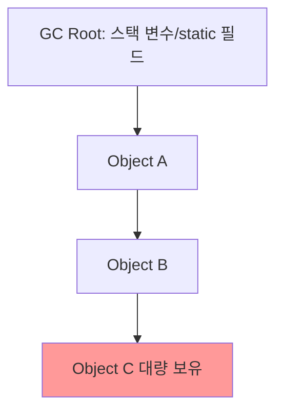

# 힙덤프와 스레드덤프 분석

## 핵심 정의
힙덤프(heap dump)는 특정 시점 JVM 힙에 존재하는 모든 객체와 그 참조 관계를 스냅샷으로 저장한 것이고, 스레드덤프(thread dump)는 스레드의 호출 스택(call stack)과 상태(state)를 기록한다. 포함되는 스레드와 일관성 수준은 도구에 따라 다르며 전통적 jstack/Thread.print는 가상 스레드 전체를 나열하지 않는다. 전자는 메모리 누수나 과도한 힙 점유 원인을 추적할 때, 후자는 응답 지연(hang), 데드락(deadlock), CPU 폭주 원인을 추적할 때 쓰는 대표적인 정적 진단 도구다. 둘 다 "한 순간의 스냅샷"이라는 한계가 있어, 시간에 따른 변화 추이를 봐야 하는 문제는 [[JFR과 프로파일링]] 쪽이 더 적합하다.

## 동작 원리 / 구조

### 캡처 방법
```bash
# 힙덤프
jmap -dump:live,format=b,file=heap.hprof <pid>
jcmd <pid> GC.heap_dump heap.hprof
# HotSpot의 지원되는 OOM 발생 시 자동 캡처 (경로·용량·권한 확보)
-XX:+HeapDumpOnOutOfMemoryError -XX:HeapDumpPath=/var/dumps/

# 스레드덤프
jstack <pid> > thread.tdump
jcmd <pid> Thread.print
kill -3 <pid>   # Unix 계열 HotSpot의 SIGQUIT 처리로 표준 출력 등에 출력
# Java 21+ 가상 스레드 포함 덤프(전통적 덤프와 출력 정보가 다름)
jcmd <pid> Thread.dump_to_file -format=json /var/dumps/threads.json
```
HotSpot의 `jmap -dump:live`와 기본 `jcmd GC.heap_dump`는 덤프 전 GC를 요청해 도달 불가능한 객체를 정리한다. JDK 25 `GC.heap_dump -all`은 이 사전 Full GC 요청을 생략하고 도달 불가능 객체도 포함하지만 덤프 자체의 정지·I/O 부담은 남는다. 영향은 힙 크기·객체 그래프·GC·저장 장치에 따라 커질 수 있으므로 시간 수치를 일반화하지 않는다. jcmd는 대상과 같은 effective UID/GID 및 attach 접근 권한이 필요하다.

### 힙덤프 분석 개념

- **Shallow size**: 객체 자신이 차지하는 크기(헤더·필드·정렬 패딩 포함, 참조한 객체 크기는 제외)
- JDK 27 HotSpot의 압축 객체 헤더 기본화로 같은 필드 구조도 이전 JDK와 shallow size가 달라질 수 있다. [[런타임 데이터 영역#객체 헤더 크기의 버전 의존성]]을 참고하고 분석 도구의 레이아웃 지원·정렬 옵션을 확인한다.
- **Retained size**: 해당 객체 자체와, 그 객체가 없으면 GC 루트에서 도달할 수 없게 되는 객체 집합의 총 크기
- **Dominator tree**: "이 객체가 없어지면 같이 없어질 객체들"의 지배 관계를 트리로 표현한 것으로, Eclipse MAT의 Leak Suspects 리포트가 이 구조를 기반으로 누수 후보를 자동 추정한다.

### 스레드 상태와 데드락 패턴
| 상태 | 의미 |
|---|---|
| `RUNNABLE` | JVM에서 실행 가능한 상태. OS 자원이나 일부 native I/O 대기도 이 상태로 보일 수 있음 |
| `BLOCKED` | `synchronized` 락 획득 대기 |
| `WAITING` | `Object.wait()`, `Thread.join()` 등 무기한 대기 |
| `TIMED_WAITING` | `sleep()`, 타임아웃 있는 `wait()`/`lock.tryLock(timeout)` |

`jstack` 출력에서 두 스레드가 서로 상대가 들고 있는 락을 `BLOCKED` 상태로 기다리고 있으면 지원되는 플랫폼 스레드 모니터 사이클이면 `jstack`이 `Found one Java-level deadlock` 섹션으로 표시해준다. 데드락까지는 아니어도 다수 스레드가 같은 락을 두고 `BLOCKED` 상태로 몰려 있으면 락 경합(contention) 핫스팟으로 본다.

## 실무 관점
- 힙덤프는 반드시 문제가 터진 뒤에만 뜨는 게 아니다. `-XX:+HeapDumpOnOutOfMemoryError`를 사전에 검토해 두면 JVM이 감지한 일부 OOM의 증거를 남길 수 있다. 모든 OOM이 즉시 프로세스를 종료하지는 않으며, OS/cgroup OOM kill이나 애플리케이션이 직접 던진 OutOfMemoryError까지 자동 덤프를 보장하지 않는다. 디스크 공간·권한·비밀정보 접근 통제도 함께 준비한다.
- 데드락/행(hang) 의심 상황에서는 스레드덤프 1장으로 부족하다. 예를 들어 5~10초 간격으로 3~5장을 수집해 같은 스레드가 매번 같은 위치에 멈춰 있는지(진짜 데드락/무한 대기) 아니면 위치가 바뀌면서 실제 업무 진행도 있는지를 비교해야 한다. 위치 변화만으로 라이브락을 배제할 수는 없다.
- 컨테이너(Kubernetes 등) 환경에서는 PID 네임스페이스 차이로 호스트에서 본 PID와 컨테이너 내부 PID가 달라 `jmap`/`jstack`이 대상 프로세스를 못 찾는 경우가 흔하다. 컨테이너 내부에서 직접 실행하거나 `jattach` 같은 도구, 사이드카 방식을 고려한다.
- 힙덤프에는 애플리케이션 메모리에 있던 실제 데이터(사용자 개인정보, 토큰, 비밀번호 등)가 그대로 포함될 수 있다. 외부 분석 도구나 클라우드로 파일을 옮기기 전 반드시 접근 권한을 통제하고, 필요하면 민감 필드를 마스킹하는 절차를 사전에 정의해둔다. 이는 [[시크릿 관리]]와 마찬가지로 다뤄야 할 보안 사고 예방 포인트다.
- 흔한 실수: `retained size`가 아니라 `shallow size` 기준으로 "가장 큰 객체"를 찾다가 실제 누수 원흉(대량의 하위 객체를 붙잡고 있는 컬렉션 등)을 놓치는 경우.

### 히스토그램의 비용과 retained size 합산

`GC.class_histogram`은 타입별 개수·크기를 보여주지만 JDK 25 문서상 영향도가 High인 힙 검사다. 출력이 텍스트라는 이유로 무중단·저비용이라고 가정하지 않는다. 기본 명령은 도달 가능한 객체를 조사하기 위한 GC를 유발할 수 있으며 `-all`은 도달 불가능한 객체도 포함한다. 진단 전에 `jcmd <pid> help GC.class_histogram`으로 대상 JVM의 옵션을 확인하고, 크기만 빠르게 볼 때의 `GC.heap_info`와 전체 힙 검사의 목적을 구분한다.

retained size는 객체마다 독립적으로 합산할 수 있는 사용량이 아니다. 지배 트리의 부모·자식을 함께 더하면 자식의 보유 집합을 중복 계산한다. 반대로 두 캐시가 같은 큰 객체를 각각 참조하면 각 캐시 하나의 retained size에는 그 공유 객체가 빠질 수 있지만, 두 캐시를 함께 제거하는 집합의 retained size에는 포함될 수 있다. 단일 객체와 선택한 객체 집합의 보유 크기를 구분한다.

### 자동 스레드 진단의 지원 범위
Java 25 `ThreadMXBean`은 플랫폼 스레드만 관리한다. `getAllThreadIds()`·스레드 개수에 가상 스레드는 포함되지 않고, 살아 있는 가상 스레드 ID를 `getThreadInfo`에 넘겨도 null이다. 모니터링 그래프의 스레드 수가 안정적이라는 이유로 가상 스레드·대기 요청 누적을 배제하지 않는다. 가상 스레드가 필요한 조사에는 위의 `Thread.dump_to_file` 등 지원되는 진단 경로를 사용한다.

`findDeadlockedThreads()`도 플랫폼 스레드의 객체 모니터·소유 동기화 객체(ownable synchronizer) 순환 대기를 찾으며, 가상 스레드를 포함한 사이클은 찾지 못한다. 또한 작업이 같은 풀의 후속 작업을 기다리는 경우나 DB·네트워크까지 걸친 순환은 이 락 탐지의 증명 범위 밖이다. null 결과는 “발견된 지원 대상 사이클이 없음”으로 해석하고, 요청·작업·자원 의존 관계는 [[데드락과 경쟁 상태]]처럼 별도로 추적한다.

## 심화 Q&A

### Q. G1이나 ZGC처럼 낮은 지연을 목표로 하는 GC를 쓰는데도 힙덤프 생성이 서비스에 큰 영향을 주는 이유는?
A. GC 알고리즘 자체의 STW 시간과 별개로, 힙덤프는 "그 순간 힙 전체의 정합적인 스냅샷"을 보장해야 하므로 덤프 생성 시작 시점에 안전점(safepoint)에서 전체 스레드를 정지시킨다. GC가 아무리 짧은 일시정지를 목표로 설계돼 있어도, 힙덤프라는 별도 작업이 요구하는 정지 시간은 객체 그래프·덤프 구현·I/O·압축·사전 GC 등에 좌우된다. 평상시 GC pause 목표가 덤프 시간의 상한은 아니며 단순한 힙 크기 비례식으로 예측할 수 없다. 힙 크기가 큰 서버라면 트래픽이 적은 시간대에 계획적으로 뜨거나, 라이브 트래픽을 다른 인스턴스로 넘긴 뒤 격리된 인스턴스에서 덤프하는 것이 안전하다.

### Q. `BLOCKED`와 `WAITING` 상태를 구분해서 봐야 하는 이유는?
A. `BLOCKED`는 `synchronized` 임계 구역에 들어가기 위한 락 경쟁 중임을 뜻해, 다른 스레드가 그 락을 오래 들고 있는 것이 원인일 가능성이 높다(락을 들고 있는 스레드의 스택을 함께 봐야 한다). `WAITING`은 wait·join·LockSupport.park 등 무기한 대기 상태다. 정상적인 유휴 worker나 ReentrantLock 획득 대기도 포함되므로 상태만으로 장애라고 판단하지 않는다. 기대한 작업이 진행되지 않는다면, 신호를 보내야 할 다른 스레드가 아예 죽었거나 그 경로를 타지 않은 로직 버그일 가능성을 봐야 한다. 원인 계열이 다르므로 덤프에서 상태를 먼저 정확히 구분하는 것이 분석 방향을 크게 좌우한다.

### Q. Dominator tree 기반 분석이 단순 "타입별 인스턴스 개수/크기" 집계보다 나은 이유는?
A. 타입별 집계는 "String이 500MB를 차지한다"처럼 결과만 보여줄 뿐 왜 그 String들이 GC되지 않고 살아있는지는 알려주지 않는다. Dominator tree는 "이 컬렉션 객체 하나가 사라지면 저 500MB어치 String이 모두 함께 회수된다"는 지배 관계를 보여주므로, 실제로 코드에서 고쳐야 할 지점(캐시를 정리 안 하는 로직, 리스너를 해제 안 하는 로직 등)을 훨씬 빠르게 좁힐 수 있다.

### Q. 힙덤프와 JFR 중 메모리 문제 진단에 무엇을 먼저 써야 하는가?
A. "언제부터, 어떤 할당 패턴으로" 메모리가 늘기 시작했는지 시계열로 보려면 JFR의 할당 이벤트/GC 이벤트가 먼저다. 특정 시점의 힙을 통으로 열어 "지금 무엇이 얼마나 붙잡혀 있는가"를 정밀 분석하려면 힙덤프가 필요하다. 실무에서는 JFR로 누수 의심 구간과 시점을 좁힌 뒤, 그 시점 근처에서 힙덤프를 떠서 확정하는 순서로 조합하는 것이 일반적이다.

### Q. 컨테이너 환경에서 스레드덤프/힙덤프를 안전하게 뜨기 위한 실무 절차는 무엇인가?
A. 컨테이너 내부(같은 PID 네임스페이스)에서 `jcmd`/`jstack`을 직접 실행하거나, `kubectl exec`로 컨테이너 안에 진입해 실행하는 것이 가장 확실하다. 사이드카나 디버그 컨테이너를 붙여 프로세스 네임스페이스를 공유(`shareProcessNamespace`)하는 방식도 쓰인다. PID가 보인다는 사실만으로 attach가 보장되지는 않으므로 사용자 ID·파일 시스템/임시 attach 소켓 접근·JDK 도구도 확인한다. 컨테이너의 쓰기 레이어에만 둔 덤프는 재생성 때 사라질 수 있으므로, 분석 전에 반드시 영속 볼륨이나 외부 스토리지로 즉시 복사해둬야 한다.

## 관련 개념
- [[JFR과 프로파일링]]
- [[메모리 누수]]
- [[GC 튜닝]]
- [[Java Memory Model과 happens-before]]

## 참고 자료

확인 날짜: 2026-09-08. 아래 버전과 범위의 공식 문서·소스로 본문을 대조했다. 성능 비교와 운영 선택은 워크로드에 따라 달라지는 판단 기준이다.

- [JDK 25 jcmd](https://docs.oracle.com/en/java/javase/25/docs/specs/man/jcmd.html) — heap_dump GC 요청/-all·Thread.dump_to_file·UID/GID 조건.
- [JDK 25 jmap](https://docs.oracle.com/en/java/javase/25/docs/specs/man/jmap.html) — live 덤프 옵션.
- [JDK 25 jstack](https://docs.oracle.com/en/java/javase/25/docs/specs/man/jstack.html) — 잠금·스레드 덤프.
- [JDK 25 java](https://docs.oracle.com/en/java/javase/25/docs/specs/man/java.html) — HeapDumpOnOutOfMemoryError·HeapDumpPath·시그널 처리.
- [JEP 444](https://openjdk.org/jeps/444) — Java 21 가상 스레드와 새 thread dump의 차이.
- [Eclipse MAT Shallow vs Retained Heap](https://help.eclipse.org/latest/topic/org.eclipse.mat.ui.help/concepts/shallowretainedheap.html) — 열람한 공식 문서의 객체 자신·보유 크기 정의.
- [Eclipse MAT Dominator Tree](https://help.eclipse.org/latest/topic/org.eclipse.mat.ui.help/concepts/dominatortree.html) — 루트에서의 지배 관계.
- [Kubernetes Process Namespace 공유](https://kubernetes.io/docs/tasks/configure-pod-container/share-process-namespace/) — 열람 문서의 Pod 내 프로세스 공유와 권한.

부분 재검증: 2026-09-22. 아래 확인 범위에 한하며 노트 전체의 기존 verified는 유지한다.

- [JDK 27 Migration Guide](https://docs.oracle.com/en/java/javase/27/migrate/significant-changes-jdk-27-release.html) — 압축 객체 헤더 기본값의 분석 영향. 덤프 생성 명령·MAT 동작 전체의 재검증은 아니다.

### 2026-09-23 부분 재검증

[JDK 25 jcmd](https://docs.oracle.com/en/java/javase/25/docs/specs/man/jcmd.html)의 histogram·heap_dump 영향도/옵션과 [Eclipse MAT Retained Heap](https://help.eclipse.org/latest/topic/org.eclipse.mat.ui.help/concepts/shallowretainedheap.html)의 집합 정의를 확인했다. 격리된 OpenJDK 25.0.2·Serial GC·최대 힙 32MB 시험 JVM에서 histogram -all과 기본 histogram을 비교하고 기본 검사 시 Heap Inspection Initiated GC를 관찰했다. heap_dump -all의 HPROF 헤더도 확인했다. MAT UI 분석·대규모 운영 힙 정지 시간·JDK 27 헤더 레이아웃은 이번 실행 범위 밖이다.

부분 재검증: 2026-10-04. 아래 적용 버전과 확인 범위에 한하며 노트 전체의 기존 verified는 유지한다.

- [Java SE 25 ThreadMXBean](https://docs.oracle.com/en/java/javase/25/docs/api/java.management/java/lang/management/ThreadMXBean.html), [JDK 25 jcmd](https://docs.oracle.com/en/java/javase/25/docs/specs/man/jcmd.html) — 플랫폼 스레드 관리·가상 스레드 제외·deadlock 탐지 범위. Oracle JDK 25.0.4에서 직접 만든 플랫폼/가상 대기 스레드를 MXBean으로 비교했고, 해당 시험 JVM에만 jcmd Thread.dump_to_file을 실행해 JSON에 둘 다 포함됨을 확인했다. 실제 교착은 생성하지 않았고 외부 서비스·사용자 JVM에는 attach하지 않았다.
