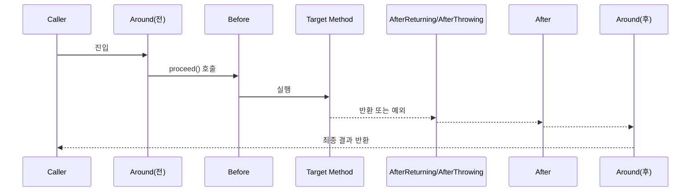

# Advice 종류와 실행 순서

## 핵심 정의
Advice(어드바이스)는 조인포인트(join point, 스프링 AOP에서는 사실상 메서드 실행 시점)에서 실제로 실행되는 부가 기능 코드를 말한다. Spring AOP는 AspectJ 애노테이션 스타일을 차용해 `@Before`, `@Around`, `@AfterReturning`, `@AfterThrowing`, `@After` 다섯 가지 어드바이스 타입을 제공한다. 하나의 조인포인트에 여러 어드바이스가 걸릴 수 있으며, 이때 실행 순서는 같은 Aspect 내부인지 다른 Aspect 간인지에 따라 규칙이 다르다.

## 동작 원리 / 구조

### 어드바이스 타입별 특징
- **`@Before`**: 대상 메서드 실행 전에 실행. 예외를 던지지 않는 한 대상 메서드 실행을 막을 수 없다.
- **`@Around`**: 조인포인트 실행 전체를 감싼다. `ProceedingJoinPoint.proceed()`를 직접 호출해야 실제 메서드가 실행되며, 호출 여부·시점·인자·반환값까지 제어할 수 있는 가장 강력한 어드바이스다. 예외를 잡아 삼킬 수 있는 유일한 어드바이스이기도 하다.
- **`@AfterReturning`**: 메서드가 정상적으로 반환된 후 실행. 반환값을 조회할 수는 있지만 다른 참조로 교체할 수는 없다.
- **`@AfterThrowing`**: 매칭된 메서드 실행이 예외로 끝나면 실행된다. 정상 반환으로 복구할 수는 없지만, 어드바이스 자체가 다른 예외를 던지면 원래 예외를 가릴 수 있다.
- **`@After`**: 해당 인터셉터까지 체인에 진입했다면 try-finally의 finally처럼 정상/예외 종료 시 실행된다. 바깥 `@Around`가 `proceed()`를 호출하지 않으면 안쪽 어드바이스도 실행되지 않는다.

### 단일 Aspect 내 실행 순서
같은 Aspect 안에 여러 어드바이스 타입이 동시에 걸린 경우 실행 순서는 다음과 같다.

```
@Around (proceed 이전 로직)
  → @Before
    → [대상 메서드 실행]
  → @AfterReturning 또는 @AfterThrowing (둘 중 해당하는 것)
  → @After
→ @Around (proceed 이후 로직)
```



### 다수 Aspect 간 실행 순서
서로 다른 Aspect가 같은 조인포인트를 매칭할 경우, Spring AOP는 AspectJ의 우선순위(precedence) 규칙을 따른다.
- Aspect 간 순서는 `@Order(n)` 애노테이션(숫자가 낮을수록 높은 우선순위) 또는 `Ordered` 인터페이스 구현으로 제어한다.
- "들어갈 때"는 우선순위가 높은(숫자가 작은) Aspect의 전처리 어드바이스가 먼저 실행되고, "나갈 때"는 반대로 우선순위가 높은 Aspect의 후처리 어드바이스가 나중에 실행된다. 즉 높은 우선순위 Aspect가 낮은 우선순위 Aspect를 감싸는(sandwich) 구조가 된다.

```
[Order=1] Around 전 → [Order=2] Around 전 → 대상 메서드
→ [Order=2] Around 후 → [Order=1] Around 후
```

같은 Aspect 안에서 같은 타입의 어드바이스가 여러 개 매칭되면 실행 순서는 정의되지 않는다. 소스 코드 선언 순서나 클래스 파일의 메서드 순서에 의존하지 않는다.

## 실무 관점
- 로깅, 인증/인가, 트랜잭션, 캐싱을 별도 Aspect로 분리하면 의존하는 실행 순서를 명시한다. 다음은 인증 → 트랜잭션 관련 로깅 → 메서드 실행 시간 측정의 예다. 커밋·롤백 시간까지 측정하려면 Metrics Aspect를 트랜잭션 Advisor보다 바깥에 둔다. 실제 트랜잭션 Advisor의 순서도 별도로 확인해야 하며, 클래스 이름만으로 트랜잭션이 시작되지는 않는다.
  ```java
  @Aspect
  @Order(1) // 숫자가 작을수록 바깥쪽(가장 먼저 진입, 가장 나중에 빠져나감)
  @Component
  public class AuthenticationAspect { /* ... */ }

  @Aspect
  @Order(2)
  @Component
  public class TransactionLoggingAspect { /* ... */ }

  @Aspect
  @Order(Ordered.LOWEST_PRECEDENCE) // 가장 안쪽
  @Component
  public class MetricsAspect { /* ... */ }
  ```
  `@Order` 값이 같으면 순서가 정의되지 않으므로(같은 값을 여러 Aspect에 주는 것은 지양), 서로 다른 값을 명시적으로 부여해야 한다.
- **흔한 실수**: `@Around`에서 `proceed()` 호출을 빠뜨리면 대상 메서드 자체가 실행되지 않는다. 예외 처리 로직을 추가하다가 특정 분기에서 `proceed()` 호출 경로를 빠뜨리는 실수가 잦다.
- **흔한 실수**: `@AfterThrowing`은 정상 반환으로 복구하는 catch 블록이 아니다. 다만 그 어드바이스 자체가 새 예외를 던지면 원래 예외를 가릴 수 있다. 예외를 처리해 대체 결과를 반환하거나 변환 경계를 명확히 관리하려면 `@Around`의 try-catch를 사용한다.
- `@After`(finally)에서 리소스 정리를 할 때 예외가 발생한 상태라는 것을 인지하지 못하고 정상 흐름을 가정한 코드를 작성하면, 예외 상황에서 NPE 등 2차 장애로 이어질 수 있다.
- 트랜잭션 Advisor와 커스텀 로깅 Aspect가 같이 걸려 있는 메서드에서 예외가 발생했을 때, 로깅이 트랜잭션 롤백보다 먼저/나중에 실행되는지가 로그 내용(트랜잭션 상태 반영 여부)에 영향을 줄 수 있다. 순서를 정할 때 이런 부수효과까지 고려해야 한다.
- 성능이 중요한 경로에서는 어드바이스 개수가 늘어날수록 체인이 길어지므로, 꼭 필요한 조인포인트에만 포인트컷을 좁게 설계하는 것이 좋다.

## 심화 Q&A

### Q. `@Around`만으로 나머지 네 가지 어드바이스를 모두 대체할 수 있는데, 왜 여전히 세분화된 어드바이스 타입을 쓰는가?
`@Around`는 `ProceedingJoinPoint`를 직접 다뤄야 하므로 코드가 장황해지고, `proceed()` 호출을 빠뜨리는 실수 등 실수 여지가 커진다. `@Before`/`@AfterReturning`처럼 의도가 명확한 어드바이스를 쓰면 코드 자체가 문서 역할을 하고, 실수 가능성도 줄어든다. 팀 컨벤션 상 "예외를 삼켜야 하거나 반환값을 바꿔야 하는 경우에만 `@Around`를 쓴다"처럼 사용 기준을 정해두는 것이 좋다.

### Q. 같은 Aspect에 `@Before`가 여러 메서드로 선언되어 있을 때 실행 순서를 어떻게 보장하는가?
Spring의 `@Aspect` 클래스에서 같은 타입의 어드바이스끼리는 실행 순서가 정의되지 않는다. 순서가 필요하면 하나의 어드바이스 메서드 안에서 명시적으로 호출하거나, 별도 Aspect로 분리하고 서로 다른 `@Order`를 지정한다.

### Q. 인증(Aspect A, `@Order(1)`)과 트랜잭션(Aspect B, `@Order(2)`)이 같은 메서드에 걸려 있고, 인증에서 예외를 던지면 트랜잭션은 어떻게 되는가?
해당 프록시에서 인증 Aspect가 바깥을 감싸고 안쪽 체인으로 진행하기 전에 예외를 던지면, 그 안쪽 트랜잭션 Advisor에는 진입하지 않는다. 따라서 그 Advisor가 새 트랜잭션을 시작하는 일도 없다. 다만 호출자가 이미 시작한 외부 트랜잭션까지 없다는 뜻은 아니다. 예외가 외부 트랜잭션 경계로 전파되면 해당 경계의 롤백 규칙이 적용된다.

### Q. `@AfterReturning`에서 반환값을 "교체할 수 없다"는 제약을 실무에서 우회해야 한다면 어떻게 하는가?
`@AfterReturning`의 `returning` 속성은 기존 반환 객체를 바인딩할 뿐 다른 반환 참조로 교체할 수 없다. 객체 자체가 가변이면 그 상태는 변경할 수 있다. 반환값 변형(예: 응답 마스킹, 래핑)이 필요하면 `@Around`에서 `proceed()`의 반환값을 받아 가공한 뒤 그 값을 리턴해야 한다. 이는 어드바이스 타입 선택이 "관찰만 할 것인가, 개입할 것인가"에 달려 있다는 근본 기준을 보여주는 사례다.

### Q. 같은 Aspect의 `@Around`와 `@Before`가 동시에 걸려 있을 때, `@Around`가 예외를 삼키면 `@AfterThrowing`이나 `@AfterReturning`은 어떻게 되는가?
같은 Aspect의 `@Around`가 바깥을 감싼 일반적인 체인에서 target이 예외를 던지면, 안쪽 `@AfterThrowing`과 `@After`는 예외가 바깥 `@Around`에 도달하기 전에 이미 실행된다. 바깥에서 예외를 잡아 정상 값을 반환해도 그 실행을 되돌리거나 안쪽 `@AfterReturning`을 다시 실행하지 않는다. 그보다 더 바깥에 있는 다른 어드바이스는 정상 반환을 관찰할 수 있으므로, 어느 체인 경계를 기준으로 보는지 구분해야 한다.

### Q. 포인트컷 표현식이 넓어서 같은 메서드에 우연히 여러 Aspect가 매칭될 때, 이를 사전에 감지하는 방법은?
런타임에 자동으로 경고해주는 기본 기능은 없으므로, 코드 리뷰나 통합 테스트에서 실제 실행 로그 순서를 확인하는 것이 현실적이다. 포인트컷을 가능한 한 좁고 명시적으로(`@annotation`, 특정 패키지 한정 `execution` 표현식 등) 작성해 의도치 않은 중첩 적용을 예방하는 것이 근본 대책이다.

## 관련 개념
- [[프록시 기반 AOP 동작 원리]]
- [[JDK Dynamic Proxy와 CGLIB]]

## 참고 자료

부분 재검증: 2026-09-22. Spring Framework 7.0.9의 어드바이스 우선순위와 체인 진입 조건, 예외 대체 범위를 확인했다. 실제 AspectJProxyFactory로 proceed 생략·정상 반환 순서·AfterThrowing의 예외 대체를 실행 검사했다. 모니터링 위치는 측정하려는 경계를 기준으로 설명했고, 안쪽 트랜잭션 Advisor 미진입과 이미 존재하는 외부 트랜잭션의 롤백을 구분했다.

검증일: 2026-09-08. 적용 범위: Spring Framework 7.0의 @AspectJ 스타일 AOP.

- [Declaring Advice](https://docs.spring.io/spring-framework/reference/core/aop/ataspectj/advice.html) — 타입별 동작, 동일 Aspect의 우선순위, 같은 타입 순서 미정의.
- [Rolling Back a Declarative Transaction](https://docs.spring.io/spring-framework/reference/data-access/transaction/declarative/rolling-back.html) — 경계를 벗어난 예외와 설정한 롤백 규칙.
